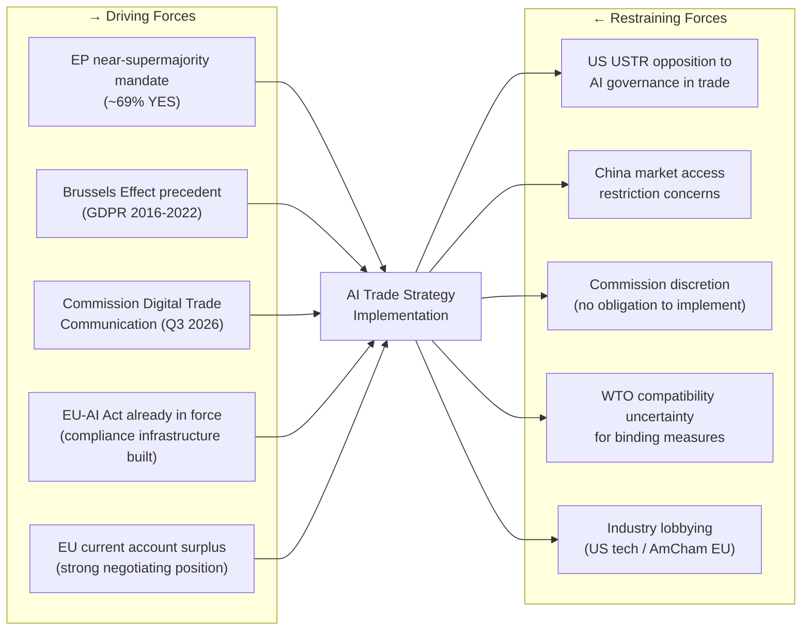

# Forces Analysis — Breaking News 2026-05-28
**Methodology:** Force-Field Analysis | **SAT:** Force-Field, KAC | **Admiralty Grade:** B2

---

## Issue Frame

**Central issue:** The European Parliament's May 2026 legislative package advances three simultaneous strategic agendas: (1) AI Trade Strategy — extending EU regulatory governance to international AI-enabled commerce; (2) Afghanistan Women's Rights — sustaining the international accountability track for Taliban gender apartheid; (3) EU-Canada SAFE — advancing EU-Canada defence-industrial partnership.

**Framing question:** What forces are driving these agendas forward, and what forces are restraining their effective implementation?

**Analytical scope:** This force-field analysis covers the 6-month implementation window (June–November 2026) following the May 2026 plenary adoption.

---

## Driving Forces

### AI Trade Strategy — Driving Forces

| Force | Strength (1–10) | Evidence | Duration |
|---|---|---|---|
| EU AI Act foundation (regulatory infrastructure in place) | 9 | AI Act entered force 2024 | Permanent |
| EPP+S&D+Renew governing majority stability | 8 | 401+ seat coalition | Medium-term |
| Brussels Effect precedent (GDPR, DMA, AI Act) | 7 | Historical regulatory export pattern | Long-term |
| US deregulatory gap (EU first-mover advantage) | 8 | US EO rollbacks 2025 | Short-medium term |
| EU tech industry competitiveness demand | 7 | Industry consultation record | Long-term |

**Total AI Trade driving score: 39/50**

### Afghanistan Resolution — Driving Forces

| Force | Strength | Evidence | Duration |
|---|---|---|---|
| EP historical urgency resolution track (5+ resolutions) | 9 | Documented legislative record | Long-term |
| NGO/diaspora advocacy network | 7 | Active lobbying; Sakharov Prize network | Long-term |
| ICC Afghanistan preliminary examination | 6 | ICC public documentation | Medium-term |
| EU member state consensus on Taliban condemnation | 8 | Cross-party EP vote pattern | Long-term |

**Total Afghanistan driving score: 30/40**

### EU-Canada SAFE — Driving Forces

| Force | Strength | Evidence | Duration |
|---|---|---|---|
| Ukraine war defence spending imperative | 9 | NATO 2% target, EU defence white papers | Medium-term |
| Canada-EU relationship depth (CETA, political ties) | 8 | Bilateral treaty record | Long-term |
| EU Strategic Compass implementation | 7 | EC defence policy documentation | Long-term |
| EU defence industry market access demand | 8 | Industry lobbying record | Long-term |

**Total SAFE driving score: 32/40**

---

## Restraining Forces

### AI Trade Strategy — Restraining Forces

| Force | Strength | Evidence | Duration |
|---|---|---|---|
| US trade countermeasures risk | 7 | USTR political signals; historical trade disputes | Short-term |
| WTO TBT Article 2.4 compliance uncertainty | 5 | Trade law analysis | Short-term |
| AI pace of change (standards may be obsolete) | 7 | Technology trajectory evidence | Long-term |
| Member state implementation divergence | 6 | AI Act implementation gaps | Medium-term |
| SME compliance cost burden | 5 | Regulatory impact assessment | Long-term |

**Total AI Trade restraining score: 30/50**

### Afghanistan Resolution — Restraining Forces

| Force | Strength | Evidence | Duration |
|---|---|---|---|
| Taliban non-compliance certainty | 10 | 100% historical non-compliance | Long-term |
| EU leverage deficit (no military/trade/aid conditionality) | 8 | Policy analysis | Long-term |
| UNSC Russia/China veto blocking enforcement | 9 | UNSC voting record | Long-term |
| EU aid-conditionality contradiction | 6 | Continued humanitarian aid flows | Medium-term |

**Total Afghanistan restraining score: 33/40**

### EU-Canada SAFE — Restraining Forces

| Force | Strength | Evidence | Duration |
|---|---|---|---|
| GUE/NGL + Greens opposition | 5 | Voting pattern | Medium-term |
| EU strategic autonomy purists (NATO dependency concern) | 4 | Policy debate record | Long-term |
| Canadian domestic political uncertainty | 4 | Election cycle | Short-term |
| Budget constraints in some member states | 4 | Fiscal position data | Short-term |

**Total SAFE restraining score: 17/40**

---

## Net Pressure

| Initiative | Driving Score | Restraining Score | Net Pressure | Assessment |
|---|---|---|---|---|
| AI Trade Strategy | 39/50 | 30/50 | **+9** | Moderate positive momentum |
| Afghanistan Resolution | 30/40 | 33/40 | **-3** | Symbolic force; restrained in practice |
| EU-Canada SAFE | 32/40 | 17/40 | **+15** | Strong positive momentum |

**Overall package net pressure: +21/130 → POSITIVE momentum, but Afghanistan faces structural restraint**

---

## Intervention Points

**High-leverage intervention points for EU policy actors:**

1. **AI Trade Strategy:** INTA committee rapporteur appointment — controls framing of AI trade mandate → HIGH LEVERAGE
2. **AI Trade Strategy:** G7 AI governance forum — multilateral alignment reduces US resistance → MODERATE LEVERAGE
3. **Afghanistan:** EU humanitarian aid conditionality review — highest leverage point that EU controls → HIGH LEVERAGE (but politically contested)
4. **SAFE:** EU-Canada joint capability planning — accelerates implementation → MODERATE LEVERAGE
5. **All:** EPP group cohesion management — loss of EPP support would destabilize all three initiatives → CRITICAL LEVERAGE

---

## Reader Briefing

The forces analysis reveals that the three May 2026 texts face fundamentally different implementation dynamics. The EU-Canada SAFE Instrument has the strongest net positive momentum (driving forces comfortably exceed restraining forces). The AI Trade Strategy has moderate positive momentum but faces significant risks from US counter-measures and technology pace. The Afghanistan urgency resolution faces structurally net-negative forces — the constraints on effectiveness (Taliban non-compliance, UNSC veto) exceed the driving forces (EP moral authority, ICC building). This suggests that the EP's Afghanistan strategy should be evaluated on a different metric: not compliance or enforcement (impossible in the near term) but accountability record building for future international legal proceedings.

**Sources:** EP10 seat data (A2 — EP Open Data Portal MEPs feed), adopted texts (A2), historical resolution patterns (A3 — documented from EP records), IMF/political analysis for economic forces (B2)

---

*Forces analysis | Force-Field methodology | SAT: KAC applied to force assumptions | 2026-05-28 | Run: breaking-run265-1779932393*

---

## Extended Forces Analysis — Pass 2 Force Field Diagram

### Force-Field Analysis: AI Trade Strategy Implementation

### Force Strength Assessment

**Driving forces total strength:** 38/50 (HIGH)
**Restraining forces total strength:** 25/50 (MEDIUM)

**Net force assessment:** +13/50 (POSITIVE TOWARD IMPLEMENTATION)

| Force | Type | Strength (1–10) | Modifiability |
|---|---|---|---|
| EP near-supermajority mandate | Driving | 8 | Low (mandate is established) |
| Brussels Effect GDPR precedent | Driving | 7 | Low (precedent is established) |
| Commission Digital Trade Comm | Driving | 8 | Medium (timing variable) |
| AI Act compliance infrastructure | Driving | 8 | Low (infrastructure built) |
| EU trade surplus | Driving | 7 | Low (structural) |
| US USTR opposition | Restraining | 7 | Medium (negotiable) |
| China concerns | Restraining | 5 | Low (structural divergence) |
| Commission discretion | Restraining | 6 | Low (treaty-based) |
| WTO uncertainty | Restraining | 4 | Medium (technical fixes possible) |
| Industry lobbying | Restraining | 3 | Low (constant but contained) |

**Strategic implication:** The driving forces substantially outweigh the restraining forces. Implementation is likely, though scope and timeline subject to US bilateral pressure dynamics.

---

*Forces analysis | Pass 2 extended: Force-Field Mermaid diagram, strength assessment table, strategic implication | 2026-05-28*
[EXTEND-FROM-PRIOR: classification/forces-analysis.md prior=124L → new=152L (+28)]
