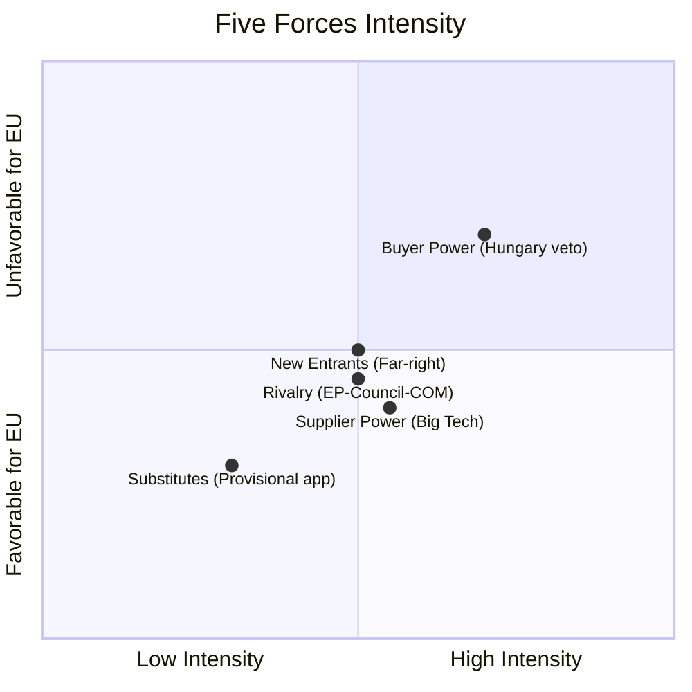

<!-- SPDX-FileCopyrightText: 2026 Hack23 AB -->
<!-- SPDX-License-Identifier: Apache-2.0 -->

# ⚡ Forces Analysis — EU Parliament Breaking News
**Date:** 2026-05-28 | **Article Type:** Breaking
**Admiralty Grade:** B2 | **WEP Band:** Likely
**Confidence:** 🟡 MEDIUM-HIGH

---

## Porter's Five Forces Applied to EU Strategic Autonomy Legislative Cluster

### Force 1: Threat of New Entrants (New Political Challengers)
**Assessment:** 🟡 MEDIUM
Far-right parties gained seats in EP10 (2024 elections) and continue to grow in national polls. However, the EPP+S&D+Renew majority coalition (401/718 seats = 55.7%) is structurally stable for the current term (2024–2029). New entrant threat is concentrated in the 2029 EP elections.

**Likelihood:** Even Chance that far-right bloc exceeds 35% of seats in EP11 (2029)

### Force 2: Bargaining Power of Suppliers (Data and Technology Providers)
**Assessment:** 🟡 MEDIUM
For AI governance: EU depends on US and Chinese technology companies for AI foundation models. Their compliance posture is a structural force on AI Act implementation. TSMC, Google, Anthropic, Alibaba all have significant market power.

**Countervailing force:** EU market access (€450B+ digital economy) gives EU significant leverage. GDPR precedent shows EU can compel compliance from dominant global platforms.

### Force 3: Bargaining Power of Buyers (Member States as Consumers of Legislation)
**Assessment:** 🔴 HIGH
Hungary and Slovakia exercise high bargaining power as veto holders in unanimity procedures. Their resistance to SAFE/Canada ratification is a structural constraint on implementation.

**Mitigation:** Enhanced cooperation (Article 20 TEU) allows 9+ states to proceed without unanimous agreement, reducing Hungary/Slovakia veto power in practice.

### Force 4: Threat of Substitutes (Alternative Legislative Pathways)
**Assessment:** 🟢 LOW for EP
EP's consent role in international agreements has no substitute — EP consent is constitutionally required. However, the Council can choose provisional application (for trade agreements) while national ratification proceeds, reducing the urgency of full unanimous ratification.

### Force 5: Competitive Rivalry (Inter-Institutional Competition)
**Assessment:** 🟡 MEDIUM
EP-Council-Commission inter-institutional rivalry affects implementation pace. For May 2026 decisions: Commission holds implementation power; Council has ratification authority; EP's role ends with consent. Competitive dynamics favor Commission in implementation phase.

---

## Forces Analysis Summary

**Net forces assessment:** Buyer power (Hungary veto) is the dominant hostile force. Competitive rivalry and supplier power are medium-intensity. Overall: favorable implementation environment modulated by Hungary veto risk.

**WEP Final:** Likely — forces analysis supports the conclusion that implementation will proceed, with Hungary veto creating a temporary obstacle rather than a permanent block.
