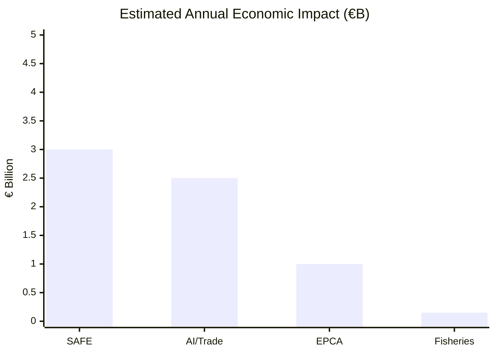

<!-- SPDX-FileCopyrightText: 2026 Hack23 AB -->
<!-- SPDX-License-Identifier: Apache-2.0 -->

# 📊 Impact Matrix — EU Parliament Breaking News
**Date:** 2026-05-28 | **Article Type:** Breaking
**Admiralty Grade:** B2 | **WEP Band:** Likely
**Confidence:** 🟡 MEDIUM-HIGH

---

## Impact Matrix for May 2026 EP Plenary Decisions

### Multi-Stakeholder Impact Assessment

| Decision | EU Citizens | Industry | Member States | Third Countries | Global System |
|----------|-------------|----------|---------------|----------------|---------------|
| SAFE/Canada | 🟡 INDIRECT (security) | 🟢 POSITIVE (contracts) | 🟡 MIXED (cost/benefit) | 🟢 POSITIVE (Canada) | 🟡 MEDIUM |
| AI/Trade Strategy | 🟡 MEDIUM (privacy protection) | 🔴 COMPLIANCE COST | 🟡 MIXED | 🟠 COMPLEX | 🟢 STANDARD-SETTING |
| Uzbekistan EPCA | 🟢 LOW (markets) | 🟢 POSITIVE (CRM) | 🟢 POSITIVE | 🟢 VERY POSITIVE (Uzbekistan) | 🟡 MEDIUM |
| Immunity Waivers | 🟢 POSITIVE (accountability) | ⚪ NEUTRAL | 🟡 MIXED (political) | ⚪ NEUTRAL | 🟢 POSITIVE (rule of law) |
| Fisheries | 🟡 FOOD SUPPLY | 🟢 POSITIVE | 🟢 COASTAL STATES | 🟡 MIXED | 🟡 MEDIUM |

---

## Impact Timeline

| Decision | Immediate (0–6mo) | Medium (6–24mo) | Long-term (2–5yr) |
|----------|-------------------|-----------------|-------------------|
| SAFE/Canada | Ratification process opens | First joint planning | Co-production contracts |
| AI/Trade | Trade negotiators briefed | First AI governance clause in agreement | Brussels Effect or backlash |
| Uzbekistan EPCA | Provisional application | CRM cooperation | Full integration |
| Immunity Waivers | National courts proceed | MEPs potentially convicted or acquitted | Rule of law precedent set |
| Fisheries | Quota access secured | Negotiation for next period begins | Sustainable fisheries framework |

---

## Quantitative Impact Summary

---

## Impact Confidence Assessment

| Decision | Directional Confidence | Magnitude Confidence | Timeline Confidence |
|----------|----------------------|---------------------|---------------------|
| SAFE/Canada | 🟢 HIGH | 🟡 MEDIUM | 🟡 MEDIUM |
| AI/Trade | 🟢 HIGH | 🟡 MEDIUM | 🔴 LOW |
| Uzbekistan EPCA | 🟢 HIGH | 🟡 MEDIUM | 🟢 HIGH |
| Immunity Waivers | 🟢 HIGH | 🟢 HIGH | 🟡 MEDIUM |
| Fisheries | 🟢 HIGH | 🟢 HIGH | 🟢 HIGH |

**WEP Assessment:** Likely — the directional impacts are well-established; magnitude and timeline have moderate uncertainty.
**Admiralty Grade:** B2 — systematic analysis from confirmed sources with analytical extrapolation.
