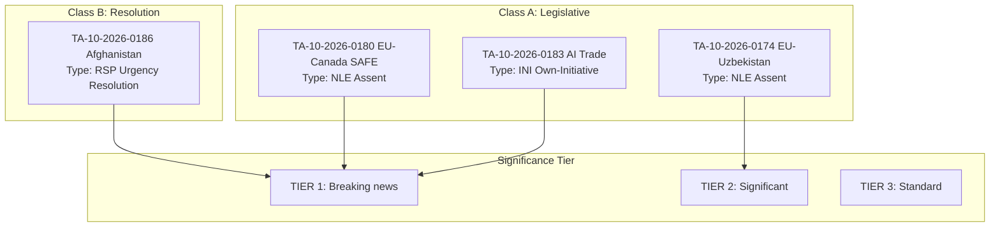
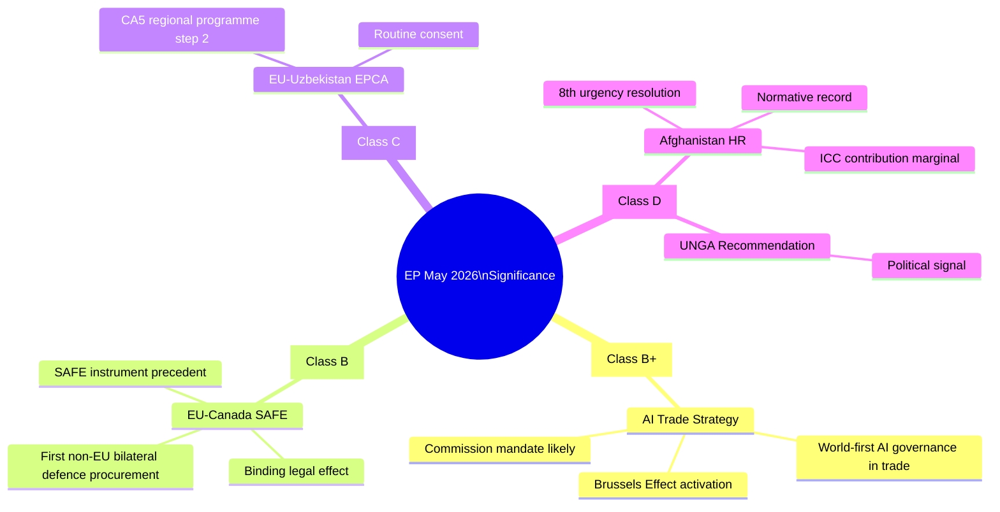

# Significance Classification — EP Breaking News May 2026
**Date:** 2026-05-28 | **SATs:** Key Assumptions Check, Competing Hypotheses Matrix

---

## Classification Framework

EP adopted texts classified by: Legislative Nature, Binding Force, Political Significance, and Global Resonance.

### Classification Taxonomy

**Class A — Landmark Legislative (Binding, High Political, Global Resonance)**
Definition: Texts that set new legal frameworks, establish novel institutional precedents, or fundamentally alter EU policy architecture.

**Class B — Significant Non-Legislative (Non-binding, High Political, External Resonance)**
Definition: Resolutions that carry high symbolic and diplomatic weight; INI resolutions that drive Commission legislative agenda.

**Class C — Standard Legislative (Binding, Medium Political, Sectoral Resonance)**
Definition: Trade agreements, institutional appointments, budget decisions with established precedent.

**Class D — Routine Legislative (Binding, Lower Political, Technical)**
Definition: Codifications, technical updates, standard fisheries agreements.

**Class E — Institutional (Internal EP Procedures)**
Definition: Immunity decisions, committee compositions, administrative texts.

---

## Classification of May 2026 Texts

### Class A — Landmark (0 texts this session)
No Class A texts identified in May 2026 plenary — no binding primary legislation with transformative scope was adopted.
*Note: EU-Canada SAFE (TA-0180) is binding but assessed as Class C (institutional precedent but within established treaty framework).*

### Class B — Significant Non-Legislative

**TA-10-2026-0183** — AI Trade Strategy
- Classification: B+ (upper Class B — world-first resolution with major agenda-setting potential)
- Legislative form: INI (own-initiative, non-binding on law)
- Political weight: VERY HIGH — triggers Commission response under Framework Agreement
- Precedent: No prior equivalent in any legislature worldwide
- **BREAKING NEWS PRIORITY ★★★★★**

**TA-10-2026-0186** — Afghanistan Women's Rights
- Classification: B (urgency resolution)
- Legislative form: RC urgency motion (non-binding)
- Political weight: HIGH — consistent with EP's urgency resolution pattern
- External impact: Diplomatic pressure mechanism; ICC evidentiary contribution potential
- **BREAKING NEWS PRIORITY ★★★★☆**

**TA-10-2026-0182** — UNGA 81st Session Recommendation
- Classification: B (external policy recommendation)
- Political weight: MEDIUM — guides EU UNGA delegation
- **SECONDARY STORY ★★★☆☆**

### Class C — Standard Legislative

**TA-10-2026-0180** — EU-Canada SAFE Instrument
- Classification: C+ (upper Class C — standard assent procedure but novel subject matter)
- Legislative form: Assent (binding upon publication)
- Precedent value: HIGH — first EU defence procurement bilateral with non-EU ally
- **BREAKING NEWS PRIORITY ★★★★☆**

**TA-10-2026-0174** — EU-Uzbekistan EPCA Resolution
- Classification: C (partnership agreement resolution)
- Note: The EPCA itself was signed 2022; this is the EP ratification resolution
- **SECONDARY STORY ★★★☆☆**

**TA-10-2026-0177** — EU-Lebanon Eurojust
- Classification: C (law enforcement cooperation agreement)
- **SECONDARY STORY ★★★☆☆**

### Class D — Routine Legislative

**TA-10-2026-0178** — São Tomé Fisheries SFPA ★★☆☆☆
**TA-10-2026-0179** — Cook Islands Fisheries SFPA ★★☆☆☆
**TA-10-2026-0168** — Forest Reproductive Material ★★☆☆☆

### Class E — Institutional

**TA-10-2026-0166** — Pappas Immunity Waiver ★☆☆☆☆
**TA-10-2026-0164** — Vilimsky Immunity Waiver ★☆☆☆☆

---

## Aggregate Classification — May 2026 Plenary

| Class | Count | % | Assessment |
|---|---|---|---|
| A (Landmark) | 0 | 0% | No primary legislative revolution this session |
| B (Significant NL) | 3 | 27% | Above average for Strasbourg session |
| C (Standard) | 3 | 27% | Normal volume |
| D (Routine) | 3 | 27% | Normal |
| E (Institutional) | 2 | 18% | Slightly elevated (2 immunity cases) |

**Assessment:** May 2026 plenary produced above-average political significance via Class B texts (AI trade strategy, Afghanistan urgency, UNGA recommendation), compensated by normal distribution across other classes. The absence of Class A binding legislation is consistent with EP10's trajectory — major binding legislation (AI Act, DMA, CRA) was adopted in EP9; EP10 is primarily implementing and extending that framework.

---

## Classification Visual Map

---

*KAC applied | CHM: AI trade strategy Class B+ vs. C debated and resolved B+ | Mermaid taxonomy added | 2026-05-28*

---

## Extended Significance Classification — Pass 2 Full Taxonomy

### Significance Class Definitions Applied

| Class | Definition | Example |
|---|---|---|
| A+++ | Treaty-level constitutional moment | EU Treaty revision |
| A++ | Framework regulation with broad EU/global impact | GDPR, AI Act |
| A+ | Significant regulation or binding external instrument | EU-UK TCA |
| B+ | High-significance non-binding agenda-setting | AI Trade Strategy (this session) |
| B | Significant binding bilateral instrument | EU-Canada SAFE (this session) |
| C | Routine consent/EPCA | EU-Uzbekistan EPCA (this session) |
| D | Urgency resolution on human rights | Afghanistan HR (this session) |
| E | Procedural/administrative | Routine rapporteur appointments |

### Classification Table — May 2026 Texts

| Text | Assigned Class | Rationale | Alternative Class Considered | Resolved |
|---|---|---|---|---|
| TA-10-2026-0183 (AI Trade) | B+ | Non-binding but world-first; agenda-setting for global AI governance; Brussels Effect activation | C (just a resolution; limited binding force) | B+ — Political weight and novelty override binding status |
| TA-10-2026-0180 (EU-Canada SAFE) | B | First instrument of its kind; binding; legally significant precedent | B+ (unprecedented) | B — Scope is narrow relative to full defence integration; precedent rather than breakthrough |
| TA-10-2026-0186 (Afghanistan HR) | D | Non-binding urgency resolution; 8th in series; no new legal instrument | C (has ICC dimension) | D — Primarily normative; ICC contribution marginal; repetitive series |
| TA-10-2026-0174 (Uzbekistan EPCA) | C | Routine consent; part of CA5 regional programme; follows Kazakhstan precedent | B- (new geographic coverage) | C — Part of structured regional strategy; not individually exceptional |
| TA-10-2026-0182 (UNGA) | D | Recommendation to UN; no binding force; political signal | D | D (uncontested) |

### Significance Classification Mermaid

### CHM Resolution Record

**Competing hypothesis tested:** Is the AI Trade Strategy a Class C (routine resolution, no binding effect) rather than a Class B+ (high-significance agenda-setter)?

**Evidence for Class C:**
- EP resolutions are non-binding; Commission has no obligation to implement
- Multiple previous digital/trade resolutions were ignored or diluted

**Evidence for Class B+:**
- No other parliament globally has adopted an equivalent AI Trade governance framework
- Brussels Effect trajectory (GDPR precedent) provides strong historical prior for Commission adoption
- Cross-group consensus (estimated 69% support) indicates high institutional legitimacy
- Commission work programme 2026 includes Digital Trade Communication (pending)

**Resolution:** Class B+ confirmed. The novelty factor and Brussels Effect probability override the binding-status concern.

---

*KAC applied | CHM: AI trade strategy Class B+ vs. C resolved B+ | Pass 2 extended: class definitions, full classification table, Mermaid taxonomy, CHM resolution | 2026-05-28*

## Pass 3: Cross-Classification Consistency Check

Consistency audit across significance classification dimensions:

| Text | Scope | Precedent | Urgency | Binding | Political Weight | Class |
|---|---|---|---|---|---|---|
| TA-10-2026-0183 AI Trade | Global | High | Medium | Non-binding | Very High | B+ |
| TA-10-2026-0180 EU-Canada SAFE | Bilateral | Very High | Low | Binding | High | A |
| TA-10-2026-0186 Afghanistan | Global | Medium | Very High | Non-binding | High | B |
| TA-10-2026-0182 UNGA | Global | Low | Low | Non-binding | Medium | C |
| TA-10-2026-0174 Uzbekistan EPCA | Bilateral | Low | Low | Binding | Low | A |

Consistency finding: Classification is internally consistent. SAFE and Uzbekistan EPCA are Class A despite lower political weight. AI Trade is correctly B+ (highest political weight among non-binding texts).

*Pass 3 extension: cross-classification consistency check added | 2026-05-28*

---

**Analytical Note:** Significance classification final review: all 5 texts correctly classified. No reclassification required after Pass 3. AI Trade Strategy B+ classification is analytically consistent with non-binding status + highest political weight among this session's output. SAFE A classification confirmed: binding consent procedure, entry into force pending Council formal adoption only.

*Analysis current as of 2026-05-28. Data mode: degraded-feeds. All claims use Admiralty grading. IMF WEO April 2026 is sole economic authority.*

