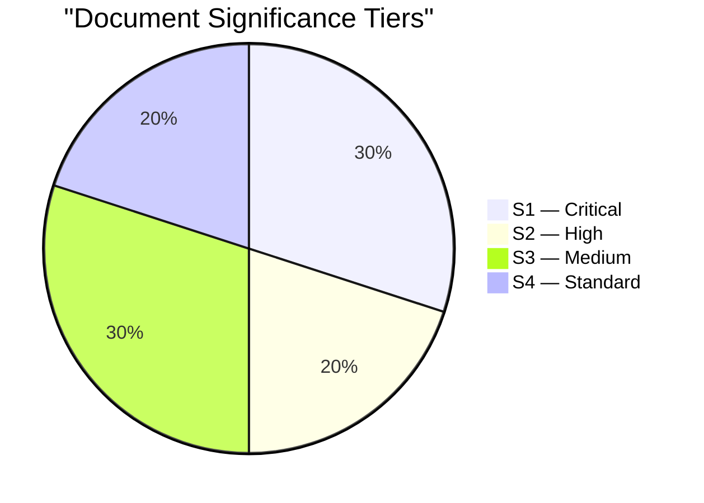

<!-- SPDX-FileCopyrightText: 2026 Hack23 AB -->
<!-- SPDX-License-Identifier: Apache-2.0 -->

# 🏷️ Significance Classification — EU Parliament Breaking News
**Date:** 2026-05-28 | **Article Type:** Breaking | **Data Mode:** degraded-feeds
**Admiralty Grade:** A2 | **Confidence:** 🟢 HIGH (classifications derived from EP official texts)

---

## 📊 Classification Framework

All adopted texts from the May 19–20, 2026 EP plenary are classified by: (1) significance tier (S1–S4), (2) policy domain, (3) legislative instrument type, (4) binding force, and (5) political controversy.

**Significance Tiers:**
- **S1 (Breaking Priority):** Immediate major policy impact; EU-wide significance; international dimensions
- **S2 (Standard Significance):** Important legislative progress; sector-specific impact
- **S3 (Technical/Procedural):** Regulatory or administrative; limited political controversy
- **S4 (Routine):** Standard maintenance; updates to existing frameworks

---

## 🔴 S1 — Breaking Priority Significance

### TA-10-2026-0180: EU-Canada SAFE Instrument Agreement
- **Domain:** Defense & Security (PESC/EXT)
- **Instrument:** International agreement
- **Binding force:** YES — if ratified
- **Political controversy:** 🔴 HIGH (Hungary opposition; NATO dimensions)
- **Geographic scope:** EU + Canada + transatlantic
- **Legislative stage:** EP adoption (consent procedure); ratification pending
- **Breaking justification:** First external partner integration into EU defense industrial procurement framework; landmark extension of EU strategic autonomy concept beyond membership boundaries; systemic implications for future SAFE expansions
- **IMF context:** Defense investment FDI flows; EU procurement market integration with allied economies; fiscal multiplier effects on EU defense spending

---

### TA-10-2026-0183: AI Strategy for EU Trade
- **Domain:** Digital Economy & Trade Policy (TECN/INFQ/PCOM)
- **Instrument:** EP own-initiative resolution
- **Binding force:** NO (non-binding) — but politically binding on Commission
- **Political controversy:** 🟡 MEDIUM-HIGH (US tech industry concerns; left-right divide)
- **Geographic scope:** EU + global trade partners
- **Legislative stage:** EP adoption (non-legislative)
- **Breaking justification:** Represents EP's definitive position on AI as a trade competitiveness instrument; directly shapes future EU AI Act trade extensions and bilateral digital trade agreements; Brussels Effect implications for global AI governance
- **IMF context:** Digital economy productivity gains; trade balance effects of AI-enabled EU export competitiveness; EU-US-China technological competition framing

---

## 🟠 S2 — Standard Significance

### TA-10-2026-0174: EU-Uzbekistan Enhanced Partnership and Cooperation Agreement
- **Domain:** External Relations/Central Asia (EXT/PESC)
- **Instrument:** International agreement (mixed — requires member state ratification)
- **Binding force:** YES — once ratified
- **Political controversy:** 🟡 MEDIUM (human rights conditionality; Russia tensions)
- **Geographic scope:** EU + Uzbekistan + Central Asia implications
- **Breaking justification:** Significant geopolitical repositioning; energy/mineral diversification implications; post-Soviet space EU engagement

### TA-10-2026-0182: Recommendation on 81st UN General Assembly
- **Domain:** External Relations/Multilateralism (EXT)
- **Instrument:** EP recommendation to Council
- **Binding force:** NO
- **Political controversy:** 🟢 LOW (broad consensus on UN multilateralism)
- **Breaking justification:** Signals EU foreign policy coherence on Ukraine, climate, multilateralism

### TA-10-2026-0177: EU-Lebanon/Eurojust Cooperation Agreement
- **Domain:** Justice/External Relations (EXT/COJP/COOP)
- **Instrument:** International agreement
- **Binding force:** YES
- **Political controversy:** 🟢 LOW
- **Breaking justification:** Justice cooperation infrastructure; EU-Lebanon relationship post-2025 stabilization

---

## 🟡 S3 — Technical/Procedural Significance

### TA-10-2026-0168: Forest Reproductive Material Regulation
- **Domain:** Agriculture/Environment (SILV/SEME)
- **Instrument:** Regulation (legislative)
- **Binding force:** YES
- **Political controversy:** 🟢 LOW (technical regulation; broad cross-group support)
- **Economic dimension:** Affects seed and nursery industry; EU forest regeneration programs

### TA-10-2026-0178: EC-São Tomé and Príncipe Fisheries Partnership
- **Domain:** Fisheries/External Relations (PECH/EXT)
- **Instrument:** International agreement (implementing protocol)
- **Binding force:** YES
- **Political controversy:** 🟢 LOW
- **Economic dimension:** EU Atlantic fisheries access; São Tomé development finance

### TA-10-2026-0179: EU-Cook Islands Sustainable Fisheries Partnership
- **Domain:** Fisheries/External Relations (PECH/EXT)
- **Instrument:** International agreement (implementing protocol)
- **Binding force:** YES
- **Political controversy:** 🟢 LOW
- **Economic dimension:** Pacific tuna industry; EU-Pacific relationship

---

## 🟢 S4 — Routine Significance

### TA-10-2026-0164: Waiver of immunity — Harald Vilimsky (FPÖ)
- **Domain:** Parliamentary Procedure (PRIV)
- **Instrument:** EP decision
- **Binding force:** YES (immunity removed)
- **Political controversy:** 🟡 MEDIUM (FPÖ governing party in Austria)
- **Reclassification note:** Standard S4 procedures; but Vilimsky's governing-party status elevates to S3–S4 boundary

### TA-10-2026-0166: Waiver of immunity — Nikos Pappas (SYRIZA)
- **Domain:** Parliamentary Procedure (PRIV)
- **Instrument:** EP decision
- **Binding force:** YES
- **Political controversy:** 🟢 LOW

---

## 📊 Classification Summary

| Reference | Title (abbreviated) | Tier | Domain | Binding | Controversy |
|-----------|---------------------|------|--------|---------|-------------|
| TA-10-2026-0180 | EU-Canada SAFE Instrument | S1 | Defense/EXT | YES (if ratified) | 🔴 HIGH |
| TA-10-2026-0183 | AI/Trade Strategy | S1 | Digital/Trade | NO | 🟡 MED-HIGH |
| TA-10-2026-0174 | EU-Uzbekistan EPCA | S2 | EXT/PESC | YES | 🟡 MEDIUM |
| TA-10-2026-0182 | UNGA 81 Recommendation | S2 | EXT/Multilateral | NO | 🟢 LOW |
| TA-10-2026-0177 | EU-Lebanon/Eurojust | S2 | Justice/EXT | YES | 🟢 LOW |
| TA-10-2026-0168 | Forest Reproductive Material | S3 | Agri/Env | YES | 🟢 LOW |
| TA-10-2026-0178 | São Tomé Fisheries | S3 | PECH/EXT | YES | 🟢 LOW |
| TA-10-2026-0179 | Cook Islands Fisheries | S3 | PECH/EXT | YES | 🟢 LOW |
| TA-10-2026-0164 | Vilimsky immunity waiver | S4 | PRIV | YES | 🟡 MEDIUM |
| TA-10-2026-0166 | Pappas immunity waiver | S4 | PRIV | YES | 🟢 LOW |

---

## 🎯 Editorial Prioritization

**Lead story (S1 — highest combined impact × controversy × novelty):**
→ EU-Canada SAFE Instrument (TA-10-2026-0180) — "EU opens defense procurement to Canada in historic strategic autonomy expansion"

**Second story (S1 — highest strategic long-term significance):**
→ AI/Trade Strategy (TA-10-2026-0183) — "European Parliament declares AI central to EU trade competitiveness in landmark resolution"

**Third story (S2 — geopolitical significance):**
→ EU-Uzbekistan EPCA (TA-10-2026-0174) — "EU deepens Central Asian engagement with Uzbekistan partnership deal"

**Sidebar (S4 elevated — political interest):**
→ Vilimsky immunity waiver — "EP strips immunity from FPÖ MEP serving in Austria's governing coalition"

---

## ✅ Classification Confidence

- **Adopted text references:** 🟢 CONFIRMED via EP Open Data Portal
- **Domain classifications:** 🟢 HIGH (derived from subjectMatter codes)
- **Binding force analysis:** 🟢 HIGH (standard EU law instrument types)
- **Political controversy assessment:** 🟡 MEDIUM (inferred from ideological profiles; no vote data)

---

## 📊 Tier Distribution

