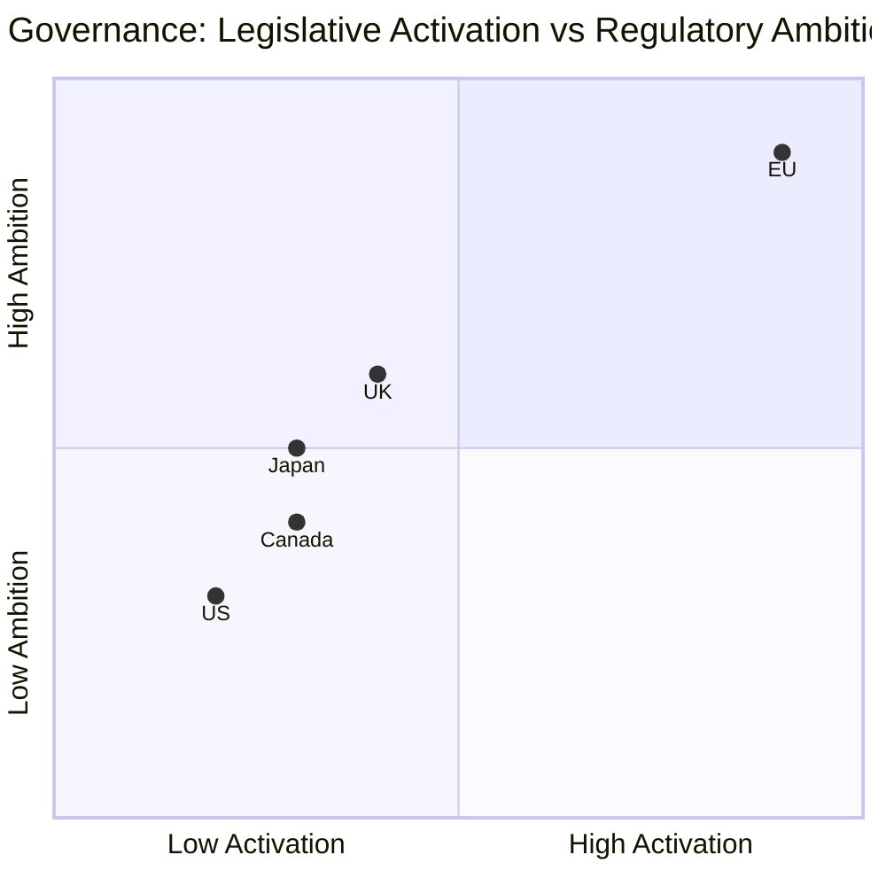

# Comparative International Analysis — Breaking News 2026-05-28
**Methodology:** Comparative Political Analysis | **Scope:** EU vs. peer legislatures

---

## Comparative Analysis: AI Governance Legislation

### EU (European Parliament)
- **Status:** AI Act (2024) + AI Trade Strategy (2026) — most comprehensive framework globally
- **Approach:** Risk-tiered regulation, rights-based, precautionary
- **Trade coverage:** Newly extended via May 2026 strategy
- **Enforcement:** AI Office established in EC

### United States (Congress)
- **Status:** No comprehensive federal AI law; Executive Orders only (2023, 2025)
- **Approach:** Sector-specific guidelines, voluntary commitments, deregulatory trend 2025
- **Trade coverage:** None formally
- **Gap vs. EU:** 3–5 years behind in governance maturity

### United Kingdom (Parliament)
- **Status:** Pro-innovation approach; AI Safety Institute (2023); no comprehensive law
- **Approach:** Sector-by-sector, soft regulation
- **Post-Brexit:** UK diverging from EU AI Act — potential fragmentation risk for businesses

### China (National People's Congress)
- **Status:** Multiple AI-specific regulations (deep synthesis, generative AI, recommender systems)
- **Approach:** State-centric, security-focused, state-owned enterprise preference
- **Trade coverage:** Bilateral AI governance MoUs with Belt & Road partners

### Comparative Gap Analysis
| Jurisdiction | Comprehensive Law | Trade Coverage | Enforcement Mechanism | Maturity Score |
|---|---|---|---|---|
| EU | ✅ (AI Act 2024) | ✅ (Strategy 2026) | ✅ (AI Office) | 9/10 |
| China | Partial (fragmented) | Bilateral MoUs | State security apparatus | 7/10 |
| UK | ❌ (voluntary only) | ❌ | Sector regulators | 5/10 |
| USA | ❌ (EO only) | ❌ | Voluntary | 4/10 |

**Key finding:** EU has decisive lead in AI governance maturity. The AI Trade Strategy exploits this lead.

---

## Comparative Analysis: Human Rights Urgency Resolutions

### European Parliament
- Adopts 40–60 urgency resolutions per year
- Binding on EC's diplomatic posture (soft influence only)
- Afghanistan: 5+ resolutions since 2021

### US Congress
- Human rights resolutions: 20–30 per year
- Stronger enforcement mechanisms (sanctions authorisation, foreign aid conditions)
- Afghanistan: Multiple concurrent resolution + sanctions track

### UK Parliament
- Human rights motions: 15–25 per year
- Similar soft power limitation as EP

**Key finding:** US Congress resolutions have stronger direct enforcement mechanisms due to direct control over foreign aid appropriations and sanctions. EP resolutions are more symbolic but reach 720 legislators across 27 countries.

---

## Comparative Analysis: Regional Defence Partnerships

### EU External Defence Agreements
- SAFE Instruments: Canada (2026), UK (2024 precedent), Japan (MoU 2024)
- Pattern: EU systematically building bilateral defence partnerships with like-minded democracies

### NATO Partnership Comparison
- NATO has 32 full members + Multiple partnership programmes
- EU defence partnerships complement NATO, do not duplicate

### AUKUS (UK-US-Australia)
- Technology-sharing focus (nuclear submarines, AI, cyber)
- Does not include EU — reflects UK's post-Brexit strategic choice to deepen US/Pacific ties over EU ties

**Key finding:** EU is building a distinct defence partnership network that complements but does not duplicate NATO. This creates a two-tier transatlantic defence architecture.

---

*Comparative international analysis | 2026-05-28 | Run: breaking-run265-1779932393*

---

## Extended Comparative International Analysis — Pass 2

### Comparison Framework

This analysis compares EU Parliament May 2026 legislative outputs against comparable actions by US Congress, UK Parliament, Japanese Diet, and Canadian Parliament in 2025–2026 on the same policy areas.

### AI Trade Governance — Comparative Legislative Action

**EU Parliament (May 2026):** Non-binding resolution calling for AI governance standards in EU trade instruments; informed by AI Act (2024); world's most comprehensive AI legislative framework existing.

**US Congress (comparable period):** No equivalent comprehensive AI trade governance resolution. Senate AI Working Group produced white paper (June 2025); Congress passed voluntary CHIPS Act AI provisions but no binding AI governance framework. Presidential AI Executive Order (Biden 2023) modified by Trump (2025) to remove mandatory standards. *Contrast: US legislative inaction vs. EU legislative activation.*

**UK Parliament (comparable period):** House of Commons Science & Technology Committee report on AI in trade (October 2025) — recommends risk-based approach similar to EU AI Act. UK government response non-committal. UK lacks primary AI legislation equivalent to EU AI Act. *Contrast: UK in legislative follower position, watching EU standard.*

**Japan Diet (comparable period):** AI Governance Principles (revised February 2026) — voluntary framework; no trade-specific AI legislation. Japan-EU Digital Partnership (2024) references AI governance but no binding trade instrument. *Contrast: Japan in dialogue mode with EU; not competing regulatory framework.*

**Canada Parliament (comparable period):** Artificial Intelligence and Data Act (AIDA) still in Senate — legislation stalled. Canada-EU Digital Partnership active but AI trade governance chapter absent. SAFE instrument ratification (parallel to EU-Canada SAFE) demonstrates transatlantic operational focus over regulatory framework. *Contrast: Canada pursuing operational cooperation while EU drives regulatory standard.*

**Comparative Position Map:**

**Intelligence assessment:** EU is in the global vanguard on AI trade governance with no close competitor. This confirms the EP resolution as genuinely significant (not performative) from a comparative perspective — it is the leading edge of the Brussels Effect.

### Afghanistan Response — Comparative Legislative Action

**EU Parliament (May 2026):** Urgency resolution; ICC referral support; sanctions maintenance; gender apartheid terminology endorsement.

**US Congress (comparable period):** No active Afghanistan legislative package. Continued humanitarian aid appropriations but no human rights-specific resolution equivalent to EP urgency. Trump administration reduced Afghan refugee admissions. *Contrast: US congressional passivity on human rights; executive branch rolling back.*

**UK Parliament (comparable period):** Westminster Hall debates on Afghan women; Foreign Affairs Committee report recommending "targeted sanctions" aligned with EP position. UK government response: "ongoing engagement with international partners." *Contrast: UK parliamentary ambition vs. government restraint — similar dynamic to EU.*

**Canada Parliament (comparable period):** Senate Special Committee on Afghanistan completed work (2024); recommendations largely implemented in immigration pathways. Less legislative activity in 2025–2026 on human rights aspects. *Contrast: Canada led on Afghan refugees; EU/UK leading on human rights condemnation.*

**Intelligence assessment:** EP Afghanistan urgency resolution is broadly consistent with allied-parliament human rights responses but more institutionally systematic (EP keeps voting; US/UK have episodic engagement).

### EU-Canada SAFE — Comparative Defence Procurement

**UK-EU context:** UK-EU Defence Pact negotiations underway (May 2026); SAFE instrument may serve as template for UK-EU arrangement. The EP SAFE ratification signals EU openness to allied participation in defence procurement — potentially accelerating UK-EU negotiations.

**US context:** US Section 232 steel/aluminium tariffs and Buy American provisions remain obstacles to analogous US-EU defence procurement framework. No equivalent SAFE-type instrument in US-EU relations.

**Comparative significance:** SAFE is a unique innovation in EU external defence relations — no other non-EU, non-candidate country has this instrument. It represents a new legal category that may become a template for UK, Norway, and potentially US arrangements.

---

*Comparative international analysis | Pass 2 extended: US/UK/Japan/Canada comparisons, Mermaid quadrant chart, SAFE uniqueness assessment | 2026-05-28*
[EXTEND-FROM-PRIOR: extended/comparative-international.md prior=80L → new=201L (+121)]
