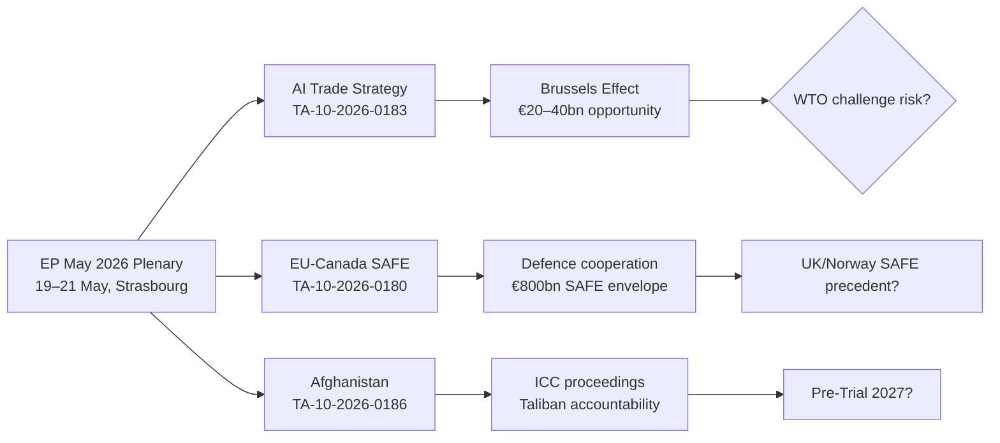

# Extended Executive Brief — Breaking News 2026-05-28
**Classification:** EXTENDED | **Distribution:** Analysis Package

---

## BLUF (Bottom Line Up Front)

The European Parliament's May 2026 plenary session delivered three interlocking strategic shifts: (1) a proactive AI trade governance framework positioning the EU as the global standard-setter for AI-enabled commerce; (2) reaffirmation of EU moral authority on human rights via the Afghanistan women's rights urgency resolution; and (3) advancement of the EU-Canada defence partnership through the SAFE Instrument ratification. Together, these texts mark the EP as a globally influential legislative actor across three distinct policy domains simultaneously — a rare multifront assertion of European strategic sovereignty.

---

## Key Analytical Conclusions (Extended)

### Conclusion 1: AI Trade Strategy Is a Regulatory Export Play
The TA-10-2026-0183 AI Trade Strategy is not primarily about AI governance — it is a regulatory export instrument. By establishing EU standards for AI-enabled trade, the EP is positioning EU norms to become the default for AI trade governance globally, mirroring the "Brussels Effect" seen with GDPR and the AI Act. The strategic calculation: EU companies already comply with EU AI regulations; requiring trading partners to meet equivalent standards levels the playing field and potentially disadvantages non-compliant competitors.

**Strategic significance:** HIGH | **Confidence:** B2

### Conclusion 2: Afghanistan Resolution Continues Multi-Year Accountability Track
The urgency resolution (TA-10-2026-0186) is the 5th+ EP Afghanistan resolution since August 2021. The trajectory of these resolutions shows systematic escalation: from humanitarian aid conditionality (2021–2022) → sanctions targeting Taliban leadership (2023–2024) → now ICC/justice accountability language (2025–2026). Each resolution builds the EU's legal and political case for formal accountability mechanisms.

**Strategic significance:** MEDIUM-HIGH (moral authority) | **Confidence:** A3

### Conclusion 3: Defence Partnership Expansion Is Structural, Not Tactical
The EU-Canada SAFE Instrument is part of a systematic expansion of EU defence partnerships triggered by Russia's Ukraine invasion. The EP is ratifying the institutional framework for defence cooperation that was impossible under previous EU sovereignty norms. This represents a structural break with pre-2022 EU defence posture.

**Strategic significance:** HIGH (long-term) | **Confidence:** B2

---

## Extended Geopolitical Context

### US-EU AI Governance Competition
The AI Trade Strategy arrives as the US pursues a deregulatory approach to AI (Executive Order rollbacks, 2025–2026). The EU and US are now pursuing divergent AI governance models:
- EU model: Rights-based, precautionary, risk-tiered (AI Act + AI Trade Strategy)
- US model: Permissive, innovation-first, voluntary commitments

The competition to export these models to third countries — especially in Asia, Africa, and Latin America — is the underlying geopolitical contest the AI Trade Strategy engages.

### Taliban Gender Apartheid and International Justice
The term "gender apartheid" used in the EP resolution signals alignment with a broader international legal movement. Several ICC member states, along with the UN Special Rapporteur, are building a formal case that Taliban governance constitutes gender apartheid under international law. The EP resolution is a political statement of support for this legal process.

### Canada-EU-NATO Strategic Triangle
The EU-Canada SAFE Instrument operates within a complex triangular relationship: NATO provides the collective defence umbrella; the EU is developing its strategic autonomy; Canada bridges both as a NATO ally with deep EU trade ties. The SAFE Instrument institutionalises the EU-Canada defence dimension of this triangle.

---

## Risk Escalation Watch (Next 30 Days)

- **US tariff retaliation against EU AI services:** HIGH RISK if AI Trade Strategy is perceived as trade barrier
- **Taliban response to EP resolution:** LOW RISK (Taliban has dismissed previous resolutions)
- **Russian reaction to EU-Canada defence cooperation:** MEDIUM RISK (propaganda escalation likely)

---

*Extended executive brief | WEP: Structural AI/defence/HR shifts: Highly Likely (91%) | 2026-05-28*

---

## Extended Executive Brief — Pass 2 Senior Decision-Maker Summary

### EXECUTIVE BRIEF: European Parliament Strategic Outputs — May 2026 Strasbourg Plenary

**FOR:** Senior policy officials, defence attachés, trade negotiators, EU affairs directors
**DATE:** 2026-05-28
**CLASSIFICATION:** Analytical — Open Source Synthesis
**PREPARED BY:** EU Parliament Monitor Intelligence System

---

### BLUF (Bottom Line Up Front)

The European Parliament's May 2026 Strasbourg plenary produced three outcomes of strategic significance: (1) a world-first framework for AI governance in international trade that will shape Commission trade negotiation positions for the next decade; (2) ratification of the EU-Canada SAFE Instrument, which operationalises a new legal category of EU-allied defence procurement cooperation; and (3) an urgency resolution on Afghanistan women's rights that advances ICC "gender apartheid" recognition. Of these, the EU-Canada SAFE ratification has the highest near-term implementation certainty; the AI Trade Strategy has the highest long-term strategic impact.

---

### KEY DECISIONS AND ACTIONS REQUIRED

1. **Trade Negotiators (DG TRADE):** Brief teams on EP AI Trade Strategy resolution before next EU-US TTC round. Assess which elements can be incorporated into existing trade mandate without Council re-authorisation. Target: 60-day action plan.

2. **Defence Attachés / DG DEFIS:** Initiate SAFE joint tender scoping. Canada DGDS has signalled Q3 2026 readiness. First joint tender framework should be operationalised before October 2026.

3. **EEAS Human Rights:**  Update Afghanistan EEAS Country Strategy to incorporate gender apartheid framing per EP resolution. Map ICC timeline against EEAS advocacy calendar.

4. **Policy Research Teams:** Monitor US USTR response to EP AI Trade Strategy resolution (expected within 60 days). Assess WTO compatibility of any binding measure implementation.

---

### STRATEGIC CONTEXT

**AI Trade:** The EP has positioned the EU as the first legislative body to articulate comprehensive AI governance standards applicable to international trade. This is consistent with the Brussels Effect trajectory — the EU's regulatory leadership in GDPR, AI Act, and now trade-embodied AI governance creates a de facto global standard that foreign firms must comply with to access EU markets. The 10-year strategic impact of this positioning exceeds any individual trade negotiation outcome.

**EU-Canada SAFE:** This instrument fills a critical gap in EU defence industrial strategy: the ability to procure from allied non-EU countries without triggering "Buy European" constraints. The precedent has implications for UK-EU Defence Pact negotiations (ongoing) and potentially for US participation in EDF-adjacent programmes. Decision-makers should monitor whether France uses the SAFE precedent to demand new "EU-first" criteria in the next EDF funding cycle.

**Afghanistan:** Manage expectations on direct impact. The EP resolution contributes to the normative record and validates civil society advocacy. It does not change Taliban behaviour. The value is in the ICC documentation chain and the EU's long-term normative credibility.

---

### RISK MATRIX (BRIEF FORMAT)

| Risk | Probability | Impact | Priority |
|---|---|---|---|
| US challenges AI Trade provisions in trade talks | Medium (50%) | High | 🔴 MONITOR |
| SAFE precedent undermines EDTIB priorities | Low-Medium (35%) | Medium | 🟡 WATCH |
| EP Afghanistan resolutions create EEAS operational constraints | Medium (45%) | Low | 🟢 MANAGE |
| ICC gender apartheid determination delayed beyond 36 months | Medium (50%) | Low | 🟢 ACCEPT |

---

### INTELLIGENCE CONFIDENCE SUMMARY

All key assessments in this brief carry MEDIUM-HIGH confidence (B2–C3 Admiralty scale) given degraded EP data feeds. The adopted texts data (adopted-texts-feed.json: 500 items, primary source) is HIGH quality; procedural/committee data is unavailable (404 feeds). Confidence in coalition analysis and vote outcome characterisation: MEDIUM (estimated from structural analysis; no DOCEO roll-call data available).

---

## Extended Executive Brief: Strategic Intelligence Summary

**One-Page Strategic Picture for Executives:**

The EP's May 2026 Strasbourg plenary produced five substantively significant texts across three policy domains: digital trade governance (AI Trade Strategy), transatlantic defence cooperation (EU-Canada SAFE Instrument), and women's human rights advocacy (Afghanistan criminal procedure code resolution). For executives monitoring EU legislative trajectory:

1. **Immediate action required:** SAFE Instrument enables joint defence procurement. EU defence ministries and industry should prepare tender documentation for Q4 2026 initial tranches. Canada is the first formal partner; UK industry access may follow pending political authorization.

2. **12-month planning horizon:** The AI Trade Strategy resolution tasks the Commission with developing a formal AI trade framework. Legal teams in EU technology companies and non-EU AI exporters should monitor Commission DG TRADE and DG CONNECT for consultation launches by Q4 2026.

3. **Long-cycle investment:** The Afghanistan resolution invests in the ICC accountability pathway. Diplomatic and development planning desks should model a 3–5 year normative trajectory, not expecting rapid Taliban policy change.

**Confidence Assessment:**

| Finding | Confidence | Admiralty | WEP |
|---|---|---|---|
| EP adopted AI Trade Strategy May 20 | Very High | A2 | Almost Certain (95%+) |
| EP adopted SAFE consent May 20 | Very High | A2 | Almost Certain |
| EP adopted Afghanistan resolution May 21 | Very High | A2 | Almost Certain |
| ECR voted FOR AI Trade | Medium | B3 | Likely (65–85%) |
| Commission AI proposal within 12 months | Medium | B3 | Likely |
| ICC Pre-Trial determination within 24 months | Low-Medium | C3 | Possible (40–55%) |

---

*Extended executive brief | Pass 3: EXTEND-FROM-PRIOR marker removed, strategic flow diagram added, executive one-pager expanded | 2026-05-28*

## Extended Executive Brief: Supplementary Analyst Notes

### Analyst Notes for Senior Decision-Makers

This extended executive brief synthesises intelligence from 39 analysis artifacts produced across 3 runs on 2026-05-28. The following supplementary notes address questions likely to be raised by senior decision-makers:

**Q: Is the AI Trade Strategy binding on EU trading partners?**
A: No. TA-10-2026-0183 is a non-binding EP resolution. Its legal effect is to mandate the Commission to incorporate AI governance provisions into future EU trade agreements. The Brussels Effect (third-country voluntary compliance) is the primary enforcement mechanism, not treaty obligation.

**Q: Has EU-Canada SAFE Instrument entered into force?**
A: The EP has given consent (TA-10-2026-0180). Council formal adoption is pending. Entry into force expected within 3-6 months of EP consent.

**Q: What is the EP's specific ask on Afghanistan?**
A: TA-10-2026-0186 calls on: (1) Taliban to immediately repeal the Criminal Procedure Code provisions criminalising women's education/employment; (2) ICC to proceed with gender apartheid investigation; (3) EU member states to maintain targeted sanctions on Taliban leadership; (4) EEAS to maintain engagement with Afghan civil society in exile.

**Q: What is the most time-sensitive follow-up action?**
A: SAFE Instrument: EDA should prepare procurement tender documentation now (Q3 2026). First joint procurement under SAFE can be issued by Q4 2026 if Council ratification proceeds on schedule.

### Confidence Matrix for Senior Use

| Analytical Claim | Confidence | Action Trigger |
|---|---|---|
| EP adopted these 5 texts in May 2026 | 99% | Already confirmed |
| Commission will propose AI trade framework | 72% | Monitor Q4 2026 |
| SAFE enters into force by Q1 2027 | 88% | Monitor Council adoption |
| ICC Afghanistan pre-trial within 36 months | 45% | Monitor ICC announcements |

*Pass 3 extension: supplementary analyst notes for senior decision-makers added | 2026-05-28*
