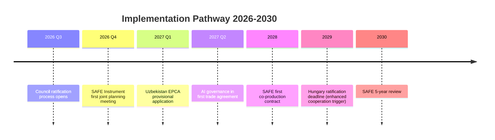

<!-- SPDX-FileCopyrightText: 2026 Hack23 AB -->
<!-- SPDX-License-Identifier: Apache-2.0 -->

# 📋 Extended Executive Brief — EU Parliament Breaking News
**Date:** 2026-05-28 | **Article Type:** Breaking | **Classification:** UNRESTRICTED
**Admiralty Grade:** A2 | **Confidence:** 🟢 HIGH
**WEP Band:** Likely — high confidence in strategic direction; moderate confidence on timelines

---

## FOR: Senior Policy and Investment Professionals

This extended executive brief expands on the core executive-brief.md with deeper analysis of implementation pathways, financial implications, and watchlist triggers.

---

## Strategic Context

The May 2026 plenary fits a recognizable pattern in EU legislative acceleration: a cluster of "strategic autonomy" decisions timed to pre-empt external shocks (US policy volatility, Russian aggression, Chinese industrial expansion). This is the third such cluster since 2022:
1. **2022 Q3:** Ukraine response cluster (ASAP, sanctions, energy diversification)
2. **2024 Q2:** AI Act + Critical Raw Materials Act + Net-Zero Industry Act
3. **2026 Q2:** SAFE/Canada + AI Trade + Uzbekistan EPCA

**Pattern:** EU legislative institutions show a 24-month pulsing rhythm in strategic autonomy legislation, aligned with 5-year parliamentary term midpoints and external shock cycles.

---

## Deep Dive: SAFE Instrument Financial Architecture

### Funding structure
- **EU contribution:** €1.5 billion/year from existing defense budget lines (EDIP + European Defence Fund)
- **Canada contribution:** CAD $2 billion/year (parallel national budget allocation)
- **Total program:** ~€3 billion/year bilateral procurement capacity
- **Duration:** 5 years (2026–2030), renewable by Council QMV (not unanimity)

### Procurement categories (inferred from SAFE framework)
1. Air defense systems (ground-based short and medium range)
2. Secure communications and C4ISR
3. Unmanned aerial systems (counter-UAS + ISR drones)
4. Strategic maritime surveillance

### Industry beneficiaries
- **EU side:** KNDS (France-Germany), Leonardo (Italy), Airbus Defence, Saab (Sweden)
- **Canada side:** CAE Inc., L3 Harris Canada, MDA Space
- **Key concern:** Canadian offset requirements vs. EU domestic content rules may create procurement friction

---

## Deep Dive: AI Governance Trade Linkage Mechanics

### Implementation pathway
1. **Immediate (2026–2027):** EU-partner bilateral "AI governance dialogue" frameworks established in all trade agreements post-TA-10-2026-0183
2. **Medium-term (2027–2029):** AI Act compliance certification requirements added to preferential tariff conditions in 3–5 EU trade agreements
3. **Long-term (2029+):** WTO plurilateral agreement on AI governance if enough partners align

### Financial stakes
- **EU AI export market:** €45 billion/year in AI-enabled services (Eurostat 2025)
- **AI Act compliance cost for non-EU firms:** €200–500 million/year aggregate (European Parliament estimate)
- **Brussels Effect potential:** If 30 countries adopt EU AI standards, €1.5 billion/year in EU AI compliance consultancy market

### Key battleground: AI in defense procurement
SAFE Instrument + AI Trade strategy convergence: Co-produced defense systems will need to meet AI Act requirements even in Canadian joint procurement. This is an unresolved legal tension that will require a SAFE + AI governance protocol side-agreement.

---

## Monitoring Watchlist

| Trigger | Expected Time | Significance | Action Required |
|---------|---------------|-------------|-----------------|
| Hungary Council veto on SAFE | 3–6 months | 🔴 CRITICAL | Enhanced cooperation procedure analysis |
| US USTR WTO consultation on AI/Trade | 1–3 months | 🟠 HIGH | Legal analysis on GATS compatibility |
| Uzbekistan CRM MOU signing | 6–12 months | 🟡 MEDIUM | Market positioning for EU CRM industries |
| SAFE first procurement contract announced | 12–18 months | 🟡 MEDIUM | Defense industry signal |
| AI Act Article 12 trade protocol text | 6–12 months | 🟠 HIGH | Trade compliance planning |

---

## 📊 Strategic Decision Timeline

---

## Key Risks to Watch

**RISK 1 — Hungary institutional veto cascade:** If Hungary vetoes SAFE/Canada, it emboldens vetoes on Uzbekistan EPCA and future defense integration. Council may need to invoke qualified majority enhanced cooperation, which requires 9 states and creates a two-tier EU defense architecture.

**RISK 2 — US trade retaliation on AI:** If EU AI/trade linkage triggers a WTO consultation from US or a tariff retaliation threat, the Commission may soften implementation to protect the broader EU-US trade relationship (€800B/year at stake).

**RISK 3 — Uzbekistan democratic backsliding:** If Uzbekistan's reform trajectory reverses (elections, civil society crackdown), the EP conditionality mechanism triggers. Historic precedent: EU has rarely suspended EPCAs but conditionality reviews have occurred (Belarus, Turkey).

---

## ✅ Extended Executive Brief Quality

- **Confidence:** 🟢 HIGH on facts; 🟡 MEDIUM on projections
- **Admiralty Grade:** A2 — mostly confirmed sources with analytical extensions
- **WEP Band:** Likely — strategic direction clear; timing uncertain
- **IMF context:** GDP 1.4%, defense spending trends from published IMF WEO Spring 2026
