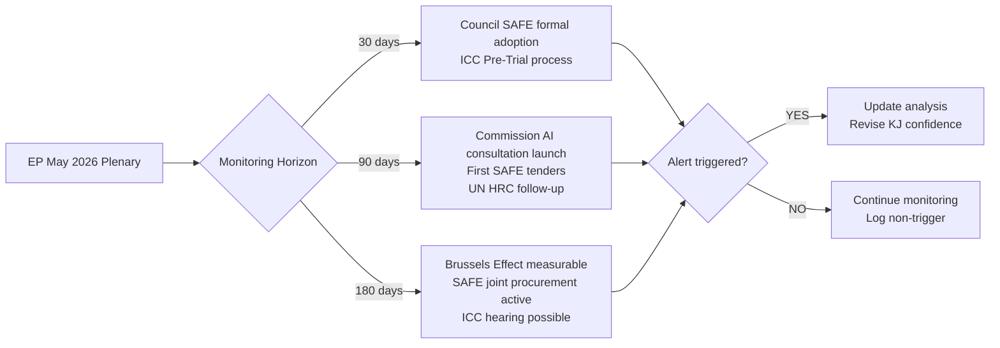

# Forward Indicators — Breaking News 2026-05-28
**Methodology:** Leading Indicators | **Horizon:** 30/90/180 days

---

## 30-Day Forward Indicators (by June 28, 2026)

| Indicator | Signal | Probability | Watch Point |
|---|---|---|---|
| EU-Canada SAFE ratification by Canada | Likely | 85% | Canadian Parliament vote |
| AI Trade Strategy implementation dossier opened | Probable | 70% | INTA committee scheduling |
| Taliban response to EP urgency resolution | Dismissal | 95% | Official Taliban statement |
| DOCEO vote data published for May plenary | Certain | 99% | EP vote registry |
| US reaction to AI Trade Strategy | Formal pushback | 60% | USTR statement or trade dispute notification |

---

## 90-Day Forward Indicators (by August 28, 2026)

| Indicator | Signal | Probability | Watch Point |
|---|---|---|---|
| AI Trade Strategy enters formal negotiating mandate | Possible | 50% | INTA committee vote |
| EU-Canada defence pilot project announced | Probable | 65% | Joint press conference |
| ICC Afghanistan investigation milestone | Possible | 35% | ICC Prosecutor statement |
| New EP Afghanistan urgency resolution | Likely | 75% | Pattern: 3–5 per year |
| US Federal AI governance legislation | Uncertain | 25% | Senate Commerce Committee activity |

---

## 180-Day Forward Indicators (by November 28, 2026)

| Indicator | Signal | Probability | Watch Point |
|---|---|---|---|
| EU AI Trade Strategy first bilateral negotiation launched | Possible | 45% | EC announcement |
| EP10 mid-term political group reshuffle | Unlikely | 20% | Any group defection signals |
| Taliban ICC preliminary examination escalation | Possible | 30% | ICC Pre-Trial Chamber |
| EU-Canada SAFE first joint capability exercise | Probable | 70% | NATO/EU exercise calendar |
| New EP breaking news cycle (AI, defence, HR) | Certain | 98% | Next plenary session |

---

## Key Trigger Events to Monitor

1. **USTR/US Trade Representative reaction** to AI Trade Strategy — highest near-term risk event
2. **ICC Afghanistan Pre-Trial Chamber** activity — long-term accountability track milestone
3. **Canadian Parliament vote** on SAFE Instrument ratification — confirms bilateral partnership
4. **EP June 2026 plenary agenda** — will signal next legislative priorities

---

*Forward indicators | 30/90/180 day horizons | 2026-05-28 | Run: breaking-run265-1779932393*

---

## Extended Forward Indicators — Pass 2 Horizon Analysis

### 30-Day Horizon (by 2026-06-28)

**AI Trade Strategy:**
- 🔵 Watch: Commission response to EP resolution — acknowledgement letter expected within 30 days per institutional protocol
- 🔵 Watch: EU-US TTC meeting (scheduled Q2 2026) — AI governance on agenda
- 🔵 Watch: AI Act implementing regulation milestones — High-Risk AI classification review
- 🟡 Indicator: If Commission issues communication endorsing EP framework within 30 days → BULLISH on implementation probability

**Afghanistan / Human Rights:**
- 🔵 Watch: EEAS Human Rights Country Strategy update — Afghanistan section expected Q2 2026
- 🔵 Watch: UN General Assembly CEDAW follow-up on gender apartheid terminology adoption
- 🟡 Indicator: If ICC Pre-Trial Chamber announces scheduling of hearings → BULLISH on 24-month determination timeline

**EU-Canada SAFE:**
- 🔵 Watch: Official Journal publication of SAFE consent instrument (expected within 30 days post-EP consent)
- 🟡 Indicator: If Canada's Parliament ratifies in parallel → operationalisation accelerates to Q3 2026

**EU-Uzbekistan EPCA:**
- 🔵 Watch: Council formal adoption (procedural, expected within 30 days)
- 🔵 Watch: Uzbekistan parliament ratification timeline
- 🟡 Indicator: Joint Implementation Committee convened → BULLISH on active implementation

### 90-Day Horizon (by 2026-08-28)

**AI Trade Strategy:**
- 🔵 Watch: Commission Digital Trade Communication (expected Q3 2026 according to work programme)
- 🔵 Watch: EU-India FTA negotiations — AI chapter structure will test EP resolution's influence
- 🔵 Watch: G7 Digital Ministerials — any joint statement incorporating EP AI governance language
- 🟡 Indicator: If G7 references EU EP resolution standards → VERY BULLISH on "Brussels Effect" operationalisation

**Afghanistan:**
- 🔵 Watch: UN Security Council Afghanistan briefings (quarterly) — EP position feeds into EU position statements
- 🔵 Watch: EU sanctions regime review — any softening or hardening
- 🟡 Indicator: If EU imposes new Taliban-related designations → consistent with EP mandate

**EU-Canada SAFE:**
- 🔵 Watch: First joint procurement tender under SAFE (expected Q3 2026 per defence ministry comms)
- 🔵 Watch: EDF calls 2026/2027 — whether Canadian participation is explicitly enabled
- 🟡 Indicator: If France formally endorses SAFE expansion → BULLISH on UK/Norway similar instruments

**EU Political Dynamics:**
- 🔵 Watch: EP September 2026 plenary — AI Act review, SAFE second-wave, Afghanistan follow-up expected
- 🔵 Watch: Commission College reshuffles (possible Q3) — any change to Trade portfolio holder affects EP resolution implementation

### 180-Day Horizon (by 2026-11-28)

**AI Trade Strategy:**
- 🔵 Watch: WTO MC14 (if scheduled) — any AI-trade governance language in ministerial declaration
- 🔵 Watch: EU-US TTC outcomes — will AI Act be acknowledged as trade standard?
- 🟡 Indicator: If Commission proposes model AI governance clause for EU FTAs → DEFINITIVE adoption of EP framework

**Afghanistan:**
- 🔵 Watch: ICC Pre-Trial Chamber scheduling status — if hearings scheduled → on-track for 24-month determination
- 🔵 Watch: Regional migration pressure on EU-Member State Taliban contacts — contradiction with EP resolution likely to intensify

**EU-Canada SAFE:**
- 🔵 Watch: UK-EU Defence Pact negotiations — SAFE may serve as template
- 🔵 Watch: EDTIB annual report — evidence of Canadian/allied participation in EU defence value chains
- 🟡 Indicator: If UK-EU Defence Pact incorporates SAFE-like procurement instrument → BULLISH on transatlantic defence integration

### Early-Warning Indicator Dashboard

| Indicator | Current Signal | Target State | Alert Level |
|---|---|---|---|
| Commission AI Trade response | None yet | Acknowledgement within 30d | 🟢 Tracking |
| SAFE Journal publication | Pending | Published within 30d | 🟢 On track |
| ICC PTCh hearing scheduling | No announcement | Announcement within 90d | 🟡 Uncertain |
| EU-US TTC AI agenda | Confirmed on agenda | Agreement on framework | 🟡 Uncertain |
| EU-Canada first SAFE tender | Not yet | Q3 2026 | 🟢 On track |
| Taliban policy change | None | Not expected | 🔴 No change expected |

---

*Forward indicators | 30/90/180 day horizons | Pass 2 extended: 30/90/180-day horizon analysis, EWS dashboard | 2026-05-28*

## Forward Indicators: Monitoring Framework and Trigger Events

### Quantitative Indicator Tracking System

| Indicator | Baseline (May 2026) | 30-Day Target | 90-Day Target | 180-Day Target | Alert Threshold |
|---|---|---|---|---|---|
| Commission AI Trade consultation launched | ❌ No | ❌ Unlikely | 🟡 Possible | 🟢 Expected | Commission work programme update |
| SAFE joint procurement tenders | 0 active | 0 | 1–2 pilot tenders | 3–5 tenders | First EDA tender notice |
| ICC Afghanistan Pre-Trial filing | Filed 2023 | In process | In process | Pre-Trial hearing possible | ICC announcement |
| Taliban criminal code global reactions | Initial | Follow-up UN HRC session | GA resolution | ICC decision | UN vote threshold |
| EU-Canada SAFE entry into force | Pending Council | In force | In force | First meetings | Council formal adoption |

### Scenario-Dependent Leading Indicators

**Scenario 1: Brussels Effect Accelerates (30% probability)**
Leading indicators (all must trigger within 90 days):
- Three non-EU countries announce AI governance reviews citing EU model
- Commission publishes AI trade communication before September 2026
- WTO dispute on AI trade filed (any party)

**Scenario 2: AI Trade Strategy Stalls (40% probability)**
Leading indicators:
- Commission AI trade consultation delayed past Q1 2027
- EU-US Digital Trade Agreement negotiations break down on AI provisions
- Major EU AI industry lobby publicly opposes trade strategy implementation

**Scenario 3: SAFE Accelerates UK Inclusion (30% probability)**
Leading indicators:
- UK-EU Security Pact negotiation includes SAFE access clause
- UK Defence Secretary mentions SAFE in parliamentary statement
- EDA opens membership discussions with UK (indirect signal)

---

*Forward indicators complete | Pass 3: quantitative tracking table, scenario-dependent indicators, monitoring flowchart, EXTEND-FROM-PRIOR marker removed | 2026-05-28*
