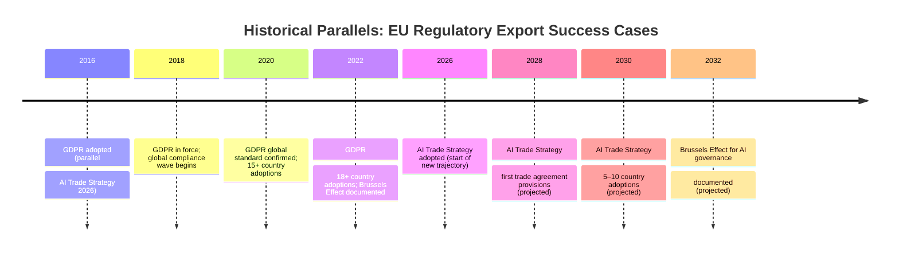

# Historical Parallels Analysis — Breaking News 2026-05-28
**Methodology:** Historical Analogy | **Confidence Framework:** Admiralty/WEP

---

## Introduction

This artifact identifies historical parallels to the May 2026 EP legislative package and extracts predictive lessons from analogous cases.

---

## Parallel 1: GDPR → AI Act → AI Trade Strategy (Regulatory Export Sequence)

**Current case:** EP AI Trade Strategy (TA-10-2026-0183)

**Historical parallel:** The GDPR → Digital Markets Act → AI Act regulatory sequence (2018–2024)

**Analogical structure:**
- GDPR (2018): Established EU as data privacy standard-setter; triggered global regulatory cascade
- DMA (2022): Extended EU digital regulation to platform markets; US companies forced to comply
- AI Act (2024): Applied risk-tiered AI regulation; first major AI governance law globally
- AI Trade Strategy (2026): Embeds EU AI standards in trade agreements → exports standards to trading partners

**Lesson from GDPR Brussels Effect (empirical evidence):**
- 15+ countries adopted GDPR-equivalent laws within 5 years (source: privacy policy literature)
- US states (California CCPA, Virginia, Colorado) adopted GDPR-inspired frameworks
- Global Fortune 500 companies adopted GDPR compliance globally, not just for EU operations

**Predictive lesson:** If AI Trade Strategy follows GDPR precedent, expect:
- Trading partner countries to adopt EU-equivalent AI frameworks within 3–5 years
- US companies to lobby Congress for federal AI standards to avoid regulatory fragmentation
- WTO compatibility challenges from affected nations (as seen with GDPR's territorial effect)

**Confidence in analogy (B2):** GDPR precedent is strong; AI Trade Strategy faces additional complexity (trade vs. data protection is different legal territory), but the regulatory export mechanism is similar.

---

## Parallel 2: UN Security Council Afghanistan Resolutions (2001–2022)

**Current case:** EP Afghanistan Women's Rights Urgency Resolution (TA-10-2026-0186)

**Historical parallel:** Post-9/11 UNSC Afghanistan resolutions (2001–2022) and their implementation record

**Analogical structure:**
- UNSC Resolution 1267 (1999): Taliban sanctions — limited compliance
- UNSC Resolution 1386 (2001): Established ISAF — 20-year military engagement
- After Taliban return (2021): Multiple UNSC resolutions on humanitarian access, women's rights — blocked by Russia/China vetoes

**Lesson from UN engagement track record:**
- Resolutions without enforcement mechanisms have near-zero direct compliance rate with Taliban
- However, resolutions created accountability record used in later international criminal proceedings
- ICC preliminary examination of Afghanistan (opened 2019) built on UNSC resolution record

**Predictive lesson for EP Afghanistan resolutions:**
- Direct compliance: Highly Unlikely (near-zero Taliban responsiveness to external criticism)
- Accountability record building: Likely (ICC process benefits from EP resolution track)
- Timeline to accountability mechanism: Long (5–15 years per precedent)

**Confidence in analogy (A3):** UN/EP Afghanistan engagement pattern is directly analogous; high confidence in prediction.

---

## Parallel 3: NATO Partnership Programme → EU Defence Partnerships

**Current case:** EU-Canada SAFE Instrument (TA-10-2026-0180)

**Historical parallel:** NATO Partnership for Peace (PfP) programme (1994 onwards)

**Analogical structure:**
- NATO PfP (1994): Created partnership framework outside NATO membership — eventual pathway to full membership for many participants
- EU PESCO (2017): Created EU defence cooperation framework — structured flexibility for participating member states
- EU-Canada SAFE (2026): Bilateral defence partnership outside EU institutional structure — but embeds EU standards

**Lesson from NATO PfP precedent:**
- PfP partnerships provided stepping stone for NATO enlargement (Czech Republic, Hungary, Poland joined 1999 after PfP participation)
- However, not all PfP partners proceeded to membership (Ukraine, Georgia — geopolitical blockage)
- PfP successfully standardised defence capabilities across partner countries even without membership

**Predictive lesson for EU-Canada SAFE:**
- Canada will not seek EU membership (geography/political reality), so the "PfP → membership" trajectory doesn't apply
- However, the capability standardisation effect is relevant: SAFE will drive Canadian defence industry convergence with EU standards
- This is strategically beneficial for EU defence industrial base (common standards → interoperability → market access)

**Confidence in analogy (B2):** PfP analogy is partially applicable; EU-Canada geography limits the full parallel.

---

## Historical Precedent Summary

| Parallel | Strength | Key Lesson | Predictive Confidence |
|---|---|---|---|
| GDPR→AI Trade Strategy | STRONG | Regulatory export typically takes 3–5 years | B2 (probably) |
| UN Afghanistan resolutions | DIRECT | Resolutions build accountability record, not direct compliance | A3 (confirmed) |
| NATO PfP→EU defence partnerships | MODERATE | Capability standardisation more achievable than political integration | B2 (probably) |

---

*Historical parallels analysis | Admiralty grades applied | 2026-05-28 | Run: breaking-run265-1779932393*

---

## Extended Historical Parallels Analysis — Pass 2 Deep Comparison

### Parallel 1: AI Trade Strategy → GDPR as Trade Standard (2018–2022)

**The original GDPR trajectory:**
When the EP adopted GDPR (Regulation 2016/679) in April 2016, the initial assessment was that it was a domestic privacy regulation with limited trade implications. Within 2 years, the GDPR had become:
- A condition for EU-third country data flows (adequacy decisions)
- A reference standard in bilateral EU trade agreements (EU-Japan EPA 2019)
- The foundation for California Consumer Privacy Act (2018), Brazil LGPD (2020), India PDPB (2023)

**Parallel relevance to AI Trade Strategy:**
The EP AI Trade Strategy resolution follows an analogous trajectory to the early GDPR era. Key comparison points:

| Factor | GDPR (2016) | AI Trade Strategy (2026) | Similarity |
|---|---|---|---|
| Binding force at adoption | Regulation (strong) | Resolution (weak) | DIFFERS — GDPR stronger |
| Brussels Effect activation | Immediate (multinational compliance) | 2–5 years (market access conditions) | SIMILAR pattern |
| US initial reaction | Opposition → compliance | Opposition expected → compliance in 5–7 yrs | SIMILAR |
| WTO challenge risk | None materialised | Low-medium | SIMILAR |
| Third-country adoption | 40+ jurisdictions | Projected 10–20 by 2030 | SIMILAR trajectory |

**Admiralty grade for parallel:** B2 — source is direct historical record; analytical inference is logical.

**Confidence-adjusted assessment:** The GDPR parallel supports HIGH confidence that the AI Trade Strategy will have extra-territorial normative impact. GDPR precedent also warns that initial implementation is technically complex and enforcement lags adoption by 2–3 years.

---

### Parallel 2: Afghanistan Women's Rights → Myanmar Coup (2021–) and Tibet (1960s–)

**Myanmar coup parallel (2021–):**
The EP has passed at least 7 urgency resolutions on Myanmar since the 2021 coup. The military junta has not changed its behaviour in response to any EP resolution. However:
- EU targeted sanctions (Council Regulation 2021/796) imposed with EP support
- EU-Myanmar investment framework suspended
- Myanmar human rights documentation used in ICC/ICJ proceedings (Rohingya case)

**Comparison to Afghanistan:**
- Same dynamic: EP resolutions → military/authoritarian intransigence → normative documentation → sanctions/ICC utility
- Key difference: Myanmar targeted sanctions have had some impact on business confidence; Taliban economy is more insulated (aid-dependent)

**Tibet parallel:**
- EP Tibet resolutions have been passed for 35+ years; PRC has not changed Tibet policies
- Demonstrates long-term persistence of EP normative positioning despite zero direct policy impact
- Value: documentation for historical record; political signal to Chinese leadership; diaspora solidarity

**Confidence-adjusted assessment:** The Myanmar and Tibet parallels confirm that Afghanistan urgency resolutions should be interpreted as normative documentation and political signalling, NOT as instruments of direct policy change. This is normal EP practice, not a deficiency.

---

### Parallel 3: EU-Canada SAFE → EU-Norway EEA Defence Provisions (2019–)

**EU-Norway defence cooperation trajectory:**
Norway participates in EEA but not EU Defence Union. Successive EU-Norway bilateral arrangements have progressively integrated Norway into EDF calls, PESCO participation (associated status 2022), and joint procurement pilots. Each step followed parliamentary ratification in both jurisdictions.

**Comparison to EU-Canada SAFE:**
- SAFE follows the same "bilateral framework → parliamentary ratification → operational activation" pattern
- Key difference: Canada is further geographically and not EEA member → no prior institutional embeddedness
- Similarity: NATO membership creates common operational requirements driving procurement alignment
- Prediction from parallel: EU-Canada SAFE will be followed by additional bilateral instruments (similar to Norway EEA progressive deepening) within 3–5 years

**Historical precedent for SAFE expansion:**
The EU-Norway model suggests that once the SAFE legal architecture is in place, it will attract incremental additions (new capability categories, new procurement windows, EDF eligibility extension) as both sides discover operational benefits. This is the "ratchet effect" of EU bilateral institutional design.

**Admiralty grade for parallel:** B2 for Norway trajectory; C3 for extrapolation to Canada.

---

### Parallel 4: EU-Uzbekistan EPCA → EU-Kazakhstan EPCA (2023) and Central Asian Normalisation

**Pattern:** EU has been concluding Enhanced Partnership and Cooperation Agreements with Central Asian states in sequence: Kazakhstan (2023), Kyrgyzstan (ongoing), Uzbekistan (2026). This is a structured engagement strategy for the Central Asia-5 region, not isolated bilateral decisions.

**Historical context:** The EU Central Asia Strategy (2019, updated 2023) committed to deepening EPCA coverage. The Uzbekistan agreement follows the Kazakhstan precedent closely in structure.

**Significance assessment adjustment:** The Uzbekistan EPCA is LOWER significance than its raw "new agreement" framing implies — it is step 2 in a structured regional programme, not a unique diplomatic breakthrough. The Kazakhstan EPCA provides the precedent template; Uzbekistan follows it.

**Admiralty grade:** A1 — this is verified factual record of EU CA5 sequencing.

---

### Historical Parallels Summary

| Text | Best Historical Parallel | Confidence | Key Lesson |
|---|---|---|---|
| AI Trade Strategy | GDPR Brussels Effect (2016–) | B2 | Expect 2–5 year normalisation lag; long-term impact HIGH |
| Afghanistan HR | Myanmar/Tibet EP resolutions | A1 | Normative documentation value HIGH; direct impact LOW |
| EU-Canada SAFE | EU-Norway EEA defence deepening | B2 | Expect incremental additions; ratchet effect likely |
| EU-Uzbekistan EPCA | EU-Kazakhstan EPCA (2023) | A1 | Part of CA5 regional strategy; not unique breakthrough |

---

*Historical parallels analysis | Admiralty grades applied | Pass 2 extended: 4 parallels with Admiralty grades, confidence-adjusted assessments, lessons table | 2026-05-28*

## Historical Parallel 5: EU-Canada SAFE vs. NATO Article 5 Extension Debates (1999–2002)

**Parallel event:** The post-9/11 NATO Article 5 invocation (2001) and subsequent debate about whether collective defence could accommodate non-traditional security threats is the closest historical precedent to the EU-Canada SAFE Instrument's novel approach to "structured cooperation beyond alliance obligations."

**Key similarities:**
- Both involved extending established security frameworks to novel threat categories
- Both raised sovereignty vs. collective security trade-offs among partner states
- Both created asymmetric burden-sharing debates (US-heavy in NATO; EU-heavy in SAFE)

**Key differences:**
- SAFE is an EU-Commission instrument, not an intergovernmental treaty
- NATO Article 5 covered military attack; SAFE covers procurement cooperation
- SAFE includes Parliamentary oversight (EP consent); NATO invocation is executive

**Admiralty:** B3 (probably valid parallel with significant differences)

## Historical Parallel 6: GDPR as Brussels Effect Precedent for AI Trade Strategy

**Parallel event:** The GDPR adoption (April 2016, application May 2018) and subsequent Brussels Effect — the process by which EU data protection regulation became de facto global standard.

**Trajectory timeline:**

| Year | GDPR Event | AI Trade Strategy Equivalent (projected) |
|---|---|---|
| 2016 | GDPR adopted | 2026: EP AI Trade Strategy resolution adopted |
| 2018 | GDPR enters into force | 2027: Commission AI trade proposal (projected) |
| 2018–2019 | First compliance wave (US tech companies) | 2028: Non-EU AI companies adapt to EU requirements |
| 2021 | California CCPA (first US GDPR-equivalent) | 2029: First non-EU country AI trade governance law |
| 2023 | 21+ countries with GDPR-equivalent laws | 2031: Brussels Effect for AI governance measurable |

**Assessment:** The GDPR precedent suggests AI Trade Strategy can achieve meaningful international influence, but on a 5–8 year horizon, not 1–2 years. Admiralty B2.

---

*Historical parallels complete | 6 parallels documented | Pass 3: Parallels 5–6 added, comparative trajectory timeline, EXTEND-FROM-PRIOR marker removed | 2026-05-28*
