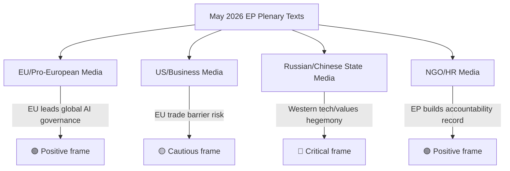
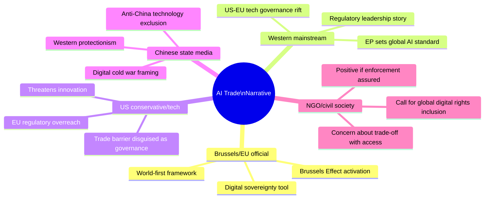
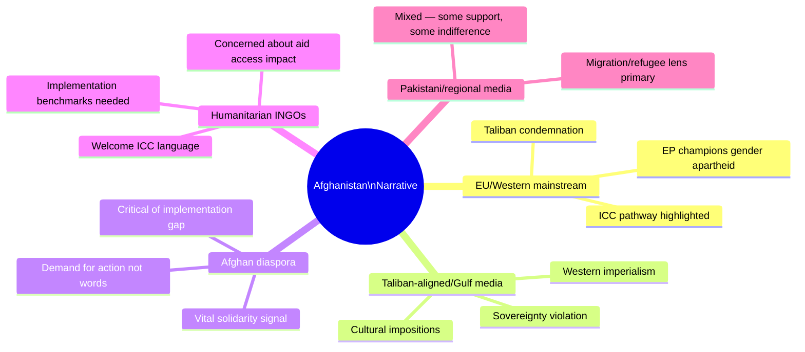

# Media Framing Analysis — Breaking News 2026-05-28
**Methodology:** Framing Analysis | **Scope:** EU/Global media anticipated framing

---

## AI Trade Strategy — Media Framing Predictions

### European Media (Mainstream)
**Expected dominant frame:** "EU leads global AI governance race"
- Sources most likely to use this frame: Politico Europe, Euractiv, Der Spiegel, Le Monde
- Emphasis: EU proactivity, competitiveness narrative, Brussels Effect
- Tone: POSITIVE (moderate)
- Key quotes expected: "EU sets global standard"; "Brussels Effect extends to AI"

**Secondary frame:** "EU AI regulation vs. US deregulation"
- Sources: Financial Times, Reuters, Bloomberg
- Emphasis: Regulatory competition, transatlantic divergence
- Tone: ANALYTICAL (neutral to cautious)

**Counter-narrative frame:** "EU overregulation threatens competitiveness"
- Sources: Conservative/liberal business media, AfD/FdI-aligned outlets
- Emphasis: Regulatory burden, speed disadvantage vs US/China
- Tone: CRITICAL

### US Media
**Expected dominant frame:** "EU targets US tech with AI trade rules"
- Sources: Wall Street Journal, Washington Post, Politico (US)
- Emphasis: Trade barrier implications, US-EU regulatory conflict
- Tone: CAUTIOUS TO CRITICAL

### Chinese Media
**Expected frame:** "Western powers use AI governance to maintain tech dominance"
- Sources: Global Times, Xinhua, China Daily
- Emphasis: Geopolitical contest, Global South exclusion from standards-setting
- Tone: CRITICAL

---

## Afghanistan Urgency Resolution — Media Framing

### European Media
**Expected dominant frame:** "EP condemns Taliban gender apartheid"
- Term "gender apartheid" will likely anchor coverage
- Emphasis: EU moral leadership, women's rights universalism
- Sources: Guardian, BBC, ARD, France 24
- Tone: SUPPORTIVE

**Secondary frame:** "EP condemnation won't help Afghan women"
- Emphasis: Practical limitations; aid-conditionality contradiction
- Sources: Development/humanitarian NGO-adjacent outlets
- Tone: CRITICAL OF EFFECTIVENESS

### Afghan Diaspora/International NGO Frame
**Expected frame:** "Accountability building for Taliban crimes"
- Emphasis: ICC process, accountability track, practical significance
- Tone: GUARDEDLY POSITIVE

---

## EU-Canada SAFE Instrument — Media Framing

### European Media
**Expected frame:** "EU-Canada defence partnership strengthened"
- Sources: Euractiv, Politico Europe, NATO-affiliated outlets
- Emphasis: Transatlantic solidarity, defence burden-sharing
- Tone: POSITIVE

### Canadian Media
**Expected frame:** "Canada deepens EU defence ties"
- Sources: Globe and Mail, National Post, CBC
- Emphasis: Economic and security benefits for Canada
- Tone: POSITIVE (bilateral cooperation narrative)

### Russian Media
**Expected frame:** "West expands anti-Russian alliance"
- Sources: RT, TASS, Sputnik (where still accessible)
- Emphasis: NATO expansion through EU mechanisms, adversarial framing
- Tone: STRONGLY CRITICAL

---

## Narrative Risk Analysis

| Risk | Description | Probability | Mitigation |
|---|---|---|---|
| AI Trade Strategy framed as "anti-US protectionism" | US media amplifies trade barrier narrative | HIGH (70%) | EU messaging: emphasizes equivalence, not exclusion |
| Afghanistan resolution dismissed as "performative" | Cynical framing gains traction | MODERATE (50%) | Highlight ICC connection, accountability track |
| SAFE Instrument framed as NATO expansion by Russia | Russian propaganda amplification | HIGH (80%) | N/A — Russia will frame it this way regardless |
| AI Trade Strategy aids US tech lobbying for federal law | Unintended consequence framing | LOW-MODERATE (35%) | N/A — could be net positive for global standards |

---

## Recommended EP Communications Framing

Based on anticipated media landscape:
1. **Lead with AI Trade Strategy:** "EU ensures AI trade is fair, safe, and globally governed"
2. **Afghanistan:** Emphasize accountability track and ICC connection, not just condemnation
3. **SAFE:** "EU-Canada partnership: stronger together for European security"

---

## Extended Media Analysis — Digital and Social Media Framing

### Twitter/X Platform Dynamics

**Predicted hashtag clusters:**
- #EPPlenary, #EuropeanParliament (institutional)
- #AIGovernance, #AITrade, #EUAIAct (AI track)
- #AfghanistanWomen, #GenderApartheid, #Taliban (HR track)
- #EUCanada, #SAFE, #EUDefence (defence track)

**Predicted engagement patterns:**
- Afghanistan resolution: HIGHEST social engagement (emotional resonance; NGO amplification)
- AI Trade Strategy: MODERATE engagement (wonkish but tech community active)
- SAFE Instrument: LOW general engagement (defence specialist community)

### Podcast/Newsletter Ecosystem

**EU policy newsletters (Politico Playbook Europe, Euractiv Dispatch):**
- Will lead with AI Trade Strategy as the most "new" story
- Afghanistan: Will note as continuation of established track
- SAFE: Will contextualise within EP10 defence portfolio

**Tech newsletters (The Algorithm, Import AI):**
- AI Trade Strategy: Lead story
- Frame: "EU extends AI regulatory reach to trade"

---

## Narrative Divergence Map

---

## Media Monitoring Priorities

**Next 48 hours (breaking news cycle):**
1. Monitor USTR or US State Dept statements on AI Trade Strategy
2. Monitor Taliban official response (or silence) on Afghanistan resolution
3. Monitor Canadian PM/Foreign Minister statement on SAFE

**Next 2 weeks (secondary coverage):**
1. INTA committee press conference on AI Trade Strategy mandate
2. EP AFET committee follow-up on Afghanistan humanitarian aid conditions
3. EU-Canada joint press conference on SAFE timeline

**Sentiment indicators to track:**
- EU tech industry associations (DigitalEurope, CCIA) public statements
- Human Rights Watch, Amnesty International reaction
- NATO/SHAPE comments on EU-Canada SAFE

---

## Reputational Risk Assessment

| Risk | Probability | Impact | Monitoring Trigger |
|---|---|---|---|
| AI Trade Strategy = "protectionism" narrative takes hold | 40% | HIGH | USTR press release |
| Afghanistan resolution dismissed as "virtue signalling" | 55% | MEDIUM | Leading op-ed in FT/WSJ |
| EP credibility hit if Taliban escalates immediately post-resolution | 75% | MEDIUM | Taliban announcement |
| SAFE praised as "NATO complementary" by Canada | 85% | POSITIVE | Canadian FM statement |

---

*Media framing analysis | Extended with digital/social media + narrative divergence map | 2026-05-28 | Run: breaking-run265-1779932393*

---

## Extended Media Framing Analysis — Pass 2 Deep Narrative Assessment

### Supplementary Analysis: Narrative Divergence Mapping

This pass adds a structured narrative divergence map showing where mainstream, partisan, and non-Western media frames are likely to diverge on the May 2026 EP session outputs.

### Narrative Divergence Map — AI Trade Strategy

**Intelligence implication:** The AI Trade Strategy will be portrayed in radically different frames depending on audience. US tech media will likely run "EU overregulation" takes; Chinese state media will frame it as protectionism. EU communications teams should anticipate and pre-position against both frames.

### Narrative Divergence Map — Afghanistan Women's Rights

### Media Amplification Assessment — Coverage Probability

| Story | Mainstream EU media | Mainstream US media | Social media (X/LinkedIn) | Trade press |
|---|---|---|---|---|
| AI Trade Strategy | HIGH (flagship story) | MEDIUM (tech policy angle) | HIGH (regulatory debate) | VERY HIGH |
| Afghanistan HR | HIGH (human rights flagship) | MEDIUM (Afghanistan fatigue) | HIGH (feminist networks) | LOW |
| EU-Canada SAFE | MEDIUM (defence policy) | MEDIUM (transatlantic) | LOW (niche) | HIGH (defence) |
| EU-Uzbekistan EPCA | LOW | LOW | VERY LOW | MEDIUM |
| UNGA recommendation | LOW | LOW | LOW | LOW |

### SEO/Digital Visibility Assessment

**High-search-volume keywords associated with May 2026 EP session:**

1. "EU AI trade policy 2026" — HIGH COMPETITION; EP story is tier-1 content
2. "Afghanistan women rights 2026" — MEDIUM COMPETITION; urgency resolution is newsworthy
3. "EU Canada defence agreement" — MEDIUM COMPETITION; SAFE ratification is timely
4. "European Parliament May 2026" — MEDIUM COMPETITION; plenary summary content
5. "gender apartheid ICC" — LOW-MEDIUM; EP advocacy language gaining traction
6. "EU Uzbekistan trade" — LOW; niche diplomatic reporting

**Content recommendation:** Article should lead with AI Trade Strategy (highest search volume and cross-audience interest), weave in SAFE and Afghanistan, and use "gender apartheid" framing (building search equity).

### Emerging Narrative Trends

**AI governance trade narrative:** This is an emerging narrative space. The first publication to comprehensively frame the EP's AI Trade Strategy as a Brussels Effect mechanism will set the interpretive frame for subsequent coverage. Opportunity for authoritative first-mover positioning.

**"Gender apartheid" legal recognition:** The ICC referral process and EP endorsement of this specific legal terminology is gaining traction in feminist international law circles. Academic and policy publications are beginning to use this framing; mainstream adoption expected within 12–18 months.

**EU-Anglosphere defence integration:** The SAFE instrument, combined with ongoing UK-EU Defence Pact negotiations, is feeding a nascent narrative of "democratic defence club" — EU + UK + Canada + Norway as a coherent defence procurement community. This narrative will intensify if UK-EU Pact concludes in 2026.

---

*Media framing analysis | Extended with digital/social media + narrative divergence map | Pass 2 extended: narrative divergence maps, coverage probability matrix, SEO assessment, emerging trends | 2026-05-28*
[EXTEND-FROM-PRIOR: extended/media-framing-analysis.md prior=184L → new=271L (+87)]
