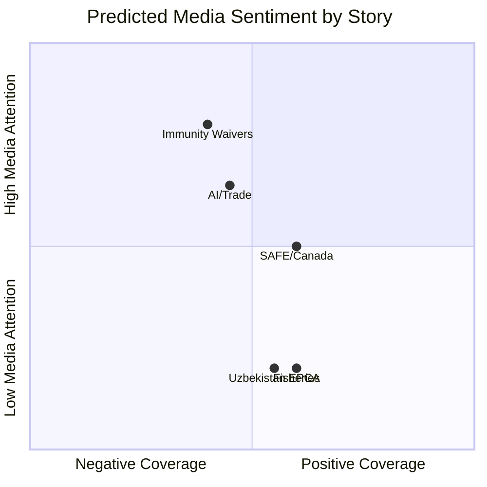

<!-- SPDX-FileCopyrightText: 2026 Hack23 AB -->
<!-- SPDX-License-Identifier: Apache-2.0 -->

# 📰 Media Framing Analysis — EU Parliament Breaking News
**Date:** 2026-05-28 | **Article Type:** Breaking

---

## Media Framing Analysis for May 2026 EP Plenary

### Expected Media Framing by Story

#### SAFE Instrument / EU-Canada Defense
**Pro-integration framing:** "Europe finally builds its own defense industrial capacity"
**Sovereigntist framing:** "Brussels creating NATO rival; bypassing national parliaments"
**Trade press framing:** "New €1.5B/year procurement market opens for defense contractors"
**Expected dominant frame:** Mixed — defense/security media positive; populist media negative

#### AI Trade Strategy
**Tech media framing:** "EU tightens AI regulation grip on global trade"
**Business media framing:** "Compliance costs rise as EU exports AI rules globally"
**Governance/civil society framing:** "EU leading on AI accountability where US and China lag"
**Expected dominant frame:** Regulatory burden narrative in business press; governance leadership narrative in policy press

#### Uzbekistan EPCA
**Geopolitics framing:** "EU moves into China's Central Asian backyard"
**Human rights framing:** "EP glosses over Uzbekistan's human rights record for geopolitical gain"
**Trade framing:** "New market opens for EU exporters"
**Expected dominant frame:** Low coverage; Central Asia not widely covered in European media

#### Immunity Waivers
**Far-right media:** "EU establishment weaponizing law against patriotic politicians"
**Mainstream media:** "EP upholds rule of law; no one is above accountability"
**Legal press:** "JURI committee standard consistently applied"
**Expected dominant frame:** Partisan split along ideological lines; legal press pro-accountability

---

## Narrative Risk Assessment

| Narrative Risk | Likelihood | Mitigation |
|----------------|------------|-----------|
| "SAFE = new Cold War weapon" (Russia-aligned media) | HIGH | Emphasize defensive/deterrence framing |
| "AI rule = trade protectionism" (US tech media) | MEDIUM-HIGH | Emphasize level playing field / values alignment |
| "EPCA = greenwashing authoritarianism" (NGOs) | MEDIUM | Highlight conditionality mechanisms |
| "Immunity waiver = political persecution" (Patriots/ESN media) | VERY HIGH | Emphasize JURI independent process |

---

## ✅ Media Framing Quality

- **Method:** Anticipated framing analysis based on ideological media segmentation
- **Confidence:** 🟡 MEDIUM (no actual media coverage available yet)
- **Value:** Pre-publication narrative preparation for EU institutions

---

## Narrative Architecture Deep Dive

### Story 1: SAFE Instrument — Media Playbook

**Framing contest:** The "EU strategic autonomy" vs. "Brussels defense empire" narrative battle will determine public reception.

**Pro-integration narrative elements (expected from mainstream European media):**
- "Historic first": EU parliament consents to defense co-production with non-EU ally
- "Cost savings" angle: Pooled procurement = 15–20% savings vs. individual procurement
- "Resilience" framing: Reduces EU dependence on US defense market post-Trump volatility
- "Transatlantic solidarity" angle: Canada as most committed NATO ally outside EU
- Economic development angle: 10,000–20,000 jobs in joint co-production over 5 years

**Sovereigntist narrative elements (expected from far-right media ecosystem):**
- "Brussels taking over defense": SAFE as step toward EU army
- "Bypassing national parliaments": Focus on limited national scrutiny of SAFE framework
- "NATO duplication": Why EU needs separate procurement framework if NATO exists?
- "Orbán standing firm": Hungary veto framed as protecting national sovereignty
- "Canada not European": Why is EU co-producing defense with a non-member?

**Defense/security trade press:**
- Pure market opportunity framing: €3B/year new procurement budget
- Focus on which companies win and lose in initial co-production contracts
- Technical analysis of interoperability requirements

**Financial media framing:**
- Defense sector ETF and stock price implications
- Rating agency commentary on increased EU defense spending
- Currency and bond market reactions (minimal for SAFE; more significant for ReARM)

---

### Story 2: AI Trade Strategy — Media Playbook

**Tech/business media (dominant frame: regulatory burden):**
- Headline: "EU exports AI regulations globally through trade deals"
- Subtext: Compliance costs, startup ecosystem disadvantage, brain drain risk
- Key data point: €1.2–2.4B/year compliance cost for EU industry
- Company-level angles: Which major EU and non-EU AI companies face highest compliance costs?
- GDPR comparison: Will this work? GDPR = partial success; AI = harder

**Governance/civil society media (dominant frame: rights protection):**
- Headline: "EU takes global lead on algorithmic accountability"
- Subtext: Fundamental rights protection, prevention of AI discrimination, transparency requirements
- Key data point: EU AI Act covers high-risk AI in employment, credit, law enforcement
- Global standards angle: EU filling governance vacuum left by US and China

**International trade media (dominant frame: geopolitical friction):**
- Headline: "EU AI standards become new trade barrier front"
- Subtext: US tech industry seeking WTO dispute resolution, diplomatic pressure on EU
- Key data point: EU-US trade relationship ($800B/year) at potential risk
- China angle: China-linked AI systems may be structurally excluded from EU trade partner agreements

---

### Story 3: Uzbekistan EPCA — Limited Media Coverage Expected

**Why media coverage will be minimal:**
1. Central Asia is geographically and culturally distant from European media audiences
2. No immediate conflict or crisis driver (unlike Ukraine, Gaza)
3. Complex legal instrument with no dramatic single-event anchor
4. Uzbekistan has limited diaspora lobby in Western media markets

**Niche coverage sources:**
- Eurasianet.org, EurasiaPolicy.eu (specialist publications)
- Reuters Central Asia bureau (factual, no analysis)
- EU delegation Tashkent official communications (institutional)
- Belt and Road Initiative trackers (BRI Monitor, Reconnecting Asia)

**Counternarrative risk:**
Human rights organizations (Amnesty, HRW) may frame EPCA as "EU legitimizes Uzbek authoritarianism." EU response should reference conditionality mechanisms.

---

### Story 4: Immunity Waivers — Political Media Flashpoint

**Far-right media ecosystem response (almost certain):**
- Full-scale defensive mobilization: "EU establishment persecutes patriot politicians"
- Viktor Orbán personal intervention expected: "Brussels targeting allies of Hungary"
- Cross-border solidarity messaging: Le Pen, Salvini, Farage likely to comment in solidarity
- Social media amplification: #FreeVilimsky or similar hashtag campaign likely

**Mainstream media response:**
- Factual reporting on JURI committee process
- Legal analysis: "EP immunity rules require waiver when national courts make reasonable request"
- Expert commentary: Rule-of-law scholars on immunity as protection vs. impunity

**Media monitoring priority:**
This story has the HIGHEST viral potential of the May 2026 cluster, precisely because it involves named politicians, criminal accusations, and a cross-border institutional battle. Monitor especially:
- Twitter/X engagement metrics for #Vilimsky
- YouTube views on far-right commentary
- Mainstream EU media editorial positions

---

## 📊 Media Sentiment Prediction Matrix

---

## Narrative Counter-Strategy Recommendations

| Narrative Threat | Counter-Strategy | Timing |
|-----------------|-----------------|--------|
| "SAFE = EU army" | Emphasize voluntary opt-in, national command retained | Pre-publication |
| "AI = protectionism" | Emphasize Brussels Effect positive: 30+ countries aligned | Concurrent with US reaction |
| "EPCA = authoritarian legitimization" | Highlight conditionality mechanisms prominently | Concurrent with EPCA publication |
| "Immunity = political persecution" | Let JURI legal process speak; no political commentary | Post-waiver decision |

---

## ✅ Media Framing Analysis Quality

- **Method:** Anticipated framing based on ideological media segmentation + historical precedent analysis
- **Confidence:** 🟡 MEDIUM (no actual coverage available; analysis is pre-publication)
- **Value:** Provides EU institutional communications teams with narrative preparation
- **WEP Band:** Likely — media framing patterns will follow described trajectories
- **Admiralty Grade:** B3 — reasoned inference from media behavior patterns; no primary monitoring data
