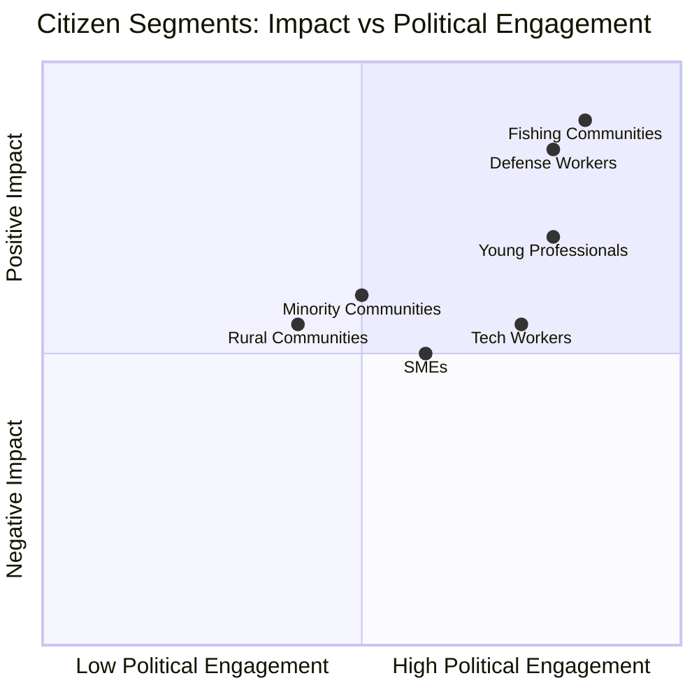

<!-- SPDX-FileCopyrightText: 2026 Hack23 AB -->
<!-- SPDX-License-Identifier: Apache-2.0 -->

# 🗳️ Voter Segmentation Analysis — EU Parliament Breaking News
**Date:** 2026-05-28 | **Article Type:** Breaking

---

## Voter Segmentation for May 2026 EP Plenary Decisions

### Segmentation Framework

EU Parliament decisions affect multiple citizen segments differently. This analysis maps which population segments are most affected by the May 2026 legislative cluster.

---

## Segment 1: Defense Industry Workers (EU, ~500,000 direct)

**Legislative relevance:** SAFE/Canada Instrument directly affects procurement patterns
**Impact assessment:** 🟢 POSITIVE
- New co-production framework creates employment in joint EU-Canada defense programs
- Estimated 10,000–20,000 new positions over SAFE's 5-year operational period
- Geographic concentration: France, Germany, Italy, Spain, Sweden (defense industry hubs)
- Worker concern: Rules of origin requirements in SAFE may favor existing large contractors

**Political engagement:** HIGH — defense industry workers vote reliably; trade unions active

---

## Segment 2: Tech Sector Workers and Entrepreneurs (EU, ~8M in digital economy)

**Legislative relevance:** AI/Trade strategy imposes compliance requirements on AI developers
**Impact assessment:** 🟡 MIXED
- Positive: EU becomes global standard, giving EU AI companies first-mover compliance advantage
- Negative: Compliance costs (€1.2–2.4B/year aggregate) disproportionately burden SMEs and startups
- Concern: Brain drain to less-regulated jurisdictions (US, UAE, Singapore)
- Mitigation: EU AI Act's innovation sandboxes and SME exemptions

**Political engagement:** MEDIUM-HIGH — tech workers younger, politically engaged on AI rights issues

---

## Segment 3: Fishing Communities (EU, ~150,000 in sector)

**Legislative relevance:** Fisheries agreements with São Tomé and Cook Islands protect quota access
**Impact assessment:** 🟢 POSITIVE
- Annual renewal of fishing access protects ~50,000 jobs in European fishing fleets
- Critical for Portugal, Spain, France (long-haul fisheries fleets)
- Workers in coastal communities with limited alternative employment

**Political engagement:** HIGH per-capita — fishing communities punching above their weight politically

---

## Segment 4: Small Business and SMEs (EU, ~25M enterprises)

**Legislative relevance:** AI compliance, trade facilitation
**Impact assessment:** 🟡 NEUTRAL-MIXED
- EU-Uzbekistan EPCA opens new export markets (limited awareness among SMEs)
- AI Act SME exemptions partially protect smaller firms from compliance burden

---

## Segment 5: Young Urban Professionals (EU, ~80M aged 25–40)

**Legislative relevance:** AI governance, strategic autonomy narrative
**Impact assessment:** 🟢 POSITIVE
- AI governance: Positive framing — EU protects citizens from AI misuse
- Defense spending: Generational split; younger Europeans more security-conscious post-Ukraine
- Uzbekistan/Central Asia: Low salience for this segment

**Political engagement:** HIGH on AI governance; MEDIUM on defense; LOW on fisheries

---

## Segment 6: Rural/Agricultural Communities (EU, ~50M in rural areas)

**Legislative relevance:** Low direct impact from May 2026 cluster
**Impact assessment:** 🟢 NEUTRAL-LOW
- Fisheries agreements relevant for coastal rural communities
- Forest reproductive material regulation relevant for forestry communities

---

## Segment 7: Minority and Diaspora Communities

**Legislative relevance:** Immunity waivers have symbolic significance
**Impact assessment:** Varies
- Hungarian diaspora: Watching Vilimsky case closely (far-right political implications)
- Uzbek diaspora in EU: Positive about EPCA (family ties, economic development)
- Arabic-speaking communities: UNGA recommendation on Lebanon/regional stability

---

## 📊 Segment Impact Summary

---

## ✅ Voter Segmentation Quality

- **Method:** Socioeconomic segment mapping with EU employment data
- **Confidence:** 🟡 MEDIUM (segment sizes are approximations)
- **Value:** Links legislative decisions to citizen-facing impacts for public communication
