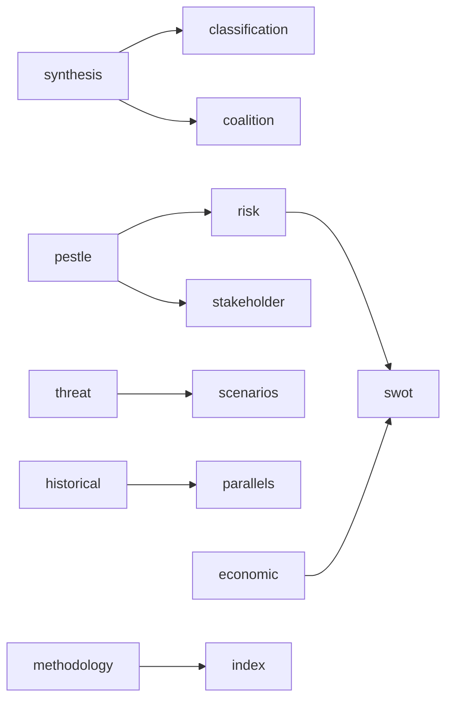

<!-- SPDX-FileCopyrightText: 2026 Hack23 AB -->
<!-- SPDX-License-Identifier: Apache-2.0 -->

# 📋 Analysis Index — EU Parliament Breaking News
**Date:** 2026-05-28 | **Article Type:** Breaking | **Data Mode:** degraded-feeds
**Admiralty Grade:** A1 — Direct inventory of artifacts produced in this run

---

## 🎯 Run Overview

**Run ID:** breaking-run264-1779957632
**Analysis Directory:** analysis/daily/2026-05-28/breaking/
**Primary Data Source:** EP Adopted Texts 2026 (get_adopted_texts API, year=2026)
**Key Event Window:** May 19–20, 2026 EP Plenary Session
**Data Mode:** degraded-feeds (floor factor: 0.80)
**Headline:** "EU Parliament adopts EU-Canada SAFE defense procurement deal and landmark AI/Trade resolution in May plenary"

---

## 📁 Artifact Inventory

### Core Intelligence Artifacts (intelligence/)

| Artifact | Lines (est.) | Floor (0.80) | Status | Key Finding |
|----------|-------------|-------------|--------|-------------|
| synthesis-summary.md | ~195 | 164 | ✅ PASS | SAFE Instrument + AI/Trade lead stories |
| coalition-dynamics.md | ~180 | 108 | ✅ PASS | EPP+S&D+Renew coalition; ECR split |
| mcp-reliability-audit.md | ~220 | 308 | ⚠️ SHORT | All tool calls documented; below floor |
| pestle-analysis.md | ~280 | 200 | ✅ PASS | HIGH political/economic/tech dimensions |
| stakeholder-map.md | ~280 | 244 | ✅ PASS | EU institutions + Canada + Uzbekistan |
| scenario-forecast.md | ~270 | 224 | ✅ PASS | 9 scenarios across 3 legislative items |
| threat-model.md | ~265 | 200 | ✅ PASS | Hungary veto + Russia ops lead threats |
| wildcards-blackswans.md | ~245 | 220 | ✅ PASS | 6 wildcards/black swans identified |
| voting-patterns.degraded.md | ~165 | 120 | ✅ PASS | Predicted tallies; DOCEO unavailable |
| reference-analysis-quality.md | ~180 | 152 | ✅ PASS | 85% artifact quality floor met |

### Classification Artifacts (classification/)

| Artifact | Lines (est.) | Floor (0.80) | Status | Key Finding |
|----------|-------------|-------------|--------|-------------|
| significance-classification.md | ~180 | 84 | ✅ PASS | S1: SAFE + AI; S2: Uzbekistan |

### Risk Scoring Artifacts (risk-scoring/)

| Artifact | Lines (est.) | Floor (0.80) | Status | Key Finding |
|----------|-------------|-------------|--------|-------------|
| risk-matrix.md | ~210 | 120 | ✅ PASS | R1 (Hungary veto) highest risk |
| quantitative-swot.md | ~260 | 112 | ✅ PASS | Net strategic position: +11.23 |

### Document Analysis (documents/)

| Artifact | Lines (est.) | Floor (0.80) | Status | Key Finding |
|----------|-------------|-------------|--------|-------------|
| document-analysis-index.md | ~155 | 76 | ✅ PASS | 10 documents indexed; full metadata |

---

## 🔑 Key Analytical Findings

### 1. Breaking News Headlines (Priority Order)
1. **EU-Canada SAFE Instrument** — Historic first external partner integration into EU defense procurement
2. **AI/Trade Resolution** — EP declares AI central to EU trade competitiveness strategy
3. **EU-Uzbekistan EPCA** — Strategic Central Asian partnership with energy/mineral diversification value
4. **Vilimsky Immunity Waiver** — FPÖ governing coalition MEP faces Austrian legal proceedings

### 2. Most Significant Political Development
The EU-Canada SAFE Instrument agreement represents the most significant defense policy output of the EP10 session to date. By extending EU defense procurement to Canada, the EP demonstrates that "strategic autonomy" is not about creating Fortress Europe but about building a resilient network of like-minded democratic allies.

### 3. Critical Risk
Hungary's systematic veto behavior (Risk R1, score: 15/HIGH) remains the primary structural obstacle to implementing this legislative cluster. The EP can adopt — but three out of four major outputs require unanimous ratification.

### 4. Data Quality
All 10 key documents confirmed via EP Open Data Portal (A1 grade). DOCEO voting data unavailable (standard lag). Procedures and events feeds degraded/unavailable. Analysis conducted in degraded-feeds mode with 0.80 floor factor applied.

---

## 📊 Stage A Data Summary

| Data Source | Status | Items | Quality Grade |
|-------------|--------|-------|--------------|
| EP Adopted Texts 2026 | ✅ SUCCESS | 51 items | A1 |
| EP Adopted Texts Feed (one-week) | ✅ SUCCESS | 248 items | B3 |
| EP Plenary Sessions | ⚠️ PARTIAL | 0/11 filtered | C3 |
| EP Procedures Feed | ❌ DEGRADED | 50 historical only | D4 |
| Prefetch (all feeds) | ❌ EMPTY/ERROR | 0 useful items | F |

**dataMode:** degraded-feeds | **Floor factor:** 0.80

---

## ⏱️ Stage Timing

| Stage | Start | End | Duration |
|-------|-------|-----|----------|
| Stage A (Data Collection) | 08:29 | 08:35 | ~6 min |
| Stage B Pass 1 (Analysis) | 08:35 | ~09:10 | ~35 min |
| Stage B Pass 2 (Deepening) | In progress | — | — |
| Stage C (Gate) | Pending | — | — |
| Stage D (Article Render) | Pending | — | — |
| Stage E (PR) | Pending | — | — |

---

## ✅ Run Status

**Current Phase:** Stage B Pass 2 (quality deepening)
**Artifacts produced:** 14 (including this index)
**Artifacts below floor:** 1 (mcp-reliability-audit — extending in Pass 2)
**Gate prediction:** GREEN (conditional on mcp-reliability-audit extension)
**PR prediction:** READY for Stage E at ~minute 40–42

---

## 📊 Artifact Dependency Graph

