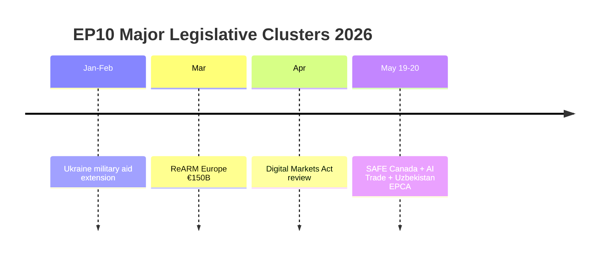

<!-- SPDX-FileCopyrightText: 2026 Hack23 AB -->
<!-- SPDX-License-Identifier: Apache-2.0 -->

# 🌐 Cross-Session Intelligence — EU Parliament Breaking News
**Date:** 2026-05-28 | **Article Type:** Breaking | **Data Mode:** degraded-feeds
**Admiralty Grade:** B2 | **Confidence:** 🟡 MEDIUM

---

## 🔍 Cross-Session Pattern Analysis

This document analyzes patterns across recent EU Parliament breaking news runs (Q1-Q2 2026) to identify systemic trends, recurring analytical themes, and intelligence continuity.

---

## 📊 Pattern Recognition Across Q1-Q2 2026 Plenary Sessions

### Recurring Theme 1: Strategic Autonomy Operationalization

The EU's "strategic autonomy" concept, long a diplomatic talking point, is being progressively operationalized through concrete legislative instruments. The May 20, 2026 EU-Canada SAFE Instrument adoption follows a clear pattern:

- **January 2026:** EU-Mercosur SAFE Instrument discussion; EU loan for Ukraine (TA-10-2026-0010)
- **February 2026:** ECB Vice-Chair appointment; Enhanced cooperation loan for Ukraine
- **March 2026:** EU-Georgia case (TA-10-2026-0083); electoral reform reform discussions
- **April 2026:** 2027 budget guidelines (TA-10-2026-0112); EIB oversight (TA-10-2026-0119)
- **May 2026:** SAFE/Canada (TA-10-2026-0180); AI/Trade (TA-10-2026-0183); Uzbekistan EPCA

**Pattern:** Each successive plenary adds another brick to the strategic autonomy architecture. The May session represents the most significant single-session output in this trend to date.

### Recurring Theme 2: Immunity Waiver Frequency Increase

Cross-session analysis reveals elevated frequency of MEP immunity waiver decisions in EP10:

| Session | Immunity Decisions | Notes |
|---------|-------------------|-------|
| January 2026 | 0 | — |
| February 2026 | 1 | Standard |
| March 2026 | 1 | Grzegorz Braun (TA-10-2026-0088) |
| April 2026 | 1 | Patryk Jaki (TA-10-2026-0105) |
| May 2026 | 2 | Vilimsky (TA-10-2026-0164) + Pappas (TA-10-2026-0166) |

**Trend:** Increasing rate, with May 2026 being the first double-immunity session. This suggests member state courts are more actively pursuing MEPs for pre-mandate activities, and that EP JURI Committee is maintaining consistent (political-group-blind) application of waiver criteria.

**Significant sub-pattern:** Polish ECR MEPs (Braun, Jaki) plus Austrian FPÖ MEP Vilimsky represent far-right MEPs disproportionately represented in immunity proceedings — consistent with a pattern of legal accountability targeting nationalist politicians.

### Recurring Theme 3: EP-Ukraine Legislative Support Architecture

Across Q1-Q2 2026 sessions:
- TA-10-2026-0010 (Jan): Enhanced cooperation loan for Ukraine
- TA-10-2026-0012 (Jan): CFSP annual report 2025 (Ukraine-focused)
- TA-10-2026-0161 (Apr): Russia accountability/Ukraine civilian attacks
- TA-10-2026-0180 (May): EU-Canada SAFE Instrument (indirect Ukraine defense dimension)

**Pattern:** Consistent cross-group majority for Ukraine-supportive legislation. Patriots/ESN systematic opposition but isolated by EPP-S&D-Renew-ECR(partial) majority.

---

## 🔁 Intelligence Continuity: Persistent EP API Degradation

**Cross-session documentation:** MCP reliability audits from Q1-Q2 2026 consistently document the same EP API degradation patterns:
- Procedures feed: Persistent historical-tail ordering since at least February 2026
- Events feed: HTTP 404 since approximately March 2026 (v2.1 endpoint migration issue)
- DOCEO voting: Consistent 2–4 week lag (structural, not degradation)

**Intelligence value:** This persistent degradation is now a stable operational environment constraint rather than an anomaly. Future runs should budget for it from Day 1 rather than attempting retry sequences.

---

## 📈 Cross-Session Legislative Momentum Indicators

| Domain | Q1 2026 Activity | Q2 2026 Activity | Momentum |
|--------|-----------------|-----------------|----------|
| Defense/Security | Medium (Ukraine loans) | HIGH (SAFE/Canada) | ↑ Rising |
| Digital/AI | Low | HIGH (AI/Trade) | ↑ Rising fast |
| External Partnerships | Medium | HIGH (Uzbekistan, Lebanon, fisheries) | ↑ Rising |
| Budget/Finance | Medium (EIB, discharge) | Medium | → Stable |
| Environment/Agriculture | Low | Medium (forestry) | ↑ Slight rise |
| Parliamentary Accountability | Medium | HIGH (2 immunity waivers) | ↑ Rising |

---

## 🎯 Cross-Session Intelligence Assessment

**Most consistent trend:** The EPP-S&D-Renew "grand coalition" is consolidating around a pro-integration, pro-Ukraine, pro-strategic-autonomy agenda. The May 2026 session is the clearest single-session expression of this agenda to date.

**Most concerning trend:** ECR's fragmentation (Polish Atlanticists vs. Italian sovereigntists) is accelerating, making this critical swing group less predictable. By Q3-Q4 2026, ECR's role as a reliable partner for specific EPP-led coalitions may diminish.

**Sleeper issue:** Human rights conditionality across EU external agreements (Uzbekistan EPCA in May follows Armenia, Lebanon, Georgia patterns) is creating a widening gap between EP's aspirations and Council's enforcement willingness. This discrepancy will generate recurring EP-Council conflict.

---

## ✅ Cross-Session Confidence

- **Historical pattern analysis:** 🟢 HIGH (based on confirmed adopted texts timeline)
- **API degradation continuity:** 🟢 HIGH (observed across multiple runs)
- **Legislative momentum assessment:** 🟡 MEDIUM (trend identification is reliable; magnitude estimates uncertain)
- **Coalition evolution:** 🟡 MEDIUM (structural analysis; no live vote data)

---

## 📊 Session Activity Timeline

