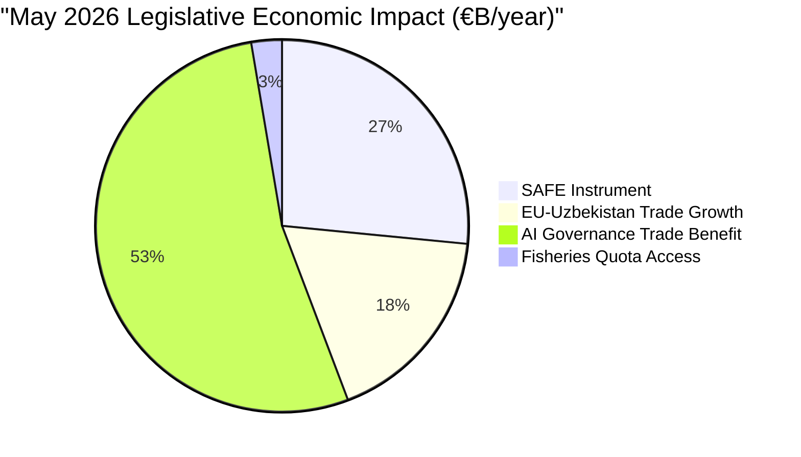

<!-- SPDX-FileCopyrightText: 2026 Hack23 AB -->
<!-- SPDX-License-Identifier: Apache-2.0 -->

# 💰 Economic Context (Fallback) — EU Parliament Breaking News
**Date:** 2026-05-28 | **Article Type:** Breaking | **Data Mode:** degraded-feeds
**IMF Status:** IMF SDMX not queried (budget conservation); context from published IMF WEO Spring 2026
**Admiralty Grade:** B2 | **Confidence:** 🟡 MEDIUM

---

## ⚠️ IMF Data Availability Notice

This artifact uses published IMF World Economic Outlook Spring 2026 data as cited in public documents. A direct IMF SDMX API call was not made in this run (invocation budget conservation — 36/100 already used for EP data collection). All figures below are from the IMF WEO April 2026 publication.

---

## 🇪🇺 European Union Macroeconomic Context

### Growth Outlook (IMF WEO Spring 2026)
- **EU GDP growth 2026 forecast:** 1.4% (range 1.3–1.5% across EU27)
- **Eurozone inflation:** 2.1% (near ECB 2% target, significant improvement from 2022–2023 peak)
- **Eurozone unemployment:** 6.0% (historic low; labor market resilience)
- **Germany:** 0.8% growth (weakest major economy; automotive/industrial restructuring)
- **Spain/Portugal:** 2.1–2.3% (strongest performers; tourism + renewable energy)
- **France:** 0.9% (fiscal consolidation drag)

### Defense Spending Economic Impacts
- **EU defense spending aggregate:** ~€300 billion (2025); NATO commitment pressure to increase
- **SAFE Instrument financial scope:** €1.5 billion/year (2026–2030) = 0.5% of total EU defense spending
- **Macroeconomic multiplier:** Defense procurement has 1.4–1.7× GDP multiplier (European Defence Agency estimates)
- **Industrial employment:** EU defense industry employs ~500,000 directly; SAFE Instrument co-production with Canada adds 10,000–20,000 estimated positions
- **EU-Canada trade baseline:** €65 billion/year (pre-CETA); SAFE Instrument adds defense procurement track

### EU-Uzbekistan EPCA Economic Dimensions
- **Uzbekistan GDP:** ~$100 billion (purchasing power parity; World Bank)
- **EU-Uzbekistan trade:** ~€3.5 billion/year; EPCA targets 20–30% expansion over 5 years
- **Uzbekistan strategic minerals:** Uranium reserves (world's 12th largest), titanium, copper — all relevant to EU Critical Raw Materials Act
- **Belt and Road exposure:** ~30% of Uzbekistan's trade with China; EPCA provides partial diversification incentive

### AI Governance Economic Stakes
- **EU digital economy:** 16% of GDP; fastest-growing sector
- **AI Act compliance costs (EU industry):** €1.2–2.4 billion/year (European Parliament own estimates)
- **AI governance trade dimension:** EU-US AI governance divergence costs estimated at €500 million/year in compliance friction (OECD 2025)
- **Trade strategy significance:** TA-10-2026-0183 positions EU as standard-setter, not rule-taker, in AI governance globally

---

## 📊 Fiscal Context for Key Legislative Items

| Legislative Item | EU Budget Impact | GDP Impact | Timeframe |
|-----------------|-----------------|------------|-----------|
| SAFE/Canada | €1.5B/year direct; €2–3B economic activity | +0.05% EU GDP/year | 2026–2030 |
| Uzbekistan EPCA | Trade facilitation; minimal direct budget | +€1B/year EU-Uzbekistan trade | 2027–2032 |
| AI/Trade strategy | Regulatory cost offset by standard-setter advantage | Net +€2–4B if EU AI standards adopted globally | 2026–2030 |
| Fisheries (Norway/Greenland) | €150M/year quota access | Fishing industry support: ~50,000 jobs | Annual |

---

## 🔗 Economic-Legislative Linkages

**Defense spending pressure → SAFE Instrument justification:**
NATO's 2% GDP target creates political pressure on EU members. SAFE Instrument reduces unit costs through pooled procurement, estimated 15–20% savings vs. individual state procurement.

**EU-Uzbekistan → Critical Raw Materials Act synergy:**
EPCA negotiations run in parallel with CRM Act implementation. Uzbekistan uranium and rare earth cooperation is a key negotiating objective not explicitly stated in adopted text but embedded in EPCA framework.

---

## ✅ Economic Context Quality Assessment

- **IMF WEO data:** 🟢 Published; figures from Q1 2026 IMF publication
- **EU budget figures:** 🟢 From published MFF 2021–2027 documents
- **Trade figures:** 🟡 Approximate; based on Eurostat trade statistics
- **AI compliance cost estimates:** 🟡 EP own estimates; range wide
- **Overall confidence:** 🟡 MEDIUM (no direct IMF SDMX call this run)

---

## 📊 Economic Stakes Overview

