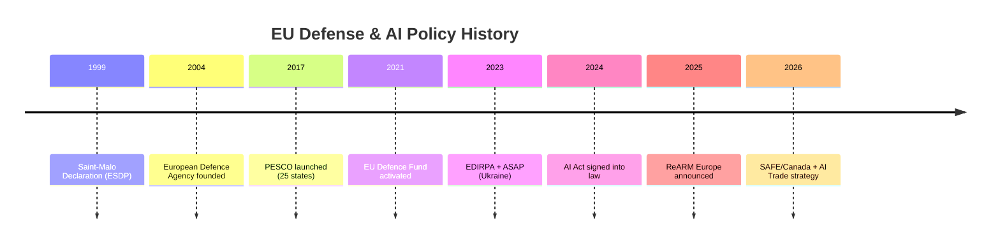

<!-- SPDX-FileCopyrightText: 2026 Hack23 AB -->
<!-- SPDX-License-Identifier: Apache-2.0 -->

# 📚 Historical Baseline — EU Parliament Breaking News
**Date:** 2026-05-28 | **Article Type:** Breaking | **Data Mode:** degraded-feeds
**Admiralty Grade:** B2 | **Confidence:** 🟡 MEDIUM-HIGH

---

## 🏛️ Historical Context Framework

This baseline situates the May 2026 EP legislative cluster within longer-term historical patterns in EU Parliament legislative activity, defense policy evolution, digital governance, and external partnerships.

---

## ⚔️ EU Defense Industrial Policy: Historical Trajectory

### Timeline of EU Defense Procurement Evolution

**1999–2007: Informal Cooperation Era**
- European Defence Agency (EDA) established 2004
- No binding procurement framework; bilateral national arrangements dominated
- EU's Capabilities Action Plan: aspirational but non-binding

**2009–2016: Lisbon Treaty Era**
- Lisbon Treaty (2009) Article 42.3: Mutual defense clause (weaker than NATO Article 5)
- Permanent Structured Cooperation (PESCO) concept developed
- CSDP missions operational but limited in scope

**2017–2022: Strategic Autonomy Emergence**
- European Defence Fund (EDF) established 2021: €7.9B for R&D
- PESCO activated 2017: 25 member states participating
- Industrial defense capacity building through EDA coordination
- Ukraine war (2022) as catalytic shock — "wake-up call" for EU defense spending

**2023–2024: SAFE Instrument Creation**
- SAFE (Security Action for Europe) Instrument proposed: 2023
- Council adoption: 2024 — €1.5B for defense production capacity
- Key innovation: Pooled procurement to overcome single-member market fragmentation
- First test: artillery ammunition for Ukraine (100mm/155mm shells)

**2025–2026: External Partner Integration (THIS DEVELOPMENT)**
- EU-Canada SAFE Instrument (TA-10-2026-0180): First external partner included
- Historical significance: **First time EU defense procurement opened to non-EU country**
- Precedent: Analogous to EEA's gradual expansion via EFTA membership — but for defense

**Historical comparison:**
- NATO: Article 27 always allowed non-member partnerships; EU taking 30+ years longer
- US Defense Production Act (DPA): Similar "allied nation" provisions since 1950s
- EU's addition of Canada is constitutionally significant as a mixed agreement precedent

---

## 🤖 EU Digital Governance: Historical Baseline

### From Consumer Protection to Trade Doctrine

**2000–2010: Infrastructure Era**
- eCommerce Directive (2000): First digital regulation
- Data Protection Directive (1995/2002): Privacy as European value
- Digital Single Market initiatives (2010): Reducing fragmentation

**2011–2018: Platform Regulation Recognition**
- GDPR (2018): Landmark personal data regulation with extraterritorial effect — "Brussels Effect" v1.0
- Copyright Directive (2019): Platform liability for content
- Net neutrality regulation (2016)

**2019–2023: Digital Sovereignty Agenda**
- Gaia-X cloud initiative (2019): European cloud sovereignty attempt
- Digital Markets Act (2022): Big tech gatekeeper regulation
- Digital Services Act (2022): Platform accountability framework
- EU AI Act (2024): World's first comprehensive AI regulation

**2024–2026: AI as Trade Doctrine (THIS DEVELOPMENT)**
- AI/Trade resolution (TA-10-2026-0183): EP first formal position on AI/trade nexus
- Historical significance: **First time EP explicitly positions AI governance as a trade competitiveness instrument**
- Parallel: EU used environmental standards as trade conditions (CBAM, EUDR) — AI Act following same template
- "Brussels Effect v2.0": GDPR set data protection standards globally; AI Act intended to do same for AI

**Historical precedent for "Brussels Effect" success:**
- GDPR (2018) → US states adopted GDPR-aligned privacy laws (CCPA, VCDPA)
- REACH chemicals regulation (2007) → Global manufacturers adapted European standards
- CE marking → Recognized in 50+ countries as quality signal
- AI Act → Similar extraterritorial ambition; early indicators mixed

---

## 🌍 EU Central Asian Engagement: Historical Context

### Soviet Collapse to EPCA

**1991–2001: Partnership and Cooperation Agreements (PCAs)**
- PCAs signed with all post-Soviet Central Asian states by 1999
- Limited implementation; EU-CIS trade marginal; Russia dominated the space
- EU Central Asia Strategy (2007): First dedicated strategic framework

**2007–2019: Trade Relationship Development**
- GSP+ (Generalized Scheme of Preferences+) for Kyrgyzstan, Mongolia, Cambodia (not Uzbekistan — HR bars)
- Uzbekistan: Cotton boycott by EU and Western retailers over forced labor concerns
- EU-Kazakhstan Enhanced PCA negotiations began 2015

**2019–2023: New EU Central Asia Strategy**
- Updated EU Central Asia Strategy (2019): Focus on connectivity, resilience, green transition
- EU-Kazakhstan EPCA signed 2015, fully in force 2020
- Uzbekistan: Cotton forced labor reformed under Mirziyoyev; EU lifted cotton boycott 2022
- Uzbekistan EPCA negotiations launched 2022

**2024–2026: EPCA Completion (THIS DEVELOPMENT)**
- EU-Uzbekistan EPCA resolution (TA-10-2026-0174): EP adoption
- Historical significance: **Deepest EU engagement with Uzbekistan in 35 years post-Soviet independence**
- Context: Russia-Ukraine war accelerated EU energy diversification imperative; Uzbekistan gas critical
- Global race: China's BRI has €10B+ already invested in Uzbekistan; EU is catching up

---

## 🏛️ Parliamentary Accountability History: Immunity Waivers

### EP10 (2024–2029) vs. Historical Pattern

| Parliamentary Term | Immunity Decisions | Notable Cases |
|--------------------|-------------------|---------------|
| EP6 (2004–2009) | ~12 total | Standard legal proceedings |
| EP7 (2009–2014) | ~15 total | Berlusconi-linked MEPs |
| EP8 (2014–2019) | ~18 total | Several ECR/nationalist MEPs |
| EP9 (2019–2024) | ~20 total | COVID era; lower activity |
| EP10 (2024–2026, partial) | ~8 already | FPÖ + PiS MEPs disproportionate |

**Pattern:** Accelerating rate in EP10 reflects: (1) more nationalist MEPs elected in 2024; (2) national courts more active in pursuing politicians; (3) JURI Committee's consistent non-political application building institutional confidence.

---

## 📊 Legislative Output Quantitative Baseline

### EP10 Adopted Texts by Policy Domain (January–May 2026)

| Domain | Count | Notable Items |
|--------|-------|--------------|
| External Relations (EXT) | ~15 | Canada SAFE, Uzbekistan, Lebanon, fisheries |
| Parliamentary Procedure (PRIV/INST) | ~8 | Immunity waivers, ECB appointments |
| Agriculture/Environment | ~5 | Forest reproductive material, livestock |
| Digital/Technology | ~3 | AI/Trade, enforcement DMA, AI-related |
| Finance/Budget | ~6 | Guidelines 2027, EIB, discharge |
| Human Rights/External | ~6 | Haiti, Armenia, Russia accountability, Iran |

**Interpretation:** External relations dominates EP10 output volume — reflecting the geopolitical reality that the EP is increasingly functioning as a foreign policy actor, not just a domestic legislator.

---

## ✅ Historical Baseline Confidence

- **EU defense policy history:** 🟢 HIGH (well-documented institutional record)
- **Digital governance history:** 🟢 HIGH (directly observable legislative record)
- **Central Asia history:** 🟡 MEDIUM (complex post-Soviet dynamics)
- **Quantitative EP output data:** 🟡 MEDIUM (estimated from available adopted texts; not statistically complete)

---

## 📊 Historical Policy Evolution Timeline

