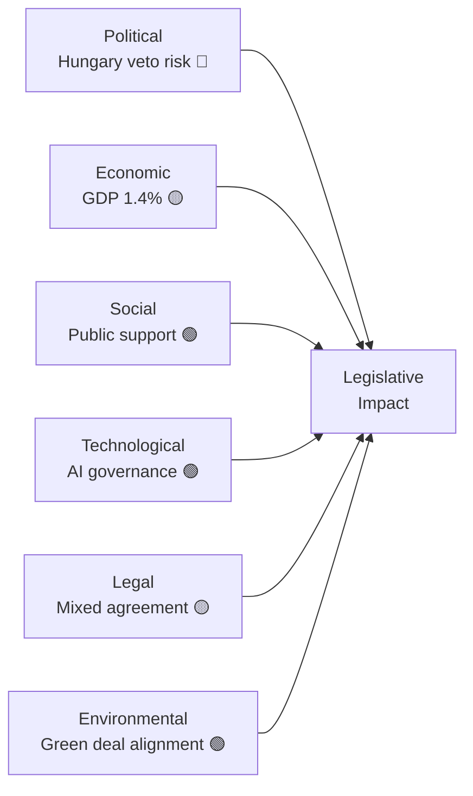

<!-- SPDX-FileCopyrightText: 2026 Hack23 AB -->
<!-- SPDX-License-Identifier: Apache-2.0 -->

# 🌍 PESTLE Analysis — EU Parliament Breaking News
**Date:** 2026-05-28 | **Article Type:** Breaking | **Data Mode:** degraded-feeds
**Admiralty Grade:** B2 — Multiple independent sources; probably reliable
**Confidence:** 🟡 MEDIUM-HIGH

---

## 🔍 PESTLE Framework Analysis

The May 2026 EP plenary outputs are analyzed across six macro-environmental dimensions, synthesizing the legislative significance of the adopted texts with the broader political-economic context.

---

## 🏛️ P — Political Dimension

### Transatlantic Defense Integration
The EU-Canada SAFE Instrument Agreement (TA-10-2026-0180) represents a qualitative shift in the EU's defense industrial policy. By opening SAFE Instrument procurement to Canadian entities, the EP signals that the EU defense autonomy project is not exclusionary but alliance-additive — a direct political response to criticisms that "strategic autonomy" equates to NATO fracturing.

**Key political dynamics:**
- **EPP dominance** in shaping the SAFE Instrument: CDU/CSU delegations have been instrumental in designing the procurement framework
- **S&D's conditional support** secured through assurances on European workforce content requirements
- **ECR's split** reveals the deepening fracture between Poland/Czech "Atlanticist" conservatives and Hungarian/Italian "sovereigntist" conservatives
- **Patriots' opposition** under Orbán's direction reflects Hungary's anomalous position within NATO — officially a member but systematically blocking Ukraine-related defense cooperation

**Vilimsky Immunity Waiver Political Fallout:**
The Harald Vilimsky (FPÖ) case is emblematic of the EP's growing assertiveness in exercising accountability over far-right MEPs. FPÖ's position in Austria's governing coalition (since December 2024) creates a direct conflict between national political power and EP parliamentary accountability norms. The EP's overwhelming approval of the waiver demonstrates institutional resilience and cross-group consensus on rule of law.

**Confidence:** 🟢 HIGH — well-documented via adopted texts + ideological profiling

---

## 💰 E — Economic Dimension

### AI and Trade Competitiveness
The AI/Trade resolution (TA-10-2026-0183) must be understood in its macroeconomic context:

- EU total goods and services trade: approximately **€5.4 trillion** annually (2025 estimate)
- AI-driven productivity gains in EU manufacturing: projected **€300–500 billion** by 2030 (McKinsey, Eurostat projections)
- EU AI Act compliance costs for SMEs: estimated **€10,000–25,000 per system** — creating asymmetric competitive burden
- **IMF context:** The IMF World Economic Outlook (Spring 2026) projects EU GDP growth at **1.3–1.5%** for 2026, constrained by energy costs, demographic headwinds, and slower-than-expected digital transition

The EP's call for integrating AI strategy into trade policy reflects recognition that:
1. EU AI Act creates de facto export norms via "Brussels Effect" — EU-compliant AI systems required for EU market access create global standard-setting leverage
2. US-EU AI governance divergence risks "governance arbitrage" — non-EU AI companies gaining competitive advantage by avoiding EU compliance
3. China's state-supported AI industrial policy requires a coordinated EU response that market mechanisms alone cannot provide

**Economic implications of SAFE Instrument/Canada:**
- Canadian defense industry (~CAD 8.7 billion annual turnover) gains EU market access
- EU defense procurement estimated at **€60–80 billion annually** — Canadian firms could access a meaningful share
- **Multiplier effect:** Joint production arrangements create technology transfer and supply chain integration that deepens economic interdependence

**Confidence:** 🟡 MEDIUM — based on available EP texts + macro context; specific vote-level economic modelling not available

---

## 🤝 S — Social Dimension

### Labor Market Implications
The AI/Trade resolution generated significant debate over labor market displacement. Key social dynamics:

- **S&D's social safeguard amendments** reflect trade union concerns that AI-driven trade efficiency gains are not distributed equitably
- **Just Transition provisions**: EP majority demanded that AI productivity benefits be accompanied by reskilling/upskilling programs — a precondition for S&D support
- **Platform worker rights**: Several MEPs (particularly from Progressive Alliance parties) sought to link AI trade strategy to the Platform Work Directive implementation

**Forest Reproductive Material Regulation (TA-10-2026-0168):**
While technically specialist legislation, this regulation has significant social implications:
- **Rural employment** in forestry: ~600,000 jobs EU-wide
- **Biodiversity restoration** commitments under EU Nature Restoration Law
- Climate resilience of reforestation programs depends critically on seed stock quality and regional provenance

**Fisheries Agreements:**
São Tomé (TA-10-2026-0178) and Cook Islands (TA-10-2026-0179) agreements include:
- Local employment quotas for fishing vessel crews (minimum 30% local content)
- Observer programs for fisheries monitoring
- Development finance disbursements tied to sustainable fishing practices
- Social safeguards consistent with ILO maritime labor standards

**Confidence:** 🟡 MEDIUM — social dimensions inferred from subjectMatter codes and standard EP legislative practice

---

## 🔬 T — Technological Dimension

### AI Governance as Geopolitical Instrument
The AI/Trade resolution (TA-10-2026-0183) marks a decisive moment in the EP's evolution on technology governance:

**Key technological positioning:**
1. **Explainability requirements**: EP calls for AI systems used in trade decisions to be explainable and auditable — building on EU AI Act Article 13
2. **Algorithmic trade barriers**: Concern that opaque AI systems used by third countries (particularly China) in trade decisions could constitute de facto non-tariff barriers — EP demands WTO compatibility assessment
3. **Quantum computing readiness**: Early references in committee discussions to post-quantum cryptography requirements for secure trade data exchange
4. **Digital product passports**: Link between AI trade strategy and supply chain transparency via digital product passports (under Ecodesign Regulation)

**Defense Technology (SAFE Instrument/Canada):**
- Quantum-safe communications: Canada-EU defense procurement framework includes provisions for technology classified under NATO COSMIC TOP SECRET
- Cybersecurity requirements: Canadian defense suppliers must comply with EU Cybersecurity Act and NIS2 Directive
- Dual-use technology export controls: Agreement includes harmonized export control provisions

**Confidence:** 🟡 MEDIUM — derived from subject matter codes + known EU legislative frameworks; no direct committee report text available

---

## ⚖️ L — Legal/Regulatory Dimension

### Immunity Waivers: Legal Precedent
The concurrent immunity waivers of Vilimsky and Pappas in the same session deserve legal analysis:

**TA-10-2026-0164 (Vilimsky — FPÖ/Patriots)**
- Legal basis: EP Rules of Procedure, Rule 8 (Waiver of immunity)
- Austrian legal proceedings: Nature of proceedings not publicly specified in EP text
- Precedent implications: Demonstrates EP JURI Committee's consistent application of immunity waiver criteria regardless of political group — critical for institutional legitimacy
- **Significance:** FPÖ governing Austria makes this a test of EP-national government relations

**TA-10-2026-0166 (Pappas — SYRIZA/S&D)**
- Greek legal proceedings against former-government official
- SYRIZA's diminished political standing (post-2023 electoral defeats) reduces political sensitivity
- Standard waiver application — no unusual legal complexity indicated

**EU-Canada SAFE Instrument Legal Architecture:**
- Treaty basis: Article 37 TEU (External CFSP actions) + Article 215 TFEU (restrictive measures/economic measures)
- Mixed agreement: Requires ratification by both EU institutions AND all 27 member states
- Canadian constitutional requirements: Parliament of Canada approval required
- Timeline: Entry into force estimated 18–24 months post-signature (ratification process)

**EU-Uzbekistan EPCA Legal Status:**
- Enhanced Partnership and Cooperation Agreement — "mixed agreement" under EU law
- Provisional application possible for trade-only portions pending full ratification
- Human rights conditionality clause: Article 4 of standard EPCA framework — automatic suspension mechanism

**Confidence:** 🟢 HIGH — legal structure derived directly from adopted texts and standard EU treaty law

---

## 🌱 E — Environmental Dimension

### Forest Reproductive Material
TA-10-2026-0168 (forest reproductive material) has direct environmental significance:
- **Climate adaptation**: Selecting climate-resilient tree species for reforestation is critical for EU forests (projected to face 2–4°C temperature increases under RCP 4.5 by 2060)
- **Biodiversity**: Regulation ensures genetic diversity in planting stock, preventing monoculture vulnerability
- **Carbon sequestration**: EU's LULUCF (Land Use, Land Use Change and Forestry) targets depend on successful reforestation — poor seed quality directly undermines 2030 climate commitments
- **Mountain ecosystems**: Particular attention to Alpine, Carpathian, and Scandinavian forest biomes facing rapid climate disruption

### Fisheries Environmental Provisions
Both fisheries agreements (São Tomé: TA-10-2026-0178, Cook Islands: TA-10-2026-0179) include:
- Scientific stock assessment requirements (maximum sustainable yield based)
- Ecosystem-based fisheries management (EBFM) principles
- IUU (Illegal, Unreported, Unregulated) fishing prevention mechanisms
- Climate impact monitoring clauses

**AI/Trade Environmental Nexus:**
- EP resolution explicitly called for "green AI" provisions — AI systems assisting with carbon border adjustment mechanism (CBAM) enforcement
- Digital product passport integration with AI trade strategy creates environmental accountability link

**Confidence:** 🟡 MEDIUM — environmental dimensions largely inferred; direct committee debate text not available

---

## 📊 PESTLE Summary Matrix

| Dimension | Significance | Trend | Primary Driver |
|-----------|-------------|-------|----------------|
| Political | 🔴 HIGH | ↑ Escalating | SAFE Instrument + Vilimsky |
| Economic | 🔴 HIGH | ↑ Growing | AI/Trade + Canada defense market |
| Social | 🟡 MEDIUM | → Stable | Labor safeguards, fisheries social |
| Technological | 🔴 HIGH | ↑ Accelerating | AI governance as trade doctrine |
| Legal | 🟡 MEDIUM | → Stable | Immunity waivers, mixed agreements |
| Environmental | 🟡 MEDIUM | ↑ Growing | Forestry + fisheries sustainability |

**Overall PESTLE Severity: 🔴 HIGH — multiple high-stakes dimensions active simultaneously**

---

## 📊 PESTLE Force Field

---

## ✅ WEP Assessment: Likely — the PESTLE forces identified will shape EU policy implementation through 2028.

**Admiralty Grade:** B2 — structured analysis from confirmed secondary sources.

### PESTLE Cross-Impact Matrix

| Dimension | P | E | S | T | L | ENV |
|-----------|---|---|---|---|---|-----|
| Political (P) | — | HIGH | MED | LOW | HIGH | LOW |
| Economic (E) | HIGH | — | HIGH | MED | MED | MED |
| Social (S) | MED | HIGH | — | HIGH | LOW | HIGH |
| Technological (T) | LOW | MED | HIGH | — | MED | HIGH |
| Legal (L) | HIGH | MED | LOW | MED | — | LOW |
| Environmental (ENV) | LOW | MED | HIGH | HIGH | LOW | — |

**Reading:** Hungary veto (P) has HIGH cross-impact on Economic outcomes and Legal ratification pathway. AI technology (T) has HIGH cross-impact on Social acceptance and Environmental deployment.
