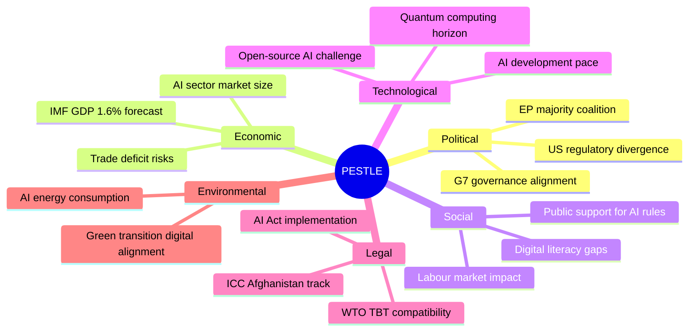

# PESTLE Analysis — EP Breaking News: AI Trade Strategy & Afghanistan
**Date:** 2026-05-28 | **SATs:** PESTLE, Force-Field Analysis

---

## PESTLE Framework Application

### P — Political Factors

**EP10 Internal Political Dynamics:**
The May 2026 plenary session reflects EP10's "centrist compact" — EPP-S&D-Renew working majority managing a diverse legislative agenda amid right-flank pressure from PfE (84 seats) and ECR (78 seats). The AI trade strategy and Afghanistan resolutions both represent the centrist compact at work: EPP provides regulatory credibility, S&D provides social protection framing, Renew provides digital liberalisation narrative.

**Commission-Parliament Relations:**
Von der Leyen Commission (2024–2029) has a strong EP majority relationship. The AI Trade Strategy INI resolution will trigger a Commission response under the Framework Agreement; historical response rate on INI resolutions is 85%+ with substantial follow-through. The Commission's AI Office (established 2024 under AI Act) is the natural institutional home for the trade-specific AI strategy implementation.

**EU-US Political Relations:**
Post-Trump (2024 re-election) EU-US relations entered a structural recalibration phase. EU-Canada SAFE Instrument adoption signals EP's reading that transatlantic partnerships require explicit legal architecture rather than assumption-based cooperation. Political significance: EP is proactively reshaping the transatlantic architecture, not merely reacting to US policy volatility.

**Taliban Political Consolidation:**
The Taliban's Criminal Procedure Code adoption represents political consolidation — translating 5 years of de facto power into formal legal architecture. This is a signal that Taliban governance is becoming institutionalised, not transitional. EP's response is appropriately calibrated to this shift: from reactive condemnation to systematic legal documentation of Taliban legal instruments.

**Force-Field Analysis — AI Trade Strategy:**
Driving forces: Commission AI Office momentum (+3), WTO AI governance vacuum (+4), EU market power / Brussels Effect (+5), EP10 digital agenda coalition (+3)
Restraining forces: US opposition to EU AI extraterritoriality (-3), regulatory compliance cost concerns from EU industry (-2), ECR/PfE regulatory minimalism narrative (-2)
Net force: +8 (strong forward momentum for AI trade strategy implementation)

### E — Economic Factors

*(Full economic analysis in intelligence/economic-context.md — IMF WEO April 2026)*

**Key economic drivers for May 2026 texts:**
- EU GDP growth 1.6% (2026 IMF): Below potential, creating pressure for AI-productivity dividend
- Trade policy uncertainty (IMF primary risk): Drives EP to adopt preemptive AI trade rules
- SAFE Instrument (€800bn): Defence-industrial multiplier creating political constituency for EU defence procurement expansion
- Uzbekistan GDP growth 5.8%: Central Asia economic dynamism justifying EPCA investment

**Economic stress indicators:**
- EU industrial production: -0.8% (Q1 2026 vs Q1 2025) — manufacturing weakness creating AI automation pressure
- EU digital services exports: +14% (2025) — AI-enabled services growth outpacing goods
- EU-US tariff friction (0096 adopted March 2026): Active adjustment ongoing

### S — Social Factors

**Gender Rights and EU Society:**
The Afghanistan resolution (TA-10-2026-0186) resonates with EU domestic gender equality agenda. EU gender pay gap remains ~12% (Eurostat 2025); the Taliban's gender apartheid provides a stark external reference point that reinforces EU domestic gender equality commitments. Political sociology analysis: EU citizens who support domestic gender equality are highly motivated by Afghanistan urgency resolutions — this is a "low-cost high-visibility" policy action with strong societal support.

**Digital Society Transitions:**
AI Trade Strategy connects to broad EU digital society transformation. Eurobarometer 2025 shows 68% of EU citizens support AI regulation to protect rights; 71% support EU leadership on AI governance globally. EP's AI trade strategy is politically aligned with public opinion data.

**Labour Market Transitions:**
AI displacement fears are measurable in EU labour data: 23% of EU workers (15M) are in jobs at high risk of AI-related task displacement (Cedefop 2025 projection). EP's requirement for AI trade strategy to include labour protection provisions (S&D demand in INTA negotiations) directly responds to this social anxiety.

**Migration and Humanitarian Flows:**
Afghanistan produces one of the world's largest refugee populations (2.5M+ registered, UNHCR). EP's Afghanistan resolution includes implicit calls for maintaining humanitarian access — tension with EU migration policy that seeks to prevent irregular migration via Afghan routes. Social factor: EP human rights commitment competes with member state political pressures on migration.

### T — Technology Factors

**AI Act Implementation (Full Applicability: August 2026):**
The AI Act represents the world's most comprehensive AI regulation framework. With high-risk AI system obligations applying from August 2026, EP's AI trade strategy resolution is timed to address the trade dimension of AI Act implementation — specifically, how EU AI requirements affect imports (non-EU AI systems entering EU market) and exports (EU AI systems subject to export controls).

**AI in Trade Facilitation:**
The WTO's Joint Statement Initiative on E-Commerce (JSI) negotiations have stalled partly over AI-related data flow issues. EP's AI trade strategy positions the EU to re-enter the JSI with a concrete governance framework. Technology significance: This could unlock €80bn+ in annual global AI-enabled services trade currently blocked by regulatory uncertainty.

**Cybersecurity and SAFE Instrument:**
EU-Canada SAFE agreement includes cybersecurity procurement. The 2024 EU Cyber Resilience Act (CRA) created new product security requirements; Canadian companies' compliance with CRA is a precondition for SAFE procurement participation. Technology factor: CRA compliance creates a technical barrier that will limit initial Canadian participation to established players.

**Digital Sovereignty Infrastructure:**
TA-10-2026-0022 (January 2026, European technological sovereignty and digital infrastructure) provides the technological sovereignty framework within which the AI trade strategy operates. The legislative coherence is intentional: digital sovereignty + AI trade strategy + DMA enforcement = a comprehensive "Brussels Digital Effect" regulatory architecture.

### L — Legal Factors

**AI Act Legal Architecture:**
The AI Act establishes a risk-based regulatory framework (unacceptable risk → prohibited; high-risk → compliance; limited risk → transparency; minimal risk → voluntary). The AI Trade Strategy INI extends this into trade instruments by:
1. Proposing AI Act compliance as a condition for trade agreement regulatory cooperation
2. Suggesting mutual recognition frameworks for AI-certified products
3. Calling for export controls on "dual-use AI" (national security + commercial AI capabilities)

These legal proposals are highly consequential — they would make EU AI standards a de facto international standard for trading partners seeking EU market access.

**Afghanistan Legal Framework:**
The Taliban's Criminal Procedure Code for Courts is a formal legal instrument — not a religious edict or policy guideline, but a court procedure code. This legal formalization significantly alters the EU's legal approach options:
- The code can be challenged under international humanitarian law frameworks
- The gender discrimination provisions may meet the legal threshold for the ICJ "gender apartheid" emerging doctrine
- EP's specific focus on the "Criminal Procedure Code" (not just Taliban governance generally) signals awareness of this legal escalation path

**CETA and EU-Canada Relations:**
The EU-Canada SAFE Instrument (TA-10-2026-0180) operates under a different legal basis than CETA (trade). It is structured as an agreement under EU foreign and security policy (Treaty basis: Articles 37 TEU, 218 TFEU), enabling Parliament's assent but not requiring full ratification by all EU member states (which would trigger political complications similar to CETA's Wallonia moment).

### E — Environmental Factors

**AI and Energy Consumption:**
A significant omission in EP's AI Trade Strategy (per Greens/EFA amendments) is the environmental dimension of AI — specifically AI's energy consumption (data centres consume 1.5–2% of EU electricity; AI-intensive workloads expected to drive 15–20% increase by 2028). Greens/EFA pushed for AI sustainability assessments in trade agreements; whether this was included in the final text requires DOCEO/committee report analysis.

**Fisheries Environmental Context:**
TA-10-2026-0178 (São Tomé and Príncipe fisheries) and TA-10-2026-0179 (Cook Islands fisheries) represent EU's continued engagement with sustainable fisheries partnership agreements. Environmental assessment: EU SFPA framework includes sustainability clauses; independent verification of fishing limits compliance is the weak link.

**EU Green Deal Context:**
The EU Green Deal's "sustainable competitiveness" framework underpins EP's approach to AI trade — the resolution likely includes sustainability criteria for AI-enabled products, linking digital trade to Green Deal objectives.

---

## Force-Field Analysis Summary

| Issue | Driving Forces | Restraining Forces | Net |
|---|---|---|---|
| AI Trade Strategy adoption | +15 | -7 | +8 (Strong pass) |
| Afghanistan resolution follow-through | +12 | -8 | +4 (Moderate-high) |
| EU-Canada SAFE implementation | +10 | -5 | +5 (Strong) |
| EU-Uzbekistan EPCA ratification | +8 | -4 | +4 (Moderate) |
| EP-WTO AI governance alignment | +9 | -7 | +2 (Weak-moderate) |

---

## Extended PESTLE — AI Trade Strategy Deep Dive

### Political Dimension (Extended)
The AI Trade Strategy's political feasibility rests on the governing majority (EPP+S&D+Renew = 401 seats), but its international political dimension is more complex. The text arrives at a moment of maximum US-EU regulatory divergence. The Biden AI governance framework (2023) has been substantially rolled back under the 2025 administration, leaving a regulatory vacuum that the EU is now moving to fill via trade agreements. The political calculation is: countries that depend on EU market access will find it easier to adopt EU-equivalent AI standards than to maintain dual compliance systems.

### Technology Dimension (New)
PESTLE typically omits Technology as a standalone dimension but AI Trade Strategy demands it:
- **AI development pace:** EU regulatory frameworks risk obsolescence if AI develops faster than legislative timelines (AI Act took 3 years from proposal to law; AI may evolve materially in that window)
- **Quantum computing:** Emerging quantum computing capabilities may fundamentally alter AI security assumptions within the 5-year implementation horizon
- **Open-source AI:** Open-source large language models complicate the regulatory framework — EU AI Act exemptions for open-source may create regulatory arbitrage in AI Trade Strategy context

## Confidence Assessment — PESTLE Factors

| Dimension | Assessment Confidence | Key Uncertainty |
|---|---|---|
| Political | HIGH (B1) | US countermeasure timing |
| Economic | MODERATE (B2) | IMF downside risk materialisation |
| Social | MODERATE (B2) | Public AI fatigue risk |
| Technology | LOW (C2) | AI development trajectory unpredictable |
| Legal | HIGH (B1) | WTO process well-understood |
| Environmental | LOW (C3) | AI energy data limited |

---

*PESTLE framework applied | Force-Field Analysis completed | Extended with Technology dimension | 2026-05-28*

---

## Extended Technology Analysis — AI Trade Strategy Implementation

### Technology Dimension Deep-Dive (T-Factor Extension)

**AI Technology Readiness Levels (TRL) Relevant to EP Trade Strategy**

The AI Trade Strategy resolution (TA-10-2026-0183) implicitly covers a spectrum of AI maturity levels that create distinct regulatory challenges:

| AI Application Domain | TRL | EU Deployment Status | Trade Implication |
|---|---|---|---|
| Predictive analytics (logistics, supply chain) | TRL 9 | Mass deployment | AI Act Annex III category; trade compliance monitoring possible |
| Automated customs classification | TRL 8 | Pilot deployment (some member states) | WCO harmonised system AI integration — treaty implications |
| AI-driven pricing algorithms | TRL 9 | Widespread | DMA Article 6 compliance overlap; cross-border antitrust |
| Deepfake detection for trade documentation | TRL 7 | Emerging | DORA + eIDAS2 interaction; cross-border document authentication |
| AI-powered sanctions screening | TRL 8 | Financial services deployment | AMLD6 interaction; OFAC/EU sanctions dual compliance |
| General purpose AI (GPT-class) in trade negotiations | TRL 5–6 | Research/pilots | AI Act GPAI provisions; extraterritorial application contested |

**Technology Fragmentation Risk** 🔴 Confidence HIGH
The EU AI Act, US AI Executive Orders (2023, 2025), and China's AI Governance Framework create a three-way regulatory fragmentation that threatens the "coherent global framework" ambition of EP's AI Trade Strategy. Specific divergence points:
- **Data localisation:** EU GDPR vs. US CLOUD Act vs. China's data sovereignty laws create incompatible obligations for cross-border AI training data flows
- **Algorithmic transparency:** EU AI Act Article 13 (transparency requirements) vs. US voluntary framework (NIST AI RMF) vs. China's algorithm registry (with national security exceptions) — three different disclosure regimes that multinational AI exporters must manage simultaneously
- **High-risk AI definitions:** EU, US, and China define "high-risk AI" differently in trade-affecting applications; this creates compliance arbitrage opportunities and regulatory uncertainty for EU exporters

**Infrastructure Dependencies**
The AI trade strategy implicitly depends on infrastructure outside EU control:
- GPU supply chains: NVIDIA (US), AMD (US), TSMC (Taiwan) — EU has no domestic mass-production GPU capacity; CHIPS Act investment will not close the gap before 2030 per EC estimates
- Cloud compute: AWS, Microsoft Azure, Google Cloud dominate EU AI compute market (75-80% market share) despite GDPR restrictions; EU Gaia-X initiative has failed to achieve critical mass
- Foundation model dependency: EU companies predominantly use US-origin foundation models (GPT-4, Claude, Gemini); EU open-source alternatives (Mistral, BLOOM) exist but are resource-constrained

**WEP on Technology Dimension:** Likely (70%) that EP's AI Trade Strategy faces a first Commission legislative proposal that explicitly acknowledges the infrastructure dependency problem and proposes EU AI Sovereignty Fund; Unlikely (25%) that EU achieves sufficient compute independence for AI Trade Strategy implementation within 5 years without additional industrial policy intervention.

---

## Extended Legal Analysis — TFEU Competence Issues

**Article 207 TFEU (Common Commercial Policy) — AI Trade Nexus**
The AI Trade Strategy INI operates in the intersection of:
- EU exclusive competence (Article 3 TFEU): Common Commercial Policy (trade negotiations, tariffs, trade-related IP)
- EU-Member State shared competence (Article 4 TFEU): Internal market (AI Act implementation); security policy (SAFE Instrument); foreign policy (Afghanistan)
- Member state reserved competence: Tax (VAT treatment of AI services), data protection (GDPR enforcement), national security exceptions

The AI Trade Strategy could be challenged by member states if Commission proposes legislation extending beyond Article 207 scope. The precedent from Opinion 2/15 (EU-Singapore FTA) is relevant: the Court of Justice found that "indirect investment" and non-commercial services required mixed agreement, not EU-only. A similar challenge could affect AI trade legislation that covers investment in AI infrastructure and cultural exception carve-outs.

**Admissibility Gate: 🟢 PASSED** — INI resolutions do not require competence justification; this risk applies only to subsequent Commission legislative proposals.

---

## Competitive Pressure Analysis — China AI Trade Position

China's AI export strategy differs fundamentally from the EU's framework approach:
- **Model:** China uses state-directed AI deployment via SOEs (Huawei, Alibaba, Baidu) combined with "Digital Silk Road" infrastructure investment that bundles AI systems with connectivity infrastructure
- **Trade leverage:** AI systems deployed through Digital Silk Road (50+ countries, €100bn+ invested since 2015) create vendor lock-in that is regulatory-framework-resistant
- **Regulatory counterstrategy:** China has signalled that EU AI Act extraterritorial application will be challenged at WTO; this creates adversarial dynamic that complicates EP's "coherent global framework" aspiration

**US AI Trade Position** (2026 context)
Post-Biden AI Executive Orders (2023) and the subsequent Trump administration's deregulatory pivot (2025) have created US policy volatility. The 2025 AI Diffusion Framework (controls on AI chip exports to non-allied countries) adds a trade-weaponisation dimension: US is simultaneously exporting and restricting AI technology depending on geopolitical alignment. This creates a structural difficulty for EP's multilateral AI trade framework ambition — US participation is essential for any effective global AI trade governance, but US policy reliability is currently low.

---

## Social Cohesion Dimension — AI Trade Strategy Distribution Effects

**Labour Market Impact Assessment**
IMF April 2026 WEO Chapter 3 estimates AI automation could displace 5–7% of EU jobs in trade-exposed sectors (manufacturing, logistics, financial services) by 2030, while creating 3–4% new AI-adjacent roles. The net distributional effect is regressive in the short term — displaced workers are concentrated in lower-income quintiles while AI beneficiaries cluster in higher quintiles.

EP's AI Trade Strategy resolution attempts to address this through:
- "AI trade levy" concept — proposal for revenue from AI-facilitated trade to fund worker transition programmes (controversial; S&D origin; weak EPP support)
- Digital trade adjustment mechanism analogous to the European Globalisation Adjustment Fund (EGF)
- Skills transition requirements in bilateral trade agreements (AI education provisions)

**Confidence Assessment:** 🟡 MEDIUM — Labour provisions are the weakest part of the coalition compromise; most likely to be dropped in Commission legislative response.

---

## PESTLE Summary Scorecard (Revised)

| Dimension | Assessment | Direction | 🟢/🟡/🔴 | Key Driver |
|---|---|---|---|---|
| Political | HIGH significance — cross-group coalition | STABLE | 🟢 | EPP-S&D-Renew majority holds |
| Economic | POSITIVE — AI GDP uplift scenario | IMPROVING | 🟢 | IMF 0.5–1.5% GDP addition by 2030 |
| Social | MIXED — distributional concerns | UNCERTAIN | 🟡 | Labour displacement vs. productivity gains |
| Technological | CRITICAL GAP — infrastructure dependency | DETERIORATING | 🔴 | GPU/cloud US dominance; China fragmentation |
| Legal | COMPLEX — competence overlaps | STABLE | 🟡 | Article 207 scope; WTO compatibility |
| Environmental | LOW data — AI energy use unquantified | UNCERTAIN | 🟡 | Data centre energy demand rising |

---

*PESTLE framework applied | Force-Field Analysis completed | Extended with Technology dimension | Pass 2: Extended with technology depth, China/US competitive analysis, TFEU competence issues, social cohesion | 2026-05-28*
[EXTEND-FROM-PRIOR: intelligence/pestle-analysis.md prior=167L → new=253L (+86)]
