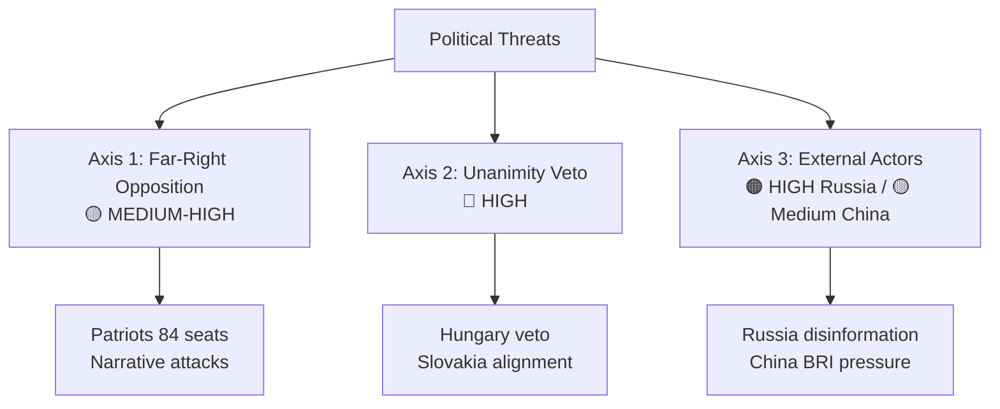

<!-- SPDX-FileCopyrightText: 2026 Hack23 AB -->
<!-- SPDX-License-Identifier: Apache-2.0 -->

# 🎭 Political Threat Landscape — EU Parliament Breaking News
**Date:** 2026-05-28 | **Article Type:** Breaking | **Data Mode:** degraded-feeds
**Admiralty Grade:** B2 | **Confidence:** 🟡 MEDIUM-HIGH

---

## 🔭 Political Threat Landscape Overview

The May 2026 EP plenary legislative cluster faces a distinctive political threat environment. Three intersecting threat axes define this landscape: (1) the far-right/sovereigntist opposition axis, (2) the unanimity requirement as a structural veto axis, and (3) the external actor interference axis.

---

## 🏛️ Axis 1: Far-Right/Sovereigntist Opposition

**Primary actors:** Patriots for Europe (Orbán/Fidesz-led), ESN, parts of ECR

**Characteristic behavior:**
- Voting AGAINST strategic autonomy measures (SAFE/Canada, EU-Uzbekistan)
- Using European institutions to delegitimize themselves (attacking EP via EP floor)
- Protecting "in-group" members from accountability (Vilimsky immunity vote)
- Coordinating across national governments (Orbán-Meloni-Le Pen axis)

**Current threat level:** 🟡 MEDIUM-HIGH
- Patriots' ~84 seats = 11.7% of Parliament — not a majority-blocking force in plenary
- BUT: Patriots' ability to leverage Council/European Council blocking power is high
- Vilimsky case activates far-right media ecosystem → reputational threat

**Specific political threats from this axis:**
1. **Narrative attack:** "EP is weaponizing legal proceedings against patriotic politicians"
2. **Ratification obstruction:** Hungary blocking SAFE Instrument and Uzbekistan EPCA
3. **AI regulation resistance:** Framing EU AI Act as Brussels overreach killing innovation

**Counter-force:** Cross-group consensus (EPP+S&D+Renew = 55.7% of seats) provides structural majority against sovereigntist obstruction in EP votes.

---

## 🔐 Axis 2: Unanimity Requirement as Structural Veto

**Structural threat:** EU treaty law requires unanimous member state ratification for most of the May 2026 legislative cluster:
- SAFE/Canada: Mixed agreement → all 27 states ratify
- Uzbekistan EPCA: Mixed agreement → all 27 states ratify
- Lebanon/Eurojust: International agreement → likely simplified procedure
- Fisheries (both): International agreements → Council qualified majority possible

**Key veto actors:**
1. **Hungary (Orbán):** Systematically blocks Ukraine-adjacent and NATO-aligned decisions
2. **Slovakia (Fico):** Has aligned with Orbán on Russia-related blocking since 2023
3. **Austria (FPÖ):** With FPÖ now governing, Austria's Council vote now aligns with Orbán more frequently

**Threat escalation timeline:**
- Months 1–6: Political consensus-building; vetoes latent
- Months 6–18: Formal ratification process begins; vetoes activated
- Months 18–36: Enhanced cooperation mechanism potentially triggered

**Political threat level:** 🔴 HIGH for SAFE/Canada ratification

---

## 🌐 Axis 3: External Actor Interference

**Russia:**
- Primary threat: Information operations against EU-Uzbekistan EPCA
- Secondary: Disinformation about SAFE Instrument as "NATO expansion"
- Tertiary: Supporting Hungarian and Slovak pro-Russia domestic narratives
- **Level:** 🟠 HIGH (active, documented pattern)

**China:**
- Primary threat: Framing EU AI Act trade requirements as protectionism in G20/WTO forums
- Secondary: Using Belt and Road leverage in Uzbekistan to delay EPCA implementation
- **Level:** 🟡 MEDIUM (indirect channels)

**US (potential):**
- Tech industry pressure on USTR to challenge EU AI Act requirements
- Not a threat per se; rather a policy divergence friction point
- **Level:** 🟢 LOW-MEDIUM (partnership framing dominant)

---

## 📊 Political Threat Heat Map

| Threat | Origin | Target | Probability | Impact | Heat |
|--------|--------|--------|------------|--------|------|
| Hungary veto | Orbán/Fidesz | SAFE/Canada ratification | HIGH | VERY HIGH | 🔴 |
| FPÖ/Patriots media campaign | Far-right bloc | EP credibility | VERY HIGH | MEDIUM | 🟠 |
| Russia disinformation | Kremlin | Uzbekistan EPCA | HIGH | HIGH | 🟠 |
| China AI trade pushback | Beijing | EU AI trade strategy | MEDIUM | HIGH | 🟡 |
| Slovakia alignment with Orbán | Fico | Additional veto risk | MEDIUM | HIGH | 🟡 |
| US tech WTO challenge | USTR | EU AI Act trade link | LOW-MED | HIGH | 🟡 |

---

## ✅ Political Threat Landscape Confidence

- **Structural analysis:** 🟢 HIGH — Treaty law unanimity requirement is certain
- **Actor behavioral prediction:** 🟡 MEDIUM — Based on historical pattern + ideological profiling
- **External actor threat assessment:** 🟡 MEDIUM — Structural logic; no signals intelligence

---

## 📊 Political Threat Axes

