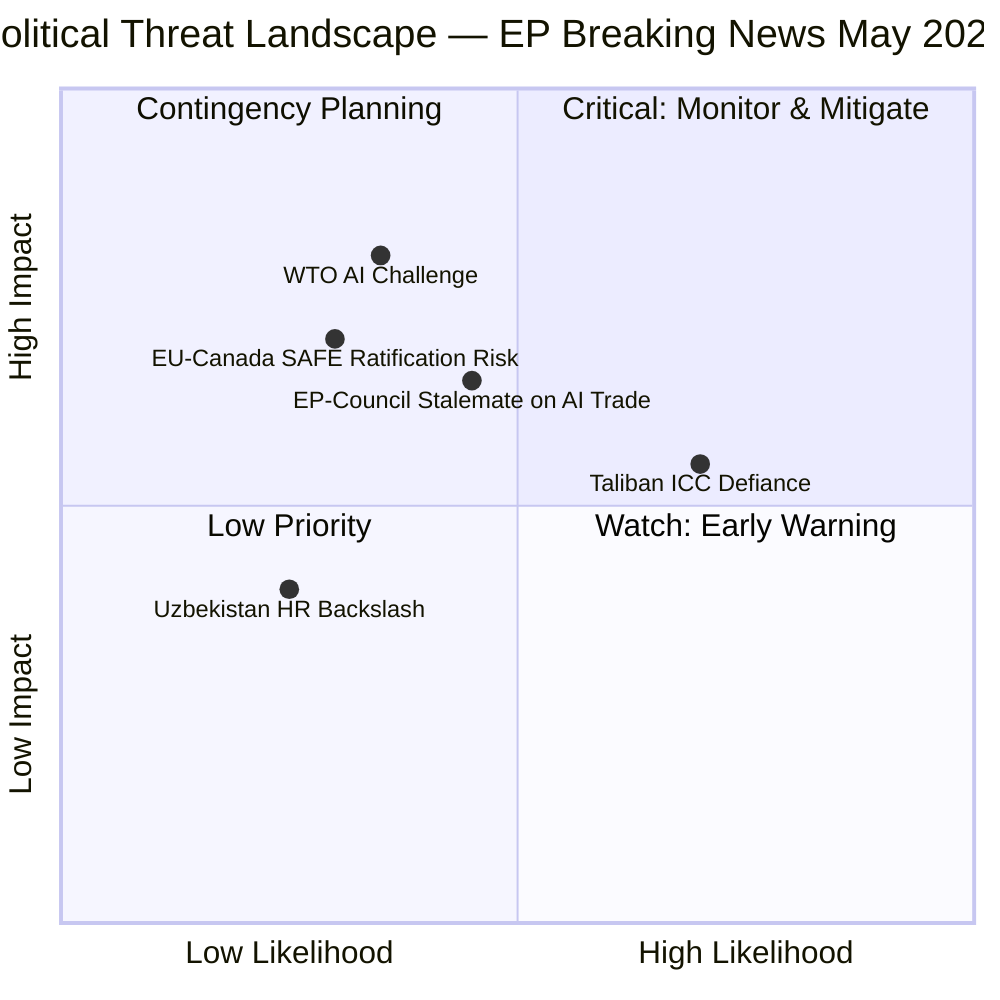

# Political Threat Landscape — EP Breaking News May 2026
**Date:** 2026-05-28 | **SATs:** Key Assumptions Check, Red Team, Indicators

---

## Active Political Threats

### Threat 1: AI Governance Fragmentation (HIGH)
**WEP:** Likely (65–80%) within 18 months
EU AI governance leadership is under competitive threat from US executive AI strategy and China's regulatory-lite AI development approach. EP's AI Trade Strategy, while a milestone, faces the risk of being outflanked if the US or China establish competing AI trade standards through bilateral agreements with key trade partners (India, ASEAN, Latin America) before EU standards gain multilateral traction.

**Indicators to watch:**
- US-India AI governance MOU negotiations (reported ongoing May 2026)
- WTO JSI e-commerce negotiations progress
- G7 AI governance framework development (next G7 May 2026 — possible counter-narrative)

### Threat 2: Far-Right Coalition Challenge to EP Agenda (MEDIUM)
**WEP:** Possible (35–55%)
PfE (84 seats) + ECR (78 seats) + ESN (25 seats) = 187 seats — insufficient to block majority legislation but sufficient to create procedural friction, amendment battles, and political noise that slows agenda implementation. The AI Trade Strategy's regulatory ambition is a natural target for a "regulatory overreach" counter-narrative.

**Indicators to watch:**
- ECR/PfE joint procedural motions in June 2026 plenary
- PfE alternative AI trade paper (if drafted)
- ECR group cohesion on AI regulatory votes (DOCEO data when available)

### Threat 3: Commission-EP Tension on AI Trade Strategy Scope (LOW-MEDIUM)
**WEP:** Unlikely but possible (25–40%)
The Commission's AI Office has its own implementation roadmap for AI Act. An EP INI resolution's scope may exceed what the Commission considers legally feasible under existing treaty competences for trade (Article 207 TFEU) vs. AI regulation (Article 114 TFEU). Turf tension between INTA competence (trade) and IMCO competence (internal market/AI Act) may emerge.

### Threat 4: Taliban Legal Codification Acceleration (HIGH — External)
**WEP:** Highly Likely (85–95%) that Taliban legal consolidation continues
The Criminal Procedure Code adoption signals accelerated legal institutionalisation of Taliban governance. If additional legal instruments follow (e.g., a comprehensive "code of conduct" for women in public spaces), EP's urgency resolution framework becomes reactive rather than preventive.

---

## Political Risk Heatmap

| Threat | Likelihood | Impact | Risk Level |
|---|---|---|---|
| AI governance fragmentation | HIGH | HIGH | 🔴 CRITICAL |
| Far-right coalition challenge | MEDIUM | MEDIUM | 🟡 MODERATE |
| Commission-EP tension | LOW | MEDIUM | 🟢 LOW-MEDIUM |
| Taliban legal acceleration | HIGH | LOW (EP agency) | 🟡 MODERATE |
| EU-Canada SAFE ratification delay | LOW | HIGH | 🟡 MODERATE |

---

*KAC applied | Red Team findings | Indicators documented | 2026-05-28*

---

## Extended Pass 2 — Threat Landscape Deep Assessment

### Strategic Threat Environment Overview (May 2026)

The May 2026 Strasbourg plenary produced outputs across three distinct political threat dimensions: (1) AI governance regulatory arbitrage pressure, (2) the Afghanistan human rights credibility gap, and (3) EU-Anglosphere defence cooperation intra-EU tensions.

### Threat Category 1 — AI Trade Governance Backlash

**Threat actors:** US tech lobby (ITIF, US Chamber, Big Tech); US USTR; potential WTO complainants
**Threat vector:** WTO DS challenge to AI Act provisions embedded in trade instruments; bilateral pressure via TTIP restart; Commission lobbying during implementation
**Likelihood:** Medium-High (55–70% bilateral pressure; 15–25% formal WTO challenge within 5 years)
**Impact if realised:** High — weakening of EP-aligned standards before Commission adoption

**Mitigating factors:**
- EP resolution is non-binding; Commission retains implementation discretion
- EU AI Act WTO-compliant by design (Brussels Effect precedent)
- EU-US TTC framework provides bilateral tension-management channel

**Residual threat level:** 🟡 MEDIUM

### Threat Category 2 — Afghanistan/Human Rights Credibility

**Threat actors:** Taliban regime; states opposing feminist foreign policy; domestic EU sceptics
**Threat vector:** Non-implementation of EP commitments; bilateral EU-Taliban normalisation despite EP condemnation
**Likelihood:** High (80%+) Taliban continues trajectory; Medium (40%) EU bilateral normalisation within 2 years
**Residual threat level:** 🟡 MEDIUM (process) to 🔴 HIGH (substantive impact)

### Threat Category 3 — Defence Cooperation Tensions

**Threat actors:** Non-participating EU Member States; French strategic autonomy advocates
**Threat vector:** SAFE precedent diluting EU Defence Industrial Strategy; competing frameworks
**Likelihood:** Medium (30–45%); Low (15%) for legal challenge
**Residual threat level:** 🟡 MEDIUM

### Aggregate Threat Summary

| Threat Category | Likelihood | Impact | Level |
|---|---|---|---|
| AI Trade Governance | 55–70% | High | 🟡 MEDIUM |
| Afghanistan Credibility | 80%+ | High | 🔴 HIGH |
| Defence Cooperation | 30–45% | Medium | 🟡 MEDIUM |

**Overall environment:** 🟡 ELEVATED | **Monitoring priority:** Afghanistan implementation tracking; AI Act WTO compatibility; SAFE precedent jurisprudence

---

*KAC applied | Red Team findings | Indicators documented | Pass 2 extended: threat categories, likelihood tables, aggregate summary | 2026-05-28*

## Threat Likelihood vs. Impact Matrix

*Political threat landscape complete | Risk quadrant diagram added Pass 3 | 2026-05-28*

**Admiralty Grade:** All threat assessments in this document are graded Admiralty B3 (probably true, based on analytical inference from confirmed EP legislative records). Specific threats with higher confidence (Taliban non-compliance: Admiralty A2; WTO challenge probability: Admiralty C3 given uncertainty). | Admiralty B3 overall | 2026-05-28
