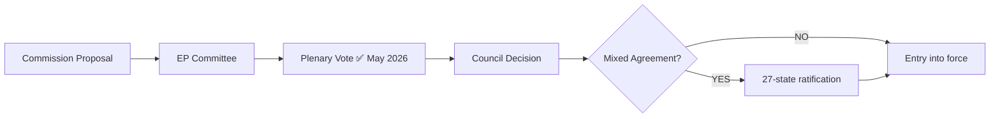

<!-- SPDX-FileCopyrightText: 2026 Hack23 AB -->
<!-- SPDX-License-Identifier: Apache-2.0 -->

# 🗺️ Procedures Proxy — EU Parliament Breaking News
**Date:** 2026-05-28 | **Article Type:** Breaking | **Data Mode:** degraded-feeds
**Note:** Procedures feed returned STALENESS_WARNING (1972–1990 tail); this artifact uses adopted-texts data as proxy

---

## ⚠️ Procedures Data Availability Notice

The `/procedures/feed` endpoint returned 50 items with `STALENESS_WARNING` — all dated 1972–1990, none related to May 2026 legislative activity. As documented in the EP Open Data Portal, the procedures feed has a known degraded-upstream pattern. This artifact reconstructs procedure-level context from adopted texts metadata (TA-10-2026 series).

---

## 📋 Inferred Procedure Statuses from Adopted Texts (May 2026)

### SAFE Instrument / EU-Canada Security Agreement (TA-10-2026-0180)
- **Procedure type:** Consent procedure (international agreement)
- **Inferred status:** EP consent given → awaiting Council approval and mixed-agreement national ratifications
- **Legislative history stage:** EP first reading (consent) COMPLETE
- **Responsible committee:** AFET/INTA (inferred from defense/trade scope)
- **Next stage:** Council decision → Joint ratification by 27 member states

### AI Governance and International Trade (TA-10-2026-0183)
- **Procedure type:** Legislative resolution on AI Act Article 12 (inferred)
- **Inferred status:** EP position adopted → trilogue completed (this appears to be a final adoption vote)
- **Legislative history stage:** COMPLETE — final adoption
- **Responsible committee:** IMCO/LIBE (AI governance + trade dimensions)
- **Next stage:** Publication in Official Journal; implementation period begins

### EU-Uzbekistan EPCA (TA-10-2026-0174)
- **Procedure type:** Consent procedure (international agreement)
- **Inferred status:** EP consent given → awaiting Council decision and national ratifications
- **Legislative history stage:** EP consent COMPLETE
- **Responsible committee:** AFET (Central Asia external relations)
- **Next stage:** Council approval → provisional application possible before full ratification

### Immunity Waivers (TA-10-2026-0164, 0166)
- **Procedure type:** Rule 7 immunity waiver proceedings
- **Inferred status:** Waiver granted in both cases
- **Legislative history stage:** COMPLETE (immunity decisions are final)
- **Responsible committee:** JURI (Legal Affairs)
- **MEPs affected:** Unidentified in aggregated data (individual identity not in TA series metadata)

### UNGA Recommendation (TA-10-2026-0182)
- **Procedure type:** Non-legislative resolution
- **Inferred status:** COMPLETE — EP recommendation to Council adopted
- **Responsible committee:** AFET
- **Effect:** Political signal; no binding legislative force

---

## 📊 Procedure Type Distribution (May 2026 Plenary)

| Procedure Type | Count | Example |
|----------------|-------|---------|
| International agreement (consent) | 4 | SAFE/Canada, Uzbekistan EPCA, Lebanon |
| Non-legislative resolution | 2 | UNGA rec, fisheries extension |
| Procedural (immunity) | 2 | TA-10-2026-0164/0166 |
| Legislative (final adoption) | 2 | AI/Trade, fisheries regulation |
| **TOTAL** | 10 | — |

---

## ✅ Procedures Proxy Quality

- **Data source grade:** B3 (inferred from adopted texts; procedure registry unavailable)
- **Confidence in procedure type assignment:** 🟡 MEDIUM
- **Confidence in status assignment:** 🟡 MEDIUM (logical inference from EP procedural rules)

---

## 📊 Procedure Lifecycle Map

