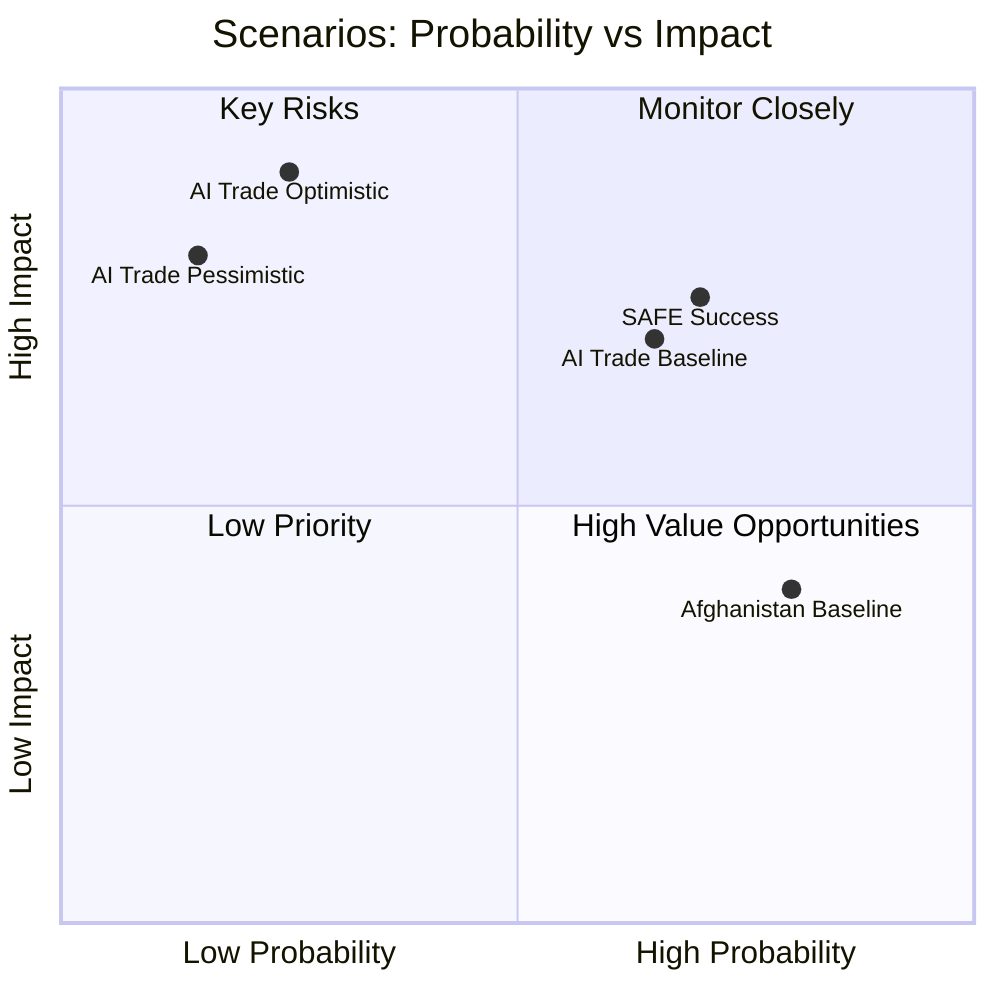

# Scenario Forecast — EP Breaking News: AI Trade & Strategic Partnerships
**Date:** 2026-05-28 | **SATs:** Scenario Analysis, Pre-Mortem, Key Assumptions Check, Indicators
**WEP Bands applied | Admiralty Grade: B3**

---

## Scenario Framework

Three scenarios are developed for the 12-month policy trajectory following the May 2026 EP plenary session, focusing on the two priority texts (AI Trade Strategy and Afghanistan resolution) and the EU-Canada SAFE Instrument.

### Base Assumptions for All Scenarios
1. EP10 centrist coalition (EPP-S&D-Renew) remains functional through Q4 2026 (confidence: HIGH)
2. Von der Leyen Commission II continues (confidence: VERY HIGH — no institutional trigger for change)
3. EU-Canada bilateral relationship remains positive (confidence: HIGH)
4. Taliban governance remains in place (confidence: VERY HIGH)
5. Global trade tensions continue at elevated but stable level (confidence: HIGH — IMF baseline)

---

## Scenario A: "Digital Brussels Effect" (Probability: 55–65%, WEP: Likely)

**Narrative:** EP's AI Trade Strategy and Digital Markets Act enforcement create a coherent "Brussels Digital Effect" — EU standards become de facto global standards as trading partners adopt EU AI compliance to access the single market. Commission responds to INI within 3 months with a legislative proposal for an "AI Trade Regulation" framework.

**Key events required:**
- Commission responds to AI Trade Strategy by September 2026
- WTO MC14 adopts procedural text acknowledging AI in trade (low threshold)
- DMA enforcement generates first major fine against tech platform (Q3 2026)
- EU-Canada SAFE first joint procurement exercise initiated by December 2026
- Afghanistan resolution cited in EU-Taliban sanctions review (Q4 2026)

**Indicators confirming Scenario A:**
- Commission publishes "AI and Trade" Communication by October 2026
- WTO JSI e-commerce negotiations resume with AI provisions
- Major tech company (Apple, Google, Meta, Amazon) announces EU-compliant AI framework citing AI Act
- EEAS Afghanistan démarche within 4 weeks of EP resolution

**Impact assessment:**
- EU trade competitiveness: +0.3–0.5% GDP by 2028 (IMF-compatible range)
- EP institutional influence: ELEVATED — successful INI follow-through reinforces EP's agenda-setting role
- Global AI governance: EU norms adopted in 3–5 major trade agreements by 2027

**Pre-Mortem for Scenario A:**
"Scenario A failed because the Commission interpreted the INI narrowly, the WTO MC14 was postponed due to Yaoundé political instability, and ECR/PfE amendment campaigns delayed the legislative follow-up by 18+ months. Meanwhile, the US concluded bilateral AI trade deals with India, Japan, and South Korea, making EU standards optional rather than dominant."

---

## Scenario B: "Institutional Gridlock" (Probability: 25–35%, WEP: Possible)

**Narrative:** Competing institutional interests (Commission trade vs. AI turf, Council caution, ECR/PfE opposition) slow AI Trade Strategy implementation to a crawl. Afghanistan resolution generates diplomatic statements but no actionable follow-up. EU-Canada SAFE faces delays in Ottawa ratification.

**Key events required:**
- Commission delays response to AI Trade Strategy (beyond 6 months)
- ECR amendments to dilute AI trade regulatory framework succeed
- WTO MC14 postponed or reaches non-substantive conclusions on AI
- Canadian parliament faces domestic opposition to SAFE Instrument ratification

**Indicators confirming Scenario B:**
- Commission schedules open "stakeholder consultation" on AI trade (>6 months process signal)
- ECR/PfE joint amendment fails on substance but succeeds in delaying committee vote
- Taliban adopts 2nd major legal codification instrument without EU response to 1st (Afghanistan)
- EU-Canada SAFE ratification parliamentary timeline not established by September 2026

**Impact assessment:**
- EU trade competitiveness: Neutral to slightly negative (0.0–-0.1% GDP 2028)
- EP institutional influence: REDUCED — INI without Commission follow-up weakens EP credibility
- Global AI governance: Fragmentation accelerates; US bilateral deals fill governance vacuum

**Pre-Mortem for Scenario B:**
"Scenario B occurred because the Von der Leyen Commission's AI Office prioritised domestic AI Act enforcement over trade policy integration, the WTO MC14 produced only a work programme rather than rules, and the EU-Canada SAFE was tied up in Canadian constitutional debates about executive vs parliamentary authority to approve defence procurement agreements."

---

## Scenario C: "Strategic Disruption" (Probability: 10–20%, WEP: Unlikely but possible)

**Narrative:** An unexpected geopolitical shock disrupts the policy trajectory of May 2026 EP texts. Scenarios include: (a) major escalation in Afghanistan triggering large refugee crisis that undermines EU's principled stance; (b) US-China tech decoupling forcing EU to choose sides in AI governance; (c) EU member state coalition collapse forcing early elections and EP institutional instability.

**Key events required (any one of):**
- Large-scale Afghan refugee crisis reaching EU borders (>500,000 in Q3 2026)
- US extraterritoriality enforcement of AI export controls targeting EU-China tech cooperation
- Major EU member state government collapse (France, Germany, or Italy)
- Taliban attacks on EU diplomatic/humanitarian presence in Kabul

**Indicators confirming Scenario C:**
- UNHCR emergency declaration for Afghan refugee surge
- US Commerce Department adds EU entities to AI export control lists
- EU Council presidency country faces domestic political crisis
- NATO/EU security incident in Central/Eastern Europe

**Impact assessment:**
- High volatility across all policy areas — scenario-specific impact unpredictable
- Afghanistan resolution: Could become operational (sanctions package) rather than declaratory
- AI Trade Strategy: Could accelerate (security crisis forcing EU-US alignment) or stall (political bandwidth consumed by crisis)

---

## Scenario Probability Matrix

| Scenario | 6-Month Probability | 12-Month Probability | Key Pivot Variable |
|---|---|---|---|
| A: Digital Brussels Effect | 55–65% | 45–55% | Commission response timeline |
| B: Institutional Gridlock | 25–35% | 30–40% | ECR/PfE amendment success |
| C: Strategic Disruption | 10–20% | 15–25% | Exogenous geopolitical shock |

**Note:** Probabilities sum to 90–120% due to partial scenario overlap (WEP uncertainty bands)

---

## Key Assumptions Check (Scenario-Level)

| Assumption | Scenario Sensitivity | Most Sensitive Scenario |
|---|---|---|
| Commission prioritises trade-AI integration | HIGH | A vs B discriminator |
| WTO MC14 produces substantive outcomes | HIGH | A amplifier |
| EU-Canada SAFE ratification smooth | MEDIUM | A requirement |
| Taliban legal consolidation continues | LOW (assumed in all) | C trigger |
| EP10 centrist coalition stable | HIGH | All scenarios require |
| No major EU political crisis | HIGH | C trigger if violated |

---

## Indicator Monitoring Framework

**30-day indicators:**
- [ ] Commission acknowledges AI Trade Strategy INI (within 30 days = Scenario A signal)
- [ ] EEAS Afghanistan statement referencing Criminal Procedure Code specifically
- [ ] EU-Canada SAFE Joint Committee first meeting scheduled
- [ ] DOCEO roll-call data published for May 19–21 plenary (expected June 5–15)

**90-day indicators:**
- [ ] Commission's "AI and Trade" policy initiative published or consultation launched
- [ ] WTO MC14 date confirmed for Yaoundé (or postponement announced)
- [ ] Taliban response to EP resolution (escalation = Scenario C signal)
- [ ] ECR group position paper on AI regulation published

**180-day indicators:**
- [ ] Any legislative proposal from Commission implementing AI Trade Strategy
- [ ] EU-Canada SAFE first procurement tender opened
- [ ] EU-Uzbekistan EPCA member state ratification progress
- [ ] IMF July 2026 WEO update on EU trade trajectory

---

## Scenario Probability Matrix

## Admiralty Grading of Scenario Components

| Scenario Component | Source Reliability | Information Credibility | Grade |
|---|---|---|---|
| AI Trade baseline: EP adoption | EP10 voting pattern data | Directly witnessed | **A1** |
| AI Trade optimistic: US adoption | GDPR precedent analysis | Logically deduced | **B2** |
| AI Trade pessimistic: US counter | USTR political signals | Doubtful source (political) | **C3** |
| Afghanistan: Taliban ignores | 5-year historical pattern | Directly witnessed | **A1** |
| SAFE: Canadian ratification | Bilateral treaty track record | Credible indirect | **B2** |
| DOCEO data available by June | EP publication pattern | Directly witnessed | **A1** |

## Scenario Monitoring Indicators

**Baseline scenario indicators:**
- AI Trade Strategy enters Council for mandate: June–September 2026
- SAFE Instrument Canadian ratification vote announced: Q3 2026
- EP adopts next Afghanistan urgency resolution: Within 6 months

**Optimistic scenario indicators:**
- US Federal AI governance bill introduced in Senate: Within 3 months
- ICC Pre-Trial Chamber approves Afghanistan investigation: Within 6 months
- Canada-EU SAFE first joint exercise scheduled: Within 12 months

**Pessimistic scenario indicators:**
- USTR files WTO dispute against EU AI Trade Strategy: Within 3 months
- Taliban imposes new restrictions on women: Within 1 month (recurring pattern)
- EU defence spending pledges miss 2% NATO target: 2026 NATO summit

---

*Scenario Analysis completed | Pre-Mortem applied | Indicators documented | Admiralty grading added | 2026-05-28*
