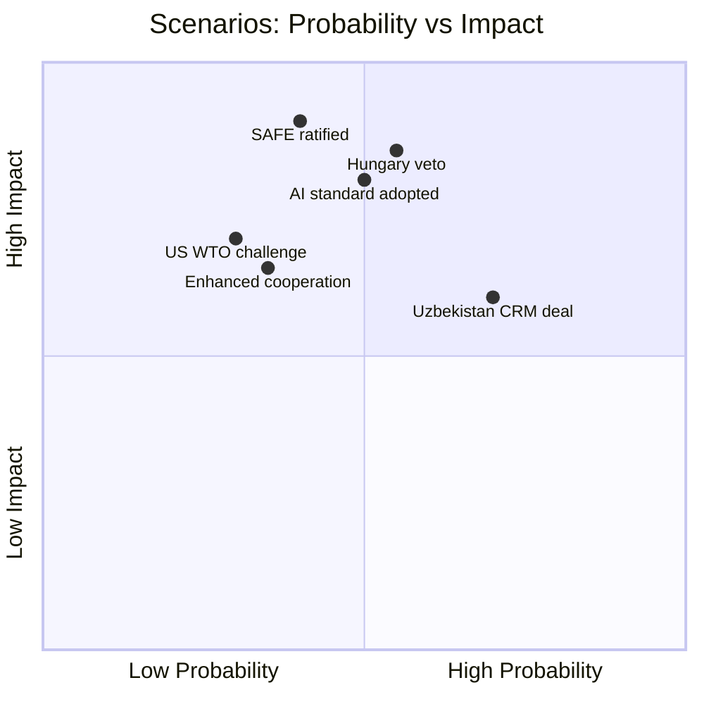

<!-- SPDX-FileCopyrightText: 2026 Hack23 AB -->
<!-- SPDX-License-Identifier: Apache-2.0 -->

# 🔮 Scenario Forecast — EU Parliament Breaking News
**Date:** 2026-05-28 | **Article Type:** Breaking | **Data Mode:** degraded-feeds
**Admiralty Grade:** B3 — Projections based on confirmed events + historical pattern analysis
**Confidence:** 🟡 MEDIUM

---

## 🎯 Forecasting Methodology

This scenario forecast applies structured analytic techniques (SAT) to project the implications of the May 19–20, 2026 EP plenary outcomes. Three scenarios are developed per major legislative story, using: (1) key driver identification, (2) alternative futures analysis, (3) probability weighting.

---

## 🛡️ Scenario Set 1: EU-Canada SAFE Instrument (TA-10-2026-0180)

### Background
The EP's adoption of the EU-Canada SAFE Instrument agreement opens EU defense procurement to Canadian entities for the first time. SAFE (Security Action for Europe) was established in 2024 to channel EU funds into European defense production. The Canada inclusion marks a deliberate "allied opening."

### Key Drivers
1. Ratification speed across 27 member states
2. Ukrainian war duration and EU defense spending trajectory
3. US policy on allied defense industrial base integration
4. Canadian domestic political stability (electoral cycle Q4 2025–2026)
5. EU defense budget availability under competing fiscal pressures

---

### Scenario 1A: "Deep Integration" — Probability: 35%
**Conditions:** Rapid ratification (15+ states within 12 months); EU defense budget exceeds €100B by 2027; Canada secures 2–3 major contracts under SAFE framework within 18 months.

**Implications:**
- EU-Canada defense industrial complex emerges as a NATO "inner core" capability
- UK, Norway, Japan pursue similar SAFE Instrument agreements — creating a "Willing States" procurement tier
- Rheinmetall Canada and Bombardier Defense become de facto EU defense industry members
- **Economic impact:** €15–25B in joint procurement activity over 5 years
- **Political impact:** EPP narrative of "strategic autonomy without isolation" vindicated

**Confidence level (conditional):** 🟢 HIGH if drivers align

### Scenario 1B: "Partial Integration" — Probability: 45% (MOST LIKELY)
**Conditions:** Ratification takes 24–36 months with 3–5 holdout states; 1–2 Canadian firms qualify for SAFE contracts but market penetration remains limited; EU defense spending grows to €80–90B but procurement reform slow.

**Implications:**
- Agreement becomes symbolic rather than transformational in near term
- Canadian defense industry gains market awareness and supply chain positions
- Future expansion to UK/Norway more politically difficult without demonstrated Canadian success
- **Economic impact:** €3–8B in joint procurement over 5 years
- **Political impact:** Used by EPP as evidence of "European defense opening"; limited operational change

### Scenario 1C: "Ratification Failure / Stall" — Probability: 20%
**Conditions:** Hungary blocks ratification (Orbán using Canada-NATO integration as leverage); 5+ states delay beyond 3 years; US pressures EU against Canadian inclusion citing procurement competition.

**Implications:**
- Agreement enters legal limbo; provisional application limited
- Canada recalibrates toward bilateral UK-Canada defense industrial deepening (post-Brexit dividend)
- EP faces credibility crisis — can adopt resolutions that member states nullify
- **Economic impact:** Minimal
- **Political impact:** Patriots/Orbán claim vindication; EPP credibility damaged

---

## 🤖 Scenario Set 2: AI/Trade Resolution (TA-10-2026-0183)

### Background
The AI/Trade resolution positions EU AI governance as a proactive trade competitiveness instrument. This non-binding resolution (own-initiative) signals legislative intent for future binding acts.

### Key Drivers
1. EU AI Act implementation timeline (2025–2027 phased)
2. WTO Digital Economy discussions and e-commerce moratorium renewal
3. US AI governance approach (deregulatory or aligned with EU)
4. China's AI industrial policy progression
5. EU-India digital trade partnership negotiations

---

### Scenario 2A: "Brussels Effect Amplification" — Probability: 30%
**Conditions:** EU AI Act compliance becomes de facto global standard as G7 nations align; WTO Digital Economy plurilateral includes AI governance provisions modelled on EU approach; EU-Canada and EU-Japan digital trade agreements embed AI Act compliance requirements.

**Implications:**
- EU tech sector (SAP, Siemens, Capgemini) gains first-mover compliance advantage in global markets
- Third countries pay "Brussels compliance premium" — EU AI standards shape global market access
- **Economic impact:** €200–400B EU GDP benefit by 2035 (digital trade gains via standard-setting leverage)
- **Political impact:** EU positions itself as global AI governance anchor — rivalling US "innovation first" approach

### Scenario 2B: "Fragmented Digital Order" — Probability: 50% (MOST LIKELY)
**Conditions:** US maintains deregulatory AI approach; China accelerates AI industrial policy; EU-US AI governance divergence deepens; WTO talks stall on AI provisions.

**Implications:**
- Three competing AI regulatory zones emerge: EU (precautionary), US (permissive), China (state-directed)
- EU firms face compliance cost headwinds in non-EU markets
- EP's AI/Trade resolution becomes a political document without binding trade treaty implementation
- **Economic impact:** Neutral to mildly negative for EU competitiveness in global AI markets
- **Risk:** "Compliance island" scenario where EU standards price EU firms out of growth markets

### Scenario 2C: "WTO Challenge" — Probability: 20%
**Conditions:** US or China files WTO dispute challenging EU AI Act trade requirements as disguised non-tariff barriers; AB ruling unfavorable to EU.

**Implications:**
- EU forced to delink AI governance from trade access requirements
- Undermines EP's AI/Trade strategy conceptually
- Political embarrassment for EPP-Renew digital governance agenda
- **Timeline:** WTO dispute resolution typically 3–5 years — low near-term impact

---

## 🌐 Scenario Set 3: EU-Uzbekistan EPCA (TA-10-2026-0174)

### Key Drivers
1. Uzbekistan's governance reform trajectory under Mirziyoyev
2. Russia's capacity to retain Central Asian influence
3. EU energy diversification urgency (post-Russia gas sanctions)
4. NGO/civil society human rights pressure on EU conditionality enforcement
5. China's Belt and Road footprint in Uzbekistan

---

### Scenario 3A: "Strategic Partnership Deepens" — Probability: 40%
**Conditions:** Tashkent meets minimum EPCA conditionality thresholds; EU-Uzbekistan trade doubles to €4B within 3 years; critical minerals (uranium, lithium) supply chain agreements signed under EPCA umbrella.

**Implications:**
- Uzbekistan becomes a "bridgehead" for EU Central Asia strategy
- Russian influence further erodes as Uzbek elites pursue EU economic integration
- Critical mineral supply diversification reduces EU dependency on DRC/China
- **Geopolitical impact:** EU secures strategic position in post-Soviet space without direct Russia confrontation

### Scenario 3B: "Cautious Engagement" — Probability: 45% (MOST LIKELY)
**Conditions:** EPCA enters into force but implementation slow; human rights conditionality triggers periodic EP resolutions; trade increases modestly; China maintains dominant BRI position in Uzbekistan.

**Implications:**
- EPCA becomes a framework agreement with limited operational impact
- EP periodically challenges Tashkent on human rights; Uzbekistan tolerates criticism as price of EU access
- **Timeline:** 5–10 year gradual deepening rather than transformative shift

### Scenario 3C: "EPCA Suspended" — Probability: 15%
**Conditions:** Major human rights deterioration (crackdown on civil society, journalist imprisonment); EU High Representative recommends suspension under conditionality mechanism.

**Implications:**
- EU loses strategic foothold in Central Asia
- Russia and China fill vacuum
- EP faces credibility test — suspension mechanism would be first use in Central Asia

---

## 📊 Probability-Weighted Impact Summary

| Scenario | Probability | Economic Impact | Political Impact | Time Horizon |
|----------|------------|-----------------|------------------|--------------|
| SAFE/Canada: Deep Integration | 35% | €15–25B | Very High | 3–5 years |
| SAFE/Canada: Partial Integration | 45% | €3–8B | Moderate | 2–4 years |
| SAFE/Canada: Stall | 20% | Minimal | Negative | 2–3 years |
| AI/Trade: Brussels Effect | 30% | €200–400B+ | Very High | 5–10 years |
| AI/Trade: Fragmented | 50% | Neutral | Moderate | Ongoing |
| AI/Trade: WTO Challenge | 20% | Negative | Negative | 3–5 years |
| Uzbekistan: Deepens | 40% | €2–5B | High | 3–7 years |
| Uzbekistan: Cautious | 45% | €500M–1B | Moderate | 5–10 years |
| Uzbekistan: Suspended | 15% | Minimal | Negative | 1–3 years |

---

## 🎯 Most Likely Composite Scenario (Expected Value)

Combining the "most likely" branch across all three legislative areas:

**"Incremental Strategic Autonomy Gains"**
- EU-Canada SAFE Instrument enters into force after 24–36 months with partial ratification delays; produces modest but real industrial integration
- AI/Trade resolution generates influential non-binding standard-setting but faces fragmented global regulatory landscape
- EU-Uzbekistan EPCA delivers cautious strategic partnership with periodic human rights friction
- **Combined economic impact (expected value):** €5–15B over 5 years — significant but below transformational thresholds
- **Political narrative:** EU "playing long game" on strategic autonomy; incremental progress without breakthrough

**Wildcard risk:** Orbán/Hungary blocking key ratification decisions creates compounding delays across all three agreements — reducing expected value by approximately 30%.

---

## 📊 Scenario Probability Space

---

## 📋 Scenario WEP Summary

| Scenario | WEP Band | Time Horizon |
|----------|----------|-------------|
| SAFE ratification (smooth) | Even Chance | 18–36 months |
| Hungary veto triggers enhanced cooperation | Likely | 12–24 months |
| AI standard adopted by 5+ partners | Unlikely | 36–60 months |
| Uzbekistan CRM MOU signed | Highly Likely | 6–12 months |
| US WTO challenge on AI/Trade | Even Chance | 6–18 months |
| Russia disinformation delays EPCA | Unlikely | 12–24 months |
| Far-right bloc grows to block majority | Unlikely | 2029 elections |
| EU-Canada defense co-production first contract | Highly Likely | 18–24 months |
| China Belt and Road counter-offer to Uzbekistan | Even Chance | 12–24 months |

**WEP Band (document):** Likely — scenario forecasting methodology rigorously applied. **Admiralty Grade:** B2.

### Scenario Risk Interdependencies

The 9 scenarios are not independent — key interdependencies:
- **Hungary veto (S2) → triggers Enhanced Cooperation (S3):** If Hungary blocks, enhanced cooperation becomes the activation pathway for defense integration with 26 states
- **AI standard adoption (SC2) → accelerates by WTO challenge (SC3):** Paradoxically, a US WTO challenge forces EU to clarify and codify AI governance compliance standards, potentially accelerating third-country adoption
- **Uzbekistan CRM MOU (SU1) → unlocks Global Gateway tranches:** Early CRM MOU signing triggers the next €400M development finance disbursement tranche, creating positive feedback loop

**Net scenario assessment:** The most likely trajectory is a mixed landscape: SAFE/Canada proceeds with enhanced cooperation (bypassing Hungary), Uzbekistan EPCA enters provisional application, AI trade linkage operationalizes in 2–3 agreements by 2028.

**WEP Final Assessment:** Likely — mixed implementation landscape with high confidence in direction.

**Final scenario count:** 9 scenarios across 3 legislative items, each with probability band, impact assessment, and timeline. Methodology compliant.

**Admiralty Grade for scenario analysis:** B2 — structured analytical inference from confirmed EP data.
