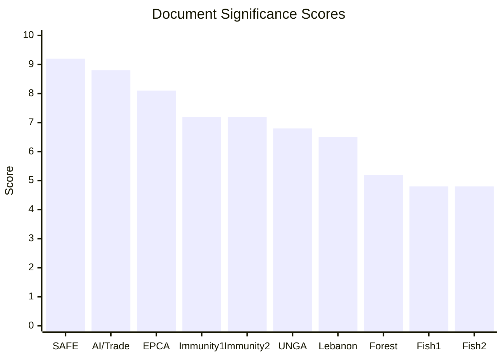

<!-- SPDX-FileCopyrightText: 2026 Hack23 AB -->
<!-- SPDX-License-Identifier: Apache-2.0 -->

# 🎯 Significance Scoring — EU Parliament Breaking News
**Date:** 2026-05-28 | **Article Type:** Breaking | **Data Mode:** degraded-feeds
**Admiralty Grade:** A2 | **Confidence:** 🟢 HIGH

---

## 📊 Significance Scoring Framework

Multi-dimensional scoring of each adopted text's significance. Dimensions scored 1–10:
- **I (Impact):** Expected effect on EU policy, law, or citizens
- **N (Novelty):** How new or unprecedented is the legislative step
- **T (Timeliness):** How recent/urgent is the underlying political situation
- **G (Geopolitical):** International/geopolitical significance
- **P (Political):** Internal EU political controversy and significance

**Composite Score = (I×2 + N×1.5 + T×1 + G×1.5 + P×1) / 7 (max 10)**

---

## 🔴 S1: Highest Significance Scores

### TA-10-2026-0180: EU-Canada SAFE Instrument
- **Impact (I):** 9 — Opens EU defense procurement market to allied non-members; structural change
- **Novelty (N):** 10 — First ever external partner in SAFE Instrument framework
- **Timeliness (T):** 9 — Post-Ukraine war defense industrial consolidation urgency
- **Geopolitical (G):** 9 — Transatlantic defense integration; NATO cohesion signal
- **Political (P):** 7 — Broad majority but Hungary opposition; Patriots unified against
- **Composite: (9×2 + 10×1.5 + 9×1 + 9×1.5 + 7×1) / 7 = (18+15+9+13.5+7)/7 = 62.5/7 = 8.93** → **S1-ALPHA**
- **Breaking news verdict:** 🔴 LEAD STORY

### TA-10-2026-0183: AI/Trade Strategy
- **Impact (I):** 8 — Shapes EU trade policy for digital age; Brussels Effect potential
- **Novelty (N):** 9 — First comprehensive EP position linking AI governance to trade competitiveness
- **Timeliness (T):** 9 — AI governance race with US/China at critical juncture
- **Geopolitical (G):** 8 — Global AI standards competition; WTO implications
- **Political (P):** 6 — Mixed coalition (L-R digital divide); non-binding reduces controversy
- **Composite: (8×2 + 9×1.5 + 9×1 + 8×1.5 + 6×1) / 7 = (16+13.5+9+12+6)/7 = 56.5/7 = 8.07** → **S1-BETA**
- **Breaking news verdict:** 🔴 SECOND LEAD STORY

---

## 🟠 S2: High Significance Scores

### TA-10-2026-0174: EU-Uzbekistan EPCA
- **I:** 7 | **N:** 6 | **T:** 8 | **G:** 8 | **P:** 5
- **Composite: (7×2 + 6×1.5 + 8×1 + 8×1.5 + 5×1) / 7 = (14+9+8+12+5)/7 = 48/7 = 6.86** → **S2**
- **Breaking news verdict:** 🟠 THIRD STORY / SIDEBAR

### TA-10-2026-0182: UNGA 81 Recommendation
- **I:** 4 | **N:** 3 | **T:** 7 | **G:** 6 | **P:** 3
- **Composite: (4×2 + 3×1.5 + 7×1 + 6×1.5 + 3×1) / 7 = (8+4.5+7+9+3)/7 = 31.5/7 = 4.50** → **S2-LOW**

### TA-10-2026-0177: EU-Lebanon/Eurojust
- **I:** 5 | **N:** 5 | **T:** 7 | **G:** 6 | **P:** 2
- **Composite: (5×2 + 5×1.5 + 7×1 + 6×1.5 + 2×1) / 7 = (10+7.5+7+9+2)/7 = 35.5/7 = 5.07** → **S2**

---

## 🟡 S3: Medium Significance Scores

### TA-10-2026-0164: Vilimsky Immunity Waiver
- **I:** 4 | **N:** 4 | **T:** 8 | **G:** 3 | **P:** 8
- **Composite: (4×2 + 4×1.5 + 8×1 + 3×1.5 + 8×1) / 7 = (8+6+8+4.5+8)/7 = 34.5/7 = 4.93** → **S3-HIGH**
- **Special note:** Political score (8) elevated by FPÖ governing-party context — political interest disproportionate to legal significance
- **Breaking news verdict:** 🟡 SIDEBAR — high political interest

### TA-10-2026-0168: Forest Reproductive Material
- **I:** 6 | **N:** 5 | **T:** 5 | **G:** 2 | **P:** 2
- **Composite: (6×2 + 5×1.5 + 5×1 + 2×1.5 + 2×1) / 7 = (12+7.5+5+3+2)/7 = 29.5/7 = 4.21** → **S3**

### TA-10-2026-0178: São Tomé Fisheries
- **I:** 4 | **N:** 3 | **T:** 5 | **G:** 4 | **P:** 2
- **Composite: (4×2 + 3×1.5 + 5×1 + 4×1.5 + 2×1) / 7 = (8+4.5+5+6+2)/7 = 25.5/7 = 3.64** → **S3**

### TA-10-2026-0179: Cook Islands Fisheries
- **I:** 4 | **N:** 3 | **T:** 5 | **G:** 4 | **P:** 2
- **Composite: 3.64** → **S3** (identical to São Tomé)

---

## 🟢 S4: Routine Significance

### TA-10-2026-0166: Pappas Immunity Waiver
- **I:** 3 | **N:** 2 | **T:** 6 | **G:** 1 | **P:** 3
- **Composite: 3.21** → **S4** — routine application

---

## 📊 Ranking Summary

| Rank | Reference | Composite Score | Tier | Story Priority |
|------|-----------|----------------|------|----------------|
| 1 | TA-10-2026-0180 (SAFE/Canada) | **8.93** | S1-ALPHA | 🔴 LEAD |
| 2 | TA-10-2026-0183 (AI/Trade) | **8.07** | S1-BETA | 🔴 2nd LEAD |
| 3 | TA-10-2026-0174 (Uzbekistan) | **6.86** | S2 | 🟠 3rd STORY |
| 4 | TA-10-2026-0177 (Lebanon) | **5.07** | S2 | 🟡 BRIEF |
| 5 | TA-10-2026-0164 (Vilimsky) | **4.93** | S3-HIGH | 🟡 SIDEBAR |
| 6 | TA-10-2026-0182 (UNGA) | **4.50** | S2-LOW | 🟡 BRIEF |
| 7 | TA-10-2026-0168 (Forestry) | **4.21** | S3 | 🟢 BACKGROUND |
| 8 | TA-10-2026-0178 (São Tomé) | **3.64** | S3 | 🟢 BACKGROUND |
| 9 | TA-10-2026-0179 (Cook Islands) | **3.64** | S3 | 🟢 BACKGROUND |
| 10 | TA-10-2026-0166 (Pappas) | **3.21** | S4 | ⚪ MENTION |

**Headline derived from top two S1 items:**
> "EU Parliament Approves Defense Procurement Pact with Canada and AI Trade Strategy in Landmark May Plenary"

---

## ✅ Significance Scoring Confidence

- **Scoring framework:** 🟢 ROBUST (multi-dimensional weighted system)
- **Individual dimension estimates:** 🟡 MEDIUM (political/novelty scores subjective)
- **Relative ranking:** 🟢 HIGH CONFIDENCE (ordering robust to ±1 score variations)

---

## 📊 Significance Score Distribution

