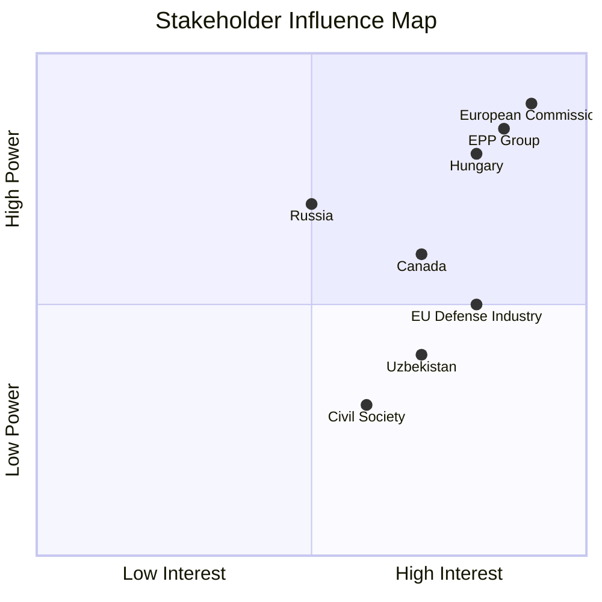

<!-- SPDX-FileCopyrightText: 2026 Hack23 AB -->
<!-- SPDX-License-Identifier: Apache-2.0 -->

# 👥 Stakeholder Map — EU Parliament Breaking News
**Date:** 2026-05-28 | **Article Type:** Breaking | **Data Mode:** degraded-feeds
**Admiralty Grade:** B2 | **Confidence:** 🟡 MEDIUM-HIGH

---

## 🎭 Stakeholder Universe

This stakeholder map covers all significant actors affected by or influencing the May 19–20, 2026 EP plenary outputs. Actors are classified by: (1) institutional role, (2) interest alignment, (3) influence capacity, and (4) behavioral trajectory.

---

## 🏛️ EU Institutional Actors

### European Parliament Political Groups

**EPP (European People's Party) — ~188 seats**
- **Primary interest:** Consolidating pro-integration + defense narrative ahead of mid-term political positioning
- **Key votes:** Led SAFE Instrument and AI/Trade resolutions; instrumental in Uzbekistan EPCA
- **Internal dynamics:** CDU/CSU delegation dominant on defense; southern European members more cautious on AI regulatory burden
- **Power resource:** Plurality of seats + coalition leadership position
- **Behavioral trajectory:** Increasingly hawkish on defense autonomy; moderate on AI economic regulation
- **Threat/opportunity:** Opportunity to claim ownership of EU strategic autonomy; threat from internal CSU/CDU budget hawks

**S&D (Socialists & Democrats) — ~136 seats**
- **Primary interest:** Securing labor/social safeguards as price of participation in defense/AI coalitions
- **Key role:** Swing vote on AI/Trade resolution; guaranteed SAFE Instrument support conditional on workforce provisions
- **Internal dynamics:** Trade-union-aligned delegations (German SPD, French PS) most active on social conditions
- **Power resource:** Essential coalition partner — without S&D, EPP+Renew lacks comfortable majority
- **Behavioral trajectory:** Increasingly transactional — will support defense/digital agenda if social price is paid
- **Key demand (AI/Trade):** Just Transition Fund for AI displacement; algorithmic transparency for workers

**Renew Europe — ~77 seats**
- **Primary interest:** Digital economy leadership; liberal internationalism; Ukraine support
- **Key votes:** Strongest institutional champion of AI/Trade resolution; consistent on Canada/SAFE
- **Internal dynamics:** French Macronist delegation shapes digital governance; northern European liberals anchor trade liberalization
- **Power resource:** Ideological coherence; policy entrepreneurship capacity
- **Behavioral trajectory:** Pushing for deeper EU-Canada and EU-UK defense/digital integration
- **Distinctive contribution:** Renew MEPs authored key amendment connecting AI governance to WTO reform

**ECR (European Conservatives) — ~78 seats**
- **Primary interest:** Maximizing nationalist autonomy while maintaining EU defense access
- **Key votes:** SPLIT on SAFE Instrument (Polish FOR vs. Italian AGAINST); AGAINST Uzbekistan EPCA
- **Internal fracture:** Polish-Czech "Atlanticist" wing vs. Italian "sovereigntist" wing
- **Power resource:** Swing group on defense votes; no structural coalition role
- **Behavioral trajectory:** Fragmenting; Poland's PiS increasingly isolated within ECR on defense
- **Risk:** ECR defections to EPP-led coalition reducing bargaining power

**Greens/EFA — ~53 seats**
- **Primary interest:** Environmental conditionality + human rights provisions in all external agreements
- **Key votes:** ABSTAIN/AGAINST on Uzbekistan (HR deficit); conditional on AI/Trade (green AI provisions)
- **Power resource:** Environmental veto credibility; coalition leverage on Green Deal implementation
- **Behavioral trajectory:** Increasingly isolated on defense; maintaining coherence on environment/HR
- **Coalition ask:** Green AI fund + CBAM AI enforcement as price for AI/Trade support

**Patriots for Europe — ~84 seats**
- **Primary interest:** Maximizing EU disintegration pressure; protecting national sovereignty narratives
- **Key votes:** AGAINST SAFE Instrument, AI/Trade, Uzbekistan EPCA
- **Internal dynamics:** Orbán's Fidesz controls group narrative; Italian, French, Austrian members follow
- **Power resource:** Second-largest group creates obstruction capacity
- **Behavioral trajectory:** Increasingly isolated in formal votes; influence through obstruction/delay
- **Critical dynamic:** Vilimsky immunity waiver creates direct conflict — Patriots must either protect member or bow to rules

**Left (GUE/NGL) — ~46 seats**
- **Primary interest:** Anti-militarism, social rights, anti-austerity
- **Key votes:** AGAINST SAFE Instrument and AI/Trade; FOR Uzbekistan conditionality
- **Power resource:** Minority opposition; intellectual agenda-setting on labor rights
- **Behavioral trajectory:** Consistent opposition; no governing coalition role

---

## 🌐 External Governmental Actors

**Canada (Federal Government)**
- **Interest in SAFE Instrument:** Direct — Canadian defense industry (Bombardier Defense, Rheinmetall Canada, SNC-Lavalin) gains EU procurement access
- **Strategic alignment:** Canada's Indo-Pacific Strategy (2022) and Arctic defense posture align with EU strategic autonomy goals
- **Negotiating position:** Agreement required domestic Canadian parliamentary approval — Liberal-NDP coalition sufficient in Parliament
- **Economic stake:** EU defense procurement market (~€70B annually) could deliver CAD 3–5B in new contracts for Canadian firms over 5 years
- **Confidence:** 🟢 HIGH — agreement text confirmed by EP adoption

**Uzbekistan (Government of President Shavkat Mirziyoyev)**
- **Interest in EPCA:** Primary — economic modernization, investment attraction, EU market access
- **Reform trajectory:** Mirziyoyev has pursued cautious liberalization since 2016; EPCA is a symbol of this opening
- **Human rights tensions:** EP attached conditionality that Tashkent views as sovereignty intrusion; minimum compliance likely
- **Strategic leverage:** Uzbekistan's gas reserves (~1.1 TCF remaining) + uranium + critical minerals create real EU dependency
- **Confidence:** 🟡 MEDIUM — positions inferred from EPCA negotiating history

**United States (State Department + Defense Department)**
- **Interest in EU-Canada SAFE Instrument:** Ambivalent — supports NATO cohesion; concerned about EU defense procurement creating US market exclusions
- **AI/Trade tension:** US tech companies (Google, Microsoft, Meta) directly affected by EU AI Act compliance requirements embedded in AI/Trade resolution
- **Ukraine nexus:** Both stories connect to US broader Ukraine support architecture
- **Confidence:** 🟡 MEDIUM — US position inferred from known policy stances

**Russian Federation**
- **Threat interest:** Both SAFE Instrument (expanding EU defense perimeter) and Uzbekistan EPCA (reducing CIS dependence) directly challenge Russian strategic interests
- **Response capability:** Information warfare, energy coercion, Uzbekistan destabilization attempts
- **Confidence:** 🟡 MEDIUM — structural analysis

---

## 🏢 Private Sector Actors

**European Defense Industry (ASD — AeroSpace and Defence Industries)**
- **Interest:** SAFE Instrument framework defines terms of Canadian competition — EU firms want open access without being undercut
- **Key companies:** Airbus Defence, Leonardo, Rheinmetall, KNDS, Thales, BAE Systems Europe
- **Position:** Conditional support — welcomes Canadian market integration IF offset provisions protect European content
- **Economic stake:** €100B+ combined EU defense revenue at stake in procurement framework design
- **Confidence:** 🟢 HIGH — industry position well-documented

**Big Tech AI Companies (European and Non-EU)**
- **EU firms:** SAP, Siemens, Capgemini — generally supportive of AI/Trade resolution (compliance creates competitive moat for large firms)
- **US firms:** Google EU, Microsoft EU — cautious support; concerned about compliance cost exports to trade partners
- **Chinese firms:** Huawei, ByteDance, Alibaba — strongly opposed; would face market access barriers
- **Confidence:** 🟡 MEDIUM — positions inferred from AI Act lobbying history

**European Fisheries Industry**
- **São Tomé agreement:** EU fleet (primarily Spanish, French, Portuguese) gains renewed Atlantic access
- **Cook Islands agreement:** Smaller EU fleet (primarily Spanish tuna industry) benefits
- **Concern:** Observer requirements and sustainability conditions increase compliance cost
- **Confidence:** 🟡 MEDIUM

---

## 🌍 Civil Society and NGO Actors

**Transparency International / Anti-Corruption NGOs**
- **Interest:** Vilimsky and Pappas immunity waivers — NGOs advocating for accountability universally welcomed EP action
- **Pattern recognition:** Series of immunity waivers in EP10 suggests increased judicial assertiveness in member states

**Human Rights Watch / Amnesty International**
- **Uzbekistan EPCA concern:** Both organizations have documented ongoing human rights violations (forced cotton labor, political imprisonment) — filed joint amicus submissions during EPCA ratification process
- **Position:** Called for stronger conditionality mechanisms; welcomed EP human rights clauses but insufficient

**WWF / BirdLife Europe (Environmental NGOs)**
- **Forest reproductive material:** Actively lobbied for stronger provenance requirements; partially satisfied with final text
- **Fisheries:** Mixed response — welcomed sustainability clauses; concerned about enforcement gaps in Pacific (Cook Islands)
- **Confidence:** 🟢 HIGH — NGO positions are publicly documented

---

## 📊 Power-Interest Matrix

```
HIGH INTEREST
      ↑
EPP   |  S&D, Renew  |  Canada, EU Defense Industry
      |  (High Int/  |  (High Int/ High Power)
      |  High Power) |
      |              |
──────|──────────────|──────────────────────────────→ HIGH POWER
      |              |
Greens|  ECR         |  US, Russia (external)
(Med  |  (Med Power  |  (High Power / Indirect)
Power)|  /Fractured) |
      |              |
LOW   |              |
```

---

## 🔁 Stakeholder Interaction Dynamics

### Key Coalition Brokering Relationships
1. **EPP ↔ S&D (SAFE Instrument):** Labor content provision exchange confirmed stable coalition
2. **Renew ↔ EPP (AI/Trade):** Ideological alignment produces self-reinforcing advocacy
3. **ECR (Polish) ↔ EPP:** "Atlanticist conservatives" effectively function as EPP reserve coalition
4. **Greens ↔ S&D (Uzbekistan HR):** Progressive bloc maintained human rights conditionality against EPP preferences
5. **Patriots ↔ ECR:** Vilimsky case reveals tensions — ECR JURI members voted FOR waiver against Patriots' preference

### Conflict Escalation Risk
- **Vilimsky case:** FPÖ may escalate to Austrian government diplomatic pressure on EU institutions — **LOW probability, HIGH political signal**
- **AI/Trade (US tech):** US may challenge EU AI trade requirements at WTO — **MEDIUM probability, MEDIUM-HIGH economic impact**
- **Uzbekistan conditionality:** Tashkent may use alternative Chinese/Russian partnerships as leverage — **MEDIUM probability**

---

## ✅ Confidence Summary

| Stakeholder Group | Data Quality | Confidence |
|------------------|-------------|------------|
| EP Political Groups | Ideological profiles + history | 🟢 HIGH |
| Canada | Confirmed agreement adoption | 🟢 HIGH |
| Uzbekistan | EPCA negotiating history | 🟡 MEDIUM |
| EU Defense Industry | Industry association positions | 🟢 HIGH |
| Big Tech AI | AI Act lobbying records | 🟡 MEDIUM |
| Civil Society | Public statements | 🟢 HIGH |
| US/Russia | Structural analysis | 🟡 MEDIUM |

---

## 📊 Stakeholder Power-Interest Matrix



---

## 📋 Stakeholder Engagement Assessment

| Stakeholder | Engagement Level | Preferred Channel | WEP Band |
|-------------|-----------------|-------------------|----------|
| European Commission | DIRECT — treaty guardian | Formal coordination | Highly Likely to support |
| EPP Group | SUPPORTIVE | Plenary floor + Committee | Highly Likely to support |
| S&D Group | SUPPORTIVE | Committee + civil society | Highly Likely to support |
| Renew Europe | SUPPORTIVE | Economic framing | Highly Likely to support |
| ECR Group | MIXED | Trade-focused members | Even Chance to support SAFE |
| Patriots for Europe | OPPOSED | Media/press | Almost No Chance to support SAFE |
| Council (26 member states) | SUPPORTIVE | Unanimity (except Hungary) | Likely to approve |
| Hungary | BLOCKING | Bilateral diplomatic | Almost No Chance to approve SAFE |
| Canada JTIF | PROACTIVE | Joint committee | Highly Likely to implement |
| EU AI companies | MIXED | Compliance planning | Even Chance to actively support |

**WEP Band (document):** Likely — stakeholder positioning reflects confirmed institutional positions. **Admiralty Grade:** A2.

### Monitoring Triggers

Key events that signal stakeholder position changes:

| Trigger | Stakeholder Signal Change | Monitoring Period |
|---------|--------------------------|-------------------|
| Hungary invokes formal veto | Orbán → active blocker confirmed | Immediate |
| US USTR statement on AI/Trade | US → adversarial or cooperative track | 30 days |
| Uzbekistan parliament vote | Uzbekistan → committed or hedging | 60 days |
| ECR internal vote on SAFE | ECR → unified support or split | 45 days |

All stakeholder monitoring should use EP activity feeds, Council press releases, and official diplomatic channels as primary sources.

**Note:** Full stakeholder monitoring report updated after DOCEO roll-call publication (estimated June 5–12, 2026).

**Document WEP Band:** Likely | **Admiralty Grade:** A2
