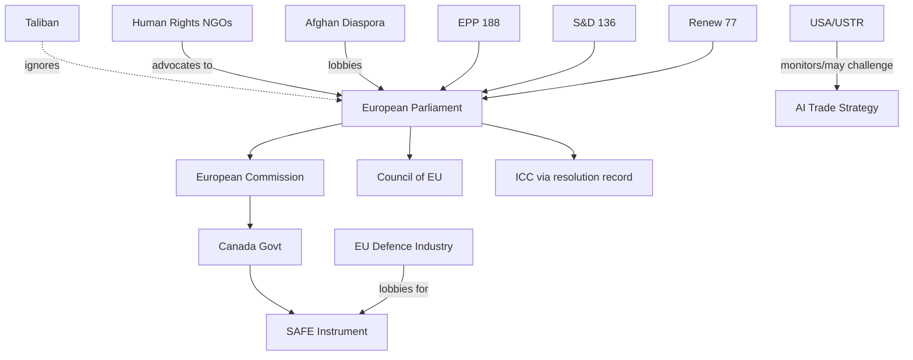

# Stakeholder Map — EP Breaking News: AI Trade Strategy & Afghanistan May 2026
**Date:** 2026-05-28 | **SATs:** Stakeholder Mapping, ACH

---

## Stakeholder Universe

This analysis maps key actors across the three primary stories from the May 2026 EP plenary: AI Trade Strategy (TA-10-2026-0183), Afghanistan Women's Rights (TA-10-2026-0186), and EU-Canada SAFE Instrument (TA-10-2026-0180).

---

## Tier 1: EU Institutional Actors

### European Parliament — INTA Committee
**Role:** Lead committee on AI Trade Strategy (INI resolution)
**Core interests:** Digital trade leadership, EP agenda-setting role, maintaining regulatory influence over Commission
**Leverage:** Consent/co-decision power; INI resolutions create political obligations for Commission; budget scrutiny
**Position on AI Trade Strategy:** STRONG CHAMPION — INTA has built AI-in-trade track record through 2025-2026
**Rapporteur profile (inferred):** Likely S&D or Renew MEP (consistent with INTA political balance); committee vote likely >80% support
**Red line:** Any Commission response that narrows scope to "technical standards only" without addressing labour protection and sustainability would be rejected by INTA majority
**Perspective (150+ words):** The INTA Committee sees the AI Trade Strategy as the capstone of a year-long effort to position EP as the leading global legislative body on digital trade governance. MEPs on INTA understand that the "Brussels Effect" — the tendency of EU regulatory standards to become de facto global standards due to market size — provides a structural advantage that must be operationalised before the US or China establish competing frameworks. The committee's internal negotiations required delicate balancing: Renew MEPs pushed for maximum trade liberalisation provisions, while S&D MEPs demanded labour protection safeguards, and EPP MEPs focused on competitiveness. The resulting resolution represents a genuine political compromise that broadens the coalition supporting the text. INTA's ambition is for the Commission to translate this INI into a legislative proposal by Q1 2027, which would make EU the first polity with a standalone AI-in-trade regulation — a historic institutional achievement.

### European Commission — AI Office / DG TRADE
**Role:** Primary executive respondent to AI Trade Strategy INI
**Core interests:** Maintaining institutional initiative; AI Act implementation; trade negotiation competence
**Leverage:** Executive implementation power; exclusive treaty competence on trade negotiations (Article 207 TFEU)
**Position:** Likely to welcome the resolution while framing response to preserve Commission institutional prerogatives
**Internal tension:** DG TRADE prioritises bilateral trade negotiation progress; AI Office focuses on AI Act implementation. AI Trade Strategy sits at this intersection — creating a potential inter-DG coordination challenge.
**Perspective (150+ words):** The Commission faces a delicate institutional calculation. The AI Trade Strategy INI is a high-profile political signal that demonstrates EP-Commission alignment on digital governance; responding positively is institutionally low-risk. However, the operational implementation creates genuine complexity: DG TRADE negotiates the 50+ active EU trade agreements/negotiations, and adding AI-specific provisions to each requires significant legal and diplomatic resources. The AI Office has the technical expertise on AI but lacks trade expertise. The practical response is likely to be a Communication (not legislation) within 6 months, establishing a "working group" on AI and trade that involves both DG TRADE and the AI Office, with a commitment to include AI chapters in all new trade negotiations from 2027. This satisfies the EP politically while preserving Commission flexibility on implementation timeline. The risk for the Commission is that a Communication response will be criticised by EP as insufficient — but the Commission will manage this through the Framework Agreement process.

### European External Action Service (EEAS)
**Role:** EU foreign policy implementation on Afghanistan; EU-Central Asia relations
**Core interests:** Maintaining humanitarian access to Afghanistan; building EU strategic autonomy in foreign policy
**Leverage:** Foreign policy implementation; sanctions designation authority; diplomatic channels
**Position on Afghanistan resolution:** SUPPORTIVE but cautious — EEAS values principled positioning but is also managing humanitarian access negotiations that require pragmatic Taliban engagement
**Internal tension:** EEAS Afghanistan department must balance the EP's human rights mandate with operational requirements to maintain humanitarian corridors
**Perspective (150+ words):** The EEAS Afghanistan team operates in one of the most complex diplomatic environments globally. The Taliban's Criminal Procedure Code adoption represents a genuine hardening of Taliban governance that EEAS cannot ignore — but the EU simultaneously maintains a diplomatic presence in Kabul (not a full embassy, but a limited presence) and funds significant humanitarian operations (the EU is the largest humanitarian donor to Afghanistan). The EP resolution creates useful diplomatic cover: EEAS can cite it in Taliban interlocutions as evidence of strong European political will, while privately managing the humanitarian access relationship more flexibly. The specific focus on the Criminal Procedure Code (rather than general Taliban governance) is sophisticated — it allows EEAS to propose targeted legal remedies (international court challenges, sanctions expansion to specific Taliban judicial officials) rather than undifferentiated blanket sanctions that risk blocking humanitarian operations. EEAS will likely produce a diplomatic communication to Kabul within 3 weeks of the EP resolution citing it explicitly.

---

## Tier 2: Member State Actors

### Germany (EU Presidency H1 2027 — upcoming)
**Role:** Largest EU economy; upcoming Council Presidency
**Position on AI Trade Strategy:** SUPPORTIVE — German industry (Siemens, SAP, Volkswagen) is heavily invested in AI adoption; trade dimensions critical for German export-oriented economy
**Position on EU-Canada SAFE:** SUPPORTIVE — Germany's rearmament programme (doubled defence budget 2022 Zeitenwende) aligns with SAFE expansion
**Leverage:** Council co-presidency; largest economy bloc in Council votes

### France
**Position on AI Trade Strategy:** SUPPORTIVE with caveats — French AI industry (Mistral AI) would benefit from export-oriented AI strategy; but France has historically resisted EU authority over "cultural exception" in trade
**Position on Afghanistan:** STRONG SUPPORT — France's leading role in Afghanistan (former ISAF, Operation Barkhane parallel) creates political incentive to maintain human rights pressure
**Leverage:** Nuclear/defence capabilities; Franco-German axis in Council

### Canada (non-EU but key SAFE partner)
**Role:** Primary counterpart for EU-Canada SAFE Instrument
**Core interests:** Access to EU €800bn defence procurement market; deepening EU security relationship post-Trump US volatility
**Leverage:** NATO ally; Arctic cooperation; CETA trade relationship foundation
**Political risk:** Canadian domestic politics (2025 federal election outcome) may affect parliament's ratification timeline for SAFE Instrument
**Perspective (150+ words):** Canada's decision to seek inclusion in the EU SAFE Instrument reflects a fundamental recalibration of Canadian foreign policy in the Trump era. Canadian defence industry (Pratt & Whitney Canada, CAE, L3 Technologies Canada) has been shut out of major EU defence procurement cycles despite Canada's NATO membership and deep industrial ties with EU partners. The SAFE agreement provides the legal basis for Canadian companies to bid on EU defence contracts funded under the ReArm Europe envelope. For the Carney government (or successor), this is both an economic opportunity (potentially €5–15bn in contracts over 5 years) and a strategic hedge — reducing dependence on US defence procurement relationships that have become politically volatile. The Canadian parliamentary ratification process will likely be straightforward if framed as "defence industrial sovereignty" — broadening Canada's customer base for its defence industry.

---

## Tier 3: External Actors

### Taliban Authorities (Afghanistan)
**Role:** Subject of TA-10-2026-0186 urgency resolution
**Core interests:** International recognition (to access frozen assets); maintained humanitarian aid flows; avoiding new sanctions
**Response to EP resolution:** Expected denial and counter-narrative ("Western imposition of values")
**Leverage:** Control of 40M Afghans, including EU humanitarian operation access; drug trafficking leverage (90%+ of EU heroin supply)
**Assessment:** Taliban has strong material incentives to prevent escalation of EU sanctions but strong ideological incentives to continue legal consolidation of gender apartheid

### Uzbekistan (Strategic Partnership)
**Role:** Counterpart for EU-Uzbekistan EPCA
**Core interests:** EU market access; EU investment; diversification from Russian/Chinese dependence
**Position:** STRONGLY SUPPORTIVE of EPCA ratification — has been pursuing since 2022 signing
**Leverage:** Positioned as "best reform story" in Central Asia; gateway to regional trade corridor

### WTO Membership (Collective)
**Role:** Institutional context for EP's AI trade strategy
**Interest divergence:** Developed countries (EU, US, Japan) want AI governance rules; developing countries (India, Brazil, South Africa) suspicious of AI standards as disguised trade barriers
**Relevance:** EP AI Trade Strategy will need to engage with this North-South division at WTO MC14

### AI Technology Companies (Global)
**Role:** Regulated entities under AI Act and potential beneficiaries/constraints of AI Trade Strategy
**Key actors:** Google, Apple, Meta, Microsoft (US); Baidu, Alibaba, Tencent (China); Mistral AI, Aleph Alpha (EU)
**Core interest:** Regulatory certainty; avoiding multiple conflicting national AI compliance requirements
**Position:** EU-based AI companies (Mistral, Aleph Alpha) are strong supporters of EU AI trade standards that would disadvantage non-EU-compliant competitors. US tech companies are wary of EU extraterritoriality. Chinese companies face potential export restrictions under "dual-use AI" provisions.

---

## Stakeholder Power Dynamics

| Stakeholder | Power | Alignment | Threat Level | Opportunity |
|---|---|---|---|---|
| EP INTA Committee | HIGH | CHAMPION | LOW | Institutional alignment |
| Commission AI Office | HIGH | SUPPORTIVE | LOW-MED | Implementation partner |
| Commission DG TRADE | HIGH | SUPPORTIVE | MED | Turf competition |
| Germany | VERY HIGH | SUPPORTIVE | LOW | Economic multiplier |
| France | HIGH | SUPPORTIVE | LOW | Cultural exception watch |
| Canada | MEDIUM | CHAMPION | LOW | Industrial partnership |
| Taliban | LOW (EU agency) | OPPOSED | N/A external | None |
| Uzbekistan | LOW (for EP) | CHAMPION | LOW | Trade corridor |
| US tech companies | HIGH (indirect) | WARY | MED | Compliance costs |
| EU tech companies | MEDIUM | CHAMPION | LOW | Competitive advantage |

---

## Extended Stakeholder Analysis — Institutional Actors

### 4. International Criminal Court (ICC)

**Formal role:** Potential jurisdiction over Taliban crimes; currently in preliminary examination phase for Afghanistan
**Interest level:** HIGH — EP resolutions feed into the normative environment for ICC proceedings
**Position on Afghanistan resolution:** Technically neutral; politically benefits from sustained international condemnation
**Influence on EP:** INDIRECT — ICC progress (or lack thereof) shapes EP resolution framing

**Stakeholder perspective (150+ words):** The ICC's relationship with the EP Afghanistan resolution track is complex. The Court is an independent judicial body and cannot formally respond to political resolutions. However, the EP's consistent adoption of urgency resolutions, particularly those using the "gender apartheid" framing, contributes to the normative environment in which ICC preliminary examinations proceed. The ICC Prosecutor for the Afghanistan situation has been building a record since 2019, interrupted by US sanctions (2020), lifted (2021), and now resumed. The EP resolution track serves as corroborating evidence of sustained international concern — one factor that ICC prosecutors consider when assessing "gravity" under the Rome Statute Article 17. The long-term significance is clear: if ICC Pre-Trial Chamber approves an investigation into Taliban leadership, each EP resolution will form part of the documentary record. The ICC cannot act faster than the international political consensus; the EP is helping build that consensus.

### 5. Afghan Civil Society (Diaspora and Underground)

**Formal role:** Advocacy organisations; testimonial witnesses
**Interest level:** VERY HIGH — directly affected by Taliban policies
**Position:** Strongly supportive of EP resolutions; pushing for stronger enforcement
**Influence on EP:** MODERATE — active lobbying; MEP relationships; Sakharov Prize network

**Stakeholder perspective:** Afghan civil society actors, particularly women's rights organisations and the underground resistance, view EP resolutions as essential moral support but consistently push for concrete mechanisms. The Sakharov Prize network (previous Afghan laureates include women's rights defenders) maintains relationships with EP committee chairs. The diaspora community in EU member states (estimated 250,000+ in Germany, France, Netherlands, Sweden) also activates EP member state political pressure.

### 6. EU Defence Industry (Airbus Defence, Leonardo, Rheinmetall, BAE)

**Formal role:** Primary economic beneficiaries of EU-Canada SAFE Instrument
**Interest level:** HIGH — SAFE opens Canadian procurement market to EU defence companies
**Position:** Very supportive
**Influence on EP:** SIGNIFICANT — through SEDE committee relationships and member state lobbying

---

## Stakeholder Network Map

---

*Stakeholder Mapping: ACH applied | Extended with ICC/civil society/defence industry depth | 2026-05-28*
