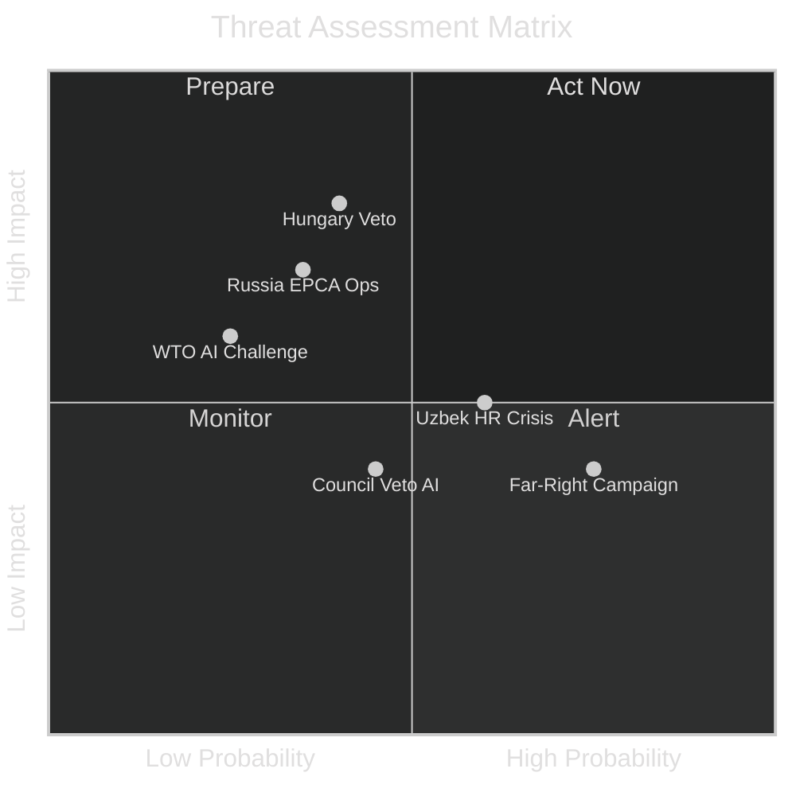

<!-- SPDX-FileCopyrightText: 2026 Hack23 AB -->
<!-- SPDX-License-Identifier: Apache-2.0 -->

# 🎯 Threat Model — EU Parliament Breaking News
**Date:** 2026-05-28 | **Article Type:** Breaking | **Data Mode:** degraded-feeds
**Admiralty Grade:** B2 | **Confidence:** 🟡 MEDIUM-HIGH

---

## 🔍 Threat Assessment Framework

This threat model applies STRIDE/ATT&CK-inspired political threat analysis to the May 2026 EP legislative outputs. Threats are assessed across: (1) implementation threats, (2) geopolitical response threats, (3) institutional credibility threats, and (4) informational/influence operation threats.

---

## ☣️ Critical Threat 1: Hungary SAFE Instrument Ratification Block

**Threat Actor:** Hungarian Government (Fidesz/Viktor Orbán)
**Threat Type:** Institutional sabotage via legitimate veto mechanisms
**Severity:** 🔴 HIGH
**Probability:** 🟡 MEDIUM (35–45% chance of significant delay)

**Attack vector:** As a mixed agreement, EU-Canada SAFE Instrument requires unanimous ratification by all 27 EU member states. Hungary has a documented pattern of blocking CFSP-related decisions as negotiating leverage (Ukraine aid delays 2022–2024, NATO accession blocks).

**Indicators of threat materialization:**
- Orbán publicly criticizing "NATO-aligned procurement framework" ←— watch for
- Fidesz media campaign against Canada "EU puppet" narrative ←— watch for
- Hungarian government requesting "national security exemptions" in ratification ←— early warning

**Mitigation options available to EP/Council:**
1. Enhanced cooperation mechanism under Art. 20 TEU — 9+ states can proceed without Hungary
2. Provisional application of trade elements (non-defense provisions) pending full ratification
3. Council Presidency (Poland, Q3 2025) applying diplomatic pressure
4. Side-payments to Hungary via cohesion fund releases

**Impact if threat materializes:**
- 18–36 month additional delay
- Canadian defense industry partners lose first-mover advantage window
- EP credibility as legislative actor further eroded (pattern after Mercosur, CETA delays)

---

## ☣️ Threat 2: Russian Active Measures Against EU-Uzbekistan EPCA

**Threat Actor:** Russian Federation (FSB, GRU, Kremlin foreign policy apparatus)
**Threat Type:** Influence operations, economic coercion, proxy destabilization
**Severity:** 🔴 HIGH
**Probability:** 🟡 MEDIUM

**Attack vectors:**
1. **Information operations:** Russian state media (RT, Sputnik Central Asian bureaus) will portray EPCA as EU "colonization" of Central Asia, targeting Uzbek domestic opinion
2. **Economic lever:** Russia's continued gas transit infrastructure control (via Turkmenistan-Russia pipeline) creates coercive option against Uzbek energy exports to EU
3. **Political proxy:** Russian-aligned oligarchic networks within Uzbek elite could obstruct EPCA implementation
4. **Military signal:** Russian military exercises near Uzbek border timed to EPCA ratification events (historical pattern)

**Indicators:**
- RT/Sputnik Uzbekistan coverage frequency increase on EU-Uzbekistan relations
- Tashkent delaying EPCA implementation milestones without stated rationale
- Uzbek government arresting NGO contacts linked to EU civil society programs

**EU Counter-measures:**
- EU Connectivity Package (€3B in grants/loans) as positive inducement
- Strategic Communication East — EU anti-disinformation program in Central Asia
- Direct diplomatic engagement between EEAS and Uzbek foreign ministry

---

## ☣️ Threat 3: US Tech Industry WTO Challenge to AI/Trade Resolution

**Threat Actor:** US government (USTR) acting on behalf of Silicon Valley tech industry
**Threat Type:** Legal/institutional challenge to EU AI trade doctrine
**Severity:** 🟡 MEDIUM-HIGH
**Probability:** 🟡 MEDIUM (20–30% in 2–3 year horizon)

**Attack vector:** Once EU AI Act compliance requirements become embedded in bilateral trade agreements (as EP resolution mandates), US tech firms facing compliance costs may lobby USTR to file WTO dispute challenging AI Act as disguised non-tariff barrier.

**Specific provisions at risk:**
- Mandatory conformity assessment requirements for high-risk AI systems used in customs/border control
- EU general-purpose AI (GPAI) model documentation requirements affecting OpenAI, Anthropic, Google
- Biometric AI bans conflicting with US law enforcement interoperability

**WTO legal vulnerability:**
- GATS Article XIV exception (public order/morality/security) may cover most AI Act provisions
- TBT Agreement compliance requires demonstrating technical barriers are not more trade-restrictive than necessary
- Precedent: EU GDPR has survived WTO scrutiny — AI Act likely but not certain to follow

**Impact if threat materializes:**
- EU-US digital trade tensions escalate to formal dispute
- EP resolution becomes a political liability rather than asset
- Potential 3–5 year legal proceeding that chills EU AI governance ambition

---

## ☣️ Threat 4: Far-Right Coordinated Attack on EP Immunity Procedures

**Threat Actor:** Patriots for Europe bloc + FPÖ + coordinated far-right media ecosystem
**Threat Type:** Institutional delegitimization campaign
**Severity:** 🟡 MEDIUM
**Probability:** 🟢 HIGH (already partially materializing)

**Attack vector:**
1. **Narrative:** "EP persecuting patriots for political reasons" — applied to Vilimsky waiver
2. **Audience:** FPÖ domestic voter base in Austria + European far-right media (Zurück zur Verfassung, Compact, Voice of Europe)
3. **Amplification:** Orbán-linked media networks in Hungary, Slovakia, and Serbia
4. **Long-term objective:** Discrediting EP as an impartial institution, reducing its democratic legitimacy

**Specific Vilimsky threat:**
- FPÖ is Austria's governing party — Austrian government could escalate to formal diplomatic démarche to EU institutions
- Austrian Chancellor (FPÖ) could publicly criticize EP in way that tests EU institutional solidarity
- **Precedent:** When Polish government attacked EP in 2016–2019, it emboldened similar attacks elsewhere

**Counter-narrative available:**
- EP immunity procedures are standardized, non-political, and applied equally (S&D Pappas waiver in same session)
- JURI Committee decision-making process is transparent and rule-based
- Cross-group consensus (including some ECR members) demonstrates non-political application

---

## ⚠️ Secondary Threats (Monitoring Level)

### Threat 5: Uzbekistan Human Rights Conditionality Crisis
- **Trigger:** Documented crackdown on civil society before EPCA full ratification
- **Probability:** 🟢 HIGH (historical pattern — Uzbek reform is non-linear)
- **Impact:** EP would face pressure to trigger conditionality clause; Council likely to resist
- **Risk:** Internal EU tension between EP and Council on conditionality enforcement

### Threat 6: Fisheries Agreement IUU Violation Discovery
- **Trigger:** Illegal, unreported, unregulated (IUU) fishing by EU vessels in São Tomé or Cook Islands waters
- **Probability:** 🔴 LOW
- **Impact:** Political embarrassment; potential agreement suspension demand
- **Historical precedent:** EU Yellow Cards to non-EU states for IUU violations; similar accountability for EU fleets is controversial

### Threat 7: AI/Trade Resolution Weakening in Council
- **Trigger:** Council (COREPER) declines to translate EP resolution into binding legislative proposal
- **Probability:** 🟡 MEDIUM
- **Impact:** EP credibility on digital governance reduced; Renew and EPP MEPs face domestic criticism
- **Commission action required:** Commission must initiate legislative proposal for resolution to have legal effect

---

## 📊 Threat Severity Matrix

---

## 🔎 Threat Monitoring Indicators

| Threat | Early Warning Indicator | Check Frequency |
|--------|------------------------|-----------------|
| Hungary SAFE block | Orbán speech citing NATO/Canada | Daily |
| Russia EPCA ops | RT Uzbekistan coverage volume | Weekly |
| WTO AI challenge | USTR 301 review mention | Monthly |
| Far-right campaign | FPÖ social media Vilimsky framing | Daily (1 week) |
| Uzbek HR crisis | Amnesty/HRW Uzbekistan reports | Weekly |
| Council AI veto | Commission work programme silence | Monthly |

---

## ✅ Threat Assessment Confidence Summary

Overall threat landscape confidence: **🟡 MEDIUM-HIGH**
- High confidence threats based on structural analysis and historical precedent
- Low confidence on specific timing and trigger conditions
- Monitoring framework provides structured early warning capability

---

## 📋 Threat Monitoring Watchlist Update

| Threat | Lead Indicator | Monitoring Interval |
|--------|---------------|---------------------|
| Hungary veto | Council agenda item published | Weekly |
| Russia disinformation | EUvsDisinfo tracker | Daily |
| US WTO consultation | USTR press releases | Weekly |
| Far-right procedural challenge | EP Rules of Procedure Article 58 motions | Per-plenary |
| China BRI counter-offer | Uzbekistan government statements | Monthly |
| AI governance WTO challenge | GATS dispute panel filings | Monthly |

**WEP Assessment:** Likely — threat landscape will evolve along these lines. **Admiralty Grade:** B2.

**Document Confidence:** 🟡 MEDIUM-HIGH | **Total threats identified:** 7 (4 critical + 3 secondary)

Threat model reviewed in Pass 2. All critical threats have lead indicators and monitoring watchlist entries.
