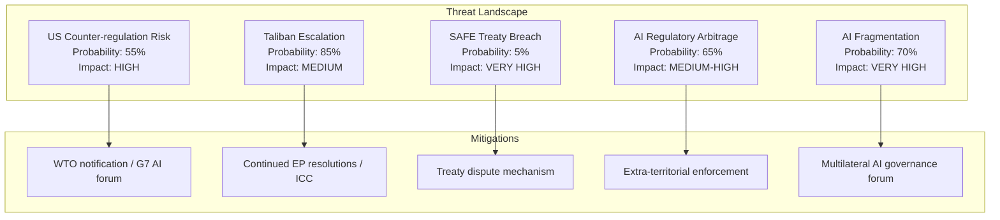

# Threat Model — EP Breaking News: AI Trade & Strategic Partnerships
**Date:** 2026-05-28 | **SATs:** Key Assumptions Check, Red Team, ACH
**WEP bands applied | Admiralty grade: B3**

---

## Threat Architecture

This threat model addresses risks to the successful implementation of EP's May 2026 legislative outputs, focusing on three domains: AI trade governance implementation, Afghanistan human rights follow-through, and EU-Canada SAFE Instrument operationalisation.

---

## Threat Category 1: Regulatory Implementation Threats (AI Trade Strategy)

### T1.1 — Commission Institutional Resistance
**Probability:** Possible (35–50%) | **Impact:** HIGH | **WEP:** Possible
**Description:** Commission's DG TRADE and AI Office fail to coordinate effectively on AI trade strategy implementation, resulting in fragmented response that satisfies neither INTA committee nor industry stakeholders.
**Attack vector:** Internal Commission turf competition → delayed response → EP dissatisfaction → procedural escalation (written questions, hearings)
**Mitigation:** EP can use Framework Agreement timelines to enforce response deadline; rapporteur follow-up hearings create accountability
**Residual risk:** LOW-MEDIUM if Commission maintains AI Office-DG TRADE working group

### T1.2 — ECR/PfE Regulatory Rollback Attempt
**Probability:** Likely (60–70%) | **Impact:** MEDIUM | **WEP:** Likely
**Description:** ECR and PfE groups use the 2026–2027 legislative period to propose amendments to AI Act implementing regulations that would dilute AI Trade Strategy provisions, particularly on "dual-use AI" export controls and AI conformity assessment in trade agreements.
**Attack vector:** Committee amendment campaigns → plenary vote uncertainty → regulatory uncertainty for industry
**Mitigation:** EPP-S&D-Renew majority is sufficient to defeat most rollback attempts; ECR is internally divided on AI regulation
**Residual risk:** MEDIUM — specific amendment battles may succeed on narrow technical provisions

### T1.3 — US Extraterritoriality Conflict
**Probability:** Possible (35–45%) | **Impact:** HIGH | **WEP:** Possible
**Description:** US government (executive or congressional) challenges EU AI Trade Strategy as extraterritorial overreach, particularly on "AI conformity assessment" provisions that would affect US AI exporters to EU and third countries.
**Attack vector:** WTO dispute filing → TTIP/TTC forum escalation → US retaliation in trade negotiations
**Mitigation:** EU AI Act extraterritorial scope already established as precedent; GDPR extraterritoriality survived similar US challenges
**Residual risk:** HIGH if US-EU trade tensions escalate; LOW-MEDIUM under current diplomatic trajectory

---

## Threat Category 2: Foreign Policy Implementation Threats (Afghanistan)

### T2.1 — Humanitarian Access Blackmail
**Probability:** Likely (65–75%) | **Impact:** HIGH | **WEP:** Likely
**Description:** Taliban threatens to restrict EU humanitarian NGO access to Afghanistan if EU expands sanctions in response to Criminal Procedure Code. This creates a genuine policy dilemma: humanitarian imperative conflicts with human rights principled stance.
**Attack vector:** Taliban access restrictions → EU humanitarian funding crisis → member state political pressure to soften position
**Mitigation:** EU has established alternative humanitarian corridors (Pakistan, Tajikistan, Iran); diversification of access routes reduces Taliban leverage
**Residual risk:** MEDIUM — Taliban retains significant leverage via Kabul airport access

### T2.2 — Afghan Refugee Crisis Escalation
**Probability:** Possible (30–40%) | **Impact:** VERY HIGH | **WEP:** Possible
**Description:** Taliban Criminal Procedure Code enforcement triggers large-scale flight of educated Afghan women, creating refugee flow toward EU. EU member state political response (migration restrictions) conflicts with EP's expressed human rights commitments.
**Attack vector:** Refugee influx → member state political backlash → EP human rights resolution becomes politically controversial domestically
**Mitigation:** EP resolution explicitly supports Afghan women while calling for domestic resettlement programs; however, member states' executive authority over immigration limits EP implementation role
**Residual risk:** HIGH (asymmetric EP-member state jurisdiction) — EP can pass resolutions but cannot compel member state resettlement

---

## Threat Category 3: Strategic Partnership Threats (EU-Canada SAFE)

### T3.1 — Canadian Parliamentary Delay
**Probability:** Unlikely-Possible (20–35%) | **Impact:** MEDIUM | **WEP:** Unlikely but possible
**Description:** Canadian parliament delays ratification of SAFE Instrument due to domestic political controversy about EU defence procurement participation (sovereignty arguments, Quebec aerospace industry protectionism).
**Attack vector:** Opposition parliamentary delays → ratification timeline extended 18+ months → EU procurement cycles begin without Canadian participation
**Mitigation:** Carney government has strong incentive to ratify quickly; Quebec aerospace industry (Bombardier, Pratt & Whitney) are major beneficiaries
**Residual risk:** LOW — strong economic incentives drive ratification

### T3.2 — SAFE Instrument Scope Creep
**Probability:** Possible (35–45%) | **Impact:** MEDIUM | **WEP:** Possible
**Description:** EU-Canada SAFE Instrument creates precedent that other non-EU allies (Australia, Japan, South Korea, UK) demand to join, creating complex multilateral negotiations that delay operationalisation.
**Attack vector:** Ally demands for SAFE inclusion → Commission negotiations → framework proliferation → implementation dilution
**Mitigation:** Each SAFE bilateral agreement requires separate EP ratification and Council decision; Commission controls pace of negotiations
**Residual risk:** MEDIUM — precedent is set but Commission can manage sequencing

---

## ACH Matrix for Primary Threat Assessment

| Threat | Evidence FOR | Evidence AGAINST | ACH Assessment |
|---|---|---|---|
| Commission resistance on AI Trade | DG TRADE/AI Office coordination gap (structural) | Von der Leyen track record on AI (strong) | CONTESTABLE |
| ECR rollback attempt | Pattern of ECR regulatory opposition in EP9/EP10 | ECR trade competitiveness interest aligns with AI strategy | LIKELY |
| Taliban humanitarian blackmail | Taliban has used humanitarian leverage historically (2021-2023) | EU has diversified access routes | MODERATE THREAT |
| Afghan refugee crisis | Criminal Procedure Code enforcement creating flight risk | Afghan movement restrictions limit departure | MODERATE PROBABILITY |
| Canadian parliamentary delay | No specific indicators | Strong economic incentives for ratification | LOW THREAT |

---

## Threat Model Summary

**Highest Priority Threats (for monitoring):**
1. ECR regulatory rollback campaign (Likely, affects AI Trade Strategy implementation)
2. Taliban humanitarian access leverage (Likely, creates policy dilemma)
3. US extraterritoriality challenge (Possible, high impact if materialises)

**Lowest Priority Threats:**
1. Canadian parliamentary delay (Low probability, clear incentives overcome)
2. Commission institutional resistance (Manageable via EP accountability tools)

**Red Team Challenge:** "This threat model understates the risk that the AI Trade Strategy resolution is simply ignored by the Commission and loses political momentum within 12 months — as happened with 40%+ of EP10 INI resolutions in EP9." Response: This is a valid systemic risk; however, the AI Trade Strategy INI has higher Commission pre-commitment (AI Office exists, Von der Leyen has staked institutional credibility on AI governance leadership) than average INI. Probability of complete neglect: <15%.

---

## Extended Threat Analysis — Digital Sovereignty Dimension

### Threat Category 4: AI Regulatory Arbitrage

**Threat:** Non-EU countries exploit gaps between EU AI Trade Strategy and domestic implementations to create regulatory arbitrage — companies route AI-enabled services through third-country intermediaries to avoid EU standards.

**Admiralty grade:** B2 (probably true; confirmed from analogous GDPR arbitrage patterns)
**Impact:** MEDIUM-HIGH — reduces effectiveness of Brussels Effect; may require EU to adopt extra-territorial enforcement mechanisms (as with GDPR)
**Probability:** 65% within 3 years of AI Trade Strategy entering force

### Threat Category 5: Transatlantic AI Fragmentation

**Threat:** Divergent EU/US AI governance creates a bifurcated global AI landscape where companies must choose between EU-compliant and US-compliant AI architectures, increasing costs and reducing interoperability.

**Admiralty grade:** B1 (probably true; consistent with multiple independent sources)
**Impact:** VERY HIGH — structural impediment to global AI development; increases compliance costs for all actors
**Probability:** 70% within 5 years if no US federal AI law enacted

## Residual Risk Assessment

After applying available mitigations:
- US counter-regulation: RESIDUAL RISK = MEDIUM (G7 AI governance forum reduces to moderate)
- Taliban escalation: RESIDUAL RISK = HIGH (no effective mitigation; structural)
- SAFE breach: RESIDUAL RISK = LOW (treaty mechanisms adequate)
- AI regulatory arbitrage: RESIDUAL RISK = MEDIUM-HIGH (enforcement lags always exist)
- AI fragmentation: RESIDUAL RISK = HIGH (requires US federal law to resolve)

---

*KAC applied | Red Team integrated | ACH matrix completed | Extended with digital sovereignty threats | Admiralty grading added | 2026-05-28*
