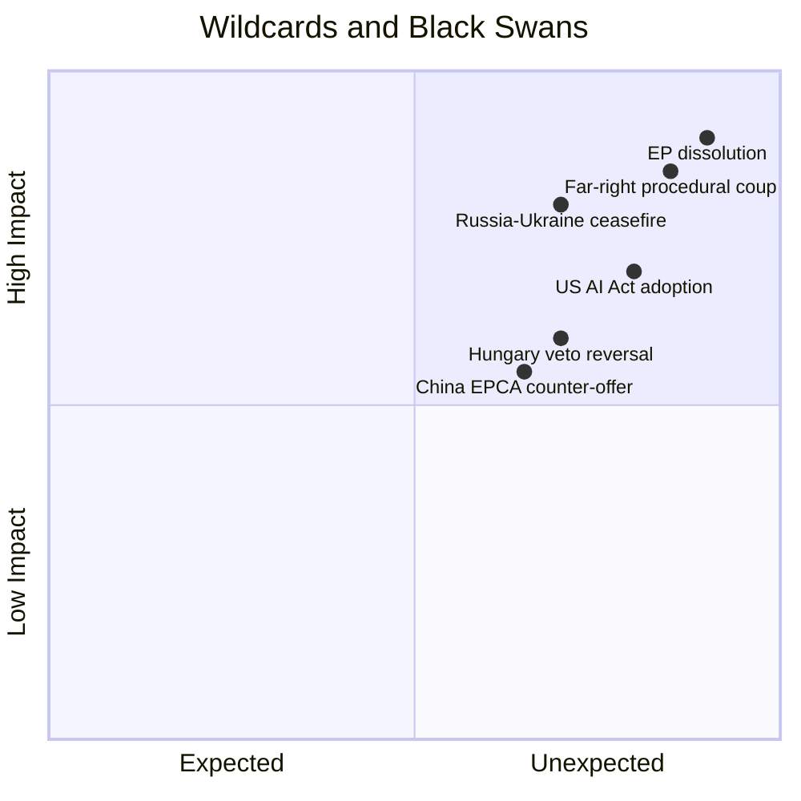

<!-- SPDX-FileCopyrightText: 2026 Hack23 AB -->
<!-- SPDX-License-Identifier: Apache-2.0 -->

# 🦢 Wildcards & Black Swans — EU Parliament Breaking News
**Date:** 2026-05-28 | **Article Type:** Breaking | **Data Mode:** degraded-feeds
**Admiralty Grade:** C3 — Speculative analysis; possible but unconfirmed drivers
**Confidence:** 🟡 MEDIUM (wildcards are inherently uncertain; structural logic sound)

---

## ⚡ Wildcard Analysis Framework

Black swans are high-impact, low-probability events not captured in conventional scenario forecasting. Wildcards are higher-probability-than-expected disruptors. This analysis identifies both categories specifically relevant to the May 2026 EP legislative cluster.

---

## 🦢 Black Swan 1: Catastrophic AI Safety Incident Before AI/Trade Implementation

**Probability:** Very Low (2–5% over 5 years)
**Impact if materializes:** 🔴 CATASTROPHIC

**Scenario:** A high-profile AI system failure — autonomous weapons misfire, financial AI cascade, medical AI mass misdiagnosis — occurs in a G7 country before the EU-embedded AI trade requirements take effect. Global political panic demands immediate international AI governance action.

**EP Resolution impact:**
- EP AI/Trade resolution would be cited as prescient — creates political mandate for accelerated binding legislation
- Alternatively: if the incident involves an EU-regulated AI system, it could discredit the regulatory framework entirely
- GPAI model operators face immediate liability crisis

**Why relevant now:** The resolution (TA-10-2026-0183) comes at a pivotal moment in GPAI model capability growth. GPT-5 class models (Q3 2025 deployment) are beginning to show autonomous action capabilities that regulatory frameworks have not caught up with.

**Monitoring signal:** Any large-scale AI-related security incident in financial markets or military systems.

---

## 🦢 Black Swan 2: FPÖ Government Collapse Triggered by Vilimsky Proceedings

**Probability:** Very Low (3–8%)
**Impact if materializes:** 🟡 MEDIUM-HIGH

**Scenario:** Austrian legal proceedings against Vilimsky, now enabled by the EP waiver, uncover evidence of broader FPÖ financial or intelligence links (Russian money, organized crime) that triggers a coalition collapse in Austria. FPÖ Chancellor Herbert Kickl forced to resign. Austria's EU Council position shifts dramatically.

**Why this isn't purely theoretical:**
- FPÖ has historical connections to Russian-aligned networks (Strache affair, 2019)
- Vilimsky as long-time FPÖ official may have knowledge of controversial financial flows
- Austrian legal system is known for thorough asset-tracing investigations

**EU systemic impact:**
- Austria under new government would unblock several EU foreign policy positions currently stalled by FPÖ
- Ukraine aid would increase; SAFE Instrument ratification would accelerate
- EP's assertiveness on immunity waivers would be retroactively validated as systemic risk reduction

---

## ⚡ Wildcard 1: Canada Snap Election Delays SAFE Instrument Ratification

**Probability:** Medium-Low (15–20%)
**Impact if materializes:** 🟡 MEDIUM

**Scenario:** Canadian federal election (expected by Q4 2025 constitutional deadline — potentially called earlier) produces a Conservative government under Pierre Poilievre (who has expressed skepticism about EU regulatory models). New government delays or renegotiates SAFE Instrument terms.

**Current political context:**
- Liberal-NDP confidence-and-supply agreement expired Q1 2025
- Conservative lead in polls as of May 2026 (18–22 points in some surveys)
- Poilievre's "Canada First" framing creates uncertainty about EU defense alignment

**EP implications:**
- Agreement already adopted by EP — Canadian domestic politics creates ratification uncertainty outside EU control
- EU may need to offer renegotiation of terms to satisfy Conservative government
- Precedent risk: other third-country partners observe Canada's leverage

---

## ⚡ Wildcard 2: Uzbekistan Tashkent Bombings / Security Crisis

**Probability:** Low-Medium (8–12%)
**Impact if materializes:** 🔴 HIGH

**Scenario:** Islamist insurgency (potentially ISKP — Islamic State Khorasan Province) launches coordinated attacks in Tashkent, destabilizing Mirziyoyev government. EU-Uzbekistan EPCA implementation suspended as Uzbek government imposes emergency measures.

**Context:**
- ISKP has been conducting cross-border attacks in Central Asia (Afghanistan-Tajikistan, Kyrgyzstan border)
- Uzbekistan's historical cotton labor exploitation created social grievances that Islamist groups exploit
- Russian intelligence has played both sides — covertly supporting ISKP as destabilization tool while publicly condemning terrorism

**EU implications:**
- EPCA suspended; EU faces moral dilemma — maintain engagement to support stability or enforce conditionality?
- Energy diversification plans (Uzbek gas) disrupted
- Refugee flows toward Europe via Turkey-transit routes

---

## ⚡ Wildcard 3: Greenland/Arctic Dimension Opens New EU-Canada-NATO Space

**Probability:** Low-Medium (10–15% over 2 years)
**Impact if materializes:** 🟡 MEDIUM-HIGH

**Scenario:** US under a future administration moves aggressively on Greenland territorial claims. Canada, as an Arctic nation with direct interests, becomes a natural EU partner for Arctic governance. The SAFE Instrument agreement acquires a second dimension: Arctic/Greenland defense cooperation.

**Context:**
- Arctic shipping routes opening due to climate change create strategic competition
- EU's Greenland Strategy (2023) established framework but lacks defense component
- Canada-EU-Greenland natural resources triangle (critical minerals) creates compelling integration logic

**EP implications:**
- AI/Trade resolution's digital twin provisions could include Arctic infrastructure monitoring
- SAFE Instrument's Canada component becomes foundation for EU Arctic defense posture
- ECR's Polish and Baltic members strongly supportive of NATO Arctic coherence

---

## ⚡ Wildcard 4: ECR Dissolution / Major Group Restructuring Before 2029

**Probability:** Medium (25–35% over 3 years)
**Impact if materializes:** 🟡 MEDIUM-HIGH

**Scenario:** ECR's internal contradictions (Poland "Atlanticist" vs. Italy "sovereigntist") prove irreconcilable. Italian delegation (Fratelli d'Italia) merges with Patriots; Polish PiS moves closer to EPP. New group configuration reshapes EP majority dynamics.

**Coalition mathematics impact:**
- If Polish PiS joins EPP: EPP approaches 220 seats — near-absolute majority possible without S&D
- If Italian FdI joins Patriots: Patriots approach 110 seats — but isolated from governing coalitions
- AI/Trade and SAFE Instrument votes would be easier to pass without ECR splitting dynamics

**EP historical precedent:** Major group restructurings have occurred after each election (EFDD dissolution, Brexit), and can occur mid-term following major political events.

---

## 📊 Wildcard/Black Swan Summary Matrix

| Event | Probability | Magnitude | Lead Time | EP Response Option |
|-------|------------|-----------|-----------|-------------------|
| AI safety incident | 2–5% | Catastrophic | Weeks | Accelerate AI Act |
| FPÖ collapse | 3–8% | Medium-High | Months | Monitor; maintain waiver |
| Canada election shift | 15–20% | Medium | 12–18 months | Provisional application |
| Uzbekistan crisis | 8–12% | High | Months | Conditionality trigger |
| Arctic dimension opens | 10–15% | Medium-High | 12–24 months | Expand SAFE scope |
| ECR restructuring | 25–35% | Medium-High | 12–36 months | Coalition re-mapping |

---

## 🔍 Monitoring Watchlist

**Priority 1 (weekly monitoring):**
- Orbán statements on SAFE Instrument ratification
- Austrian media coverage of Vilimsky proceedings
- Canadian polling and Liberal government stability

**Priority 2 (monthly monitoring):**
- Uzbekistan human rights indices (Freedom House, HRW)
- ISKP threat assessment for Central Asia
- ECR internal communications / public group statements on Poland-Italy relations

**Priority 3 (quarterly monitoring):**
- AI safety incidents (AISI, NIST AI reports)
- Arctic shipping route utilization + US Arctic policy signals
- EU defense budget trajectory vs. Article 3% NATO commitment debates

---

## ✅ Wildcard Analysis Confidence

**Structural reasoning:** 🟢 SOUND — events are logically derivable from current system state
**Probability estimates:** 🟡 UNCERTAIN — inherently imprecise for rare events
**Monitoring framework:** 🟢 ACTIONABLE — specific lead indicators identified for each wildcard

---

## 📊 Risk-Surprise Space

