<!-- SPDX-FileCopyrightText: 2026 Hack23 AB -->
<!-- SPDX-License-Identifier: Apache-2.0 -->

# 📋 Workflow Audit — EU Parliament Breaking News
**Date:** 2026-05-28 | **Article Type:** Breaking | **Run ID:** breaking-run264-1779957632
**Admiralty Grade:** A1 — Direct observation of workflow execution

---

## 🔍 Workflow Execution Audit

This document audits the execution of the breaking news unified workflow (news-breaking.md) for the 2026-05-28 run. It provides a transparent record of decisions, deviations from standard path, and quality control checkpoints.

---

## 📋 Stage Execution Log

### Stage A: Data Collection

**Status:** ✅ COMPLETE

**Execution decisions:**
1. **Pre-fetch inventory:** All 6 pre-fetched feed files were empty/error placeholders — prefetchMode=degraded-feeds (5 fetched, 1 placeholder, 1 appears failed)
2. **Fallback trigger:** Rule 2a applied immediately — direct endpoint calls only for primary data
3. **MCP calls made (4 total):**
   - Call 1: `get_adopted_texts(year=2026)` → 51 items ✅ PRIMARY DATA SOURCE
   - Call 2: `get_adopted_texts_feed(timeframe=one-week)` → 248 items ✅ SUPPLEMENTARY
   - Call 3: `get_plenary_sessions(dateFrom=2026-05-14)` → 0 filtered items ⚠️ PARTIAL
   - Call 4: `get_procedures_feed(timeframe=one-week)` → 50 historical items ❌ DEGRADED
4. **Data mode declaration:** degraded-feeds (0.80 floor factor)
5. **Budget compliance:** 4 MCP calls ≤ 5 cap ✅

**Stage A variance from standard path:**
- ⚠️ Events fallback (`get_plenary_sessions`) returned filtered=0 — date filter bug
- ℹ️ IMF/World Bank probes NOT performed (invocation budget conservation)
- ℹ️ Voting data not probed (within known DOCEO lag window)

---

### Stage B: Analysis

**Status:** ✅ IN PROGRESS (Pass 2 underway)

**Artifacts produced (Pass 1):**
1. intelligence/synthesis-summary.md ✅
2. intelligence/coalition-dynamics.md ✅
3. intelligence/mcp-reliability-audit.md ✅ (may be below floor; Pass 2 target)
4. intelligence/pestle-analysis.md ✅
5. intelligence/stakeholder-map.md ✅
6. intelligence/scenario-forecast.md ✅
7. intelligence/threat-model.md ✅
8. intelligence/wildcards-blackswans.md ✅
9. intelligence/voting-patterns.degraded.md ✅
10. intelligence/reference-analysis-quality.md ✅
11. intelligence/analysis-index.md ✅
12. risk-scoring/risk-matrix.md ✅
13. risk-scoring/quantitative-swot.md ✅
14. classification/significance-classification.md ✅
15. documents/document-analysis-index.md ✅

**Thresholds cache:** Written at Stage B start ✅ (`runs/thresholds-cache.json`)

**Pass 2 improvements documented in:** `intelligence/reference-analysis-quality.md` ✅

---

### Stage C: Completeness Gate

**Status:** PENDING

**Pre-assessment:**
- ~12/15 artifacts comfortably above degraded floor
- mcp-reliability-audit.md: likely below 308-line floor → Pass 2/3 extension target
- Additional artifacts (workflow-audit, cross-session-intelligence, methodology-reflection, historical-baseline, significance-scoring, political-threat-landscape, procedures-proxy, data-availability-assessment) still to produce
- Extended artifacts (extended/) required per thresholds

**Elapsed time at this point:** ~25–30 minutes (within Stage B budget)

---

## ⚠️ Deviation Log

| Deviation | Reason | Impact | Mitigation |
|-----------|--------|--------|------------|
| IMF API not called | Invocation budget conservation | IMF context cited from known data (1.3–1.5% EU GDP growth) | IMF cited contextually in PESTLE |
| Events fallback only partial | EP API events filter bug | No specific session agenda data | Recovered via adopted texts timestamps |
| DOCEO voting unavailable | Standard 2–4 week lag | Coalition analysis uses inferred positions | voting-patterns.degraded.md produced |
| Procedures feed degraded | Historical-tail ordering bug | No recent procedures data | Adopted texts procedureReference used |

---

## 🔒 Security & Compliance Audit

**Shell safety:** ✅ No forbidden shell expansion patterns used
**Secret handling:** ✅ No secrets hardcoded or referenced
**GDPR compliance:** ✅ No personal data beyond publicly available MEP information
**WCAG:** ✅ Markdown accessibility standard maintained
**File authoring:** ✅ All files created via `create` tool (no heredocs or cat loops)

---

## ✅ Workflow Audit Confidence

**Completeness:** 🟢 HIGH — all major execution decisions documented
**Accuracy:** 🟢 HIGH — based on direct observation of tool call results
**Deviation identification:** 🟢 HIGH — all significant deviations from standard path logged

---

## 📊 Stage Execution Timeline

```mermaid
gantt
    title Workflow Stage Execution
    dateFormat mm
    section Stages
    Stage A Data Collection :done, a1, 00, 02m
    Stage B Pass1 Analysis  :done, b1, 02, 20m
    Stage B Pass2 Deepening :done, b2, 22, 08m
    Stage C Gate            :active, c1, 30, 03m
    Stage D Article Render  :d1, 33, 05m
    Stage E PR              :e1, 38, 04m
```

