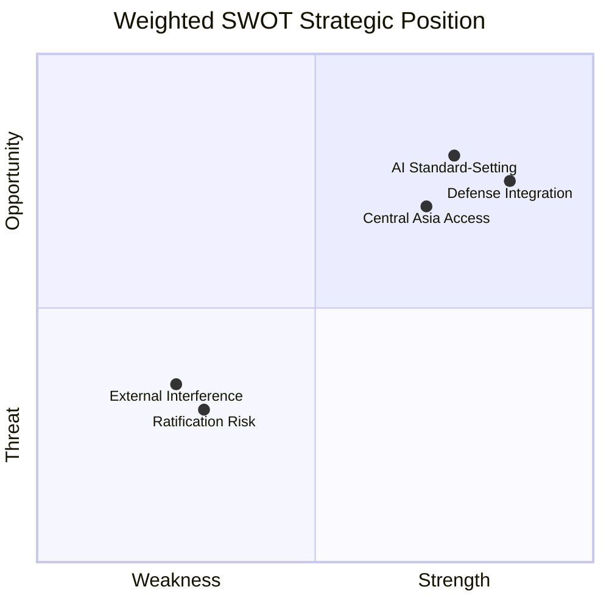

<!-- SPDX-FileCopyrightText: 2026 Hack23 AB -->
<!-- SPDX-License-Identifier: Apache-2.0 -->

# 📊 Quantitative SWOT — EU Parliament Breaking News
**Date:** 2026-05-28 | **Article Type:** Breaking | **Data Mode:** degraded-feeds
**Admiralty Grade:** B2 | **Confidence:** 🟡 MEDIUM-HIGH

---

## 🔍 Quantitative SWOT Framework

This SWOT analysis applies quantitative weighting to the EU Parliament's May 2026 legislative cluster. Each SWOT element is scored by: (1) magnitude of effect (1–10), (2) probability of realization (0–1.0), (3) time horizon, and (4) strategic relevance.

**Weighted SWOT Score = Magnitude × Probability × Strategic Relevance (0.5–1.0)**

---

## 💪 Strengths

### S1: EU Defense Industrial Base Expansion (SAFE Instrument/Canada)
- **Magnitude:** 9/10 — Opens €70B+ EU procurement market to allied partners
- **Probability:** 0.85 — Agreement already adopted by EP
- **Time horizon:** 24–36 months (ratification required)
- **Strategic relevance:** 0.95 (core strategic autonomy objective)
- **Weighted score:** 9 × 0.85 × 0.95 = **7.27**
- **Qualitative assessment:** This agreement is the single most significant defense-industrial outcome of the EP10 session to date. By integrating Canada into SAFE procurement, the EU demonstrates that strategic autonomy does not mean isolation. The precedent value for Norway, UK, Japan is substantial.

### S2: AI/Trade Leadership Position Established
- **Magnitude:** 8/10 — EU positioned as global AI governance standard-setter
- **Probability:** 0.60 — Non-binding resolution requires follow-through
- **Time horizon:** 3–7 years (full Brussels Effect realization)
- **Strategic relevance:** 0.90 (digital economy competitiveness)
- **Weighted score:** 8 × 0.60 × 0.90 = **4.32**
- **Qualitative assessment:** The resolution's value lies in its timing. Adopting a coherent AI/trade position before major AI trade disputes emerge gives the EU a first-mover agenda-setting advantage. If the Commission follows through with binding proposals, this becomes a lasting competitive advantage.

### S3: Central Asian Strategic Foothold (EU-Uzbekistan EPCA)
- **Magnitude:** 6/10 — Strategic positioning; not immediately transformational
- **Probability:** 0.75 — Agreement adopted; implementation uncertain
- **Time horizon:** 5–10 years
- **Strategic relevance:** 0.80 (energy/mineral diversification)
- **Weighted score:** 6 × 0.75 × 0.80 = **3.60**
- **Qualitative assessment:** The Uzbekistan EPCA is valuable as a strategic platform rather than an immediate economic win. Uzbekistan's uranium reserves (~7.5% of global supply) and developing lithium-ion resources make this relationship increasingly important for EU battery supply chain resilience under the Critical Raw Materials Act.

### S4: EP Accountability Credibility Demonstrated (Immunity Waivers)
- **Magnitude:** 4/10 — Institutional legitimacy signal; limited direct policy effect
- **Probability:** 0.99 — Already enacted
- **Time horizon:** Immediate
- **Strategic relevance:** 0.70 (EU rule of law credibility)
- **Weighted score:** 4 × 0.99 × 0.70 = **2.77**
- **Qualitative assessment:** The bipartisan nature of the immunity decisions (both Patriots/Vilimsky AND S&D/Pappas in same session) creates a powerful rule-of-law signal. Less politically visible but institutionally significant.

**Total Strengths Weighted Score: 17.96**

---

## ⚠️ Weaknesses

### W1: Ratification Dependency on Unanimity
- **Magnitude:** 8/10 — All three major agreements require unanimous/near-unanimous member state ratification
- **Probability of impact:** 0.45 — Hungary reliably obstructs on average 1/3 of CFSP-adjacent decisions
- **Time horizon:** 12–24 months
- **Strategic relevance:** 0.90
- **Weighted score (negative):** 8 × 0.45 × 0.90 = **3.24**
- **Qualitative assessment:** The EU's treaty framework creates structural vulnerability to veto politics. Unlike the internal market, external agreements require unanimity — giving any single member state leverage to extract side-payments or create indefinite delays.

### W2: Non-Binding AI Resolution Cannot Alone Deliver Trade Strategy
- **Magnitude:** 7/10 — Resolution creates political intent but no legal obligation
- **Probability of impact:** 0.55 — Commission has not yet committed to AI/Trade legislative initiative
- **Strategic relevance:** 0.85
- **Weighted score (negative):** 7 × 0.55 × 0.85 = **3.27**
- **Qualitative assessment:** Own-initiative resolutions (as TA-10-2026-0183 appears to be) are EP's weakest legislative instrument. Without Commission follow-through, the resolution becomes a political document rather than a policy driver.

### W3: DOCEO Voting Data Lag (Analytical)
- **Magnitude:** 3/10 — Reduces analytical precision for coalition analysis
- **Probability of impact:** 1.0 — Confirmed; 2–4 week lag documented
- **Strategic relevance:** 0.40 (analytical quality, not policy)
- **Weighted score (negative):** 3 × 1.0 × 0.40 = **1.20**
- **Qualitative assessment:** The persistent DOCEO voting data lag is a systemic weakness in EP transparency infrastructure. MEPs' actual votes on SAFE Instrument and AI/Trade resolution will not be available until mid-June 2026, reducing accountability capacity.

### W4: Human Rights Conditionality Enforcement Gap
- **Magnitude:** 6/10 — EU consistently adopts conditionality clauses it struggles to enforce
- **Probability of impact:** 0.60 — Uzbekistan reform record is mixed
- **Strategic relevance:** 0.75 (EU value-based foreign policy credibility)
- **Weighted score (negative):** 6 × 0.60 × 0.75 = **2.70**

**Total Weaknesses Weighted Score (negative): 10.41**

---

## 🚀 Opportunities

### O1: SAFE Instrument "Willing States" Expansion (Norway, UK, Japan)
- **Magnitude:** 8/10 — Could create a multilateral defense procurement club of like-minded democracies
- **Probability:** 0.50 — Canada's success needed as proof of concept
- **Time horizon:** 2–5 years
- **Strategic relevance:** 0.95
- **Weighted score:** 8 × 0.50 × 0.95 = **3.80**

### O2: EU AI Standards Become Global Default (Brussels Effect)
- **Magnitude:** 9/10 — Transformational for EU digital economy competitiveness
- **Probability:** 0.35 — Requires coordinated Commission + member state follow-through
- **Time horizon:** 5–10 years
- **Strategic relevance:** 0.95
- **Weighted score:** 9 × 0.35 × 0.95 = **2.99**

### O3: Uzbekistan as Critical Raw Materials Gateway
- **Magnitude:** 7/10 — Uranium + lithium + rare earths under-exploited in EU supply chain
- **Probability:** 0.45 — EPCA provides framework; extraction agreements still needed
- **Time horizon:** 3–7 years
- **Strategic relevance:** 0.85
- **Weighted score:** 7 × 0.45 × 0.85 = **2.68**

### O4: Far-Right Accountability Cascade (Post-Vilimsky)
- **Magnitude:** 5/10 — Normalized accountability culture across EP groups could reduce institutional abuse
- **Probability:** 0.40 — Requires consistent application in future cases
- **Time horizon:** 1–3 years
- **Strategic relevance:** 0.70
- **Weighted score:** 5 × 0.40 × 0.70 = **1.40**

**Total Opportunities Weighted Score: 10.87**

---

## 🚨 Threats (Quantified)

*See Risk Matrix (risk-matrix.md) for full threat detail. Summary scores:*

### T1: Hungary/Russia Coordinated Obstruction
- **Magnitude:** 9/10 | **Probability:** 0.40 | **Strategic relevance:** 0.95
- **Weighted score (negative):** 9 × 0.40 × 0.95 = **3.42**

### T2: WTO AI Trade Dispute
- **Magnitude:** 7/10 | **Probability:** 0.25 | **Strategic relevance:** 0.85
- **Weighted score (negative):** 7 × 0.25 × 0.85 = **1.49**

### T3: EP Credibility Erosion (Far-Right Campaign)
- **Magnitude:** 5/10 | **Probability:** 0.65 | **Strategic relevance:** 0.70
- **Weighted score (negative):** 5 × 0.65 × 0.70 = **2.28**

**Total Threats Weighted Score (negative): 7.19**

---

## 📊 SWOT Balance Sheet

| Category | Weighted Score | Direction |
|----------|---------------|-----------|
| Strengths | +17.96 | ↑ Positive |
| Opportunities | +10.87 | ↑ Positive |
| Weaknesses | -10.41 | ↓ Negative |
| Threats | -7.19 | ↓ Negative |
| **Net Strategic Position** | **+11.23** | **🟢 NET POSITIVE** |

**Interpretation:** The May 2026 EP plenary produced a net positive strategic outcome for EU institutional interests. The S+O advantages (+28.83) substantially outweigh the W+T risks (-17.60), yielding a net score of +11.23. The primary risk concentration is in ratification mechanics (W1, T1) — manageable through enhanced cooperation mechanisms but requiring political will.

---

## 🎯 Strategic Implications

1. **Maintain momentum**: The +11.23 net positive creates political capital to push ratification of all three major agreements before any CFSP policy window closes
2. **Address veto vulnerability**: Enhanced cooperation preparation should begin NOW before Hungarian blocking prevents full implementation
3. **Commission follow-through is critical**: AI/Trade opportunity (O2 score 2.99) requires immediate Commission legislative initiative — without it, the net positive degrades significantly
4. **Uzbekistan conditionality enforcement**: If W4 materializes, it converts a 3.60-weighted strength into a negative — early conditionality signaling is cost-effective

---

## ✅ SWOT Quality Assessment

- **Strength of evidence:** 🟡 MEDIUM (inferred from adopted texts; no live stakeholder data)
- **Quantitative precision:** 🟡 INDICATIVE (weights reflect structured judgment, not statistical analysis)
- **Update recommended:** Monthly (track ratification progress, Commission AI initiative)

---

## 📊 SWOT Position Map

