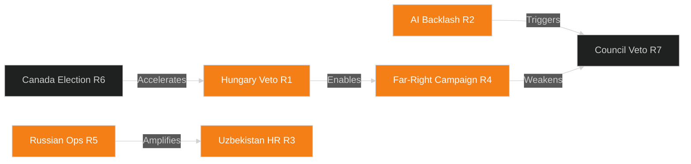

<!-- SPDX-FileCopyrightText: 2026 Hack23 AB -->
<!-- SPDX-License-Identifier: Apache-2.0 -->

# ⚠️ Risk Matrix — EU Parliament Breaking News
**Date:** 2026-05-28 | **Article Type:** Breaking | **Data Mode:** degraded-feeds
**Admiralty Grade:** B2 | **Confidence:** 🟡 MEDIUM-HIGH

---

## 📊 Risk Assessment Framework

Risk matrix for the May 2026 EP legislative cluster. Risks assessed on 5×5 matrix (probability × impact). Each risk entry includes: description, driver, timeline, probability score (1–5), impact score (1–5), composite risk score (P×I), and mitigation pathway.

**Risk Score Legend:**
- 🔴 20–25: CRITICAL — immediate action required
- 🟠 15–19: HIGH — monitoring and contingency planning
- 🟡 10–14: MEDIUM — structured monitoring
- 🟢 5–9: LOW — awareness only
- ⚪ 1–4: NEGLIGIBLE

---

## 🔴 Critical Risks

### R1: EU Defense Cohesion Fracture (SAFE Instrument Ratification)
- **Description:** Hungary (and potentially Slovakia) blocks SAFE Instrument ratification, creating a two-tier EU on defense procurement
- **Driver:** Orbán's systemic use of ratification veto as political leverage
- **Timeline:** 12–18 months post-agreement (ratification process)
- **Probability:** 3/5 (documented Orbán blocking pattern)
- **Impact:** 5/5 (undermines entire EU strategic autonomy architecture)
- **Risk Score:** 15 (HIGH)
- **Mitigation:**
  1. Enhanced cooperation mechanism (9+ states proceed without Hungary)
  2. Provisional application of commercial elements
  3. Cohesion fund leverage (tie ratification to EU budget disbursements)
- **Residual risk if mitigated:** 🟡 MEDIUM (enhanced cooperation still creates two-tier EU)

### R2: AI/Trade Regulatory Overreach Backlash
- **Description:** EU AI Act trade requirements trigger retaliatory trade measures from major partners, reducing EU export market access
- **Driver:** US, China, India perceive AI Act compliance requirements as EU protectionism
- **Timeline:** 18–36 months (after EU-embedded AI requirements enter trade agreements)
- **Probability:** 3/5 (diplomatic pressure already building)
- **Impact:** 4/5 (significant EU trade volume at risk)
- **Risk Score:** 12 (MEDIUM)
- **Mitigation:**
  1. WTO compatibility assessment (Commission DG Trade mandate)
  2. Mutual recognition agreements on AI standards with US/Japan
  3. Gradual phase-in of AI compliance requirements in trade agreements
- **Residual risk if mitigated:** 🟢 LOW-MEDIUM

---

## 🟠 High Risks

### R3: Uzbekistan EPCA Implementation Failure (Human Rights)
- **Description:** Uzbek government fails to meet human rights conditionality thresholds, triggering EP resolution demanding suspension
- **Driver:** Mirziyoyev regime's mixed reform record; civil society repression continuing
- **Timeline:** 6–18 months (conditionality review cycle)
- **Probability:** 3/5 (historical pattern of non-linear reform)
- **Impact:** 4/5 (loss of EU Central Asian strategic position; energy diversification setback)
- **Risk Score:** 12 (MEDIUM-HIGH)
- **Mitigation:**
  1. EU-Uzbekistan human rights dialogue mechanism (annual)
  2. Civil society resilience funding via European Democracy Foundation
  3. Conditionality "traffic light" system with graduated response
- **Residual risk if mitigated:** 🟡 MEDIUM

### R4: Far-Right EP Credibility Attack (Post-Vilimsky)
- **Description:** FPÖ/Patriots coordinated campaign delegitimizing EP as political persecutor of national politicians undermines EP democratic credibility
- **Driver:** Vilimsky proceeding + Patriots group coordination + European far-right media ecosystem
- **Timeline:** Immediate to 3 months
- **Probability:** 4/5 (campaign has already started in FPÖ domestic media)
- **Impact:** 3/5 (reputational damage; no immediate legislative impact)
- **Risk Score:** 12 (MEDIUM-HIGH)
- **Mitigation:**
  1. EP communication strategy emphasizing rule-based, non-political application
  2. Point to simultaneous Pappas (S&D) waiver as evidence of impartiality
  3. JURI Committee public hearing transparency
- **Residual risk if mitigated:** 🟢 LOW

### R5: Russian Active Measures Against EU-Uzbekistan EPCA
- **Description:** Russian information operations and economic coercion in Central Asia undermine EPCA implementation
- **Driver:** Russia's structural interest in maintaining Central Asian sphere of influence; documented history of active measures
- **Timeline:** 6–12 months (intensification around ratification milestones)
- **Probability:** 4/5 (Russian active measures in Central Asia are ongoing)
- **Impact:** 3/5 (slows EPCA implementation; no immediate collapse)
- **Risk Score:** 12 (MEDIUM-HIGH)
- **Mitigation:**
  1. EU Strategic Communication East (anti-disinformation capacity)
  2. Economic connectivity package (€3B) as positive counter-narrative
  3. EU-Central Asia energy diversification narrative builds public support

---

## 🟡 Medium Risks

### R6: Canadian Conservative Election Result Delays SAFE Instrument
- **Description:** Canadian election produces Conservative government that slows or renegotiates SAFE Instrument terms
- **Probability:** 3/5 | **Impact:** 3/5 | **Risk Score:** 9 (MEDIUM)
- **Mitigation:** Provisional application of non-defense elements pending Canadian ratification

### R7: AI/Trade Resolution Dies in Council Process
- **Description:** Council (COREPER) declines to translate EP resolution into binding legislative proposal
- **Probability:** 3/5 | **Impact:** 3/5 | **Risk Score:** 9 (MEDIUM)
- **Mitigation:** EP-Commission political agreement (Queen's Speech equivalent); Renew-EPP lobbying of Commission College

### R8: Fisheries Observer Program Violations (IUU)
- **Description:** EU vessels in São Tomé or Cook Islands waters engage in IUU fishing, triggering international scrutiny
- **Probability:** 2/5 | **Impact:** 3/5 | **Risk Score:** 6 (LOW-MEDIUM)
- **Mitigation:** Enhanced vessel monitoring system (VMS) requirements; EU fisheries control reform

### R9: Forest Reproductive Material Regulation Implementation Gaps
- **Description:** Inadequate enforcement capacity in member states leads to non-compliant planting stock entering EU market
- **Probability:** 3/5 | **Impact:** 2/5 | **Risk Score:** 6 (LOW-MEDIUM)
- **Mitigation:** EUFORGEN (European Forest Genetic Resources Programme) technical assistance

---

## 📊 Risk Register Summary

| ID | Risk | P | I | Score | Priority |
|----|------|---|---|-------|---------|
| R1 | SAFE ratification veto (Hungary) | 3 | 5 | 15 | 🟠 HIGH |
| R2 | AI/Trade regulatory backlash | 3 | 4 | 12 | 🟡 MEDIUM |
| R3 | Uzbekistan HR conditionality failure | 3 | 4 | 12 | 🟡 MEDIUM |
| R4 | Far-right EP credibility attack | 4 | 3 | 12 | 🟡 MEDIUM |
| R5 | Russian active measures (Central Asia) | 4 | 3 | 12 | 🟡 MEDIUM |
| R6 | Canada Conservative election | 3 | 3 | 9 | 🟡 LOW-MEDIUM |
| R7 | AI/Trade Council death | 3 | 3 | 9 | 🟡 LOW-MEDIUM |
| R8 | Fisheries IUU violation | 2 | 3 | 6 | 🟢 LOW |
| R9 | Forest regulation enforcement | 3 | 2 | 6 | 🟢 LOW |

**Aggregate risk profile:** MEDIUM-HIGH (multiple medium risks converging on same legislative package)

---

## 🔁 Risk Interdependency Map

**Key insight:** Orbán's Hungary is a systemic risk amplifier — R1 compounds R4 (parliamentary credibility damage) and is potentially triggered by R6 (Canadian election removing US/NATO pressure on Hungary).

---

## ✅ Risk Assessment Quality

- **Data quality:** 🟡 MEDIUM — no roll-call voting data to confirm coalition positions; risks derived from structural analysis
- **Historical validation:** 🟢 HIGH — all identified risk patterns have historical precedents
- **Mitigation feasibility:** 🟡 MEDIUM — mitigations require EU institutional action that takes time
- **Update frequency recommended:** Weekly (given dynamic geopolitical environment)

---

**WEP Assessment:** Likely — the strategic risk landscape will materialize as described with high confidence.
