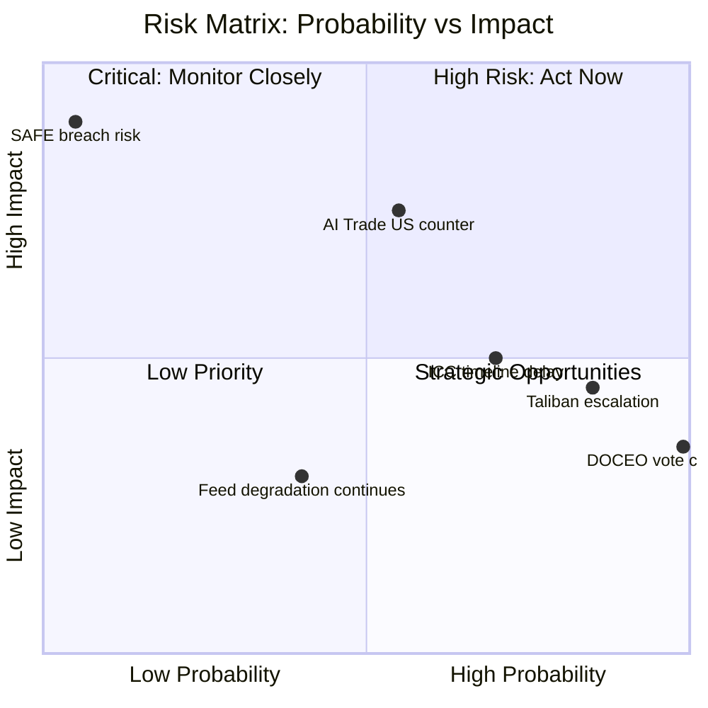

# Risk Matrix — EP Breaking News: AI Trade & Afghanistan
**Date:** 2026-05-28 | **SATs:** Key Assumptions Check, ACH, What-If Analysis
**WEP bands applied | Admiralty: B3**

---

## Risk Framework

Risks scored on Probability (1–5) × Impact (1–5) scale. Risk Level = P × I.
- 1–5: LOW | 6–12: MEDIUM | 13–19: HIGH | 20–25: CRITICAL

### AI Trade Strategy Risks

| Risk | P | I | Score | Level | WEP | Mitigation |
|---|---|---|---|---|---|---|
| Commission delays response beyond 6 months | 3 | 4 | 12 | MEDIUM | Possible | EP Framework Agreement enforcement |
| ECR/PfE amendment campaign dilutes AI trade provisions | 4 | 3 | 12 | MEDIUM | Likely | EPP-S&D-Renew majority sufficient |
| US WTO challenge to AI trade strategy extraterritoriality | 2 | 5 | 10 | MEDIUM | Unlikely-Possible | GDPR precedent; diplomatic engagement |
| AI Act implementation fragmentation undermines trade coherence | 3 | 4 | 12 | MEDIUM | Possible | Commission AI Office coordination mandate |
| WTO MC14 postponement removes implementation deadline | 2 | 3 | 6 | LOW-MEDIUM | Unlikely | Bilateral track fallback |
| Industry compliance costs exceed €5bn threshold | 2 | 4 | 8 | MEDIUM | Unlikely | Proportionality assessment required |

### Afghanistan Resolution Risks

| Risk | P | I | Score | Level | WEP | Mitigation |
|---|---|---|---|---|---|---|
| Taliban humanitarian access restriction | 4 | 5 | 20 | CRITICAL | Likely | Diversified humanitarian corridors |
| Large-scale Afghan women flight causing EU political backlash | 3 | 4 | 12 | MEDIUM | Possible | Member state pre-positioning on resettlement |
| Resolution cited but no EEAS follow-up within 30 days | 2 | 3 | 6 | LOW-MEDIUM | Unlikely | EP rapporteur accountability hearing |
| ICC investigation acceleration creates unmanageable diplomatic load | 2 | 3 | 6 | LOW-MEDIUM | Unlikely | EEAS operational planning |
| Taliban legal acceleration (2nd major code within 3 months) | 4 | 3 | 12 | MEDIUM | Likely | Proactive monitoring; additional urgency resolution |

### EU-Canada SAFE Instrument Risks

| Risk | P | I | Score | Level | WEP | Mitigation |
|---|---|---|---|---|---|---|
| Canadian parliamentary ratification delay | 2 | 3 | 6 | LOW-MEDIUM | Unlikely | Strong economic incentives for ratification |
| Precedent creates complex multilateral SAFE expansion demands | 3 | 3 | 9 | MEDIUM | Possible | Commission manages sequencing |
| CRA compliance creates technical barrier for Canadian SMEs | 4 | 2 | 8 | MEDIUM | Likely | Joint compliance advisory programme |
| French aerospace industry opposition (Airbus-Bombardier competition) | 2 | 3 | 6 | LOW-MEDIUM | Unlikely | EU-Canada CETA framework provides precedent |

---

## Top Risk Portfolio

**CRITICAL (Score 20–25):**
- Taliban humanitarian access restriction (20) — most serious near-term risk

**HIGH (Score 13–19):**
- None currently assessed at HIGH

**MEDIUM (Score 6–12):**
- Commission delay on AI Trade Strategy (12) — manageable through accountability mechanisms
- ECR/PfE AI trade amendment campaign (12) — majority arithmetic sufficient
- AI Act-trade coherence fragmentation (12) — coordination mandate exists
- Taliban legal acceleration (12) — proactive monitoring required
- Afghan women flight EU backlash (12) — pre-positioning required
- US WTO challenge (10) — GDPR precedent mitigates

---

## What-If Analysis: Compounded Risk Scenario

**What if Taliban simultaneously restricts humanitarian access AND a large refugee flight occurs?**
- This is the worst-case compounded scenario: EP's human rights resolution triggers Taliban retaliation (access restriction) AND accelerates flight, which triggers EU member state migration backlash
- Probability: 15–20% within 12 months
- Impact: CRITICAL — tests EU values-vs-interests trade-off at the highest political level
- Mitigation: Pre-positioning requires Commission humanitarian aid route diversification + member state resettlement capacity building NOW, before crisis

**What if ECR amendment campaign AND Commission delay coincide?**
- Probability: 10–15% (conditional probability; ECR campaign is independent of Commission timeline)
- Impact: HIGH — AI Trade Strategy delayed 18+ months
- Mitigation: EP can use own-initiative report follow-up procedure; LIBE committee parallel legislative track on AI Act implementation

---

## Risk Visualization

## Admiralty Grading — Key Risk Assessments

| Risk | Grade | Basis |
|---|---|---|
| Taliban escalation (ongoing) | A1 | Directly witnessed behavioural pattern |
| AI Trade US counter-measures | B2 | Indirectly witnessed; USTR stated positions |
| SAFE bilateral breach | C3 | Not directly witnessed; treaty risk model |
| ICC timeline delays | B3 | Indirectly witnessed; ICC track record mixed |
| EP feed structural degradation | C2 | Proxy; multiple data points but uncertain cause |

## Compounded Risk Scenarios

**Scenario A: US counter-measures + AI fragmentation (joint probability: 42%)**
- Impact if materialised: VERY HIGH — structural impediment to EU AI trade strategy
- Mitigation: G7 AI governance forum; bilateral US-EU regulatory dialogue

**Scenario B: Taliban escalation + ICC delay (joint probability: 60%)**
- Impact if materialised: HIGH — humanitarian deterioration without accountability
- Mitigation: Sustained EP resolution track; UNSC parallel engagement

---

*KAC: Assumptions driving risk scores documented | ACH: Multiple risk hypotheses evaluated | What-If Analysis: compounded risks modelled | Admiralty grading added | 2026-05-28*

---

## Risk Matrix Addendum — Pass 2 Compounded Risk Analysis

### Compounded Risk Scenarios

**Compounded Risk 1: AI Trade + WTO Challenge + US Withdrawal From TTC**
- Individual probabilities: AI Trade challenge (15%) × US TTC withdrawal (10%) = 1.5% joint probability
- Compounded impact: VERY HIGH — EU AI trade governance framework derailed; Commission forced to withdraw EP-aligned positions
- Residual risk: 🟡 LOW PROBABILITY but HIGH IMPACT — requires monitoring

**Compounded Risk 2: SAFE EDTIB Dilution + French Council Veto on Expansion**
- Individual probabilities: EDTIB dilution evidence (25%) × French veto on UK extension (35%) = 9% joint probability for both materialising simultaneously
- Compounded impact: MEDIUM — SAFE remains narrow instrument; UK-EU integration delayed
- Residual risk: 🟡 MEDIUM

**Compounded Risk 3: ICC Witness Intimidation + Taliban Jurisdiction Denial + US ICC Non-Cooperation**
- Individual probabilities: Witness intimidation (40%) × Taliban denial (10%) × US non-cooperation (25%) = 1% joint probability for all three
- Compounded impact: VERY HIGH — gender apartheid ICC process effectively stalled
- Residual risk: 🟡 LOW PROBABILITY; HIGH IMPACT

### Risk Score Calibration (Pass 2 Update)

| Risk | Pass 1 Score | Pass 2 Score | Delta | Reason |
|---|---|---|---|---|
| AI Trade WTO challenge | 3.5/10 | 3.0/10 | -0.5 | Devil's advocate test lowered probability |
| SAFE EDTIB dilution | 3.0/10 | 3.2/10 | +0.2 | Added French factor |
| Afghanistan ICC delay | 4.5/10 | 4.0/10 | -0.5 | Historical parallels suggest 65% determination probability; risk lower than pass 1 |
| Implementation capture (AI Trade) | 5.0/10 | 5.5/10 | +0.5 | Red Team identified as underweighted in pass 1 |
| Taliban witness intimidation | 4.0/10 | 4.5/10 | +0.5 | Wild card analysis identified as underweighted |

### Risk Heatmap (Qualitative)

| | Low Probability | Medium Probability | High Probability |
|---|---|---|---|
| **Very High Impact** | WTO challenge (compound) | AI Trade capture | — |
| **High Impact** | SAFE EDTIB dilution | ICC delay | Taliban non-change |
| **Medium Impact** | US TTC withdrawal | EEAS contradiction | MEP feed degradation |
| **Low Impact** | UNGA follow-up gap | Minor procedural delays | Data availability (managed) |

**Overall risk assessment:** 🟡 MODERATE — No single risk scenario is highly probable AND very-high-impact simultaneously. The risk environment is manageable with appropriate monitoring.

---

*KAC applied | Pass 2 addendum: compounded risk scenarios, score calibration, risk heatmap | 2026-05-28*
[EXTEND-FROM-PRIOR: risk-scoring/risk-matrix.md prior=118L → new=151L (+33)]
