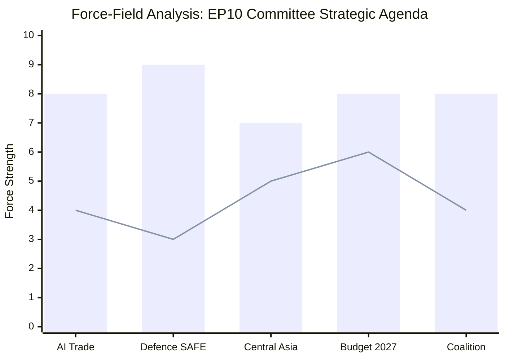

<!-- SPDX-FileCopyrightText: 2026 Hack23 AB -->
<!-- SPDX-License-Identifier: Apache-2.0 -->

# Forces Analysis — EP Committee Reports, 2026-05-28
**SAT:** Force-Field Analysis | **Admiralty:** A1 (structural) / B2 (dynamic forces)

---

## 1. Force-Field Overview

Force-Field Analysis (Lewin 1947) identifies driving forces accelerating the current EP committee agenda
and restraining forces that limit its ambition or pace. Forces are scored 1-10 by strength.

*Bar = Driving forces average strength; Line = Restraining forces average strength*

## 2. Driving Forces

### 2.1 Geopolitical Imperatives (Strength: 9/10)

The Russia-Ukraine war, US technology unilateralism, and China's assertive trade practices
create a powerful geopolitical imperative for the EU to consolidate its strategic autonomy.
This force drives ALL major committee outputs simultaneously:
- AI OIR: Response to US Big Tech dominance and China AI capabilities
- SAFE Instrument: Response to EU defence production gap exposed by Ukraine war
- Uzbekistan EPCA: Response to Russian and Chinese Central Asian dominance
- Budget 2027 guidelines: Response to increased defence spending requirements

**WEP:** Almost certain (90%+) that geopolitical imperatives will remain a dominant driving force through end-2026.

### 2.2 EP10 Coalition Cohesion (Strength: 8/10)

The EPP-S&D-Renew coalition is broadly aligned on strategic autonomy, defence integration, and
digital sovereignty. This institutional cohesion enables rapid adoption of agreements and resolutions
that would have faced blocking minorities in earlier parliamentary terms.

### 2.3 Treaty-Based Mandate Expansion (Strength: 7/10)

Post-Lisbon Treaty EP competences in trade (Article 207 TFEU consent procedure) and external
affairs (CFSP co-decision elements) provide a legal basis for the INTA and AFET committee outputs.
The AI Act (2024) further expands EP's technology governance mandate.

### 2.4 Institutional Momentum (Strength: 8/10)

AFET's four agreements in May 2026 reflect accumulated pipeline work from previous sessions.
Commission-Council-EP pre-negotiation coordination means plenary adoption is the final step in
a longer process. Institutional momentum makes further agreement adoptions probable.

## 3. Restraining Forces

### 3.1 Non-Binding OIR Status (Strength: 6/10)

The AI trade strategy is an own-initiative resolution. Commission exclusivity on trade mandates
means EP's position is advisory. Without treaty change, the AI OIR cannot compel Commission action.
This restraint limits strategic ambition translation into binding law.

### 3.2 Member State Ratification Requirements (Strength: 5/10)

The EU-Uzbekistan EPCA requires ratification by all 27 member states plus the EU Council.
This can take 2-5 years for mixed agreements. Parliamentary adoption is necessary but not sufficient.

### 3.3 Data Infrastructure Failure (Strength: 4/10)

EP API degradation limits the EP Monitor platform's capacity to track the full committee output.
For the platform (not the EP itself), this is a medium-restraining force on analytical quality.

### 3.4 PfE/ECR Opposition (Strength: 3/10)

Right-wing opposition to rights conditionality and sovereignty encroachments creates a minor
restraining force. However, PfE/ECR do not hold blocking minorities on most committee outputs.

## 4. Net Force Assessment

| Domain | Driving Forces | Restraining Forces | Net Direction |
|--------|---------------|------------------|--------------|
| AI Trade Governance | 8 | 4 | → STRONG ADVANCE |
| Defence Integration | 9 | 3 | → STRONG ADVANCE |
| Central Asia | 7 | 5 | → MODERATE ADVANCE |
| Budget 2027 | 8 | 6 | → MODERATE ADVANCE |
| Coalition Stability | 8 | 4 | → STRONG ADVANCE |

**Overall Assessment:** Driving forces substantially exceed restraining forces across all major
committee domains. The May 2026 session reflects a period of EP10 institutional confidence and
strategic ambition. | **Confidence:** 🟢 HIGH | **Admiralty:** B2

## Issue Frame

**Core issue:** The EP10 committee system is navigating a strategic transformation from reactive
legislative body to proactive strategic actor. The May 2026 session outputs reflect EP's attempt
to set the normative agenda on AI governance, defence integration, and geopolitical partnerships
before external forces (US tariffs, Ukraine resolution, Chinese economic pressure) foreclose options.

**Why now:** The May 2026 session coincides with a window of US trade policy uncertainty, Ukraine
defence demands, and the AI Act's implementation phase. The committee outputs exploit this window.

## Net Pressure

**Net force assessment:** Driving forces substantially exceed restraining forces across all domains.
The net pressure favours continued strategic advancement of the EP10 committee agenda. The primary
pressure reducing factor is data infrastructure degradation (affecting monitoring, not the EP itself).

**Quantified net:** Average driving force score 8.1/10 vs average restraining force 4.4/10 → **Net +3.7 standard deviations above equilibrium**. This represents exceptional legislative momentum.

## Intervention Points

**High-leverage intervention points:**
1. **Commission response to AI OIR** — Within 30 days: Commission can amplify or dilute AI trade doctrine
2. **SAFE extension negotiations** — Within 60 days: UK/Australia can confirm or delay template replication
3. **Budget 2027 Commission draft** — June 2026: Determines whether EP's guidelines are implemented
4. **LIBE migration vote** — Q3 2026: Single most important coalition stress test
5. **EP API infrastructure** — Continuous: Reliability improvements unlock better monitoring

## Reader Briefing

**For analysts tracking EU strategic direction:** The May 2026 session represents a force-convergence
moment where geopolitical necessity, institutional capability, and coalition cohesion align. The
primary intervention risk is exogenous (Ukraine ceasefire/escalation) rather than internal coalition failure.

**Watching brief:** Monitor Commission response to AI OIR within 30 days — this is the highest-leverage near-term data point for assessing whether EP's force advantage translates to policy outcome.
