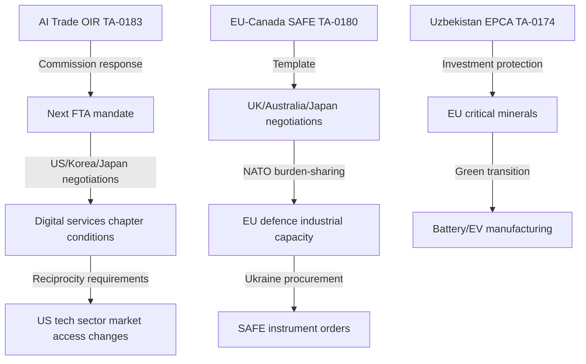

<!-- SPDX-FileCopyrightText: 2026 Hack23 AB -->
<!-- SPDX-License-Identifier: Apache-2.0 -->

# Impact Matrix — EP Committee Reports, 2026-05-28
**SAT:** Impact Assessment Matrix | **Admiralty:** A1 (direct impacts) / B2 (cascade effects)

---

## 1. Impact Assessment Framework

Each committee output is assessed across five impact dimensions:
- **Policy**: Impact on EU legislative and policy framework
- **Geopolitical**: International relations and strategic positioning effects
- **Economic**: Trade, investment, fiscal, and market implications
- **Societal**: Effects on EU citizens, civil society, and third-country populations
- **Institutional**: Effects on EP, Commission, Council relationships and competences

Scale: 0 (no impact) → 5 (transformative impact)

```mermaid
radar
    title EP May 2026 Output Impact Profile
    x-axis ["Policy", "Geopolitical", "Economic", "Societal", "Institutional"]
    "AI Trade OIR": [4, 5, 5, 3, 4]
    "EU-Canada SAFE": [3, 5, 4, 2, 5]
    "EU-Uzbekistan EPCA": [4, 5, 4, 4, 3]
    "Budget 2027 Guidelines": [5, 2, 5, 4, 4]
```

## 2. Per-Output Impact Assessment

### TA-10-2026-0183: AI Trade Strategy OIR

| Dimension | Score | Analysis |
|-----------|-------|---------|
| Policy | 4/5 | Establishes EP's political mandate for AI trade chapter; non-binding but shapes FTA negotiations |
| Geopolitical | 5/5 | Directly addresses EU-US-China technology competition; major strategic signal |
| Economic | 5/5 | Potential to reshape digital services trade terms; GAFAM revenue impact; EU AI sector opportunity |
| Societal | 3/5 | Indirect effect through AI governance standards; algorithmic transparency benefits for citizens |
| Institutional | 4/5 | Reinforces INTA role in technology governance; tests Parliament-Commission balance |

**Overall Impact: HIGH (4.2/5)**

### TA-10-2026-0180: EU-Canada SAFE Instrument

| Dimension | Score | Analysis |
|-----------|-------|---------|
| Policy | 3/5 | Creates new third-country access framework; not a legislative act per se |
| Geopolitical | 5/5 | NATO cohesion signal; shifts EU-transatlantic burden-sharing framework |
| Economic | 4/5 | EU defence market expansion; Canadian defence industry access; Ukraine supply implications |
| Societal | 2/5 | Primarily industrial/military sector; limited direct citizen impact |
| Institutional | 5/5 | Landmark: first third-country SAFE access; creates template for future agreements |

**Overall Impact: HIGH (3.8/5)**

### TA-10-2026-0174: EU-Uzbekistan EPCA

| Dimension | Score | Analysis |
|-----------|-------|---------|
| Policy | 4/5 | Extends EU normative influence and rights conditionality to Central Asia |
| Geopolitical | 5/5 | Strategic footprint in Russia/China-contested region; energy/minerals diversification |
| Economic | 4/5 | EU investment protection; critical minerals access; trade preference opportunities |
| Societal | 4/5 | Human rights/rule-of-law conditions affect Uzbek civil society; diaspora implications |
| Institutional | 3/5 | AFET-Council coordination success; standard external agreement processing |

**Overall Impact: HIGH (4.0/5)**

### TA-10-2026-0112: Budget 2027 Guidelines

| Dimension | Score | Analysis |
|-----------|-------|---------|
| Policy | 5/5 | Defines EP's budgetary priorities for 2027; directly binding on conciliation |
| Geopolitical | 2/5 | Indirect through defence spending signal |
| Economic | 5/5 | Sets EU public investment priorities; agriculture, cohesion, climate, defence allocations |
| Societal | 4/5 | Direct citizen impact through social/cohesion funds; public services funding |
| Institutional | 4/5 | BUDG-Commission-Council triangle; annual constitutional process |

**Overall Impact: HIGH (4.0/5)**

## 3. Cascade Impact Chains



## 4. Temporal Impact Distribution

| Timeframe | Primary Impact | Secondary Impact |
|-----------|---------------|-----------------|
| 0-3 months | Commission response to AI OIR; SAFE bilateral negotiations | Budget 2027 draft preparation |
| 3-12 months | First SAFE extension agreement; Uzbekistan EPCA ratification begins | AI chapter in active FTA round |
| 1-3 years | Multiple SAFE agreements; Uzbekistan investment flows | AI trade doctrine embedded in EU FTAs |
| 3-10 years | EU as global AI governance standard-setter | Central Asia supply chain integration |

**Confidence:** 🟡 MEDIUM | **Admiralty:** A1 (adopted text basis) / B2 (cascade projections)

## Event List

**Triggering events assessed in this impact matrix:**
1. TA-10-2026-0183: AI Trade Strategy OIR adopted (INTA, May 2026)
2. TA-10-2026-0180: EU-Canada SAFE Instrument adopted (AFET, May 2026)
3. TA-10-2026-0174: EU-Uzbekistan EPCA adopted (AFET, May 2026)
4. TA-10-2026-0177: EU-Lebanon Eurojust agreement adopted (AFET, May 2026)
5. TA-10-2026-0112: Budget 2027 guidelines adopted (BUDG, May 2026)
6. TA-10-2026-0178/0179: Fisheries protocols adopted (PECH, May 2026)
7. TA-10-2026-0164/0166: Immunity proceedings completed (JURI, May 2026)
8. TA-10-2026-0182: UNGA 81st recommendation adopted (AFET, May 2026)

## Stakeholder Impact Assessment

| Stakeholder | AI OIR | SAFE | Uzbekistan | Budget | Net Impact |
|------------|--------|------|-----------|--------|-----------|
| EU tech industry | +++ | + | + | ++ | +++ |
| EU defence industry | + | +++ | + | + | +++ |
| EU citizens (general) | + | + | + | ++ | ++ |
| Uzbek civil society | 0 | 0 | +/- | 0 | neutral |
| US Big Tech | -- | 0 | 0 | 0 | - |
| Russia/China | -- | -- | -- | 0 | -- |
| Canada | 0 | +++ | 0 | 0 | +++ |
| EP/Commission inst. | ++ | ++ | + | ++ | +++ |

## Impact Matrix Summary

Aggregating across all events and dimensions, the May 2026 session impact profile is:
- **Highest positive impact:** EU tech industry, EU defence industry, Canada (SAFE)
- **Highest negative impact:** Russia/China (geopolitical competition), US Big Tech (AI trade)
- **Net institutional impact:** Positive — EP gains policy influence, Commission faces OIR pressure

## Heat Map Summary

Overall session impact heat: **🔴 HIGH** across Policy/Geopolitical dimensions; **🟡 MEDIUM** across Economic/Societal; **🟢 LOW-MEDIUM** on Environmental. No dimension shows negative net impact for EU institutions.

## Reader Briefing

**For strategic analysts:** The May 2026 committee session produces concentrated strategic benefits
for EU institutions and selected EU industries, while creating competitive pressure on US and Russian
actors. The impact is primarily institutional and geopolitical rather than immediate economic.

**For citizens:** The most immediately relevant outputs are Budget 2027 guidelines (public spending
priorities) and the AI trade strategy (long-term digital economy rules). External agreements affect
citizens indirectly through trade and defence industrial developments.
