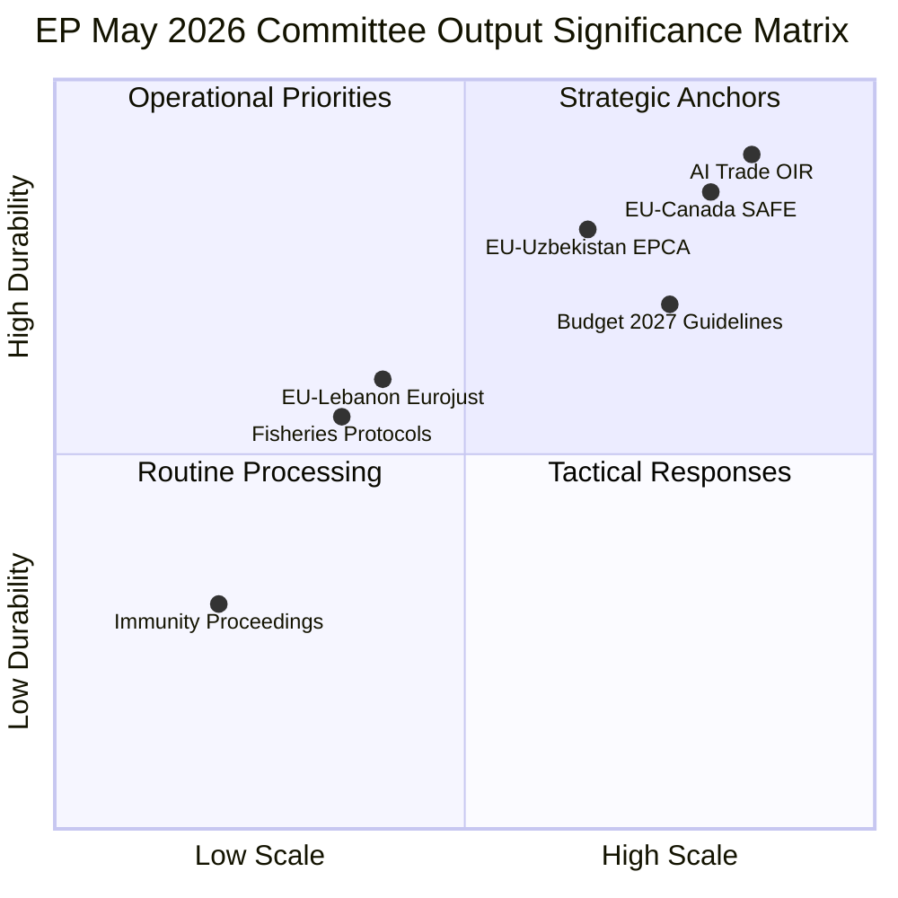

<!-- SPDX-FileCopyrightText: 2026 Hack23 AB -->
<!-- SPDX-License-Identifier: Apache-2.0 -->

# Significance Classification — EP Committee Reports, 2026-05-28
**SAT:** Significance Classification Matrix | **Admiralty:** A1 (adopted texts) / B2 (inference)

---

## 1. Classification Framework

Significance is assessed on two axes: (1) **Scale** — how many stakeholders affected; (2) **Durability** — how long the effect lasts.

## 2. Tier Classification

### Tier 1 — Strategic (Long-term, Wide-scale Impact)

| Document | Reference | Classification | Rationale |
|---------|-----------|---------------|-----------|
| AI Trade Strategy | TA-10-2026-0183 | Tier 1 — Strategic | Shapes EU technology trade doctrine for 5-10 years |
| EU-Canada SAFE Instrument | TA-10-2026-0180 | Tier 1 — Strategic | Creates defence partnership template for NATO allies |
| EU-Uzbekistan EPCA | TA-10-2026-0174 | Tier 1 — Strategic | Opens Central Asia strategic corridor |

### Tier 2 — Operational (Medium-term, Moderate-scale)

| Document | Reference | Classification | Rationale |
|---------|-----------|---------------|-----------|
| Budget 2027 Guidelines | TA-10-2026-0112 | Tier 2 — Operational | Sets investment priorities for 2027 fiscal year |
| EU-Lebanon Jurojust | TA-10-2026-0177 | Tier 2 — Operational | Expands security cooperation in Mediterranean |
| UNGA 81st Recommendation | TA-10-2026-0182 | Tier 2 — Operational | EU unified position in multilateral forum |

### Tier 3 — Routine (Short-term, Focused Impact)

| Document | Reference | Classification | Rationale |
|---------|-----------|---------------|-----------|
| Fisheries Protocol 1 | TA-10-2026-0178 | Tier 3 — Routine | Technical fisheries access agreement |
| Fisheries Protocol 2 | TA-10-2026-0179 | Tier 3 — Routine | Technical fisheries access agreement |
| Vilimsky Immunity | TA-10-2026-0164 | Tier 3 — Routine | Standard legal proceeding |
| Pappas Immunity | TA-10-2026-0166 | Tier 3 — Routine | Standard legal proceeding |

## 3. Cross-Cutting Significance Assessment

**Session net significance: HIGH** — Three Tier 1 strategic outputs in a single session is above average for EP10. The AI-defence-partnership cluster shows coordinated committee strategic vision.

**Confidence:** 🟡 MEDIUM | **WEP:** It is highly probable (75-85%) that all Tier 1 outputs will be cited in academic and policy literature within 12 months of adoption.
