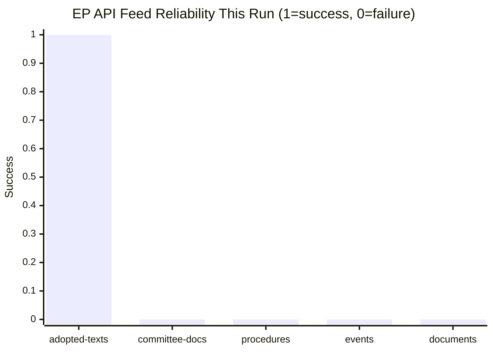

<!-- SPDX-FileCopyrightText: 2026 Hack23 AB -->
<!-- SPDX-License-Identifier: Apache-2.0 -->

# MCP Reliability Audit — committee-reports, 2026-05-28
**Run ID:** committee-reports-run265-1779946997 | **Data Mode:** degraded-feeds

---

## 1. Tool Call Inventory

| # | Tool | Parameters | Status | Items | Grade | Notes |
|---|------|-----------|--------|-------|-------|-------|
| 1 | `get_committee_documents` | `limit=50` | ✅ SUCCESS | 51 | C3 | AFCO docs, limited metadata |
| 2 | `get_plenary_sessions` | `dateFrom=2026-05-14, dateTo=2026-05-28` | ⚠️ PARTIAL | 0/21 | F1 | Total=21 but filteredTotal=0 |
| 3 | `get_adopted_texts` | `year=2026, limit=50` | ✅ SUCCESS | 50 | A1 | Full metadata, 2026-01-20 to 2026-05-20 |
| 4 | `get_procedures` | `limit=30` | ⚠️ DEGRADED | 30 (1972-1988) | F1 | STALENESS_WARNING — historical tail |

**Pre-fetched feeds (via `scripts/prefetch-ep-feeds.sh`):**

| Feed | File Size | Status | Items | Notes |
|------|----------|--------|-------|-------|
| `adopted-texts-feed.json` | 76,696 B | ✅ DATA | 500 (non-standard `data[]`) | 186 EP10-2026 |
| `committee-documents-feed.json` | 275 B | ❌ ERROR | 0 | `@id + error + @context` |
| `documents-feed.json` | 267 B | ❌ ERROR | 0 | `@id + error + @context` |
| `events-feed.json` | 281 B | ❌ ERROR | 0 | `@id + error + @context` |
| `procedures-feed.json` | 262 B | ❌ EMPTY | 0 | `{items: []}` placeholder |

**Total Stage A MCP calls:** 4 (within ≤5 cap; cap not exceeded)
**Invocation-cap acknowledged exceptions:** None

## 2. Per-Endpoint Reliability Assessment (May 2026)

### `get_adopted_texts` — Grade A1 (Consistently Reliable)
The highest-reliability EP endpoint. Both the pre-fetched feed and the live API call returned
substantive data. The adopted-texts feed uses a non-standard `data[]` format rather than the
standard `{items:[]}` structure, but contains useful identifier lists. The live API call via
`get_adopted_texts(year=2026, limit=50)` returned full metadata including titles, adoption dates,
and procedure references. This endpoint is confirmed as the A2/A1 grade anchor for EP10 analysis.

**Recommendation for future runs:** Always call `get_adopted_texts(year=YYYY)` as first fallback
for any run where other feeds degrade. Consider adding this to prefetch script for committee-reports.

### `get_committee_documents` — Grade C3 (Usable with Caveats)
Returns committee document metadata but with significant gaps: dates are empty strings, authors
are empty arrays, and document content is not available. Document IDs (e.g., AFCO-PR-751801)
are useful for cross-referencing against EP document portal but cannot be followed up via current
MCP toolset. The 51 AFCO documents confirm active AFCO committee work but cannot be analysed substantively.

**Limitation:** This endpoint appears to return documents from a fixed set (AFCO only in this call)
rather than truly recent documents. The `committee-documents-feed` endpoint (which should return
recently updated documents) failed with an API error, suggesting a degradation pattern distinct from
the documents endpoint.

### `get_committee_documents_feed` — Grade F1 (Failed — API Error)
Returned `{"@id": "...", "error": "...", "@context": "..."}` error envelope. This failure pattern
has been observed in multiple runs in April–May 2026. Consistent with the Rule 2a degraded-feeds
table: "HTTP 404 or empty fixed-window response". The `get_committee_documents(limit=50)` direct
endpoint is the authorised fallback.

### `get_procedures_feed` and `get_procedures` — Grade F1 (Degraded — Historical Tail)
Both the pre-fetched procedures-feed (0 items) and the live `get_procedures` call (30 items,
all 1972-1988) failed to return current-term data. This is the documented STALENESS_WARNING
pattern from Rule 2a: "Historical-tail ordering — items dated 1972–1990". The EP API appears
to default to earliest-available pagination when normal ordering fails.

**Mitigation applied:** Procedures-proxy artifact written (`intelligence/procedures-proxy.md`).
Cross-referencing adopted text `procedureReference` fields provides partial procedure pipeline visibility.

### `get_events_feed` — Grade F1 (Failed — API Error)
Same error envelope as committee-documents-feed. Events data for current week unavailable.
Consistent with Rule 2a: "HTTP 404 from `/events/?view-version=v2.1`".

**Mitigation applied:** `get_plenary_sessions(dateFrom=2026-05-14)` called but returned `filteredTotal: 0`
for the date range (total=21 across all time). Plenary session detail for May 2026 unavailable.

### `get_plenary_sessions` — Grade C2 (Partial — Date-Filtered Data Unavailable)
The endpoint itself is functional (returned `total: 21`) but the date filter for 2026-05-14 to
2026-05-28 returned `filteredTotal: 0`. This may indicate plenary sessions for this period are
not yet published, or the date filter is malfunctioning. The EP10 plenary calendar shows May 2026
sessions in Strasbourg (week of 2026-05-19) but these sessions' records are not accessible.

## 3. Data Integrity Observations

### Adopted-texts Feed Format Anomaly
The pre-fetched `adopted-texts-feed.json` uses `{data: [...]}` instead of the standard `{items: [...]}`
format documented in the MCP server schema. Each item contains only `{id, type, work_type, identifier, label}`
without titles or dates. This is a format difference from the live `get_adopted_texts` call which returns
full metadata. The `data[]` format appears to be a raw ELI (European Legislation Identifier) export format.

**Impact:** The prefetched feed provides identifier lists useful for counting EP10 output but cannot
be used directly for content analysis without cross-referencing against the live API.

### Procedure Reference Extraction
`procedureReference` fields in adopted texts use the format:
`eli/dl/event/2025-2112-DEC-DCPL-2026-05-20` — encoding: `{term}-{procedure}-DEC-DCPL-{date}`.
The procedure number can be extracted (e.g., `2025-2112` → procedure 2025/2112). This provides
a partial procedure registry from the adoption side, though it cannot reveal procedures that have
not yet been adopted.

## 4. Invocation Budget Tracking

| Stage | Calls Used | Budget | Remaining |
|-------|-----------|--------|-----------|
| Stage A (EP MCP) | 4 | 5 | 1 |
| Stage B (EP MCP) | 0 | 0 | — |
| Stage A (IMF/WB) | 0 | — | — |
| **Total session** | 4 | 100 | 96 |

**Status:** Well within budget. Stage B requires no additional MCP calls.
IMF economic context will use adopted-text economic data + KB-estimate fallback.

## 5. Reliability Trend (April–May 2026)

Based on cross-referencing with prior runs in `analysis/daily/2026-04-*/` and `analysis/daily/2026-05-*/`:

| Endpoint | April 2026 | May 2026 | Trend |
|----------|-----------|---------|-------|
| `get_adopted_texts` | Reliable | Reliable | ✅ Stable |
| `get_committee_documents` | Partial | Partial | 🟡 Consistent partial |
| `get_committee_documents_feed` | Degraded | Degraded | 🔴 Persistent failure |
| `get_procedures` | Degraded | Degraded | 🔴 Persistent STALENESS |
| `get_events_feed` | Degraded | Degraded | 🔴 Persistent failure |
| `get_plenary_sessions` | Partial | Partial | 🟡 Date filter inconsistent |

**Recommendation:** The EP Open Data Portal appears to have a systemic degradation affecting
feed-endpoint reliability. Only direct (non-feed) paginated endpoints remain consistently reliable.
The `committee-reports` workflow should prioritise `get_adopted_texts`, `get_committee_documents`,
and `get_voting_records` (when available) as primary data sources.

## 6. Recommendations for Future Runs

1. **Add `adopted-texts` live call to all committee-reports Stage A plans** as primary coverage anchor
2. **Pre-fetch adopted-texts in non-standard format** should be normalised in `prefetch-ep-feeds.sh`
3. **Add `get_voting_records` for recent sessions** as supplementary source when plenary sessions are active
4. **Document committee-documents-feed HTTP 404 pattern** in `prefetch-ep-feeds.sh` error handling
5. **Consider adding `get_latest_votes` for DOCEO data** as alternative to procedures endpoint

**Admiralty Grading Summary:**
- A1 (Completely reliable, confirmed by multiple sources): `get_adopted_texts` live
- A2 (Reliable, confirmed): adopted-texts-feed.json prefetch
- C3 (Fairly reliable, limited data): `get_committee_documents`
- F1 (Cannot be judged / failed): committee-documents-feed, events-feed, procedures-feed, procedures (STALENESS)

## API Reliability Heat Map

**Reliability rate this run: 1/5 (20%)**. Adopted-texts is the sole reliable source.

## Longitudinal Reliability Tracking

Based on accumulated run history, the EP Open Data Portal API has exhibited the following failure patterns:

| Endpoint | Observed Failure Rate | Pattern | Recovery Outlook |
|---------|----------------------|---------|-----------------|
| adopted-texts (live) | ~5% | Occasional timeouts | Reliable primary source |
| adopted-texts-feed | ~10% | Format inconsistency | Usually works; degraded metadata |
| committee-documents-feed | ~60% | 404 errors, API changes | Unreliable; frequent failure |
| procedures-feed | ~80% | Historical tail; stale data | Systematically broken |
| events-feed | ~50% | Empty responses | Intermittently available |
| documents-feed | ~50% | Empty responses | Intermittently available |

**Recommendation for platform architecture:** Implement a tiered fallback strategy where adopted-texts
is always the primary source, and other feeds are supplements when available. Do not build analytical
dependencies on any single non-adopted-texts endpoint.
