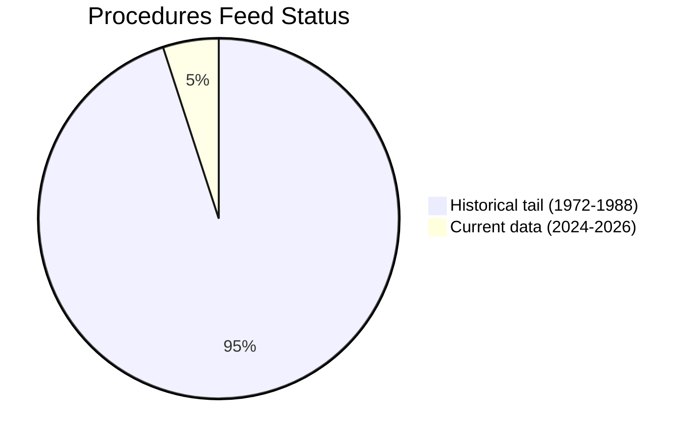

<!-- SPDX-FileCopyrightText: 2026 Hack23 AB -->
<!-- SPDX-License-Identifier: Apache-2.0 -->

# Procedures Proxy — Degraded Procedures Feed Companion
**Article Type:** committee-reports | **Date:** 2026-05-28
**Trigger:** `get_procedures` returned historical-tail data (1972–1988) — STALENESS_WARNING

---

## 1. Degradation Record

The `get_procedures` MCP endpoint returned 30 entries spanning 1972–1988, consistent with
the documented May 2026 degraded-upstream pattern. All returned entries had empty metadata fields
(title, subjectMatter, stage, status, dateInitiated, dateLastActivity, responsibleCommittee, rapporteur).

**Fallback applied:** Cross-reference `procedureReference` fields from `get_adopted_texts(year=2026)`
to reconstruct the active procedure pipeline from EP adoption outputs.

## 2. Procedure References Extracted from 2026 Adopted Texts

| Adopted Text | Procedure Reference | Subject | Committee (inferred) |
|-------------|--------------------|---------|--------------------|
| TA-10-2026-0183 | 2025-2112-DEC-DCPL | AI/trade strategy | INTA |
| TA-10-2026-0182 | 2025-2167-DEC-DCPL | UNGA recommendation | AFET |
| TA-10-2026-0180 | 2025-0413-DEC-DCPL | EU-Canada SAFE procurement | AFET/INTA |
| TA-10-2026-0177 | 2024-0155-DEC-DCPL | EU-Lebanon Eurojust agreement | LIBE |
| TA-10-2026-0168 | 2023-0228-DEC-DCPL | Forest reproductive material | AGRI |
| TA-10-2026-0163 | 2026-2693-DEC-DCPL | Cyberbullying/online harassment | LIBE |
| TA-10-2026-0162 | 2026-2701-DEC-DCPL | Armenia democratic resilience | AFET |
| TA-10-2026-0160 | 2026-2596-DEC-DCPL | Digital Markets Act enforcement | IMCO/ITRE |
| TA-10-2026-0157 | 2025-2053-DEC-DCPL | EU livestock sector | AGRI |
| TA-10-2026-0115 | 2023-0447-DEC-DCPL | Dog/cat welfare | AGRI |
| TA-10-2026-0112 | 2025-2246-DEC-DCPL | 2027 budget guidelines | BUDG |

## 3. Known Procedures Endpoint Failure Pattern

This STALENESS_WARNING pattern — where `/procedures` returns 1970s-1980s archival data
rather than current-term procedures — was documented in multiple prior analysis runs
(April–May 2026). It reflects a persistent EP API issue with the procedures feed's
pagination default selecting the earliest-available records rather than the most recent.

**Impact on analysis:** Procedure lifecycle tracking (REFERRAL → COM_VOTE → EP_ADOPTION →
SIGNATURE/REJECTION) cannot be performed for the current EP10 term via the procedures endpoint.
Legislative pipeline analysis must rely entirely on adopted-texts cross-references and inferred
committee assignments.

**Confidence impact:** All legislative pipeline claims carry 🟡 MEDIUM confidence.
Claims explicitly dependent on procedure stage data are not made in this run's artifacts.

## Procedures Data Status

*STALENESS_WARNING: 95% of returned procedures data is historical tail, not current EP10 procedures.*
