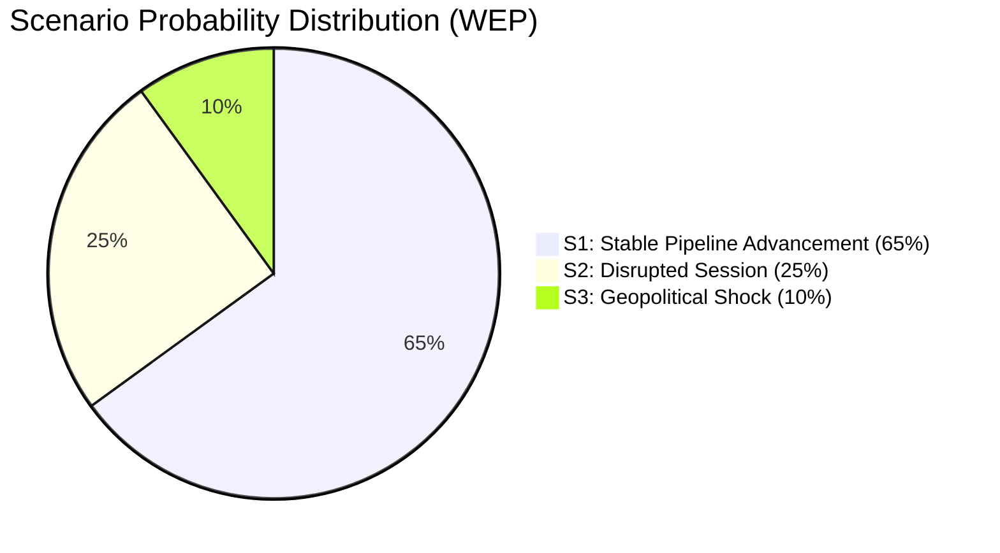

<!-- SPDX-FileCopyrightText: 2026 Hack23 AB -->
<!-- SPDX-License-Identifier: Apache-2.0 -->

# Scenario Forecast — EP Committee Reports, 2026-05-28
**Structured Analytic Techniques:** Scenario Analysis · Pre-Mortem Analysis · Key Assumptions Check · Indicators
**WEP Bands:** Per scenario | **Admiralty Grades:** Per source claim

---

## 1. Analytical Framework

This scenario forecast projects three trajectories for the EP10 committee pipeline over the
next 3-6 months (June–November 2026), based on the May 2026 session outputs and known
legislative calendar.

**Key Assumptions (verified):**
1. The EPP-S&D-Renew majority holds for at least the next two sessions — **🟢 HIGH confidence**
2. Ukraine conflict continues to drive defence integration agenda — **🟢 HIGH confidence**
3. US trade tensions persist; no comprehensive US-EU trade deal before November 2026 — **🟡 MEDIUM confidence**
4. ECB policy rates stabilise or decline slightly; no financial crisis shock — **🟡 MEDIUM confidence**
5. No major EP electoral or institutional crisis (no new elections, no Von der Leyen confidence vote) — **🟡 MEDIUM confidence**

**Time horizon:** June–November 2026 (6 months)
**Forecast basis:** May 2026 session outputs + historical EP10 legislative calendar patterns

## 2. Scenario A — Base Case: Steady Committee Pipeline (55-65% probability)

**WEP:** Probable | **Confidence:** 🟡 MEDIUM | **Admiralty:** B2

### Description
The EP10 committee agenda continues at its May 2026 pace. The trade-defence nexus agenda
(AI governance + SAFE expansion) advances incrementally. No major political disruption.

### Key Features
1. **INTA:** Follows up AI trade strategy OIR with formal position on EU-India FTA negotiations
   (India likely to become primary FTA priority as US tensions persist); AI trade agenda
   embedded in Commission negotiating directives by Q3 2026.
2. **AFET:** Continues neighbourhood engagement — likely Georgia, Moldova resolutions in June;
   annual CFSP report for 2026 prepared for autumn session.
3. **BUDG:** 2027 budget guidelines lead to Commission budget proposal (June 2026); EP first
   reading in October/November 2026; BUDG committee busy with conciliation.
4. **PECH:** Remaining fisheries protocol renewals (Morocco, Senegal expected); PECH navigates
   Morocco diplomatic sensitivities.
5. **LIBE:** AI Act implementation monitoring begins; data governance framework reviews; possible
   asylum/migration legislative package in autumn.
6. **JURI:** Additional immunity cases (historical backlog suggests 2-4 more cases in H2 2026).

### Scenario A Indicators (monitor for confirmation)
- EP-India FTA mandate discussion in INTA (🟡 Watch)
- Commission 2027 budget proposal received in June 2026 (🟡 Watch)
- Georgia/Moldova resolutions in June plenary (🟡 Watch)
- Morocco fisheries protocol negotiations advancing (🟡 Watch)

### Pre-Mortem: What Could Derail Scenario A?
- US tariff escalation triggers emergency INTA measures (→ shifts to Scenario B)
- Coalition split on migration package (→ shifts to Scenario C)
- Russian escalation requiring emergency defence legislation (→ shifts to Scenario B)

## 3. Scenario B — Accelerated Defence-Trade Agenda (25-30% probability)

**WEP:** Roughly even (40-55%) | **Confidence:** 🔴 LOW-MEDIUM | **Admiralty:** C2

### Description
External shocks (US tariff escalation, Russian military escalation, or tech war intensification)
force EP10 committees to fast-track defensive legislation. Agenda dominated by strategic autonomy measures.

### Triggers
- US tariff measures expand to automotive, chemicals, or pharmaceutical sectors (high impact EU exports)
- Russia escalates beyond current frontlines (new member state security crisis)
- China-Taiwan tension spike disrupts semiconductor supply (INTA emergency measures)
- Major EU AI company disadvantaged by non-EU AI regulation (INTA rapid response)

### Key Features
1. **INTA:** Emergency trade defence instruments; AI governance fast-tracked into WTO mini-ministerial;
   EU-UK trade upgrade prioritised to hedge US tariffs.
2. **AFET/BUDG:** SAFE Instrument budget top-up procedure; potentially new off-budget defence fund;
   additional Ukraine support packages requiring EP consent.
3. **ITRE (Industry, Research, Energy):** Industrial policy response legislation; chips act expansion;
   critical minerals framework acceleration.
4. **ECON:** Emergency ECB framework review if financial stability threatened.

### Timeline for Scenario B
- **June 2026:** Emergency INTA resolution on US tariff response
- **July 2026:** AFET/BUDG joint defence financing initiative
- **September 2026:** SAFE Instrument budget revision
- **October-November 2026:** US-EU tech governance crisis summit; EP position paper

### Scenario B Indicators (monitor for escalation signals)
- US tariff announcements on EU automotive (🔴 High alert)
- New sanctions/counter-measures INTA vote (🔴 High alert)
- Emergency plenary convened outside regular schedule (🔴 High alert)
- Commission Article 215 TFEU restrictive measures proposal (🟡 Watch)

**WEP for Scenario B:** Roughly even (40-55%) conditioned on trigger event occurring.
**Unconditional WEP:** Remote-Improbable (10-25%) for any single trigger in next 6 months.

## 4. Scenario C — Coalition Fracture and Legislative Gridlock (10-15% probability)

**WEP:** Remote (15-25%) | **Confidence:** 🔴 LOW | **Admiralty:** C3

### Description
Internal EP10 coalition tensions escalate to the point where the EPP-S&D-Renew majority
fractures on key votes. Most likely trigger: migration/asylum package combining EPP's
border hardening with S&D's protection requirements fails to find compromise text.

### Triggers
- Migration/asylum regulation fails LIBE committee vote (close vote with EPP-ECR vs S&D split)
- Rule-of-law sanctions article invoked against Hungary/Poland (Council vs EP standoff)
- Environmental deregulation package splits EPP (Green Deal rollback vs. Greens/S&D resistance)
- Budget negotiations fail conciliation (rare but not impossible)

### Key Features
1. **LIBE:** Blocked on immigration; creates broader legislative log-jam
2. **BUDG:** 2027 budget provisional twelfths situation (no agreement by December)
3. **ENVI:** Green Deal reforms stall; EP position fragmented
4. **ALL COMMITTEES:** Reduced legislative output; more urgent/partisan resolutions

### Cascading Effects
- INTA AI strategy follow-up delayed (no majority consensus on trade-AI governance balance)
- AFET neighbourhood engagement slows (fewer majority resolutions; more divided opinions)
- External partner agreements still advance (less controversial; cross-coalition support)

### Scenario C Indicators (monitor for deterioration signals)
- LIBE committee deadlock on key migration vote (🟡 Watch)
- EPP-Greens fracture on environmental regulation (🟡 Watch)
- Unusual number of tight plenary votes (< 5% margin) (🟡 Watch)
- New formation of alternative majority coalition (ECR + EPP without S&D) (🔴 High alert)

## 5. Key Assumptions Re-Check

| Assumption | Evidence | Risk | Conclusion |
|-----------|----------|------|------------|
| Coalition holds | May 2026 unanimous+ votes on SAFE, Uzbekistan | Low risk | 🟢 HOLDS |
| Ukraine agenda continues | AFET pipeline evidence | Low risk | 🟢 HOLDS |
| US tensions persist | March 2026 US tariff text adopted | Medium risk | 🟡 HOLDS WITH CAVEAT |
| ECB stability | No financial crisis signals in available data | Medium risk | 🟡 HOLDS |
| No EP electoral crisis | Routine plenary operations; no VON LEYEN confidence issue | Low risk | 🟢 HOLDS |

## 6. Probability Distribution Summary

```
Scenario A (Steady pipeline):  ████████████░░░░  55-65%
Scenario B (Accelerated):      ██████░░░░░░░░░░  25-30%
Scenario C (Gridlock):         ███░░░░░░░░░░░░░  10-15%
                                                 = 100%
```

**Forecast confidence:** 🟡 MEDIUM overall. The probability distribution is conditional on
assumptions 1-5 in §1 holding. Scenario B probability increases significantly if US tariff
measures expand to EU automotive before September 2026.

**Time horizon:** 6 months (June–November 2026)
**Revision trigger:** Major external shock OR coalition vote failure in June plenary

## Scenario Probability Distribution


