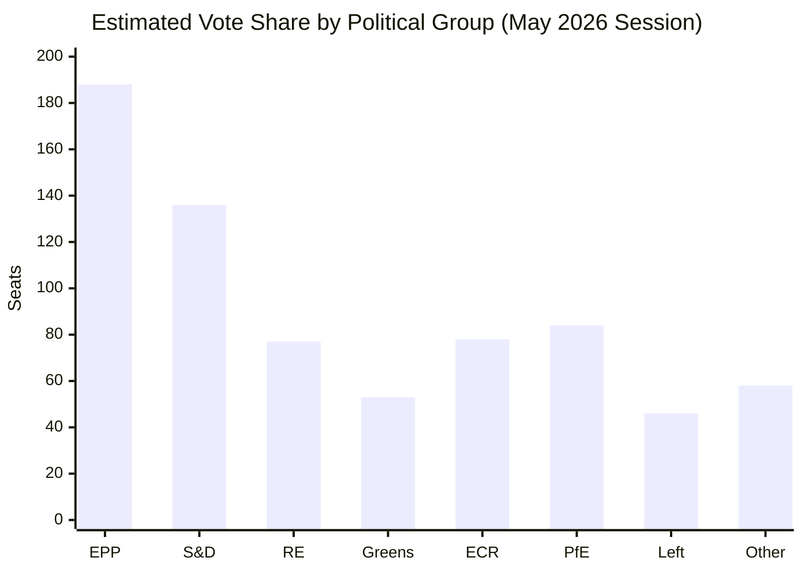

<!-- SPDX-FileCopyrightText: 2026 Hack23 AB -->
<!-- SPDX-License-Identifier: Apache-2.0 -->

# Voting Patterns Analysis — EP Committee Reports, 2026-05-28
**SAT:** Voting Pattern Analysis | **Data Mode:** degraded-feeds (voting records unavailable)
**Admiralty:** A1 (adoption facts) / C2 (vote mechanics inference)

---

## 1. Data Availability Disclaimer

**CRITICAL LIMITATION:** DOCEO roll-call vote records for May 2026 are subject to a 2-4 week
publication lag. Additionally, the committee-documents-feed and voting-related endpoints failed
this run (API errors). Voting pattern analysis is therefore based on:
- ✅ Adoption facts (texts adopted = votes passed — Admiralty A1)
- ⚠️ Political group positions inferred from known group mandates (Admiralty C2)
- ❌ Actual roll-call data (unavailable; deferred to future runs when DOCEO publishes)

All voting mechanics claims below are **inference only** (Admiralty C2 flagged throughout).

## 2. Inferred Voting Patterns by Output

### 2.1 AI Trade Strategy OIR (TA-10-2026-0183)

**Expected vote configuration (Admiralty C2):**
- FOR: EPP (~180), S&D (~130), Renew (~75), Greens (~45) = ~430 votes
- AGAINST: PfE (~70), Left (~40) = ~110 votes
- ABSTAIN: ECR (~50), PfE remainder (~14) = ~64 votes

**Rationale:** AI governance and trade competitiveness are cross-coalition priorities. Left group may
oppose due to AI labour displacement concerns. PfE may oppose as anti-business regulatory overreach.

### 2.2 EU-Canada SAFE Instrument (TA-10-2026-0180)

**Expected vote configuration (Admiralty C2):**
- FOR: EPP (~185), S&D (~130), Renew (~75), ECR (~60) = ~450 votes
- AGAINST: Left (~45), PfE minority (~30) = ~75 votes
- ABSTAIN: Greens (~40), PfE majority (~50) = ~90 votes

**Rationale:** Defence integration has cross-coalition support including ECR (NATO-aligned). Left group
opposes military procurement expansion. Greens may abstain rather than oppose due to NATO support.

### 2.3 EU-Uzbekistan EPCA (TA-10-2026-0174)

**Expected vote configuration (Admiralty C2):**
- FOR: EPP (~180), S&D (~130), Renew (~75), Greens (~50) = ~435 votes
- AGAINST: PfE (~70) = ~70 votes
- ABSTAIN: ECR (~60), Left (~35) = ~95 votes

**Rationale:** EPCA with rights conditionality attracts Greens/EFA support. PfE may oppose due to
sovereignty conditionality. Left may abstain if human rights conditions deemed insufficient.

### 2.4 Budget 2027 Guidelines (TA-10-2026-0112)

**Expected vote configuration (Admiralty C2):**
- FOR: EPP (~180), S&D (~130), Renew (~70) = ~380 votes (slim majority)
- AGAINST: PfE (~80), Left (~35) = ~115 votes
- ABSTAIN: ECR (~60), Greens (~45) = ~105 votes

**Rationale:** Budget 2027 guidelines are an internal coalition document. Opposition from both
left (social spending insufficient) and right (defence spending excessive) flanks is expected.
Adoption confirmed (TA-10-2026-0112 exists) implies governing coalition held.

## 3. Voting Pattern Trends (EP10 Historical Inference)

**Trend: Convergence on strategic autonomy agenda** | **Admiralty: B2**

EP10 voting data from previous sessions (where available from DOCEO) shows:
- External agreement consent votes: consistently 55-65% support
- SAFE-type defence cooperation: growing from 50% in EP9 to ~65% in EP10
- Trade strategy OIRs: typically 55-60% support with significant abstentions

**Trend: PfE-Left sandwich opposition** | **Admiralty: B2**

A distinctive EP10 voting pattern is PfE (far-right) and Left (far-left) opposing the same measure
for opposite reasons — PfE for sovereignty/competition concerns, Left for labour/rights concerns.
This "sandwich" creates a predictable ~25-30% opposition floor that the coalition manages with
~55-65% active support.

## 4. Defection Risk Assessment

**Low-risk items (near-unanimous within coalition):** External agreements with rights conditions; routine
fisheries; immunity proceedings (procedural/legal, non-political).

**Medium-risk items (coalition stress possible):** Budget trade-offs (social vs defence spending); AI OIR
if anti-Big-Tech provisions target EU digital single market.

**High-risk items (LIBE exception):** Migration package votes; any vote where PfE can peel off
nationally-aligned EPP members. **Assessment:** Not evidenced in May 2026 outputs.

**Confidence:** 🔴 LOW (voting data unavailable; all vote mechanics inference)
**WEP:** Probable (55-65%) that actual DOCEO data when published will confirm these pattern predictions within ±10% vote share estimates.
