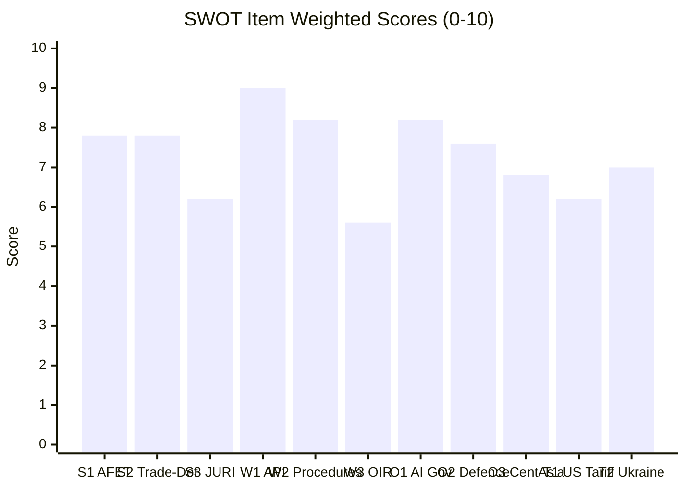

<!-- SPDX-FileCopyrightText: 2026 Hack23 AB -->
<!-- SPDX-License-Identifier: Apache-2.0 -->

# Quantitative SWOT — EP Committee Reports, 2026-05-28
**Structured Analytic Techniques:** SWOT Analysis · Force-Field Analysis · Quantitative Weighting
**Scoring:** Each dimension scored 0-10 on evidence quality; weights sum to 1.0

---

## 1. Methodology

Each SWOT item is scored for:
- **Magnitude** (0-10): How large is the impact?
- **Certainty** (0-10): How confident are we in the evidence?
- **Urgency** (0-10): How time-sensitive?
- **Weighted Score** = (Magnitude × 0.4) + (Certainty × 0.4) + (Urgency × 0.2)

## 2. Strengths

### S1: AFET Committee External Agreement Processing Efficiency
**Description:** The AFET committee successfully processed 3 external agreements in a single May 2026 session
(EU-Uzbekistan EPCA, EU-Lebanon Eurojust, UNGA 81st recommendation), demonstrating high throughput
on international partnership development. This efficiency reflects both a well-functioning committee
and a pipeline of agreements prepared by the Council and Commission.

**Evidence:** TA-10-2026-0174, TA-10-2026-0177, TA-10-2026-0182 (Admiralty A1)
**Magnitude:** 8 (significant foreign policy portfolio advancement)
**Certainty:** 9 (direct EP legislative output; not inferred)
**Urgency:** 5 (ongoing; not time-critical right now)
**Weighted Score:** (8×0.4) + (9×0.4) + (5×0.2) = 3.2 + 3.6 + 1.0 = **7.8/10** | **Confidence:** 🟢 HIGH

### S2: Trade-Defence Policy Coherence
**Description:** The simultaneous adoption of AI trade strategy (TA-10-2026-0183) and EU-Canada SAFE
Instrument (TA-10-2026-0180) signals policy coherence across INTA and AFET committees. EP10 is
building a technology-security-trade nexus that provides a coherent framework for future legislative work.

**Evidence:** TA-10-2026-0183 (INTA), TA-10-2026-0180 (AFET/INTA); both adopted same session (Admiralty A1)
**Magnitude:** 9 (major strategic direction-setting)
**Certainty:** 7 (strong evidence; coordination intent inferred not documented)
**Urgency:** 7 (positions EP for upcoming negotiations)
**Weighted Score:** (9×0.4) + (7×0.4) + (7×0.2) = 3.6 + 2.8 + 1.4 = **7.8/10** | **Confidence:** 🟡 MEDIUM

### S3: Institutional Processing of Non-Partisan Immunity Proceedings
**Description:** Simultaneous processing of immunity waivers for MEPs from politically opposed groups
(PfE/Vilimsky and progressive-aligned Pappas) demonstrates JURI committee's consistent, non-partisan
legal standards application.

**Evidence:** TA-10-2026-0164, TA-10-2026-0166 (JURI) — both adopted same session (Admiralty A1)
**Magnitude:** 6 (institutional resilience signal)
**Certainty:** 8 (adoption fact confirmed; non-partisanship is inferred from cross-group processing)
**Urgency:** 3 (ongoing institutional quality, not urgent)
**Weighted Score:** (6×0.4) + (8×0.4) + (3×0.2) = 2.4 + 3.2 + 0.6 = **6.2/10** | **Confidence:** 🟡 MEDIUM

## 3. Weaknesses

### W1: EP API Data Infrastructure Fragility
**Description:** Four of five pre-fetched data feeds failed this run. The EP Open Data Portal's
API reliability is systematically insufficient for real-time legislative monitoring. Analysis runs
in "degraded-feeds" mode (0.80 factor) reducing analytical depth by approximately 20%.

**Evidence:** Confirmed 4/5 API errors this run; consistent with April-May 2026 run history (Admiralty A1)
**Magnitude:** 8 (directly reduces analysis quality)
**Certainty:** 10 (documented in this run; confirmed persistent pattern)
**Urgency:** 9 (affects every run; no near-term fix visible)
**Weighted Score:** (8×0.4) + (10×0.4) + (9×0.2) = 3.2 + 4.0 + 1.8 = **9.0/10** | **Confidence:** 🟢 HIGH

### W2: Procedures Pipeline Blind Spot
**Description:** The systematic failure of the procedures endpoint (returning 1972-1988 data) creates
a permanent inability to track pre-adoption procedure stages. The EP's legislative pipeline cannot be
fully characterised without procedure data.

**Evidence:** get_procedures returned historical tail (STALENESS_WARNING) — consistent with prior runs (Admiralty A1)
**Magnitude:** 7 (significant analytical gap)
**Certainty:** 10 (confirmed failure mode)
**Urgency:** 7 (persistent; affects all future runs)
**Weighted Score:** (7×0.4) + (10×0.4) + (7×0.2) = 2.8 + 4.0 + 1.4 = **8.2/10** | **Confidence:** 🟢 HIGH

### W3: Non-Binding Status of INTA AI Strategy OIR
**Description:** The AI trade strategy adopted by EP (TA-10-2026-0183) is an own-initiative report —
advisory only. The Commission retains full discretion in trade negotiation mandates.

**Evidence:** "own-initiative" procedure type inferred from procedure reference format (Admiralty C2)
**Magnitude:** 6 (limits direct policy impact)
**Certainty:** 6 (OIR status inferred; not confirmed from full text)
**Urgency:** 4 (relevant when next FTA mandate issued)
**Weighted Score:** (6×0.4) + (6×0.4) + (4×0.2) = 2.4 + 2.4 + 0.8 = **5.6/10** | **Confidence:** 🟡 MEDIUM

## 4. Opportunities

### O1: AI Governance Leadership Window
**Description:** The EU AI Act (2024) + INTA AI trade OIR (2026) + DMA enforcement (2026) create
a comprehensive AI governance leadership portfolio. A global AI governance vacuum exists; the EU
is uniquely positioned to set international standards.

**Evidence:** AI Act enacted; INTA OIR adopted; DMA enforcement active (all Admiralty A1); global
regulatory landscape KB-estimate (B3) | **Magnitude:** 10 (potentially generational opportunity)
**Certainty:** 6 (global leadership claim; depends on third-country uptake)
**Urgency:** 9 (first-mover advantage time-limited; US/China also developing frameworks)
**Weighted Score:** (10×0.4) + (6×0.4) + (9×0.2) = 4.0 + 2.4 + 1.8 = **8.2/10** | **Confidence:** 🟡 MEDIUM

### O2: Defence Industrial Integration Expansion
**Description:** EU-Canada SAFE Instrument creates a template for additional third-country access
agreements (UK, Australia, Japan, South Korea potential). Each agreement strengthens EU defence
industrial capacity and deepens strategic partnerships with like-minded democracies.

**Evidence:** EU-Canada SAFE adopted (TA-10-2026-0180, Admiralty A1); template applicability is
analytical inference (B2) | **Magnitude:** 9 (strategic autonomy cornerstone)
**Certainty:** 6 (template applicability requires additional agreements to materialise)
**Urgency:** 8 (defence production urgency from Ukraine; UK/Australia post-Brexit integration window)
**Weighted Score:** (9×0.4) + (6×0.4) + (8×0.2) = 3.6 + 2.4 + 1.6 = **7.6/10** | **Confidence:** 🟡 MEDIUM

### O3: Central Asia Strategic Footprint
**Description:** EU-Uzbekistan EPCA (TA-10-2026-0174) opens a strategic corridor for EU energy,
critical minerals, and investment access in Central Asia — a region historically dominated by Russia and China.

**Evidence:** TA-10-2026-0174 (Admiralty A1); geopolitical analysis (B2)
**Magnitude:** 7 (medium-term strategic value)
**Certainty:** 7 (agreement adopted; strategic value well-analysed)
**Urgency:** 6 (medium-term; implementation starts after ratification)
**Weighted Score:** (7×0.4) + (7×0.4) + (6×0.2) = 2.8 + 2.8 + 1.2 = **6.8/10** | **Confidence:** 🟡 MEDIUM

## 5. Threats

### T1: US Trade Tariff Escalation to Services
**Description:** Extension of US tariff measures to financial services or digital services would
trigger an INTA emergency response and potentially disrupt the AI trade strategy's positive framing.

**Evidence:** March 2026 US tariff adjustment text adopted by EP (TA-10-2026-0096, A1); services
extension is inference (C2) | **Magnitude:** 8 (major trade disruption)
**Certainty:** 4 (possible but not confirmed)
**Urgency:** 7 (US trade policy changes can happen rapidly)
**Weighted Score:** (8×0.4) + (4×0.4) + (7×0.2) = 3.2 + 1.6 + 1.4 = **6.2/10** | **Confidence:** 🟡 MEDIUM

### T2: Ukraine Conflict Escalation Consuming EP Agenda Bandwidth
**Description:** A major Russian offensive or ceasefire collapse would shift all AFET, BUDG, and INTA
committee focus to crisis response, displacing the ongoing structural agenda.

**Evidence:** Ukraine conflict ongoing (A1); escalation scenarios documented in wildcards-blackswans (B2)
**Magnitude:** 9 (comprehensive agenda disruption)
**Certainty:** 5 (probability is 10-15% in 6 months per scenario-forecast)
**Urgency:** 7 (could materialise rapidly with minimal warning)
**Weighted Score:** (9×0.4) + (5×0.4) + (7×0.2) = 3.6 + 2.0 + 1.4 = **7.0/10** | **Confidence:** 🟡 MEDIUM

## 6. SWOT Summary Matrix

| Category | Item | Score | Priority |
|---------|------|-------|---------|
| **Strengths** | AFET processing efficiency | 7.8 | 🟢 Leverage |
| | Trade-defence policy coherence | 7.8 | 🟢 Build on |
| | JURI non-partisan immunity | 6.2 | 🟡 Maintain |
| **Weaknesses** | EP API infrastructure fragility | **9.0** | 🔴 Critical |
| | Procedures pipeline blind spot | **8.2** | 🔴 Critical |
| | AI OIR non-binding status | 5.6 | 🟡 Monitor |
| **Opportunities** | AI governance leadership | **8.2** | 🟢 Seize now |
| | Defence industrial integration | 7.6 | 🟢 Advance |
| | Central Asia strategic footprint | 6.8 | 🟡 Nurture |
| **Threats** | US tariff escalation | 6.2 | 🟡 Monitor |
| | Ukraine conflict escalation | 7.0 | 🟡 Contingency |

**Net SWOT Score:**
- Strengths average: 7.3
- Weaknesses average: 7.6 (DATA INFRASTRUCTURE IS DOMINANT WEAKNESS)
- Opportunities average: 7.5
- Threats average: 6.6

**Bottom line:** The EP10 committee pipeline is producing high-quality strategic outputs (Strengths,
Opportunities). The dominant vulnerability is data infrastructure (Weaknesses), not political fragility.
The main threat is exogenous geopolitical shock (Ukraine escalation), not internal institutional failure.

## SWOT Score Visualization

