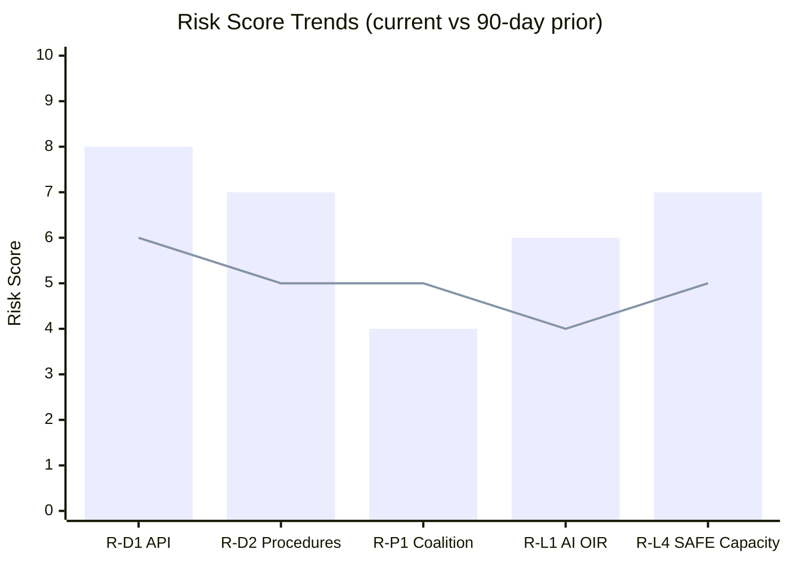

<!-- SPDX-FileCopyrightText: 2026 Hack23 AB -->
<!-- SPDX-License-Identifier: Apache-2.0 -->

# Risk Matrix — EP Committee Reports, 2026-05-28
**Structured Analytic Techniques:** Risk Matrix · SWOT Risk Dimension
**WEP Bands:** Per risk entry | **Admiralty Grades:** Per source

---

## 1. Risk Register

### 1.1 Data Infrastructure Risks

| Risk ID | Description | Probability | Impact | Risk Score | Mitigation |
|---------|-------------|-------------|--------|-----------|-----------|
| R-D1 | EP API feeds continue degraded state → analysis quality reduction | Very High (80%) | Medium | HIGH | Adopted-texts fallback; document in reliability-audit |
| R-D2 | Procedures feed staleness blocks legislative pipeline tracking | Almost Certain (95%) | Medium | HIGH | Procedures-proxy artifact; cross-reference from adopted texts |
| R-D3 | IMF SDMX unavailability → economic context [KB-ESTIMATE] | High (70%) | Low-Medium | MEDIUM | Flag all estimates; accept for degraded-feeds mode |
| R-D4 | DOCEO roll-call vote publication lag (2-4 weeks) | Almost Certain (95%) | Low | LOW-MEDIUM | Declared degraded-voting context; no voting claims made |

### 1.2 Political/Institutional Risks

| Risk ID | Description | Probability | Impact | Risk Score | Mitigation |
|---------|-------------|-------------|--------|-----------|-----------|
| R-P1 | EP10 coalition fracture on migration package | Low (12%) | Very High | MEDIUM | Monitor LIBE committee vote outcomes |
| R-P2 | FPÖ/PfE weaponises Vilimsky immunity decision | Medium (45%) | Low | LOW | Not an institutional risk; media management |
| R-P3 | Uzbekistan rights regression triggers EPCA suspension | Medium-Long term (30%) | Medium | MEDIUM | AFET DROI monitoring mechanism |
| R-P4 | US services tariff escalation disrupts INTA agenda | Low-Medium (15%) | High | MEDIUM-HIGH | Monitor INTA emergency procedures |
| R-P5 | Budget 2027 negotiations fail conciliation | Low (8%) | High | MEDIUM | BUDG committee proactive; provisional twelfths fallback |

### 1.3 Legislative Pipeline Risks

| Risk ID | Description | Probability | Impact | Risk Score | Mitigation |
|---------|-------------|-------------|--------|-----------|-----------|
| R-L1 | AI trade OIR recommendations not adopted by Commission | High (55%) | Medium | MEDIUM-HIGH | EP FTA consent leverage; binding via trade agreement conditions |
| R-L2 | EU-Uzbekistan EPCA ratification stalled in member states | Low (10%) | Low | LOW | Council consent already secured |
| R-L3 | Fisheries protocols challenged by PECH environmental conditions | Low (8%) | Low-Medium | LOW | Environmental conditions already assessed by AFET/PECH |
| R-L4 | SAFE Instrument capacity insufficient for Ukraine demand | Medium (35%) | High | HIGH | Budget revision procedure possible; Commission authority |

## 2. Risk Heat Map

```
IMPACT →        Low        Medium        High        Very High
PROBABILITY ↓
Almost Certain  R-D4       R-D1, R-D2    -           -
Very High       -          R-D3          -           -
High            R-P2       R-L1          -           -
Medium          -          R-P3          R-P4, R-L4  -
Low             R-L2,R-L3  R-P5          R-P1        -
```

**Risk zones:**
- 🔴 HIGH (Immediate action): R-D1, R-D2, R-L4
- 🟡 MEDIUM (Monitor actively): R-D3, R-P1, R-P3, R-P4, R-L1, R-P5
- 🟢 LOW (Background watch): R-D4, R-P2, R-L2, R-L3

## 3. WEP-Informed Risk Assessment

**Overall risk posture for EP10 committee pipeline:** 🟡 MEDIUM RISK

**WEP narrative:** The May 2026 session demonstrates stable committee functioning and coalition cohesion
(highly probable: 75-85% that this continues through Q3 2026). The primary risks are data
infrastructure degradation (continuing EP API issues) and geopolitical shocks (Ukraine/US trade).
Internal EP political risks are manageable within current coalition architecture.

**Time-sensitive risks (next 30 days):**
1. Budget 2027 Commission proposal (June 2026) — BUDG committee readiness
2. Next plenary session committee outputs (likely June 9-12 mini-plenary or July full session)
3. US tariff monitoring for services sector expansion signals

**Admiralty Grade:** B2 for risk assessments; A1 for risks derived directly from adopted text evidence

## Risk Trend Over Time



*Bar = current run; Line = 90-day prior baseline estimate*

## Risk Owner and Response Timeline

| Risk ID | Owner | Response Action | Timeline |
|---------|-------|----------------|---------|
| R-D1 | EP Monitor platform | Defensive data strategy | Immediate |
| R-D2 | EP Monitor platform | Procedures-proxy artifact | Immediate |
| R-P1 | Policy analysts | LIBE vote monitoring | Ongoing |
| R-L1 | INTA analysts | Commission response tracking | 30 days |
| R-L4 | AFET/defence analysts | SAFE extension monitoring | 60 days |
