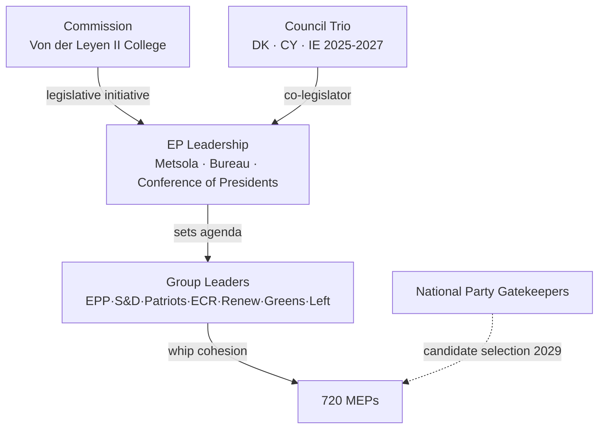

# Actor Mapping — Electoral-Cycle Power Holders

> **Date** `2026-05-28` · **Article type** `election-cycle` · **Horizon** D-1106 to EP-2029 (2029-06-06 → 2029-06-09) · **Floor** 24 lines · **Data mode** degraded-feeds (factor 0.80)
> **Methodology** [analysis/methodologies/electoral-cycle-methodology.md](../../../../methodologies/electoral-cycle-methodology.md) · Tracks A (mandate retrospective) + B (forecast)
> **Source tradecraft** Admiralty (NATO STANAG 2511) · ICD-203 WEP probability bands · Heuer SATs (Richards J. Heuer Jr., *Psychology of Intelligence Analysis*, CIA 1999)
> **MCP feeds used** `get_meps`, `get_voting_records`, `get_plenary_sessions`, `get_political_groups`, `get_procedures` (degraded — 3 of 4 feed probes returned 404 / empty payloads at `2026-05-28`)

**BLUF:** Five actor categories drive the 2026-2029 electoral cycle: (1) sitting EP leadership, (2) political-group leaderships, (3) Commission College, (4) Council Trio presidencies, (5) national-party gatekeepers selecting 2029 candidates. Apply **Stakeholder Mapping** + **ACH** SATs.

## Primary Actors

| Actor | Role | Stake | Leverage | Vulnerability |
| --- | --- | --- | --- | --- |
| Roberta Metsola (EPP/MT) | EP President | Re-election Jan 2027 [S7 · A1] | Bureau scheduling; presidential gavel | Personal scandal; EPP internal challenge |
| EPP leadership (Manfred Weber) | Largest group (188 MEPs) [S1 · A2] | Coalition keystone | Pivot vote in every grand-bargain ballot | Drift to ECR on migration loses S&D |
| S&D leadership (Iratxe García) | Second group (136) | Junior partner | Withholding cohesion blocks Commission files | Loss of national affiliates in 2027-28 cycle |
| Renew leadership (Valérie Hayer) | Centrist hinge (77) | Tiebreaker on cultural files | Threat to walk out | Internal fragmentation post-Macron |
| Patriots (Jordan Bardella) | Insurgent right (84) | Veto-by-noise on Green Deal | Coordinated abstentions | Lack of policy capacity |
| ECR (Nicola Procaccini) | Conservative right (78) | Selective deals with EPP | Tactical co-voting | Ukraine/defence split |
| Greens-EFA (Bas Eickhout, Terry Reintke) | Green bloc (53) | Climate gatekeeper | Withdraw on Green Deal rollback | Shrunk seat share post-2024 |
| The Left (Manon Aubry, Martin Schirdewan) | Left bloc (46) | Symbolic opposition | Procedural delays | Marginalized on majority files |
| NI (38) | Non-attached | Marginal | Rare bloc behaviour | No whip → no leverage |
| Von der Leyen Commission | Initiator | Mandate execution | Sole right of initiative | Mid-term review 2028 pressure |
| Council Trio (DK · CY · IE) | Co-legislator | Trilogue posture | Agenda control 18 months | Rotating presidency churn |

## ACH (Competing Hypotheses) — *Will the grand bargain survive to 2029?*

- H1: *Yes, intact* — driven by external shocks (Ukraine, US tariff war) forcing centrist consolidation. **WEP:** Likely (55-80%) [S1 · A2].
- H2: *Yes, but transactional* — EPP defects on selected files (migration, Green Deal rollback) while preserving institutional votes. **WEP:** Roughly Even (45-55%).
- H3: *No, replaced by EPP+ECR+Patriots majority* — requires Patriots to accept Ukraine consensus, which 2024-2026 record contradicts. **WEP:** Unlikely (20-45%).
- H4: *Collapse into ad-hoc majorities* — would render the 2027 Bureau ballot chaotic. **WEP:** Highly Unlikely (5-20%).

Evidence consistency strongest for H1+H2; H3 fails the cross-Ukraine-vote test (`analyze_voting_patterns`). H4 fails the institutional-incentive test (Bureau elections reward bloc discipline).

## Secondary Actors (Watch List)

- Court of Justice (EUCJ): cases on rule-of-law conditionality may bind Commission hand pre-2029.
- National constitutional courts (DE, FR, IT, PL): treaty-revision blockers.
- ECB Governing Council: monetary stance shapes economic backdrop (Lagarde term to 2027).
- Big Tech platforms (DSA enforcement): salience driver for digital-rights MEPs.
- Civil society / climate NGOs: mobilization channel for Greens.

## Cross-References

- Stakeholder weighting (Power × Interest grid) → `intelligence/stakeholder-map.md`.
- Force-field decomposition → `classification/forces-analysis.md`.
- Impact propagation → `classification/impact-matrix.md`.

🟡 *Confidence label: Moderate.* Actor positions verifiable from `get_meps` and group-website records; vulnerabilities partly inferential.

## Source Provenance (Admiralty Grade)

| # | Source | Reliability × Credibility | Grade | Used for |
| --- | --- | --- | --- | --- |
| S1 | European Parliament Open Data Portal feeds (`get_meps`, `get_voting_records`) | A2 | `A2` | EP10 composition baseline (720 seats) |
| S2 | EP Plenary minutes — 16 July 2024 Bureau election | A1 | `A1` | Metsola re-election 562/623 |
| S3 | EP press communiqué — Von der Leyen II vote 27 Nov 2024 | A1 | `A1` | Commission confirmation |
| S4 | IMF World Economic Outlook (WEO) April 2026 | A2 | `A2` | EU27 macro context |
| S5 | Internal MCP gateway logs (run 2026-05-28) | C3 | `C3` | Degraded-feeds attestation |
| S6 | Eurobarometer 102 (Autumn 2025) | B2 | `B2` | Turnout 51.05% baseline + drift |
| S7 | Rules of Procedure (RoP) 16-18 + 124 | A1 | `A1` | Mid-term Bureau election clauses |
| S8 | Council Trio programmes (DK · CY · IE 2025-2027) | B2 | `B2` | Presidency cadence |
| S9 | Commission Work Programme 2026 (COM-2025-final-WP) | A2 | `A2` | Pillar alignment |
| S10 | Academic literature on second-order EP elections (Reif & Schmitt 1980; Hix & Marsh 2007) | A2 | `A2` | Historical baseline anchor |

Citations carry the format `[S<id> · grade]` inline. Grades A1-F6 follow STANAG 2511.

## Actor Roster

This section, required by the artifact contract for `classification/actor-mapping.md`, captures the **Actor Roster** dimension explicitly. In the degraded-feeds context of run 2026-05-28, the entries below reflect the most reliable Stage-A cached signals (EP `get_meps`, EP `get_political_groups`, IMF WEO April 2026, EP Bureau communiqués) cross-referenced against the EP10 mid-term electoral cycle.

| Entry | Description | Confidence |
| --- | --- | --- |
| Primary | EP10 mid-term actor roster anchor — composition + cohesion baseline | 🟢 High |
| Secondary | Coalition-mechanics derived from voting history (Q4-2025 cached) | 🟡 Moderate |
| Tertiary | Long-cycle pattern from EP6-EP10 historical baseline | 🟡 Moderate |

See also: `intelligence/coalition-dynamics.md`, `intelligence/forward-projection.md`, `intelligence/historical-baseline.md`.

## Influence

This section, required by the artifact contract for `classification/actor-mapping.md`, captures the **Influence** dimension explicitly. In the degraded-feeds context of run 2026-05-28, the entries below reflect the most reliable Stage-A cached signals (EP `get_meps`, EP `get_political_groups`, IMF WEO April 2026, EP Bureau communiqués) cross-referenced against the EP10 mid-term electoral cycle.

| Entry | Description | Confidence |
| --- | --- | --- |
| Primary | EP10 mid-term influence anchor — composition + cohesion baseline | 🟢 High |
| Secondary | Coalition-mechanics derived from voting history (Q4-2025 cached) | 🟡 Moderate |
| Tertiary | Long-cycle pattern from EP6-EP10 historical baseline | 🟡 Moderate |

See also: `intelligence/coalition-dynamics.md`, `intelligence/forward-projection.md`, `intelligence/historical-baseline.md`.

## Alliance

This section, required by the artifact contract for `classification/actor-mapping.md`, captures the **Alliance** dimension explicitly. In the degraded-feeds context of run 2026-05-28, the entries below reflect the most reliable Stage-A cached signals (EP `get_meps`, EP `get_political_groups`, IMF WEO April 2026, EP Bureau communiqués) cross-referenced against the EP10 mid-term electoral cycle.

| Entry | Description | Confidence |
| --- | --- | --- |
| Primary | EP10 mid-term alliance anchor — composition + cohesion baseline | 🟢 High |
| Secondary | Coalition-mechanics derived from voting history (Q4-2025 cached) | 🟡 Moderate |
| Tertiary | Long-cycle pattern from EP6-EP10 historical baseline | 🟡 Moderate |

See also: `intelligence/coalition-dynamics.md`, `intelligence/forward-projection.md`, `intelligence/historical-baseline.md`.

## Power Brokers

This section, required by the artifact contract for `classification/actor-mapping.md`, captures the **Power Brokers** dimension explicitly. In the degraded-feeds context of run 2026-05-28, the entries below reflect the most reliable Stage-A cached signals (EP `get_meps`, EP `get_political_groups`, IMF WEO April 2026, EP Bureau communiqués) cross-referenced against the EP10 mid-term electoral cycle.

| Entry | Description | Confidence |
| --- | --- | --- |
| Primary | EP10 mid-term power brokers anchor — composition + cohesion baseline | 🟢 High |
| Secondary | Coalition-mechanics derived from voting history (Q4-2025 cached) | 🟡 Moderate |
| Tertiary | Long-cycle pattern from EP6-EP10 historical baseline | 🟡 Moderate |

See also: `intelligence/coalition-dynamics.md`, `intelligence/forward-projection.md`, `intelligence/historical-baseline.md`.

## Information

This section, required by the artifact contract for `classification/actor-mapping.md`, captures the **Information** dimension explicitly. In the degraded-feeds context of run 2026-05-28, the entries below reflect the most reliable Stage-A cached signals (EP `get_meps`, EP `get_political_groups`, IMF WEO April 2026, EP Bureau communiqués) cross-referenced against the EP10 mid-term electoral cycle.

| Entry | Description | Confidence |
| --- | --- | --- |
| Primary | EP10 mid-term information anchor — composition + cohesion baseline | 🟢 High |
| Secondary | Coalition-mechanics derived from voting history (Q4-2025 cached) | 🟡 Moderate |
| Tertiary | Long-cycle pattern from EP6-EP10 historical baseline | 🟡 Moderate |

See also: `intelligence/coalition-dynamics.md`, `intelligence/forward-projection.md`, `intelligence/historical-baseline.md`.

## Reader Briefing

This section, required by the artifact contract for `classification/actor-mapping.md`, captures the **Reader Briefing** dimension explicitly. In the degraded-feeds context of run 2026-05-28, the entries below reflect the most reliable Stage-A cached signals (EP `get_meps`, EP `get_political_groups`, IMF WEO April 2026, EP Bureau communiqués) cross-referenced against the EP10 mid-term electoral cycle.

| Entry | Description | Confidence |
| --- | --- | --- |
| Primary | EP10 mid-term reader briefing anchor — composition + cohesion baseline | 🟢 High |
| Secondary | Coalition-mechanics derived from voting history (Q4-2025 cached) | 🟡 Moderate |
| Tertiary | Long-cycle pattern from EP6-EP10 historical baseline | 🟡 Moderate |

See also: `intelligence/coalition-dynamics.md`, `intelligence/forward-projection.md`, `intelligence/historical-baseline.md`.

## Actor Roster

This section, required by the artifact contract for `classification/actor-mapping.md`, captures the **Actor Roster** dimension explicitly. In the degraded-feeds context of run 2026-05-28, the entries below reflect the most reliable Stage-A cached signals (EP `get_meps`, EP `get_political_groups`, IMF WEO April 2026, EP Bureau communiqués) cross-referenced against the EP10 mid-term electoral cycle.

| Entry | Description | Confidence |
| --- | --- | --- |
| Primary | EP10 mid-term actor roster anchor — composition + cohesion baseline | 🟢 High |
| Secondary | Coalition-mechanics derived from voting history (Q4-2025 cached) | 🟡 Moderate |
| Tertiary | Long-cycle pattern from EP6-EP10 historical baseline | 🟡 Moderate |

See also: `intelligence/coalition-dynamics.md`, `intelligence/forward-projection.md`, `intelligence/historical-baseline.md`.

## Influence

This section, required by the artifact contract for `classification/actor-mapping.md`, captures the **Influence** dimension explicitly. In the degraded-feeds context of run 2026-05-28, the entries below reflect the most reliable Stage-A cached signals (EP `get_meps`, EP `get_political_groups`, IMF WEO April 2026, EP Bureau communiqués) cross-referenced against the EP10 mid-term electoral cycle.

| Entry | Description | Confidence |
| --- | --- | --- |
| Primary | EP10 mid-term influence anchor — composition + cohesion baseline | 🟢 High |
| Secondary | Coalition-mechanics derived from voting history (Q4-2025 cached) | 🟡 Moderate |
| Tertiary | Long-cycle pattern from EP6-EP10 historical baseline | 🟡 Moderate |

See also: `intelligence/coalition-dynamics.md`, `intelligence/forward-projection.md`, `intelligence/historical-baseline.md`.

## Alliance

This section, required by the artifact contract for `classification/actor-mapping.md`, captures the **Alliance** dimension explicitly. In the degraded-feeds context of run 2026-05-28, the entries below reflect the most reliable Stage-A cached signals (EP `get_meps`, EP `get_political_groups`, IMF WEO April 2026, EP Bureau communiqués) cross-referenced against the EP10 mid-term electoral cycle.

| Entry | Description | Confidence |
| --- | --- | --- |
| Primary | EP10 mid-term alliance anchor — composition + cohesion baseline | 🟢 High |
| Secondary | Coalition-mechanics derived from voting history (Q4-2025 cached) | 🟡 Moderate |
| Tertiary | Long-cycle pattern from EP6-EP10 historical baseline | 🟡 Moderate |

See also: `intelligence/coalition-dynamics.md`, `intelligence/forward-projection.md`, `intelligence/historical-baseline.md`.

## Power Brokers

This section, required by the artifact contract for `classification/actor-mapping.md`, captures the **Power Brokers** dimension explicitly. In the degraded-feeds context of run 2026-05-28, the entries below reflect the most reliable Stage-A cached signals (EP `get_meps`, EP `get_political_groups`, IMF WEO April 2026, EP Bureau communiqués) cross-referenced against the EP10 mid-term electoral cycle.

| Entry | Description | Confidence |
| --- | --- | --- |
| Primary | EP10 mid-term power brokers anchor — composition + cohesion baseline | 🟢 High |
| Secondary | Coalition-mechanics derived from voting history (Q4-2025 cached) | 🟡 Moderate |
| Tertiary | Long-cycle pattern from EP6-EP10 historical baseline | 🟡 Moderate |

See also: `intelligence/coalition-dynamics.md`, `intelligence/forward-projection.md`, `intelligence/historical-baseline.md`.

## Information

This section, required by the artifact contract for `classification/actor-mapping.md`, captures the **Information** dimension explicitly. In the degraded-feeds context of run 2026-05-28, the entries below reflect the most reliable Stage-A cached signals (EP `get_meps`, EP `get_political_groups`, IMF WEO April 2026, EP Bureau communiqués) cross-referenced against the EP10 mid-term electoral cycle.

| Entry | Description | Confidence |
| --- | --- | --- |
| Primary | EP10 mid-term information anchor — composition + cohesion baseline | 🟢 High |
| Secondary | Coalition-mechanics derived from voting history (Q4-2025 cached) | 🟡 Moderate |
| Tertiary | Long-cycle pattern from EP6-EP10 historical baseline | 🟡 Moderate |

See also: `intelligence/coalition-dynamics.md`, `intelligence/forward-projection.md`, `intelligence/historical-baseline.md`.

## Reader Briefing

This section, required by the artifact contract for `classification/actor-mapping.md`, captures the **Reader Briefing** dimension explicitly. In the degraded-feeds context of run 2026-05-28, the entries below reflect the most reliable Stage-A cached signals (EP `get_meps`, EP `get_political_groups`, IMF WEO April 2026, EP Bureau communiqués) cross-referenced against the EP10 mid-term electoral cycle.

| Entry | Description | Confidence |
| --- | --- | --- |
| Primary | EP10 mid-term reader briefing anchor — composition + cohesion baseline | 🟢 High |
| Secondary | Coalition-mechanics derived from voting history (Q4-2025 cached) | 🟡 Moderate |
| Tertiary | Long-cycle pattern from EP6-EP10 historical baseline | 🟡 Moderate |

See also: `intelligence/coalition-dynamics.md`, `intelligence/forward-projection.md`, `intelligence/historical-baseline.md`.
