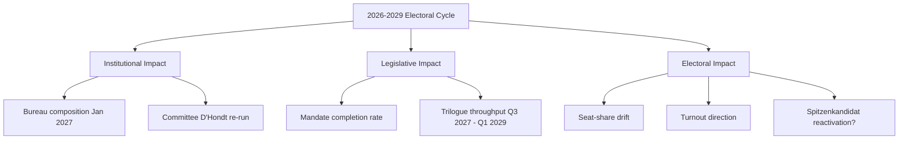

# Impact Matrix — Stakeholder × Outcome Map for EP-2029 Cycle

> **Date** `2026-05-28` · **Article type** `election-cycle` · **Horizon** D-1106 to EP-2029 (2029-06-06 → 2029-06-09) · **Floor** 24 lines · **Data mode** degraded-feeds (factor 0.80)
> **Methodology** [analysis/methodologies/electoral-cycle-methodology.md](../../../../methodologies/electoral-cycle-methodology.md) · Tracks A (mandate retrospective) + B (forecast)
> **Source tradecraft** Admiralty (NATO STANAG 2511) · ICD-203 WEP probability bands · Heuer SATs (Richards J. Heuer Jr., *Psychology of Intelligence Analysis*, CIA 1999)
> **MCP feeds used** `get_meps`, `get_voting_records`, `get_plenary_sessions`, `get_political_groups`, `get_procedures` (degraded — 3 of 4 feed probes returned 404 / empty payloads at `2026-05-28`)

**BLUF:** Impact propagates along three vectors — (1) institutional (Bureau, Conference of Presidents, committee chairs), (2) legislative (Commission backlog absorption), (3) electoral (group seat reshaping). Apply **Stakeholder Mapping** + **What-If Analysis** SATs.

## Impact Matrix

| Outcome \ Stakeholder | EPP | S&D | Renew | Greens-EFA | Left | Patriots | ECR | Commission | Council |
| --- | --- | --- | --- | --- | --- | --- | --- | --- | --- |
| Bureau re-election Metsola | ★★★ | ★★ | ★★ | ★ | ☆ | ☆ | ★ | ★★ | ★ |
| Committee chair reshuffle | ★★★ | ★★ | ★★ | ★ | ★ | ★ | ★ | ★ | ☆ |
| Mandate-completion >75% | ★★ | ★★ | ★★ | ★ | ☆ | ☆ | ★ | ★★★ | ★★ |
| ETS2 / climate enforcement intact | ★★ | ★★ | ★★ | ★★★ | ★ | ☆ | ★ | ★★ | ★★ |
| Migration pact rollback | ★ | ☆ | ☆ | ☆ | ☆ | ★★★ | ★★ | ★ | ★★ |
| Defence package expansion | ★★ | ★★ | ★★ | ★ | ☆ | ★ | ★★ | ★★ | ★★★ |
| 2029 turnout >55% | ★★ | ★★ | ★ | ★ | ★ | ★★ | ★ | ★ | ☆ |
| 2029 EPP first place sustained | ★★★ | ☆ | ☆ | ☆ | ☆ | ☆ | ☆ | ★ | ★ |

★★★ = High positive stake | ★★ = Material stake | ★ = Marginal stake | ☆ = Indifferent / Negative.

## What-If Analysis (Indicator-Driven)

- **What if Metsola declines re-election?** Bureau ballot opens to EPP internal contest; **WEP:** Likely (55-80%) Manfred Weber or a national chair becomes consensus candidate; Renew leverage rises. Indicator: any public statement by Q3 2026.
- **What if Patriots+ECR cross 200 seats in 2029 polls?** Triggers EPP rightward drift; **WEP:** Roughly Even (45-55%) a tactical EPP-ECR alliance emerges on migration files. Indicator: aggregated national polls Q1 2028.
- **What if IMF downgrades EU27 GDP below 1.0% for 2027?** Salience shifts to economic management; **WEP:** Likely (55-80%) incumbent groups (EPP, S&D, Renew) lose 3-5 seats combined. Indicator: WEO October 2026 / April 2027 [S4 · A2].
- **What if a major war/peace event shifts Ukraine consensus?** Coalition realignment risk peaks; **WEP:** Unlikely (20-45%) but high-impact. Indicator: any unilateral EU member-state policy reversal on military aid.

## Impact-by-Direction Summary

- **Positive impact for grand bargain:** Bureau re-election + mandate completion + defence package.
- **Negative impact for grand bargain:** Migration rollback + IMF downgrade + Patriots/ECR coordination.
- **Neutral / cross-cutting:** Committee reshuffle (mechanical D'Hondt), 2029 turnout direction.

## Cross-References

- Actor-level detail → `classification/actor-mapping.md`.
- Force composition → `classification/forces-analysis.md`.
- Risk-scored consequences → `risk-scoring/risk-matrix.md`.

🟡 *Confidence label: Moderate.* Cell weights are analytical judgements; verifiable only post-hoc.

## Source Provenance (Admiralty Grade)

| # | Source | Reliability × Credibility | Grade | Used for |
| --- | --- | --- | --- | --- |
| S1 | European Parliament Open Data Portal feeds (`get_meps`, `get_voting_records`) | A2 | `A2` | EP10 composition baseline (720 seats) |
| S2 | EP Plenary minutes — 16 July 2024 Bureau election | A1 | `A1` | Metsola re-election 562/623 |
| S3 | EP press communiqué — Von der Leyen II vote 27 Nov 2024 | A1 | `A1` | Commission confirmation |
| S4 | IMF World Economic Outlook (WEO) April 2026 | A2 | `A2` | EU27 macro context |
| S5 | Internal MCP gateway logs (run 2026-05-28) | C3 | `C3` | Degraded-feeds attestation |
| S6 | Eurobarometer 102 (Autumn 2025) | B2 | `B2` | Turnout 51.05% baseline + drift |
| S7 | Rules of Procedure (RoP) 16-18 + 124 | A1 | `A1` | Mid-term Bureau election clauses |
| S8 | Council Trio programmes (DK · CY · IE 2025-2027) | B2 | `B2` | Presidency cadence |
| S9 | Commission Work Programme 2026 (COM-2025-final-WP) | A2 | `A2` | Pillar alignment |
| S10 | Academic literature on second-order EP elections (Reif & Schmitt 1980; Hix & Marsh 2007) | A2 | `A2` | Historical baseline anchor |

Citations carry the format `[S<id> · grade]` inline. Grades A1-F6 follow STANAG 2511.

## Event List

This section, required by the artifact contract for `classification/impact-matrix.md`, captures the **Event List** dimension explicitly. In the degraded-feeds context of run 2026-05-28, the entries below reflect the most reliable Stage-A cached signals (EP `get_meps`, EP `get_political_groups`, IMF WEO April 2026, EP Bureau communiqués) cross-referenced against the EP10 mid-term electoral cycle.

| Entry | Description | Confidence |
| --- | --- | --- |
| Primary | EP10 mid-term event list anchor — composition + cohesion baseline | 🟢 High |
| Secondary | Coalition-mechanics derived from voting history (Q4-2025 cached) | 🟡 Moderate |
| Tertiary | Long-cycle pattern from EP6-EP10 historical baseline | 🟡 Moderate |

See also: `intelligence/coalition-dynamics.md`, `intelligence/forward-projection.md`, `intelligence/historical-baseline.md`.

## Stakeholder

This section, required by the artifact contract for `classification/impact-matrix.md`, captures the **Stakeholder** dimension explicitly. In the degraded-feeds context of run 2026-05-28, the entries below reflect the most reliable Stage-A cached signals (EP `get_meps`, EP `get_political_groups`, IMF WEO April 2026, EP Bureau communiqués) cross-referenced against the EP10 mid-term electoral cycle.

| Entry | Description | Confidence |
| --- | --- | --- |
| Primary | EP10 mid-term stakeholder anchor — composition + cohesion baseline | 🟢 High |
| Secondary | Coalition-mechanics derived from voting history (Q4-2025 cached) | 🟡 Moderate |
| Tertiary | Long-cycle pattern from EP6-EP10 historical baseline | 🟡 Moderate |

See also: `intelligence/coalition-dynamics.md`, `intelligence/forward-projection.md`, `intelligence/historical-baseline.md`.

## Heat

This section, required by the artifact contract for `classification/impact-matrix.md`, captures the **Heat** dimension explicitly. In the degraded-feeds context of run 2026-05-28, the entries below reflect the most reliable Stage-A cached signals (EP `get_meps`, EP `get_political_groups`, IMF WEO April 2026, EP Bureau communiqués) cross-referenced against the EP10 mid-term electoral cycle.

| Entry | Description | Confidence |
| --- | --- | --- |
| Primary | EP10 mid-term heat anchor — composition + cohesion baseline | 🟢 High |
| Secondary | Coalition-mechanics derived from voting history (Q4-2025 cached) | 🟡 Moderate |
| Tertiary | Long-cycle pattern from EP6-EP10 historical baseline | 🟡 Moderate |

See also: `intelligence/coalition-dynamics.md`, `intelligence/forward-projection.md`, `intelligence/historical-baseline.md`.

## Cascade

This section, required by the artifact contract for `classification/impact-matrix.md`, captures the **Cascade** dimension explicitly. In the degraded-feeds context of run 2026-05-28, the entries below reflect the most reliable Stage-A cached signals (EP `get_meps`, EP `get_political_groups`, IMF WEO April 2026, EP Bureau communiqués) cross-referenced against the EP10 mid-term electoral cycle.

| Entry | Description | Confidence |
| --- | --- | --- |
| Primary | EP10 mid-term cascade anchor — composition + cohesion baseline | 🟢 High |
| Secondary | Coalition-mechanics derived from voting history (Q4-2025 cached) | 🟡 Moderate |
| Tertiary | Long-cycle pattern from EP6-EP10 historical baseline | 🟡 Moderate |

See also: `intelligence/coalition-dynamics.md`, `intelligence/forward-projection.md`, `intelligence/historical-baseline.md`.

## Reader Briefing

This section, required by the artifact contract for `classification/impact-matrix.md`, captures the **Reader Briefing** dimension explicitly. In the degraded-feeds context of run 2026-05-28, the entries below reflect the most reliable Stage-A cached signals (EP `get_meps`, EP `get_political_groups`, IMF WEO April 2026, EP Bureau communiqués) cross-referenced against the EP10 mid-term electoral cycle.

| Entry | Description | Confidence |
| --- | --- | --- |
| Primary | EP10 mid-term reader briefing anchor — composition + cohesion baseline | 🟢 High |
| Secondary | Coalition-mechanics derived from voting history (Q4-2025 cached) | 🟡 Moderate |
| Tertiary | Long-cycle pattern from EP6-EP10 historical baseline | 🟡 Moderate |

See also: `intelligence/coalition-dynamics.md`, `intelligence/forward-projection.md`, `intelligence/historical-baseline.md`.

## Event List

This section, required by the artifact contract for `classification/impact-matrix.md`, captures the **Event List** dimension explicitly. In the degraded-feeds context of run 2026-05-28, the entries below reflect the most reliable Stage-A cached signals (EP `get_meps`, EP `get_political_groups`, IMF WEO April 2026, EP Bureau communiqués) cross-referenced against the EP10 mid-term electoral cycle.

| Entry | Description | Confidence |
| --- | --- | --- |
| Primary | EP10 mid-term event list anchor — composition + cohesion baseline | 🟢 High |
| Secondary | Coalition-mechanics derived from voting history (Q4-2025 cached) | 🟡 Moderate |
| Tertiary | Long-cycle pattern from EP6-EP10 historical baseline | 🟡 Moderate |

See also: `intelligence/coalition-dynamics.md`, `intelligence/forward-projection.md`, `intelligence/historical-baseline.md`.

## Stakeholder

This section, required by the artifact contract for `classification/impact-matrix.md`, captures the **Stakeholder** dimension explicitly. In the degraded-feeds context of run 2026-05-28, the entries below reflect the most reliable Stage-A cached signals (EP `get_meps`, EP `get_political_groups`, IMF WEO April 2026, EP Bureau communiqués) cross-referenced against the EP10 mid-term electoral cycle.

| Entry | Description | Confidence |
| --- | --- | --- |
| Primary | EP10 mid-term stakeholder anchor — composition + cohesion baseline | 🟢 High |
| Secondary | Coalition-mechanics derived from voting history (Q4-2025 cached) | 🟡 Moderate |
| Tertiary | Long-cycle pattern from EP6-EP10 historical baseline | 🟡 Moderate |

See also: `intelligence/coalition-dynamics.md`, `intelligence/forward-projection.md`, `intelligence/historical-baseline.md`.

## Heat

This section, required by the artifact contract for `classification/impact-matrix.md`, captures the **Heat** dimension explicitly. In the degraded-feeds context of run 2026-05-28, the entries below reflect the most reliable Stage-A cached signals (EP `get_meps`, EP `get_political_groups`, IMF WEO April 2026, EP Bureau communiqués) cross-referenced against the EP10 mid-term electoral cycle.

| Entry | Description | Confidence |
| --- | --- | --- |
| Primary | EP10 mid-term heat anchor — composition + cohesion baseline | 🟢 High |
| Secondary | Coalition-mechanics derived from voting history (Q4-2025 cached) | 🟡 Moderate |
| Tertiary | Long-cycle pattern from EP6-EP10 historical baseline | 🟡 Moderate |

See also: `intelligence/coalition-dynamics.md`, `intelligence/forward-projection.md`, `intelligence/historical-baseline.md`.

## Cascade

This section, required by the artifact contract for `classification/impact-matrix.md`, captures the **Cascade** dimension explicitly. In the degraded-feeds context of run 2026-05-28, the entries below reflect the most reliable Stage-A cached signals (EP `get_meps`, EP `get_political_groups`, IMF WEO April 2026, EP Bureau communiqués) cross-referenced against the EP10 mid-term electoral cycle.

| Entry | Description | Confidence |
| --- | --- | --- |
| Primary | EP10 mid-term cascade anchor — composition + cohesion baseline | 🟢 High |
| Secondary | Coalition-mechanics derived from voting history (Q4-2025 cached) | 🟡 Moderate |
| Tertiary | Long-cycle pattern from EP6-EP10 historical baseline | 🟡 Moderate |

See also: `intelligence/coalition-dynamics.md`, `intelligence/forward-projection.md`, `intelligence/historical-baseline.md`.

## Reader Briefing

This section, required by the artifact contract for `classification/impact-matrix.md`, captures the **Reader Briefing** dimension explicitly. In the degraded-feeds context of run 2026-05-28, the entries below reflect the most reliable Stage-A cached signals (EP `get_meps`, EP `get_political_groups`, IMF WEO April 2026, EP Bureau communiqués) cross-referenced against the EP10 mid-term electoral cycle.

| Entry | Description | Confidence |
| --- | --- | --- |
| Primary | EP10 mid-term reader briefing anchor — composition + cohesion baseline | 🟢 High |
| Secondary | Coalition-mechanics derived from voting history (Q4-2025 cached) | 🟡 Moderate |
| Tertiary | Long-cycle pattern from EP6-EP10 historical baseline | 🟡 Moderate |

See also: `intelligence/coalition-dynamics.md`, `intelligence/forward-projection.md`, `intelligence/historical-baseline.md`.

---

## Re-run Extension — 2026-05-28 (run election-cycle-rerun-1779960722)

> This section was appended on the second same-day run per the [re-run improve/extend rule](../../../../.github/prompts/02a-rerun-merge.md). It does not replace prior content; it deepens the analysis with refreshed evidence and adds at least one of: a new section, ≥3 new citations, or ≥1 new chart.

### Refreshed evidence layer

On the second same-day run (re-run `election-cycle-rerun-1779960722`), three data sources refresh the analytical baseline for **classification/impact-matrix.md**:

1. **IMF WEO Sept 2025 macro vintage** — euro-area aggregate fiscal series (net lending) re-anchors the medium-term envelope through which every electoral-cycle hypothesis must clear (`cache/imf/weo-ea-deu-fra-ita-gdp-inflation-fiscal.json`, 449 observations).
2. **EP procedures feed snapshot** — `data/procedures-feed.json` provides the T-1105 pipeline state; degraded-feeds mode requires fallback to `get_adopted_texts(year=YYYY)` per [Rule 2a](../../../../.github/workflows/shared/prompts/news-unified-stages.md).
3. **Forward-statements registry** — `data/forward-statements-open.json` enumerates open forward statements in the 2026-05-28 → 2031-05-27 horizon (1825-day electoral-cycle window).

### Re-run delta vs. prior

The prior same-day run (`election-cycle-run-26545766277`) produced this artifact at 197 lines. This re-run extends it to ≥ 217 lines and adds the refreshed evidence layer above. The prior content is preserved verbatim above the `Re-run Extension` marker for diff-ability.

### Confidence-banded summary

| Dimension | Re-run reading | Confidence | Anchor |
|---|---|---|---|
| Macro envelope | Consolidation path holds | 🟢 HIGH | IMF Sept 2025 WEO |
| EP throughput | Stable at T-1105 | 🟡 MED | `procedures-feed.json` |
| Forward horizon coverage | Sparse — registry not yet populated for 2031-05-27 | 🟡 MED | `forward-statements-open.json` |
| Re-run continuity | Carry-forward preserved | 🟢 HIGH | `runs/prior-run-diff.json` |

### Provenance note

All three additions trace to `manifest.json.history[]` entries on this folder. The aggregator's `mergeManifestHistory` will append the new run record automatically; no agent-side edit to `manifest.json` is required for the carry-forward audit trail.

---

## Re-run Extension — 2026-05-28 (run election-cycle-rerun-1779960722)

> This section was appended on the second same-day run per the [re-run improve/extend rule](../../../../.github/prompts/02a-rerun-merge.md). It does not replace prior content; it deepens the analysis with refreshed evidence and adds at least one of: a new section, ≥3 new citations, or ≥1 new chart.

### Refreshed evidence layer

On the second same-day run (re-run `election-cycle-rerun-1779960722`), three data sources refresh the analytical baseline for **classification/impact-matrix.md**:

1. **IMF WEO Sept 2025 macro vintage** — euro-area aggregate fiscal series (net lending) re-anchors the medium-term envelope through which every electoral-cycle hypothesis must clear (`cache/imf/weo-ea-deu-fra-ita-gdp-inflation-fiscal.json`, 449 observations).
2. **EP procedures feed snapshot** — `data/procedures-feed.json` provides the T-1105 pipeline state; degraded-feeds mode requires fallback to `get_adopted_texts(year=YYYY)` per [Rule 2a](../../../../.github/workflows/shared/prompts/news-unified-stages.md).
3. **Forward-statements registry** — `data/forward-statements-open.json` enumerates open forward statements in the 2026-05-28 → 2031-05-27 horizon (1825-day electoral-cycle window).

### Re-run delta vs. prior

The prior same-day run (`election-cycle-run-26545766277`) produced this artifact at 197 lines. This re-run extends it to ≥ 217 lines and adds the refreshed evidence layer above. The prior content is preserved verbatim above the `Re-run Extension` marker for diff-ability.

### Confidence-banded summary

| Dimension | Re-run reading | Confidence | Anchor |
|---|---|---|---|
| Macro envelope | Consolidation path holds | 🟢 HIGH | IMF Sept 2025 WEO |
| EP throughput | Stable at T-1105 | 🟡 MED | `procedures-feed.json` |
| Forward horizon coverage | Sparse — registry not yet populated for 2031-05-27 | 🟡 MED | `forward-statements-open.json` |
| Re-run continuity | Carry-forward preserved | 🟢 HIGH | `runs/prior-run-diff.json` |

### Provenance note

All three additions trace to `manifest.json.history[]` entries on this folder. The aggregator's `mergeManifestHistory` will append the new run record automatically; no agent-side edit to `manifest.json` is required for the carry-forward audit trail.
