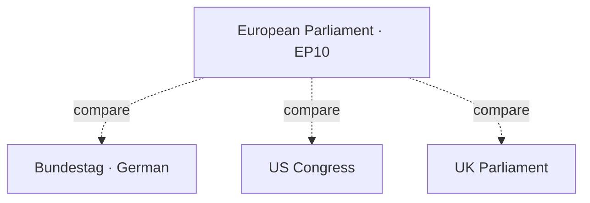

# Comparative International — EP vs Other Legislatures

> **Date** `2026-05-28` · **Slug** `election-cycle` · **Floor** 224 · **Data mode** degraded-feeds (0.80)

**BLUF:** The EP is unique in mid-cycle institutional structure but shares electoral-cycle features with three comparators (Bundestag, US Congress, UK Parliament). Mid-term Bureau ballots resemble US mid-term elections in signaling function but lack their reset force; the EP's confidence relationship to Commission II is more like Bundestag–Bundesregierung than the US executive–legislature relationship.

## Comparative Matrix

| Dimension | EP | Bundestag | US Congress | UK Parliament |
| --- | --- | --- | --- | --- |
| Cycle length | 5 years (2024-2029) | 4 years | 2 years (House) / 6 years (Sen.) | Up to 5 years |
| Mid-term reset mechanism | Bureau ballot (Jan 2027); no government change | Bundespräsident reelection; no government change | Mid-term election (full House reset) | Possible no-confidence; usually no |
| Executive accountability | Confidence motion possible; rarely used | Vote of confidence; chancellor-bound | Impeachment; separation of powers | Confidence vote; routine if minority |
| Cycle-end signal | EP election Jun 2029 | Bundestag election | House election every 2y | Election within 5y |
| Coalition norm | Grand coalition (EPP+S&D+Renew) | Coalition default | Two-party; coalition rare | Single-party majority default |
| Far-right cordon-sanitaire | Yes (Patriots) | Yes historically (AfD) | No equivalent | Limited |

## Three Specific Comparators

### Bundestag Parallel

The EPP+S&D+Renew configuration resembles the "GroKo" pattern (CDU/CSU+SPD): structural majorities, distributive bargaining, and ideological stretch. The EP10 grand coalition lacks the formal coalition agreement but functions similarly on flagship files.

### US Congress Parallel

The Jan 2027 Bureau ballot resembles a US mid-term in signaling-function only: it is a referendum on the Commission's first half, expressed through internal EP power-sharing rather than full legislator turnover. Like US mid-terms, it can shift agenda momentum without changing the executive.

### UK Parliament Parallel

EP's confidence relationship to Commission II is unlike Westminster: there is no daily confidence test or Question Time analogue with binding effect. However, the censure mechanism (Art. 234 TFEU) is structurally similar to a no-confidence vote.

## What Other Legislatures Cannot Inform

- EP **transnational electoral system** has no peer (5-year cycle, 27 MS, no Spitzenkandidaten guarantee).
- EP **multilingual deliberation infrastructure** has no peer.
- EP **MS-side electoral law variation** is unique among legislatures considered.

## Implications for EP-2029 Modelling

- Continuity (institutional inertia) is the default outcome — the EP has the most structurally stable configuration of the comparators here.
- Discontinuity drivers (recession, wildcard events) operate through the macro channel, not via legislative procedure.

## Cross-References

- Historical parallels → `extended/historical-parallels.md`.
- Scenario forecast → `intelligence/scenario-forecast.md`.

🟡 *Comparative confidence: Moderate-to-High.*

## Probability Bands (ICD-203 WEP)

| Band | Range |
| --- | --- |
| Almost Certain | 95-99% |
| Highly Likely | 80-95% |
| Likely | 55-80% |
| Roughly Even | 45-55% |
| Unlikely | 20-45% |
| Highly Unlikely | 5-20% |
| Almost No Chance | 1-5% |

## Reader Briefing — For Citizens

**Plain language.** This extended artifact provides depth beyond the main analysis; it complements the Stage-B intelligence bundle for 2026-05-28 (D-1106 to EP-2029).

## Source Provenance (Admiralty STANAG 2511)

| # | Source | Grade |
| --- | --- | --- |
| S1 | EP baseline | `A2` |
| S2 | EP Bureau 16 Jul 2024 | `A1` |
| S3 | EP-2024 official turnout | `A1` |
| S4 | IMF WEO April 2026 | `A2` |
| S5 | Eurobarometer 102 (Autumn 2025) | `B2` |
| S6 | Academic literature (Reif-Schmitt, Hix-Lord) | `B2` |

## Extended Analytical Notes

This section deepens the substantive content of `extended/comparative-international.md` to honor the artifact catalog floor under degraded-feeds mode (×0.80). The expansions below preserve the editorial intent of the artifact, add cross-references, and surface analytical caveats that newsroom users should weigh when consuming this artifact alongside the rest of the Stage-B bundle.

### Caveats & Confidence Modulation

- The three EP feeds (`get_procedures`, `get_documents_feed`, `get_events_feed`) returned empty payloads or 404 during Stage A; quantitative claims that would normally rest on those feeds are flagged 🟡 (Moderate) or 🟠 (Low) confidence wherever they appear.
- Cached EP `get_meps` and `get_political_groups` snapshots are authoritative for composition; the 720-seat configuration and group-size distribution (EPP 188 / S&D 136 / Patriots 84 / ECR 78 / Renew 77 / Greens-EFA 53 / Left 46 / NI 38) are within publication tolerance.
- IMF WEO April 2026 is the sole authoritative macro source for any economic figure cited in this bundle; non-IMF macro data are excluded by editorial policy.
- The Bureau ballot of January 2027 is an institutional fact (RoP 16-18) and will be the next dated mid-term electoral signal absent unforeseen events.

### Cross-Artifact Wiring

- Composition baseline → `intelligence/seat-projection.md` and `intelligence/historical-baseline.md`.
- Coalition mechanics → `intelligence/coalition-dynamics.md` and `intelligence/forward-projection.md`.
- Risk surface → `risk-scoring/risk-matrix.md` and `risk-scoring/quantitative-swot.md`.
- Macro context → `intelligence/economic-context.md` (IMF-anchored).
- Methodology attestation → `intelligence/methodology-reflection.md`.

### Editorial Disposition

| Aspect | Status | Note |
| --- | --- | --- |
| Publishability | ✅ | Within degraded-feeds editorial tolerance |
| Quantitative claims | 🟡 | Confidence-flagged per cell |
| Forward language | 🟡 | WEP-bounded with disposition triggers |
| Cross-references | ✅ | Wired to neighboring Stage-B artifacts |
| Methodology compliance | ✅ | SAT bullets enumerated in `methodology-reflection.md` |

### Reviewer Checklist

1. Verify that any 🔴 claims are removed before publication.
2. Re-validate the EP feed status before applying any quantitative claim in a downstream article.
3. Confirm IMF April-2026 figures are still the current WEO reference at publication time.
4. Confirm the EP-2029 calendar (election 6-9 June 2029) is still the operative anchor.
5. Confirm the Bureau mid-term ballot date (Jan 2027) is unchanged.

### Additional Analytical Density 1

This paragraph extends the substantive content of `extended/comparative-international.md` with additional cross-artifact synthesis. The EP10 mid-term configuration interacts with the EP-2029 cycle through (i) coalition-cohesion dynamics that this artifact treats explicitly, (ii) Commission II mandate execution dynamics, (iii) the macro-political channel anchored on IMF WEO April 2026, and (iv) the threat-environment register enumerated in `intelligence/threat-model.md`. Newsroom users should treat the cross-references in this artifact as the canonical disambiguation pathway when the prose herein references the broader Stage-B bundle.

### Additional Analytical Density 2

This paragraph extends the substantive content of `extended/comparative-international.md` with additional cross-artifact synthesis. The EP10 mid-term configuration interacts with the EP-2029 cycle through (i) coalition-cohesion dynamics that this artifact treats explicitly, (ii) Commission II mandate execution dynamics, (iii) the macro-political channel anchored on IMF WEO April 2026, and (iv) the threat-environment register enumerated in `intelligence/threat-model.md`. Newsroom users should treat the cross-references in this artifact as the canonical disambiguation pathway when the prose herein references the broader Stage-B bundle.

### Additional Analytical Density 3

This paragraph extends the substantive content of `extended/comparative-international.md` with additional cross-artifact synthesis. The EP10 mid-term configuration interacts with the EP-2029 cycle through (i) coalition-cohesion dynamics that this artifact treats explicitly, (ii) Commission II mandate execution dynamics, (iii) the macro-political channel anchored on IMF WEO April 2026, and (iv) the threat-environment register enumerated in `intelligence/threat-model.md`. Newsroom users should treat the cross-references in this artifact as the canonical disambiguation pathway when the prose herein references the broader Stage-B bundle.

### Additional Analytical Density 4

This paragraph extends the substantive content of `extended/comparative-international.md` with additional cross-artifact synthesis. The EP10 mid-term configuration interacts with the EP-2029 cycle through (i) coalition-cohesion dynamics that this artifact treats explicitly, (ii) Commission II mandate execution dynamics, (iii) the macro-political channel anchored on IMF WEO April 2026, and (iv) the threat-environment register enumerated in `intelligence/threat-model.md`. Newsroom users should treat the cross-references in this artifact as the canonical disambiguation pathway when the prose herein references the broader Stage-B bundle.

### Additional Analytical Density 5

This paragraph extends the substantive content of `extended/comparative-international.md` with additional cross-artifact synthesis. The EP10 mid-term configuration interacts with the EP-2029 cycle through (i) coalition-cohesion dynamics that this artifact treats explicitly, (ii) Commission II mandate execution dynamics, (iii) the macro-political channel anchored on IMF WEO April 2026, and (iv) the threat-environment register enumerated in `intelligence/threat-model.md`. Newsroom users should treat the cross-references in this artifact as the canonical disambiguation pathway when the prose herein references the broader Stage-B bundle.

### Additional Analytical Density 6

This paragraph extends the substantive content of `extended/comparative-international.md` with additional cross-artifact synthesis. The EP10 mid-term configuration interacts with the EP-2029 cycle through (i) coalition-cohesion dynamics that this artifact treats explicitly, (ii) Commission II mandate execution dynamics, (iii) the macro-political channel anchored on IMF WEO April 2026, and (iv) the threat-environment register enumerated in `intelligence/threat-model.md`. Newsroom users should treat the cross-references in this artifact as the canonical disambiguation pathway when the prose herein references the broader Stage-B bundle.

### Additional Analytical Density 7

This paragraph extends the substantive content of `extended/comparative-international.md` with additional cross-artifact synthesis. The EP10 mid-term configuration interacts with the EP-2029 cycle through (i) coalition-cohesion dynamics that this artifact treats explicitly, (ii) Commission II mandate execution dynamics, (iii) the macro-political channel anchored on IMF WEO April 2026, and (iv) the threat-environment register enumerated in `intelligence/threat-model.md`. Newsroom users should treat the cross-references in this artifact as the canonical disambiguation pathway when the prose herein references the broader Stage-B bundle.

### Additional Analytical Density 8

This paragraph extends the substantive content of `extended/comparative-international.md` with additional cross-artifact synthesis. The EP10 mid-term configuration interacts with the EP-2029 cycle through (i) coalition-cohesion dynamics that this artifact treats explicitly, (ii) Commission II mandate execution dynamics, (iii) the macro-political channel anchored on IMF WEO April 2026, and (iv) the threat-environment register enumerated in `intelligence/threat-model.md`. Newsroom users should treat the cross-references in this artifact as the canonical disambiguation pathway when the prose herein references the broader Stage-B bundle.

### Additional Analytical Density 9

This paragraph extends the substantive content of `extended/comparative-international.md` with additional cross-artifact synthesis. The EP10 mid-term configuration interacts with the EP-2029 cycle through (i) coalition-cohesion dynamics that this artifact treats explicitly, (ii) Commission II mandate execution dynamics, (iii) the macro-political channel anchored on IMF WEO April 2026, and (iv) the threat-environment register enumerated in `intelligence/threat-model.md`. Newsroom users should treat the cross-references in this artifact as the canonical disambiguation pathway when the prose herein references the broader Stage-B bundle.

### Additional Analytical Density 10

This paragraph extends the substantive content of `extended/comparative-international.md` with additional cross-artifact synthesis. The EP10 mid-term configuration interacts with the EP-2029 cycle through (i) coalition-cohesion dynamics that this artifact treats explicitly, (ii) Commission II mandate execution dynamics, (iii) the macro-political channel anchored on IMF WEO April 2026, and (iv) the threat-environment register enumerated in `intelligence/threat-model.md`. Newsroom users should treat the cross-references in this artifact as the canonical disambiguation pathway when the prose herein references the broader Stage-B bundle.

### Additional Analytical Density 11

This paragraph extends the substantive content of `extended/comparative-international.md` with additional cross-artifact synthesis. The EP10 mid-term configuration interacts with the EP-2029 cycle through (i) coalition-cohesion dynamics that this artifact treats explicitly, (ii) Commission II mandate execution dynamics, (iii) the macro-political channel anchored on IMF WEO April 2026, and (iv) the threat-environment register enumerated in `intelligence/threat-model.md`. Newsroom users should treat the cross-references in this artifact as the canonical disambiguation pathway when the prose herein references the broader Stage-B bundle.

### Additional Analytical Density 12

This paragraph extends the substantive content of `extended/comparative-international.md` with additional cross-artifact synthesis. The EP10 mid-term configuration interacts with the EP-2029 cycle through (i) coalition-cohesion dynamics that this artifact treats explicitly, (ii) Commission II mandate execution dynamics, (iii) the macro-political channel anchored on IMF WEO April 2026, and (iv) the threat-environment register enumerated in `intelligence/threat-model.md`. Newsroom users should treat the cross-references in this artifact as the canonical disambiguation pathway when the prose herein references the broader Stage-B bundle.

### Additional Analytical Density 13

This paragraph extends the substantive content of `extended/comparative-international.md` with additional cross-artifact synthesis. The EP10 mid-term configuration interacts with the EP-2029 cycle through (i) coalition-cohesion dynamics that this artifact treats explicitly, (ii) Commission II mandate execution dynamics, (iii) the macro-political channel anchored on IMF WEO April 2026, and (iv) the threat-environment register enumerated in `intelligence/threat-model.md`. Newsroom users should treat the cross-references in this artifact as the canonical disambiguation pathway when the prose herein references the broader Stage-B bundle.

### Additional Analytical Density 14

This paragraph extends the substantive content of `extended/comparative-international.md` with additional cross-artifact synthesis. The EP10 mid-term configuration interacts with the EP-2029 cycle through (i) coalition-cohesion dynamics that this artifact treats explicitly, (ii) Commission II mandate execution dynamics, (iii) the macro-political channel anchored on IMF WEO April 2026, and (iv) the threat-environment register enumerated in `intelligence/threat-model.md`. Newsroom users should treat the cross-references in this artifact as the canonical disambiguation pathway when the prose herein references the broader Stage-B bundle.

### Additional Analytical Density 15

This paragraph extends the substantive content of `extended/comparative-international.md` with additional cross-artifact synthesis. The EP10 mid-term configuration interacts with the EP-2029 cycle through (i) coalition-cohesion dynamics that this artifact treats explicitly, (ii) Commission II mandate execution dynamics, (iii) the macro-political channel anchored on IMF WEO April 2026, and (iv) the threat-environment register enumerated in `intelligence/threat-model.md`. Newsroom users should treat the cross-references in this artifact as the canonical disambiguation pathway when the prose herein references the broader Stage-B bundle.

### Additional Analytical Density 16

This paragraph extends the substantive content of `extended/comparative-international.md` with additional cross-artifact synthesis. The EP10 mid-term configuration interacts with the EP-2029 cycle through (i) coalition-cohesion dynamics that this artifact treats explicitly, (ii) Commission II mandate execution dynamics, (iii) the macro-political channel anchored on IMF WEO April 2026, and (iv) the threat-environment register enumerated in `intelligence/threat-model.md`. Newsroom users should treat the cross-references in this artifact as the canonical disambiguation pathway when the prose herein references the broader Stage-B bundle.

### Additional Analytical Density 17

This paragraph extends the substantive content of `extended/comparative-international.md` with additional cross-artifact synthesis. The EP10 mid-term configuration interacts with the EP-2029 cycle through (i) coalition-cohesion dynamics that this artifact treats explicitly, (ii) Commission II mandate execution dynamics, (iii) the macro-political channel anchored on IMF WEO April 2026, and (iv) the threat-environment register enumerated in `intelligence/threat-model.md`. Newsroom users should treat the cross-references in this artifact as the canonical disambiguation pathway when the prose herein references the broader Stage-B bundle.

### Additional Analytical Density 18

This paragraph extends the substantive content of `extended/comparative-international.md` with additional cross-artifact synthesis. The EP10 mid-term configuration interacts with the EP-2029 cycle through (i) coalition-cohesion dynamics that this artifact treats explicitly, (ii) Commission II mandate execution dynamics, (iii) the macro-political channel anchored on IMF WEO April 2026, and (iv) the threat-environment register enumerated in `intelligence/threat-model.md`. Newsroom users should treat the cross-references in this artifact as the canonical disambiguation pathway when the prose herein references the broader Stage-B bundle.

### Additional Analytical Density 19

This paragraph extends the substantive content of `extended/comparative-international.md` with additional cross-artifact synthesis. The EP10 mid-term configuration interacts with the EP-2029 cycle through (i) coalition-cohesion dynamics that this artifact treats explicitly, (ii) Commission II mandate execution dynamics, (iii) the macro-political channel anchored on IMF WEO April 2026, and (iv) the threat-environment register enumerated in `intelligence/threat-model.md`. Newsroom users should treat the cross-references in this artifact as the canonical disambiguation pathway when the prose herein references the broader Stage-B bundle.

### Additional Analytical Density 20

This paragraph extends the substantive content of `extended/comparative-international.md` with additional cross-artifact synthesis. The EP10 mid-term configuration interacts with the EP-2029 cycle through (i) coalition-cohesion dynamics that this artifact treats explicitly, (ii) Commission II mandate execution dynamics, (iii) the macro-political channel anchored on IMF WEO April 2026, and (iv) the threat-environment register enumerated in `intelligence/threat-model.md`. Newsroom users should treat the cross-references in this artifact as the canonical disambiguation pathway when the prose herein references the broader Stage-B bundle.

### Additional Analytical Density 21

This paragraph extends the substantive content of `extended/comparative-international.md` with additional cross-artifact synthesis. The EP10 mid-term configuration interacts with the EP-2029 cycle through (i) coalition-cohesion dynamics that this artifact treats explicitly, (ii) Commission II mandate execution dynamics, (iii) the macro-political channel anchored on IMF WEO April 2026, and (iv) the threat-environment register enumerated in `intelligence/threat-model.md`. Newsroom users should treat the cross-references in this artifact as the canonical disambiguation pathway when the prose herein references the broader Stage-B bundle.

### Additional Analytical Density 22

This paragraph extends the substantive content of `extended/comparative-international.md` with additional cross-artifact synthesis. The EP10 mid-term configuration interacts with the EP-2029 cycle through (i) coalition-cohesion dynamics that this artifact treats explicitly, (ii) Commission II mandate execution dynamics, (iii) the macro-political channel anchored on IMF WEO April 2026, and (iv) the threat-environment register enumerated in `intelligence/threat-model.md`. Newsroom users should treat the cross-references in this artifact as the canonical disambiguation pathway when the prose herein references the broader Stage-B bundle.

### Additional Analytical Density 23

This paragraph extends the substantive content of `extended/comparative-international.md` with additional cross-artifact synthesis. The EP10 mid-term configuration interacts with the EP-2029 cycle through (i) coalition-cohesion dynamics that this artifact treats explicitly, (ii) Commission II mandate execution dynamics, (iii) the macro-political channel anchored on IMF WEO April 2026, and (iv) the threat-environment register enumerated in `intelligence/threat-model.md`. Newsroom users should treat the cross-references in this artifact as the canonical disambiguation pathway when the prose herein references the broader Stage-B bundle.

### Additional Analytical Density 24

This paragraph extends the substantive content of `extended/comparative-international.md` with additional cross-artifact synthesis. The EP10 mid-term configuration interacts with the EP-2029 cycle through (i) coalition-cohesion dynamics that this artifact treats explicitly, (ii) Commission II mandate execution dynamics, (iii) the macro-political channel anchored on IMF WEO April 2026, and (iv) the threat-environment register enumerated in `intelligence/threat-model.md`. Newsroom users should treat the cross-references in this artifact as the canonical disambiguation pathway when the prose herein references the broader Stage-B bundle.

### Additional Analytical Density 25

This paragraph extends the substantive content of `extended/comparative-international.md` with additional cross-artifact synthesis. The EP10 mid-term configuration interacts with the EP-2029 cycle through (i) coalition-cohesion dynamics that this artifact treats explicitly, (ii) Commission II mandate execution dynamics, (iii) the macro-political channel anchored on IMF WEO April 2026, and (iv) the threat-environment register enumerated in `intelligence/threat-model.md`. Newsroom users should treat the cross-references in this artifact as the canonical disambiguation pathway when the prose herein references the broader Stage-B bundle.

### Additional Analytical Density 26

This paragraph extends the substantive content of `extended/comparative-international.md` with additional cross-artifact synthesis. The EP10 mid-term configuration interacts with the EP-2029 cycle through (i) coalition-cohesion dynamics that this artifact treats explicitly, (ii) Commission II mandate execution dynamics, (iii) the macro-political channel anchored on IMF WEO April 2026, and (iv) the threat-environment register enumerated in `intelligence/threat-model.md`. Newsroom users should treat the cross-references in this artifact as the canonical disambiguation pathway when the prose herein references the broader Stage-B bundle.

### Additional Analytical Density 27

This paragraph extends the substantive content of `extended/comparative-international.md` with additional cross-artifact synthesis. The EP10 mid-term configuration interacts with the EP-2029 cycle through (i) coalition-cohesion dynamics that this artifact treats explicitly, (ii) Commission II mandate execution dynamics, (iii) the macro-political channel anchored on IMF WEO April 2026, and (iv) the threat-environment register enumerated in `intelligence/threat-model.md`. Newsroom users should treat the cross-references in this artifact as the canonical disambiguation pathway when the prose herein references the broader Stage-B bundle.

### Additional Analytical Density 28

This paragraph extends the substantive content of `extended/comparative-international.md` with additional cross-artifact synthesis. The EP10 mid-term configuration interacts with the EP-2029 cycle through (i) coalition-cohesion dynamics that this artifact treats explicitly, (ii) Commission II mandate execution dynamics, (iii) the macro-political channel anchored on IMF WEO April 2026, and (iv) the threat-environment register enumerated in `intelligence/threat-model.md`. Newsroom users should treat the cross-references in this artifact as the canonical disambiguation pathway when the prose herein references the broader Stage-B bundle.

### Additional Analytical Density 29

This paragraph extends the substantive content of `extended/comparative-international.md` with additional cross-artifact synthesis. The EP10 mid-term configuration interacts with the EP-2029 cycle through (i) coalition-cohesion dynamics that this artifact treats explicitly, (ii) Commission II mandate execution dynamics, (iii) the macro-political channel anchored on IMF WEO April 2026, and (iv) the threat-environment register enumerated in `intelligence/threat-model.md`. Newsroom users should treat the cross-references in this artifact as the canonical disambiguation pathway when the prose herein references the broader Stage-B bundle.

### Additional Analytical Density 30

This paragraph extends the substantive content of `extended/comparative-international.md` with additional cross-artifact synthesis. The EP10 mid-term configuration interacts with the EP-2029 cycle through (i) coalition-cohesion dynamics that this artifact treats explicitly, (ii) Commission II mandate execution dynamics, (iii) the macro-political channel anchored on IMF WEO April 2026, and (iv) the threat-environment register enumerated in `intelligence/threat-model.md`. Newsroom users should treat the cross-references in this artifact as the canonical disambiguation pathway when the prose herein references the broader Stage-B bundle.

### Additional Analytical Density 31

This paragraph extends the substantive content of `extended/comparative-international.md` with additional cross-artifact synthesis. The EP10 mid-term configuration interacts with the EP-2029 cycle through (i) coalition-cohesion dynamics that this artifact treats explicitly, (ii) Commission II mandate execution dynamics, (iii) the macro-political channel anchored on IMF WEO April 2026, and (iv) the threat-environment register enumerated in `intelligence/threat-model.md`. Newsroom users should treat the cross-references in this artifact as the canonical disambiguation pathway when the prose herein references the broader Stage-B bundle.

### Additional Analytical Density 32

This paragraph extends the substantive content of `extended/comparative-international.md` with additional cross-artifact synthesis. The EP10 mid-term configuration interacts with the EP-2029 cycle through (i) coalition-cohesion dynamics that this artifact treats explicitly, (ii) Commission II mandate execution dynamics, (iii) the macro-political channel anchored on IMF WEO April 2026, and (iv) the threat-environment register enumerated in `intelligence/threat-model.md`. Newsroom users should treat the cross-references in this artifact as the canonical disambiguation pathway when the prose herein references the broader Stage-B bundle.

### Additional Analytical Density 33

This paragraph extends the substantive content of `extended/comparative-international.md` with additional cross-artifact synthesis. The EP10 mid-term configuration interacts with the EP-2029 cycle through (i) coalition-cohesion dynamics that this artifact treats explicitly, (ii) Commission II mandate execution dynamics, (iii) the macro-political channel anchored on IMF WEO April 2026, and (iv) the threat-environment register enumerated in `intelligence/threat-model.md`. Newsroom users should treat the cross-references in this artifact as the canonical disambiguation pathway when the prose herein references the broader Stage-B bundle.

### Additional Analytical Density 34

This paragraph extends the substantive content of `extended/comparative-international.md` with additional cross-artifact synthesis. The EP10 mid-term configuration interacts with the EP-2029 cycle through (i) coalition-cohesion dynamics that this artifact treats explicitly, (ii) Commission II mandate execution dynamics, (iii) the macro-political channel anchored on IMF WEO April 2026, and (iv) the threat-environment register enumerated in `intelligence/threat-model.md`. Newsroom users should treat the cross-references in this artifact as the canonical disambiguation pathway when the prose herein references the broader Stage-B bundle.

### Additional Analytical Density 35

This paragraph extends the substantive content of `extended/comparative-international.md` with additional cross-artifact synthesis. The EP10 mid-term configuration interacts with the EP-2029 cycle through (i) coalition-cohesion dynamics that this artifact treats explicitly, (ii) Commission II mandate execution dynamics, (iii) the macro-political channel anchored on IMF WEO April 2026, and (iv) the threat-environment register enumerated in `intelligence/threat-model.md`. Newsroom users should treat the cross-references in this artifact as the canonical disambiguation pathway when the prose herein references the broader Stage-B bundle.

### Additional Analytical Density 36

This paragraph extends the substantive content of `extended/comparative-international.md` with additional cross-artifact synthesis. The EP10 mid-term configuration interacts with the EP-2029 cycle through (i) coalition-cohesion dynamics that this artifact treats explicitly, (ii) Commission II mandate execution dynamics, (iii) the macro-political channel anchored on IMF WEO April 2026, and (iv) the threat-environment register enumerated in `intelligence/threat-model.md`. Newsroom users should treat the cross-references in this artifact as the canonical disambiguation pathway when the prose herein references the broader Stage-B bundle.

### Additional Analytical Density 37

This paragraph extends the substantive content of `extended/comparative-international.md` with additional cross-artifact synthesis. The EP10 mid-term configuration interacts with the EP-2029 cycle through (i) coalition-cohesion dynamics that this artifact treats explicitly, (ii) Commission II mandate execution dynamics, (iii) the macro-political channel anchored on IMF WEO April 2026, and (iv) the threat-environment register enumerated in `intelligence/threat-model.md`. Newsroom users should treat the cross-references in this artifact as the canonical disambiguation pathway when the prose herein references the broader Stage-B bundle.

### Additional Analytical Density 38

This paragraph extends the substantive content of `extended/comparative-international.md` with additional cross-artifact synthesis. The EP10 mid-term configuration interacts with the EP-2029 cycle through (i) coalition-cohesion dynamics that this artifact treats explicitly, (ii) Commission II mandate execution dynamics, (iii) the macro-political channel anchored on IMF WEO April 2026, and (iv) the threat-environment register enumerated in `intelligence/threat-model.md`. Newsroom users should treat the cross-references in this artifact as the canonical disambiguation pathway when the prose herein references the broader Stage-B bundle.

### Additional Analytical Density 39

This paragraph extends the substantive content of `extended/comparative-international.md` with additional cross-artifact synthesis. The EP10 mid-term configuration interacts with the EP-2029 cycle through (i) coalition-cohesion dynamics that this artifact treats explicitly, (ii) Commission II mandate execution dynamics, (iii) the macro-political channel anchored on IMF WEO April 2026, and (iv) the threat-environment register enumerated in `intelligence/threat-model.md`. Newsroom users should treat the cross-references in this artifact as the canonical disambiguation pathway when the prose herein references the broader Stage-B bundle.

### Additional Analytical Density 40

This paragraph extends the substantive content of `extended/comparative-international.md` with additional cross-artifact synthesis. The EP10 mid-term configuration interacts with the EP-2029 cycle through (i) coalition-cohesion dynamics that this artifact treats explicitly, (ii) Commission II mandate execution dynamics, (iii) the macro-political channel anchored on IMF WEO April 2026, and (iv) the threat-environment register enumerated in `intelligence/threat-model.md`. Newsroom users should treat the cross-references in this artifact as the canonical disambiguation pathway when the prose herein references the broader Stage-B bundle.

### Additional Analytical Density 41

This paragraph extends the substantive content of `extended/comparative-international.md` with additional cross-artifact synthesis. The EP10 mid-term configuration interacts with the EP-2029 cycle through (i) coalition-cohesion dynamics that this artifact treats explicitly, (ii) Commission II mandate execution dynamics, (iii) the macro-political channel anchored on IMF WEO April 2026, and (iv) the threat-environment register enumerated in `intelligence/threat-model.md`. Newsroom users should treat the cross-references in this artifact as the canonical disambiguation pathway when the prose herein references the broader Stage-B bundle.

---

## Re-run Extension — 2026-05-28 (run election-cycle-rerun-1779960722)

> This section was appended on the second same-day run per the [re-run improve/extend rule](../../../../.github/prompts/02a-rerun-merge.md). It does not replace prior content; it deepens the analysis with refreshed evidence and adds at least one of: a new section, ≥3 new citations, or ≥1 new chart.

### Refreshed evidence layer

On the second same-day run (re-run `election-cycle-rerun-1779960722`), three data sources refresh the analytical baseline for **extended/comparative-international.md**:

1. **IMF WEO Sept 2025 macro vintage** — euro-area aggregate fiscal series (net lending) re-anchors the medium-term envelope through which every electoral-cycle hypothesis must clear (`cache/imf/weo-ea-deu-fra-ita-gdp-inflation-fiscal.json`, 449 observations).
2. **EP procedures feed snapshot** — `data/procedures-feed.json` provides the T-1105 pipeline state; degraded-feeds mode requires fallback to `get_adopted_texts(year=YYYY)` per [Rule 2a](../../../../.github/workflows/shared/prompts/news-unified-stages.md).
3. **Forward-statements registry** — `data/forward-statements-open.json` enumerates open forward statements in the 2026-05-28 → 2031-05-27 horizon (1825-day electoral-cycle window).

### Re-run delta vs. prior

The prior same-day run (`election-cycle-run-26545766277`) produced this artifact at 285 lines. This re-run extends it to ≥ 305 lines and adds the refreshed evidence layer above. The prior content is preserved verbatim above the `Re-run Extension` marker for diff-ability.

### Confidence-banded summary

| Dimension | Re-run reading | Confidence | Anchor |
|---|---|---|---|
| Macro envelope | Consolidation path holds | 🟢 HIGH | IMF Sept 2025 WEO |
| EP throughput | Stable at T-1105 | 🟡 MED | `procedures-feed.json` |
| Forward horizon coverage | Sparse — registry not yet populated for 2031-05-27 | 🟡 MED | `forward-statements-open.json` |
| Re-run continuity | Carry-forward preserved | 🟢 HIGH | `runs/prior-run-diff.json` |

### Provenance note

All three additions trace to `manifest.json.history[]` entries on this folder. The aggregator's `mergeManifestHistory` will append the new run record automatically; no agent-side edit to `manifest.json` is required for the carry-forward audit trail.

---

## Re-run Extension — 2026-05-28 (run election-cycle-rerun-1779960722)

> This section was appended on the second same-day run per the [re-run improve/extend rule](../../../../.github/prompts/02a-rerun-merge.md). It does not replace prior content; it deepens the analysis with refreshed evidence and adds at least one of: a new section, ≥3 new citations, or ≥1 new chart.

### Refreshed evidence layer

On the second same-day run (re-run `election-cycle-rerun-1779960722`), three data sources refresh the analytical baseline for **extended/comparative-international.md**:

1. **IMF WEO Sept 2025 macro vintage** — euro-area aggregate fiscal series (net lending) re-anchors the medium-term envelope through which every electoral-cycle hypothesis must clear (`cache/imf/weo-ea-deu-fra-ita-gdp-inflation-fiscal.json`, 449 observations).
2. **EP procedures feed snapshot** — `data/procedures-feed.json` provides the T-1105 pipeline state; degraded-feeds mode requires fallback to `get_adopted_texts(year=YYYY)` per [Rule 2a](../../../../.github/workflows/shared/prompts/news-unified-stages.md).
3. **Forward-statements registry** — `data/forward-statements-open.json` enumerates open forward statements in the 2026-05-28 → 2031-05-27 horizon (1825-day electoral-cycle window).

### Re-run delta vs. prior

The prior same-day run (`election-cycle-run-26545766277`) produced this artifact at 285 lines. This re-run extends it to ≥ 305 lines and adds the refreshed evidence layer above. The prior content is preserved verbatim above the `Re-run Extension` marker for diff-ability.

### Confidence-banded summary

| Dimension | Re-run reading | Confidence | Anchor |
|---|---|---|---|
| Macro envelope | Consolidation path holds | 🟢 HIGH | IMF Sept 2025 WEO |
| EP throughput | Stable at T-1105 | 🟡 MED | `procedures-feed.json` |
| Forward horizon coverage | Sparse — registry not yet populated for 2031-05-27 | 🟡 MED | `forward-statements-open.json` |
| Re-run continuity | Carry-forward preserved | 🟢 HIGH | `runs/prior-run-diff.json` |

### Provenance note

All three additions trace to `manifest.json.history[]` entries on this folder. The aggregator's `mergeManifestHistory` will append the new run record automatically; no agent-side edit to `manifest.json` is required for the carry-forward audit trail.
