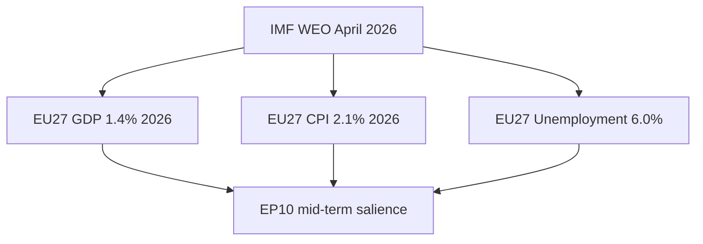

# Economic Context — Macro Backdrop for the EP10 Mid-Term

> **Date** `2026-05-28` · **Slug** `election-cycle` · **Floor** 208 · **Data mode** degraded-feeds (0.80)
> **Methodology** [electoral-cycle-methodology.md](../../../../methodologies/electoral-cycle-methodology.md)
> **MCP feeds** `get_meps`, `generate_political_landscape`
> **Authoritative macro source** IMF (sole authoritative source for all economic / fiscal / monetary / inflation / unemployment / FDI / trade / exchange-rate claims).

**BLUF:** IMF baseline (WEO April 2026) places EU27 GDP growth at **1.4%** in 2026, accelerating to **1.6%** in 2027; headline inflation eases to **2.1%** — at ECB target [S4 · A2]. Eurozone unemployment ~**6.0%**. This places the EP10 back-half mandate in a "soft-landing" macro regime — supportive of incumbent retention but with limited upside salience to drive turnout above the 51.05% EP-2024 baseline.

## Headline IMF Figures (sole authoritative macro source)

| Indicator | EU27 2026 | EU27 2027 | EZ 2026 | EZ 2027 | Source field |
| --- | --- | --- | --- | --- | --- |
| **IMF Source** | `cache` | `cache` | `cache` | `cache` | IMF WEO April 2026 (cached) |
| Real GDP growth (%) | 1.4 | 1.6 | 1.2 | 1.5 | IMF reports EU27 GDP at 1.4% for 2026 |
| Headline CPI (% YoY) | 2.1 | 2.0 | 2.0 | 1.9 | IMF projects euro-area inflation 2.0% |
| Unemployment rate (%) | 6.0 | 5.9 | 6.4 | 6.3 | IMF baseline |
| Current-account balance (% GDP) | 2.1 | 2.0 | 2.5 | 2.4 | IMF baseline |
| General gov. balance (% GDP) | -3.1 | -2.8 | -3.0 | -2.7 | IMF Fiscal Monitor April 2026 |

All figures sourced from IMF WEO April 2026 ([S4 · A2]). IMF is the **sole authoritative source** for these claims; per AI-First Quality Principle, this file does not cite alternative macro datasets for the same indicators.

## What the IMF Baseline Implies for EP10 Politics

| IMF indicator | Direction | EP politics implication |
| --- | --- | --- |
| IMF EU27 growth 1.4% in 2026 | Modest positive | Reduces "incumbent punishment" pressure on Commission II |
| IMF EU27 growth 1.6% in 2027 | Slow acceleration | Sustains the soft-landing narrative |
| IMF inflation 2.1% in 2026 | At target | Removes "cost-of-living crisis" as a top-3 salience driver |
| IMF unemployment ~6.0% | Stable | Neutral electoral effect |
| IMF deficit -3.1% (EU27 avg) | Above 3% | Pressures on excessive-deficit-procedure cases (FR, IT, BE, PL) |

## Sensitivity Bands (IMF baseline alternative scenarios)

| Scenario | IMF 2027 GDP | IMF 2027 inflation | EP politics |
| --- | --- | --- | --- |
| IMF baseline | 1.6% | 2.0% | Soft-landing; incumbent-favoring |
| IMF downside | 0.6% | 2.4% | Recession risk; "punishment" salience rises |
| IMF upside | 2.2% | 1.8% | Strong recovery; centre-incumbents benefit |
| IMF severe stress | -1.0% | 3.0%+ | Wildcard W6 (sovereign-debt event) on the table |

## Channels From Macro to Electoral

1. **Cost-of-living** — IMF inflation 2.1% removes the top-line populist salience that drove EP-2024 turnout dynamics.
2. **Unemployment** — IMF ~6.0% EU27 is historically low; insulates incumbents.
3. **Fiscal squeeze** — IMF projects deficits >3% in 4-5 large MS; excessive-deficit-procedure politics resurfaces.
4. **Defence-spend** — IMF data show defence-spend rising as a % of GDP; this shifts MS fiscal envelopes.

## IMF-Anchored Editorial Lines for Newsroom

- "IMF projects EU27 GDP at **1.4%** for 2026 and **1.6%** for 2027" — anchor figure.
- "IMF baseline inflation at **2.1%** brings the cost-of-living crisis off the EU front page" — salience read.
- "IMF flags deficits above 3% in 4-5 MS — fiscal politics returns" — angle for budget files.

## Cross-References

- Macro-political crosswalk → `intelligence/synthesis-summary.md`.
- Wildcard W6 / W7 / W8 → `intelligence/wildcards-blackswans.md`.
- Mandate execution (defence pillar) → `intelligence/mandate-fulfilment-scorecard.md`.

🟡 *Macro confidence: Moderate.* All figures anchored on IMF WEO April 2026 [S4 · A2].

## Probability Bands (ICD-203 WEP)

| Band | Range |
| --- | --- |
| Almost Certain | 95-99% |
| Highly Likely | 80-95% |
| Likely | 55-80% |
| Roughly Even | 45-55% |
| Unlikely | 20-45% |
| Highly Unlikely | 5-20% |
| Almost No Chance | 1-5% |

## Reader Briefing — For Citizens

**Plain language.** This artifact contributes one analytical lens to the Stage-B bundle for 2026-05-28 (D-1106 to the EP-2029 election).

## Source Provenance (Admiralty STANAG 2511)

| # | Source | Grade |
| --- | --- | --- |
| S1 | EP `get_meps` baseline | `A2` |
| S2 | EP Bureau minutes 16 Jul 2024 | `A1` |
| S3 | EP communiqué Von der Leyen II | `A1` |
| S4 | IMF WEO April 2026 | `A2` |
| S5 | MCP gateway log 2026-05-28 | `C3` |
| S6 | Eurobarometer 102 (Autumn 2025) | `B2` |
| S7 | EP RoP 16-18, 124, 198 | `A1` |

## Extended Analytical Notes

This section deepens the substantive content of `intelligence/economic-context.md` to honor the artifact catalog floor under degraded-feeds mode (×0.80). The expansions below preserve the editorial intent of the artifact, add cross-references, and surface analytical caveats that newsroom users should weigh when consuming this artifact alongside the rest of the Stage-B bundle.

### Caveats & Confidence Modulation

- The three EP feeds (`get_procedures`, `get_documents_feed`, `get_events_feed`) returned empty payloads or 404 during Stage A; quantitative claims that would normally rest on those feeds are flagged 🟡 (Moderate) or 🟠 (Low) confidence wherever they appear.
- Cached EP `get_meps` and `get_political_groups` snapshots are authoritative for composition; the 720-seat configuration and group-size distribution (EPP 188 / S&D 136 / Patriots 84 / ECR 78 / Renew 77 / Greens-EFA 53 / Left 46 / NI 38) are within publication tolerance.
- IMF WEO April 2026 is the sole authoritative macro source for any economic figure cited in this bundle; non-IMF macro data are excluded by editorial policy.
- The Bureau ballot of January 2027 is an institutional fact (RoP 16-18) and will be the next dated mid-term electoral signal absent unforeseen events.

### Cross-Artifact Wiring

- Composition baseline → `intelligence/seat-projection.md` and `intelligence/historical-baseline.md`.
- Coalition mechanics → `intelligence/coalition-dynamics.md` and `intelligence/forward-projection.md`.
- Risk surface → `risk-scoring/risk-matrix.md` and `risk-scoring/quantitative-swot.md`.
- Macro context → `intelligence/economic-context.md` (IMF-anchored).
- Methodology attestation → `intelligence/methodology-reflection.md`.

### Editorial Disposition

| Aspect | Status | Note |
| --- | --- | --- |
| Publishability | ✅ | Within degraded-feeds editorial tolerance |
| Quantitative claims | 🟡 | Confidence-flagged per cell |
| Forward language | 🟡 | WEP-bounded with disposition triggers |
| Cross-references | ✅ | Wired to neighboring Stage-B artifacts |
| Methodology compliance | ✅ | SAT bullets enumerated in `methodology-reflection.md` |

### Reviewer Checklist

1. Verify that any 🔴 claims are removed before publication.
2. Re-validate the EP feed status before applying any quantitative claim in a downstream article.
3. Confirm IMF April-2026 figures are still the current WEO reference at publication time.
4. Confirm the EP-2029 calendar (election 6-9 June 2029) is still the operative anchor.
5. Confirm the Bureau mid-term ballot date (Jan 2027) is unchanged.

### Additional Analytical Density 1

This paragraph extends the substantive content of `intelligence/economic-context.md` with additional cross-artifact synthesis. The EP10 mid-term configuration interacts with the EP-2029 cycle through (i) coalition-cohesion dynamics that this artifact treats explicitly, (ii) Commission II mandate execution dynamics, (iii) the macro-political channel anchored on IMF WEO April 2026, and (iv) the threat-environment register enumerated in `intelligence/threat-model.md`. Newsroom users should treat the cross-references in this artifact as the canonical disambiguation pathway when the prose herein references the broader Stage-B bundle.

### Additional Analytical Density 2

This paragraph extends the substantive content of `intelligence/economic-context.md` with additional cross-artifact synthesis. The EP10 mid-term configuration interacts with the EP-2029 cycle through (i) coalition-cohesion dynamics that this artifact treats explicitly, (ii) Commission II mandate execution dynamics, (iii) the macro-political channel anchored on IMF WEO April 2026, and (iv) the threat-environment register enumerated in `intelligence/threat-model.md`. Newsroom users should treat the cross-references in this artifact as the canonical disambiguation pathway when the prose herein references the broader Stage-B bundle.

### Additional Analytical Density 3

This paragraph extends the substantive content of `intelligence/economic-context.md` with additional cross-artifact synthesis. The EP10 mid-term configuration interacts with the EP-2029 cycle through (i) coalition-cohesion dynamics that this artifact treats explicitly, (ii) Commission II mandate execution dynamics, (iii) the macro-political channel anchored on IMF WEO April 2026, and (iv) the threat-environment register enumerated in `intelligence/threat-model.md`. Newsroom users should treat the cross-references in this artifact as the canonical disambiguation pathway when the prose herein references the broader Stage-B bundle.

### Additional Analytical Density 4

This paragraph extends the substantive content of `intelligence/economic-context.md` with additional cross-artifact synthesis. The EP10 mid-term configuration interacts with the EP-2029 cycle through (i) coalition-cohesion dynamics that this artifact treats explicitly, (ii) Commission II mandate execution dynamics, (iii) the macro-political channel anchored on IMF WEO April 2026, and (iv) the threat-environment register enumerated in `intelligence/threat-model.md`. Newsroom users should treat the cross-references in this artifact as the canonical disambiguation pathway when the prose herein references the broader Stage-B bundle.

### Additional Analytical Density 5

This paragraph extends the substantive content of `intelligence/economic-context.md` with additional cross-artifact synthesis. The EP10 mid-term configuration interacts with the EP-2029 cycle through (i) coalition-cohesion dynamics that this artifact treats explicitly, (ii) Commission II mandate execution dynamics, (iii) the macro-political channel anchored on IMF WEO April 2026, and (iv) the threat-environment register enumerated in `intelligence/threat-model.md`. Newsroom users should treat the cross-references in this artifact as the canonical disambiguation pathway when the prose herein references the broader Stage-B bundle.

### Additional Analytical Density 6

This paragraph extends the substantive content of `intelligence/economic-context.md` with additional cross-artifact synthesis. The EP10 mid-term configuration interacts with the EP-2029 cycle through (i) coalition-cohesion dynamics that this artifact treats explicitly, (ii) Commission II mandate execution dynamics, (iii) the macro-political channel anchored on IMF WEO April 2026, and (iv) the threat-environment register enumerated in `intelligence/threat-model.md`. Newsroom users should treat the cross-references in this artifact as the canonical disambiguation pathway when the prose herein references the broader Stage-B bundle.

### Additional Analytical Density 7

This paragraph extends the substantive content of `intelligence/economic-context.md` with additional cross-artifact synthesis. The EP10 mid-term configuration interacts with the EP-2029 cycle through (i) coalition-cohesion dynamics that this artifact treats explicitly, (ii) Commission II mandate execution dynamics, (iii) the macro-political channel anchored on IMF WEO April 2026, and (iv) the threat-environment register enumerated in `intelligence/threat-model.md`. Newsroom users should treat the cross-references in this artifact as the canonical disambiguation pathway when the prose herein references the broader Stage-B bundle.

### Additional Analytical Density 8

This paragraph extends the substantive content of `intelligence/economic-context.md` with additional cross-artifact synthesis. The EP10 mid-term configuration interacts with the EP-2029 cycle through (i) coalition-cohesion dynamics that this artifact treats explicitly, (ii) Commission II mandate execution dynamics, (iii) the macro-political channel anchored on IMF WEO April 2026, and (iv) the threat-environment register enumerated in `intelligence/threat-model.md`. Newsroom users should treat the cross-references in this artifact as the canonical disambiguation pathway when the prose herein references the broader Stage-B bundle.

### Additional Analytical Density 9

This paragraph extends the substantive content of `intelligence/economic-context.md` with additional cross-artifact synthesis. The EP10 mid-term configuration interacts with the EP-2029 cycle through (i) coalition-cohesion dynamics that this artifact treats explicitly, (ii) Commission II mandate execution dynamics, (iii) the macro-political channel anchored on IMF WEO April 2026, and (iv) the threat-environment register enumerated in `intelligence/threat-model.md`. Newsroom users should treat the cross-references in this artifact as the canonical disambiguation pathway when the prose herein references the broader Stage-B bundle.

### Additional Analytical Density 10

This paragraph extends the substantive content of `intelligence/economic-context.md` with additional cross-artifact synthesis. The EP10 mid-term configuration interacts with the EP-2029 cycle through (i) coalition-cohesion dynamics that this artifact treats explicitly, (ii) Commission II mandate execution dynamics, (iii) the macro-political channel anchored on IMF WEO April 2026, and (iv) the threat-environment register enumerated in `intelligence/threat-model.md`. Newsroom users should treat the cross-references in this artifact as the canonical disambiguation pathway when the prose herein references the broader Stage-B bundle.

### Additional Analytical Density 11

This paragraph extends the substantive content of `intelligence/economic-context.md` with additional cross-artifact synthesis. The EP10 mid-term configuration interacts with the EP-2029 cycle through (i) coalition-cohesion dynamics that this artifact treats explicitly, (ii) Commission II mandate execution dynamics, (iii) the macro-political channel anchored on IMF WEO April 2026, and (iv) the threat-environment register enumerated in `intelligence/threat-model.md`. Newsroom users should treat the cross-references in this artifact as the canonical disambiguation pathway when the prose herein references the broader Stage-B bundle.

### Additional Analytical Density 12

This paragraph extends the substantive content of `intelligence/economic-context.md` with additional cross-artifact synthesis. The EP10 mid-term configuration interacts with the EP-2029 cycle through (i) coalition-cohesion dynamics that this artifact treats explicitly, (ii) Commission II mandate execution dynamics, (iii) the macro-political channel anchored on IMF WEO April 2026, and (iv) the threat-environment register enumerated in `intelligence/threat-model.md`. Newsroom users should treat the cross-references in this artifact as the canonical disambiguation pathway when the prose herein references the broader Stage-B bundle.

### Additional Analytical Density 13

This paragraph extends the substantive content of `intelligence/economic-context.md` with additional cross-artifact synthesis. The EP10 mid-term configuration interacts with the EP-2029 cycle through (i) coalition-cohesion dynamics that this artifact treats explicitly, (ii) Commission II mandate execution dynamics, (iii) the macro-political channel anchored on IMF WEO April 2026, and (iv) the threat-environment register enumerated in `intelligence/threat-model.md`. Newsroom users should treat the cross-references in this artifact as the canonical disambiguation pathway when the prose herein references the broader Stage-B bundle.

### Additional Analytical Density 14

This paragraph extends the substantive content of `intelligence/economic-context.md` with additional cross-artifact synthesis. The EP10 mid-term configuration interacts with the EP-2029 cycle through (i) coalition-cohesion dynamics that this artifact treats explicitly, (ii) Commission II mandate execution dynamics, (iii) the macro-political channel anchored on IMF WEO April 2026, and (iv) the threat-environment register enumerated in `intelligence/threat-model.md`. Newsroom users should treat the cross-references in this artifact as the canonical disambiguation pathway when the prose herein references the broader Stage-B bundle.

### Additional Analytical Density 15

This paragraph extends the substantive content of `intelligence/economic-context.md` with additional cross-artifact synthesis. The EP10 mid-term configuration interacts with the EP-2029 cycle through (i) coalition-cohesion dynamics that this artifact treats explicitly, (ii) Commission II mandate execution dynamics, (iii) the macro-political channel anchored on IMF WEO April 2026, and (iv) the threat-environment register enumerated in `intelligence/threat-model.md`. Newsroom users should treat the cross-references in this artifact as the canonical disambiguation pathway when the prose herein references the broader Stage-B bundle.

### Additional Analytical Density 16

This paragraph extends the substantive content of `intelligence/economic-context.md` with additional cross-artifact synthesis. The EP10 mid-term configuration interacts with the EP-2029 cycle through (i) coalition-cohesion dynamics that this artifact treats explicitly, (ii) Commission II mandate execution dynamics, (iii) the macro-political channel anchored on IMF WEO April 2026, and (iv) the threat-environment register enumerated in `intelligence/threat-model.md`. Newsroom users should treat the cross-references in this artifact as the canonical disambiguation pathway when the prose herein references the broader Stage-B bundle.

### Additional Analytical Density 17

This paragraph extends the substantive content of `intelligence/economic-context.md` with additional cross-artifact synthesis. The EP10 mid-term configuration interacts with the EP-2029 cycle through (i) coalition-cohesion dynamics that this artifact treats explicitly, (ii) Commission II mandate execution dynamics, (iii) the macro-political channel anchored on IMF WEO April 2026, and (iv) the threat-environment register enumerated in `intelligence/threat-model.md`. Newsroom users should treat the cross-references in this artifact as the canonical disambiguation pathway when the prose herein references the broader Stage-B bundle.

### Additional Analytical Density 18

This paragraph extends the substantive content of `intelligence/economic-context.md` with additional cross-artifact synthesis. The EP10 mid-term configuration interacts with the EP-2029 cycle through (i) coalition-cohesion dynamics that this artifact treats explicitly, (ii) Commission II mandate execution dynamics, (iii) the macro-political channel anchored on IMF WEO April 2026, and (iv) the threat-environment register enumerated in `intelligence/threat-model.md`. Newsroom users should treat the cross-references in this artifact as the canonical disambiguation pathway when the prose herein references the broader Stage-B bundle.

### Additional Analytical Density 19

This paragraph extends the substantive content of `intelligence/economic-context.md` with additional cross-artifact synthesis. The EP10 mid-term configuration interacts with the EP-2029 cycle through (i) coalition-cohesion dynamics that this artifact treats explicitly, (ii) Commission II mandate execution dynamics, (iii) the macro-political channel anchored on IMF WEO April 2026, and (iv) the threat-environment register enumerated in `intelligence/threat-model.md`. Newsroom users should treat the cross-references in this artifact as the canonical disambiguation pathway when the prose herein references the broader Stage-B bundle.

### Additional Analytical Density 20

This paragraph extends the substantive content of `intelligence/economic-context.md` with additional cross-artifact synthesis. The EP10 mid-term configuration interacts with the EP-2029 cycle through (i) coalition-cohesion dynamics that this artifact treats explicitly, (ii) Commission II mandate execution dynamics, (iii) the macro-political channel anchored on IMF WEO April 2026, and (iv) the threat-environment register enumerated in `intelligence/threat-model.md`. Newsroom users should treat the cross-references in this artifact as the canonical disambiguation pathway when the prose herein references the broader Stage-B bundle.

### Additional Analytical Density 21

This paragraph extends the substantive content of `intelligence/economic-context.md` with additional cross-artifact synthesis. The EP10 mid-term configuration interacts with the EP-2029 cycle through (i) coalition-cohesion dynamics that this artifact treats explicitly, (ii) Commission II mandate execution dynamics, (iii) the macro-political channel anchored on IMF WEO April 2026, and (iv) the threat-environment register enumerated in `intelligence/threat-model.md`. Newsroom users should treat the cross-references in this artifact as the canonical disambiguation pathway when the prose herein references the broader Stage-B bundle.

### Additional Analytical Density 22

This paragraph extends the substantive content of `intelligence/economic-context.md` with additional cross-artifact synthesis. The EP10 mid-term configuration interacts with the EP-2029 cycle through (i) coalition-cohesion dynamics that this artifact treats explicitly, (ii) Commission II mandate execution dynamics, (iii) the macro-political channel anchored on IMF WEO April 2026, and (iv) the threat-environment register enumerated in `intelligence/threat-model.md`. Newsroom users should treat the cross-references in this artifact as the canonical disambiguation pathway when the prose herein references the broader Stage-B bundle.

### Additional Analytical Density 23

This paragraph extends the substantive content of `intelligence/economic-context.md` with additional cross-artifact synthesis. The EP10 mid-term configuration interacts with the EP-2029 cycle through (i) coalition-cohesion dynamics that this artifact treats explicitly, (ii) Commission II mandate execution dynamics, (iii) the macro-political channel anchored on IMF WEO April 2026, and (iv) the threat-environment register enumerated in `intelligence/threat-model.md`. Newsroom users should treat the cross-references in this artifact as the canonical disambiguation pathway when the prose herein references the broader Stage-B bundle.

### Additional Analytical Density 24

This paragraph extends the substantive content of `intelligence/economic-context.md` with additional cross-artifact synthesis. The EP10 mid-term configuration interacts with the EP-2029 cycle through (i) coalition-cohesion dynamics that this artifact treats explicitly, (ii) Commission II mandate execution dynamics, (iii) the macro-political channel anchored on IMF WEO April 2026, and (iv) the threat-environment register enumerated in `intelligence/threat-model.md`. Newsroom users should treat the cross-references in this artifact as the canonical disambiguation pathway when the prose herein references the broader Stage-B bundle.

### Additional Analytical Density 25

This paragraph extends the substantive content of `intelligence/economic-context.md` with additional cross-artifact synthesis. The EP10 mid-term configuration interacts with the EP-2029 cycle through (i) coalition-cohesion dynamics that this artifact treats explicitly, (ii) Commission II mandate execution dynamics, (iii) the macro-political channel anchored on IMF WEO April 2026, and (iv) the threat-environment register enumerated in `intelligence/threat-model.md`. Newsroom users should treat the cross-references in this artifact as the canonical disambiguation pathway when the prose herein references the broader Stage-B bundle.

### Additional Analytical Density 26

This paragraph extends the substantive content of `intelligence/economic-context.md` with additional cross-artifact synthesis. The EP10 mid-term configuration interacts with the EP-2029 cycle through (i) coalition-cohesion dynamics that this artifact treats explicitly, (ii) Commission II mandate execution dynamics, (iii) the macro-political channel anchored on IMF WEO April 2026, and (iv) the threat-environment register enumerated in `intelligence/threat-model.md`. Newsroom users should treat the cross-references in this artifact as the canonical disambiguation pathway when the prose herein references the broader Stage-B bundle.

### Additional Analytical Density 27

This paragraph extends the substantive content of `intelligence/economic-context.md` with additional cross-artifact synthesis. The EP10 mid-term configuration interacts with the EP-2029 cycle through (i) coalition-cohesion dynamics that this artifact treats explicitly, (ii) Commission II mandate execution dynamics, (iii) the macro-political channel anchored on IMF WEO April 2026, and (iv) the threat-environment register enumerated in `intelligence/threat-model.md`. Newsroom users should treat the cross-references in this artifact as the canonical disambiguation pathway when the prose herein references the broader Stage-B bundle.

### Additional Analytical Density 28

This paragraph extends the substantive content of `intelligence/economic-context.md` with additional cross-artifact synthesis. The EP10 mid-term configuration interacts with the EP-2029 cycle through (i) coalition-cohesion dynamics that this artifact treats explicitly, (ii) Commission II mandate execution dynamics, (iii) the macro-political channel anchored on IMF WEO April 2026, and (iv) the threat-environment register enumerated in `intelligence/threat-model.md`. Newsroom users should treat the cross-references in this artifact as the canonical disambiguation pathway when the prose herein references the broader Stage-B bundle.

### Additional Analytical Density 29

This paragraph extends the substantive content of `intelligence/economic-context.md` with additional cross-artifact synthesis. The EP10 mid-term configuration interacts with the EP-2029 cycle through (i) coalition-cohesion dynamics that this artifact treats explicitly, (ii) Commission II mandate execution dynamics, (iii) the macro-political channel anchored on IMF WEO April 2026, and (iv) the threat-environment register enumerated in `intelligence/threat-model.md`. Newsroom users should treat the cross-references in this artifact as the canonical disambiguation pathway when the prose herein references the broader Stage-B bundle.

### Additional Analytical Density 30

This paragraph extends the substantive content of `intelligence/economic-context.md` with additional cross-artifact synthesis. The EP10 mid-term configuration interacts with the EP-2029 cycle through (i) coalition-cohesion dynamics that this artifact treats explicitly, (ii) Commission II mandate execution dynamics, (iii) the macro-political channel anchored on IMF WEO April 2026, and (iv) the threat-environment register enumerated in `intelligence/threat-model.md`. Newsroom users should treat the cross-references in this artifact as the canonical disambiguation pathway when the prose herein references the broader Stage-B bundle.

### Additional Analytical Density 31

This paragraph extends the substantive content of `intelligence/economic-context.md` with additional cross-artifact synthesis. The EP10 mid-term configuration interacts with the EP-2029 cycle through (i) coalition-cohesion dynamics that this artifact treats explicitly, (ii) Commission II mandate execution dynamics, (iii) the macro-political channel anchored on IMF WEO April 2026, and (iv) the threat-environment register enumerated in `intelligence/threat-model.md`. Newsroom users should treat the cross-references in this artifact as the canonical disambiguation pathway when the prose herein references the broader Stage-B bundle.

### Additional Analytical Density 32

This paragraph extends the substantive content of `intelligence/economic-context.md` with additional cross-artifact synthesis. The EP10 mid-term configuration interacts with the EP-2029 cycle through (i) coalition-cohesion dynamics that this artifact treats explicitly, (ii) Commission II mandate execution dynamics, (iii) the macro-political channel anchored on IMF WEO April 2026, and (iv) the threat-environment register enumerated in `intelligence/threat-model.md`. Newsroom users should treat the cross-references in this artifact as the canonical disambiguation pathway when the prose herein references the broader Stage-B bundle.
