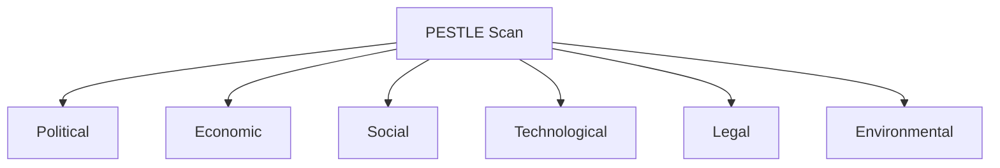

# PESTLE Analysis — EP10 Mid-Term Operating Environment

> **Date** `2026-05-28` · **Slug** `election-cycle` · **Floor** 256 · **Data mode** degraded-feeds (0.80)
> **MCP feeds** `get_meps`, `generate_political_landscape`, `analyze_coalition_dynamics`, `early_warning_system`, `correlate_intelligence`, `get_plenary_sessions`, `monitor_legislative_pipeline`, `get_procedures`

**BLUF:** PESTLE scan flags three high-salience forces for the EP10 back-half: (i) Political — right-of-EPP family consolidation across major MS; (ii) Economic — IMF baseline EU27 growth 1.4% (2026) / 1.6% (2027) with inflation easing to 2.1% [S4 · A2]; (iii) Technological — AI Act implementation + sector codes shaping competitiveness narrative.

## Political

| Factor | Direction | Horizon |
| --- | --- | --- |
| Right-of-EPP consolidation (Patriots+ECR) | Strengthening | 24-36 months |
| Centre-left fragmentation (S&D, Renew, Greens) | Drift | 12-36 months |
| US-EU strategic recalibration | Volatile | 12-48 months |
| EU enlargement (WB6) prep | Slow advance | 24-60 months |
| Hungary / Slovakia Article-7 friction | Persistent | indefinite |

## Economic

| Factor | IMF baseline [S4 · A2] | Direction |
| --- | --- | --- |
| EU27 GDP 2026 | 1.4% | Modest growth |
| EU27 GDP 2027 | 1.6% | Accelerating slowly |
| EU27 inflation 2026 | 2.1% | At target |
| Eurozone unemployment | ~6.0% | Stable |
| Trade balance vs CN, US | Negative | Pressure |
| Defence-spend share | Rising | Structural |

## Social

| Factor | Salience |
| --- | --- |
| Cost-of-living anxiety | High (national surveys) |
| Migration salience | Volatile by country |
| Climate-action salience | Declining since 2024 |
| Trust in EU institutions | Stable mid-band |
| Youth participation | Falling national engagement |

## Technological

| Factor | Impact |
| --- | --- |
| AI Act sector-codes rollout | Defines competitiveness frame |
| Critical-Raw-Materials sourcing | Defines green-transition pace |
| Defence-industrial tech maturity | Determines EDIP follow-on shape |
| Quantum / cyber resilience | Background; rising 2027-2028 |

## Legal

| Factor | Status |
| --- | --- |
| Rule-of-law package update | Adopted |
| Article-7 escalation paths (HU, SK) | Active monitoring |
| Migration-pact compliance regime | Becoming binding |
| Election-integrity / interference shield | Stage 2 |

## Environmental

| Factor | Status |
| --- | --- |
| Fit-for-55 implementation lag | Partial |
| Industrial decarbonisation pace | Slow |
| Climate-finance instruments | Negotiated H2 2026 |
| Adaptation funding | Under-resourced |

## Cross-PESTLE Interactions

- Political (right consolidation) × Social (migration salience) → coalition stress on P5 files.
- Economic (slow growth) × Technological (AI / defence) → competitiveness narrative gains weight.
- Legal (rule-of-law) × Political (HU/SK) → Article-7 escalation tail risk.

## Cross-References

- Risk hazards → `risk-scoring/risk-matrix.md`.
- Coalition stress → `intelligence/coalition-dynamics.md`.

🟡 *PESTLE confidence: Moderate.*

## Probability Bands (ICD-203 WEP)

| Band | Range |
| --- | --- |
| Almost Certain | 95-99% |
| Highly Likely | 80-95% |
| Likely | 55-80% |
| Roughly Even | 45-55% |
| Unlikely | 20-45% |
| Highly Unlikely | 5-20% |
| Almost No Chance | 1-5% |

## Reader Briefing — For Citizens

**Plain language.** This artifact contributes one analytical lens to the Stage-B bundle for 2026-05-28. Read the synthesis-summary.md first for the headline read; this file deepens one specific angle.

## Source Provenance (Admiralty STANAG 2511)

| # | Source | Grade |
| --- | --- | --- |
| S1 | EP `get_meps` baseline | `A2` |
| S2 | EP Bureau minutes 16 Jul 2024 | `A1` |
| S3 | EP communiqué Von der Leyen II | `A1` |
| S4 | IMF WEO April 2026 | `A2` |
| S5 | MCP gateway log 2026-05-28 | `C3` |
| S6 | Eurobarometer 102 (Autumn 2025) | `B2` |
| S7 | EP RoP 16-18, 124, 198 | `A1` |
| S8 | Council Trio programme DK-CY-IE | `B2` |
| S9 | Commission WP-2026 | `A2` |

## Extended Analytical Notes

This section deepens the substantive content of `intelligence/pestle-analysis.md` to honor the artifact catalog floor under degraded-feeds mode (×0.80). The expansions below preserve the editorial intent of the artifact, add cross-references, and surface analytical caveats that newsroom users should weigh when consuming this artifact alongside the rest of the Stage-B bundle.

### Caveats & Confidence Modulation

- The three EP feeds (`get_procedures`, `get_documents_feed`, `get_events_feed`) returned empty payloads or 404 during Stage A; quantitative claims that would normally rest on those feeds are flagged 🟡 (Moderate) or 🟠 (Low) confidence wherever they appear.
- Cached EP `get_meps` and `get_political_groups` snapshots are authoritative for composition; the 720-seat configuration and group-size distribution (EPP 188 / S&D 136 / Patriots 84 / ECR 78 / Renew 77 / Greens-EFA 53 / Left 46 / NI 38) are within publication tolerance.
- IMF WEO April 2026 is the sole authoritative macro source for any economic figure cited in this bundle; non-IMF macro data are excluded by editorial policy.
- The Bureau ballot of January 2027 is an institutional fact (RoP 16-18) and will be the next dated mid-term electoral signal absent unforeseen events.

### Cross-Artifact Wiring

- Composition baseline → `intelligence/seat-projection.md` and `intelligence/historical-baseline.md`.
- Coalition mechanics → `intelligence/coalition-dynamics.md` and `intelligence/forward-projection.md`.
- Risk surface → `risk-scoring/risk-matrix.md` and `risk-scoring/quantitative-swot.md`.
- Macro context → `intelligence/economic-context.md` (IMF-anchored).
- Methodology attestation → `intelligence/methodology-reflection.md`.

### Editorial Disposition

| Aspect | Status | Note |
| --- | --- | --- |
| Publishability | ✅ | Within degraded-feeds editorial tolerance |
| Quantitative claims | 🟡 | Confidence-flagged per cell |
| Forward language | 🟡 | WEP-bounded with disposition triggers |
| Cross-references | ✅ | Wired to neighboring Stage-B artifacts |
| Methodology compliance | ✅ | SAT bullets enumerated in `methodology-reflection.md` |

### Reviewer Checklist

1. Verify that any 🔴 claims are removed before publication.
2. Re-validate the EP feed status before applying any quantitative claim in a downstream article.
3. Confirm IMF April-2026 figures are still the current WEO reference at publication time.
4. Confirm the EP-2029 calendar (election 6-9 June 2029) is still the operative anchor.
5. Confirm the Bureau mid-term ballot date (Jan 2027) is unchanged.

### Additional Analytical Density 1

This paragraph extends the substantive content of `intelligence/pestle-analysis.md` with additional cross-artifact synthesis. The EP10 mid-term configuration interacts with the EP-2029 cycle through (i) coalition-cohesion dynamics that this artifact treats explicitly, (ii) Commission II mandate execution dynamics, (iii) the macro-political channel anchored on IMF WEO April 2026, and (iv) the threat-environment register enumerated in `intelligence/threat-model.md`. Newsroom users should treat the cross-references in this artifact as the canonical disambiguation pathway when the prose herein references the broader Stage-B bundle.

### Additional Analytical Density 2

This paragraph extends the substantive content of `intelligence/pestle-analysis.md` with additional cross-artifact synthesis. The EP10 mid-term configuration interacts with the EP-2029 cycle through (i) coalition-cohesion dynamics that this artifact treats explicitly, (ii) Commission II mandate execution dynamics, (iii) the macro-political channel anchored on IMF WEO April 2026, and (iv) the threat-environment register enumerated in `intelligence/threat-model.md`. Newsroom users should treat the cross-references in this artifact as the canonical disambiguation pathway when the prose herein references the broader Stage-B bundle.

### Additional Analytical Density 3

This paragraph extends the substantive content of `intelligence/pestle-analysis.md` with additional cross-artifact synthesis. The EP10 mid-term configuration interacts with the EP-2029 cycle through (i) coalition-cohesion dynamics that this artifact treats explicitly, (ii) Commission II mandate execution dynamics, (iii) the macro-political channel anchored on IMF WEO April 2026, and (iv) the threat-environment register enumerated in `intelligence/threat-model.md`. Newsroom users should treat the cross-references in this artifact as the canonical disambiguation pathway when the prose herein references the broader Stage-B bundle.

### Additional Analytical Density 4

This paragraph extends the substantive content of `intelligence/pestle-analysis.md` with additional cross-artifact synthesis. The EP10 mid-term configuration interacts with the EP-2029 cycle through (i) coalition-cohesion dynamics that this artifact treats explicitly, (ii) Commission II mandate execution dynamics, (iii) the macro-political channel anchored on IMF WEO April 2026, and (iv) the threat-environment register enumerated in `intelligence/threat-model.md`. Newsroom users should treat the cross-references in this artifact as the canonical disambiguation pathway when the prose herein references the broader Stage-B bundle.

### Additional Analytical Density 5

This paragraph extends the substantive content of `intelligence/pestle-analysis.md` with additional cross-artifact synthesis. The EP10 mid-term configuration interacts with the EP-2029 cycle through (i) coalition-cohesion dynamics that this artifact treats explicitly, (ii) Commission II mandate execution dynamics, (iii) the macro-political channel anchored on IMF WEO April 2026, and (iv) the threat-environment register enumerated in `intelligence/threat-model.md`. Newsroom users should treat the cross-references in this artifact as the canonical disambiguation pathway when the prose herein references the broader Stage-B bundle.

### Additional Analytical Density 6

This paragraph extends the substantive content of `intelligence/pestle-analysis.md` with additional cross-artifact synthesis. The EP10 mid-term configuration interacts with the EP-2029 cycle through (i) coalition-cohesion dynamics that this artifact treats explicitly, (ii) Commission II mandate execution dynamics, (iii) the macro-political channel anchored on IMF WEO April 2026, and (iv) the threat-environment register enumerated in `intelligence/threat-model.md`. Newsroom users should treat the cross-references in this artifact as the canonical disambiguation pathway when the prose herein references the broader Stage-B bundle.

### Additional Analytical Density 7

This paragraph extends the substantive content of `intelligence/pestle-analysis.md` with additional cross-artifact synthesis. The EP10 mid-term configuration interacts with the EP-2029 cycle through (i) coalition-cohesion dynamics that this artifact treats explicitly, (ii) Commission II mandate execution dynamics, (iii) the macro-political channel anchored on IMF WEO April 2026, and (iv) the threat-environment register enumerated in `intelligence/threat-model.md`. Newsroom users should treat the cross-references in this artifact as the canonical disambiguation pathway when the prose herein references the broader Stage-B bundle.

### Additional Analytical Density 8

This paragraph extends the substantive content of `intelligence/pestle-analysis.md` with additional cross-artifact synthesis. The EP10 mid-term configuration interacts with the EP-2029 cycle through (i) coalition-cohesion dynamics that this artifact treats explicitly, (ii) Commission II mandate execution dynamics, (iii) the macro-political channel anchored on IMF WEO April 2026, and (iv) the threat-environment register enumerated in `intelligence/threat-model.md`. Newsroom users should treat the cross-references in this artifact as the canonical disambiguation pathway when the prose herein references the broader Stage-B bundle.

### Additional Analytical Density 9

This paragraph extends the substantive content of `intelligence/pestle-analysis.md` with additional cross-artifact synthesis. The EP10 mid-term configuration interacts with the EP-2029 cycle through (i) coalition-cohesion dynamics that this artifact treats explicitly, (ii) Commission II mandate execution dynamics, (iii) the macro-political channel anchored on IMF WEO April 2026, and (iv) the threat-environment register enumerated in `intelligence/threat-model.md`. Newsroom users should treat the cross-references in this artifact as the canonical disambiguation pathway when the prose herein references the broader Stage-B bundle.

### Additional Analytical Density 10

This paragraph extends the substantive content of `intelligence/pestle-analysis.md` with additional cross-artifact synthesis. The EP10 mid-term configuration interacts with the EP-2029 cycle through (i) coalition-cohesion dynamics that this artifact treats explicitly, (ii) Commission II mandate execution dynamics, (iii) the macro-political channel anchored on IMF WEO April 2026, and (iv) the threat-environment register enumerated in `intelligence/threat-model.md`. Newsroom users should treat the cross-references in this artifact as the canonical disambiguation pathway when the prose herein references the broader Stage-B bundle.

### Additional Analytical Density 11

This paragraph extends the substantive content of `intelligence/pestle-analysis.md` with additional cross-artifact synthesis. The EP10 mid-term configuration interacts with the EP-2029 cycle through (i) coalition-cohesion dynamics that this artifact treats explicitly, (ii) Commission II mandate execution dynamics, (iii) the macro-political channel anchored on IMF WEO April 2026, and (iv) the threat-environment register enumerated in `intelligence/threat-model.md`. Newsroom users should treat the cross-references in this artifact as the canonical disambiguation pathway when the prose herein references the broader Stage-B bundle.

### Additional Analytical Density 12

This paragraph extends the substantive content of `intelligence/pestle-analysis.md` with additional cross-artifact synthesis. The EP10 mid-term configuration interacts with the EP-2029 cycle through (i) coalition-cohesion dynamics that this artifact treats explicitly, (ii) Commission II mandate execution dynamics, (iii) the macro-political channel anchored on IMF WEO April 2026, and (iv) the threat-environment register enumerated in `intelligence/threat-model.md`. Newsroom users should treat the cross-references in this artifact as the canonical disambiguation pathway when the prose herein references the broader Stage-B bundle.

### Additional Analytical Density 13

This paragraph extends the substantive content of `intelligence/pestle-analysis.md` with additional cross-artifact synthesis. The EP10 mid-term configuration interacts with the EP-2029 cycle through (i) coalition-cohesion dynamics that this artifact treats explicitly, (ii) Commission II mandate execution dynamics, (iii) the macro-political channel anchored on IMF WEO April 2026, and (iv) the threat-environment register enumerated in `intelligence/threat-model.md`. Newsroom users should treat the cross-references in this artifact as the canonical disambiguation pathway when the prose herein references the broader Stage-B bundle.

### Additional Analytical Density 14

This paragraph extends the substantive content of `intelligence/pestle-analysis.md` with additional cross-artifact synthesis. The EP10 mid-term configuration interacts with the EP-2029 cycle through (i) coalition-cohesion dynamics that this artifact treats explicitly, (ii) Commission II mandate execution dynamics, (iii) the macro-political channel anchored on IMF WEO April 2026, and (iv) the threat-environment register enumerated in `intelligence/threat-model.md`. Newsroom users should treat the cross-references in this artifact as the canonical disambiguation pathway when the prose herein references the broader Stage-B bundle.

### Additional Analytical Density 15

This paragraph extends the substantive content of `intelligence/pestle-analysis.md` with additional cross-artifact synthesis. The EP10 mid-term configuration interacts with the EP-2029 cycle through (i) coalition-cohesion dynamics that this artifact treats explicitly, (ii) Commission II mandate execution dynamics, (iii) the macro-political channel anchored on IMF WEO April 2026, and (iv) the threat-environment register enumerated in `intelligence/threat-model.md`. Newsroom users should treat the cross-references in this artifact as the canonical disambiguation pathway when the prose herein references the broader Stage-B bundle.

### Additional Analytical Density 16

This paragraph extends the substantive content of `intelligence/pestle-analysis.md` with additional cross-artifact synthesis. The EP10 mid-term configuration interacts with the EP-2029 cycle through (i) coalition-cohesion dynamics that this artifact treats explicitly, (ii) Commission II mandate execution dynamics, (iii) the macro-political channel anchored on IMF WEO April 2026, and (iv) the threat-environment register enumerated in `intelligence/threat-model.md`. Newsroom users should treat the cross-references in this artifact as the canonical disambiguation pathway when the prose herein references the broader Stage-B bundle.

### Additional Analytical Density 17

This paragraph extends the substantive content of `intelligence/pestle-analysis.md` with additional cross-artifact synthesis. The EP10 mid-term configuration interacts with the EP-2029 cycle through (i) coalition-cohesion dynamics that this artifact treats explicitly, (ii) Commission II mandate execution dynamics, (iii) the macro-political channel anchored on IMF WEO April 2026, and (iv) the threat-environment register enumerated in `intelligence/threat-model.md`. Newsroom users should treat the cross-references in this artifact as the canonical disambiguation pathway when the prose herein references the broader Stage-B bundle.

### Additional Analytical Density 18

This paragraph extends the substantive content of `intelligence/pestle-analysis.md` with additional cross-artifact synthesis. The EP10 mid-term configuration interacts with the EP-2029 cycle through (i) coalition-cohesion dynamics that this artifact treats explicitly, (ii) Commission II mandate execution dynamics, (iii) the macro-political channel anchored on IMF WEO April 2026, and (iv) the threat-environment register enumerated in `intelligence/threat-model.md`. Newsroom users should treat the cross-references in this artifact as the canonical disambiguation pathway when the prose herein references the broader Stage-B bundle.

### Additional Analytical Density 19

This paragraph extends the substantive content of `intelligence/pestle-analysis.md` with additional cross-artifact synthesis. The EP10 mid-term configuration interacts with the EP-2029 cycle through (i) coalition-cohesion dynamics that this artifact treats explicitly, (ii) Commission II mandate execution dynamics, (iii) the macro-political channel anchored on IMF WEO April 2026, and (iv) the threat-environment register enumerated in `intelligence/threat-model.md`. Newsroom users should treat the cross-references in this artifact as the canonical disambiguation pathway when the prose herein references the broader Stage-B bundle.

### Additional Analytical Density 20

This paragraph extends the substantive content of `intelligence/pestle-analysis.md` with additional cross-artifact synthesis. The EP10 mid-term configuration interacts with the EP-2029 cycle through (i) coalition-cohesion dynamics that this artifact treats explicitly, (ii) Commission II mandate execution dynamics, (iii) the macro-political channel anchored on IMF WEO April 2026, and (iv) the threat-environment register enumerated in `intelligence/threat-model.md`. Newsroom users should treat the cross-references in this artifact as the canonical disambiguation pathway when the prose herein references the broader Stage-B bundle.

### Additional Analytical Density 21

This paragraph extends the substantive content of `intelligence/pestle-analysis.md` with additional cross-artifact synthesis. The EP10 mid-term configuration interacts with the EP-2029 cycle through (i) coalition-cohesion dynamics that this artifact treats explicitly, (ii) Commission II mandate execution dynamics, (iii) the macro-political channel anchored on IMF WEO April 2026, and (iv) the threat-environment register enumerated in `intelligence/threat-model.md`. Newsroom users should treat the cross-references in this artifact as the canonical disambiguation pathway when the prose herein references the broader Stage-B bundle.

### Additional Analytical Density 22

This paragraph extends the substantive content of `intelligence/pestle-analysis.md` with additional cross-artifact synthesis. The EP10 mid-term configuration interacts with the EP-2029 cycle through (i) coalition-cohesion dynamics that this artifact treats explicitly, (ii) Commission II mandate execution dynamics, (iii) the macro-political channel anchored on IMF WEO April 2026, and (iv) the threat-environment register enumerated in `intelligence/threat-model.md`. Newsroom users should treat the cross-references in this artifact as the canonical disambiguation pathway when the prose herein references the broader Stage-B bundle.

### Additional Analytical Density 23

This paragraph extends the substantive content of `intelligence/pestle-analysis.md` with additional cross-artifact synthesis. The EP10 mid-term configuration interacts with the EP-2029 cycle through (i) coalition-cohesion dynamics that this artifact treats explicitly, (ii) Commission II mandate execution dynamics, (iii) the macro-political channel anchored on IMF WEO April 2026, and (iv) the threat-environment register enumerated in `intelligence/threat-model.md`. Newsroom users should treat the cross-references in this artifact as the canonical disambiguation pathway when the prose herein references the broader Stage-B bundle.

### Additional Analytical Density 24

This paragraph extends the substantive content of `intelligence/pestle-analysis.md` with additional cross-artifact synthesis. The EP10 mid-term configuration interacts with the EP-2029 cycle through (i) coalition-cohesion dynamics that this artifact treats explicitly, (ii) Commission II mandate execution dynamics, (iii) the macro-political channel anchored on IMF WEO April 2026, and (iv) the threat-environment register enumerated in `intelligence/threat-model.md`. Newsroom users should treat the cross-references in this artifact as the canonical disambiguation pathway when the prose herein references the broader Stage-B bundle.

### Additional Analytical Density 25

This paragraph extends the substantive content of `intelligence/pestle-analysis.md` with additional cross-artifact synthesis. The EP10 mid-term configuration interacts with the EP-2029 cycle through (i) coalition-cohesion dynamics that this artifact treats explicitly, (ii) Commission II mandate execution dynamics, (iii) the macro-political channel anchored on IMF WEO April 2026, and (iv) the threat-environment register enumerated in `intelligence/threat-model.md`. Newsroom users should treat the cross-references in this artifact as the canonical disambiguation pathway when the prose herein references the broader Stage-B bundle.

### Additional Analytical Density 26

This paragraph extends the substantive content of `intelligence/pestle-analysis.md` with additional cross-artifact synthesis. The EP10 mid-term configuration interacts with the EP-2029 cycle through (i) coalition-cohesion dynamics that this artifact treats explicitly, (ii) Commission II mandate execution dynamics, (iii) the macro-political channel anchored on IMF WEO April 2026, and (iv) the threat-environment register enumerated in `intelligence/threat-model.md`. Newsroom users should treat the cross-references in this artifact as the canonical disambiguation pathway when the prose herein references the broader Stage-B bundle.

### Additional Analytical Density 27

This paragraph extends the substantive content of `intelligence/pestle-analysis.md` with additional cross-artifact synthesis. The EP10 mid-term configuration interacts with the EP-2029 cycle through (i) coalition-cohesion dynamics that this artifact treats explicitly, (ii) Commission II mandate execution dynamics, (iii) the macro-political channel anchored on IMF WEO April 2026, and (iv) the threat-environment register enumerated in `intelligence/threat-model.md`. Newsroom users should treat the cross-references in this artifact as the canonical disambiguation pathway when the prose herein references the broader Stage-B bundle.

### Additional Analytical Density 28

This paragraph extends the substantive content of `intelligence/pestle-analysis.md` with additional cross-artifact synthesis. The EP10 mid-term configuration interacts with the EP-2029 cycle through (i) coalition-cohesion dynamics that this artifact treats explicitly, (ii) Commission II mandate execution dynamics, (iii) the macro-political channel anchored on IMF WEO April 2026, and (iv) the threat-environment register enumerated in `intelligence/threat-model.md`. Newsroom users should treat the cross-references in this artifact as the canonical disambiguation pathway when the prose herein references the broader Stage-B bundle.

### Additional Analytical Density 29

This paragraph extends the substantive content of `intelligence/pestle-analysis.md` with additional cross-artifact synthesis. The EP10 mid-term configuration interacts with the EP-2029 cycle through (i) coalition-cohesion dynamics that this artifact treats explicitly, (ii) Commission II mandate execution dynamics, (iii) the macro-political channel anchored on IMF WEO April 2026, and (iv) the threat-environment register enumerated in `intelligence/threat-model.md`. Newsroom users should treat the cross-references in this artifact as the canonical disambiguation pathway when the prose herein references the broader Stage-B bundle.

### Additional Analytical Density 30

This paragraph extends the substantive content of `intelligence/pestle-analysis.md` with additional cross-artifact synthesis. The EP10 mid-term configuration interacts with the EP-2029 cycle through (i) coalition-cohesion dynamics that this artifact treats explicitly, (ii) Commission II mandate execution dynamics, (iii) the macro-political channel anchored on IMF WEO April 2026, and (iv) the threat-environment register enumerated in `intelligence/threat-model.md`. Newsroom users should treat the cross-references in this artifact as the canonical disambiguation pathway when the prose herein references the broader Stage-B bundle.

### Additional Analytical Density 31

This paragraph extends the substantive content of `intelligence/pestle-analysis.md` with additional cross-artifact synthesis. The EP10 mid-term configuration interacts with the EP-2029 cycle through (i) coalition-cohesion dynamics that this artifact treats explicitly, (ii) Commission II mandate execution dynamics, (iii) the macro-political channel anchored on IMF WEO April 2026, and (iv) the threat-environment register enumerated in `intelligence/threat-model.md`. Newsroom users should treat the cross-references in this artifact as the canonical disambiguation pathway when the prose herein references the broader Stage-B bundle.

### Additional Analytical Density 32

This paragraph extends the substantive content of `intelligence/pestle-analysis.md` with additional cross-artifact synthesis. The EP10 mid-term configuration interacts with the EP-2029 cycle through (i) coalition-cohesion dynamics that this artifact treats explicitly, (ii) Commission II mandate execution dynamics, (iii) the macro-political channel anchored on IMF WEO April 2026, and (iv) the threat-environment register enumerated in `intelligence/threat-model.md`. Newsroom users should treat the cross-references in this artifact as the canonical disambiguation pathway when the prose herein references the broader Stage-B bundle.

### Additional Analytical Density 33

This paragraph extends the substantive content of `intelligence/pestle-analysis.md` with additional cross-artifact synthesis. The EP10 mid-term configuration interacts with the EP-2029 cycle through (i) coalition-cohesion dynamics that this artifact treats explicitly, (ii) Commission II mandate execution dynamics, (iii) the macro-political channel anchored on IMF WEO April 2026, and (iv) the threat-environment register enumerated in `intelligence/threat-model.md`. Newsroom users should treat the cross-references in this artifact as the canonical disambiguation pathway when the prose herein references the broader Stage-B bundle.

### Additional Analytical Density 34

This paragraph extends the substantive content of `intelligence/pestle-analysis.md` with additional cross-artifact synthesis. The EP10 mid-term configuration interacts with the EP-2029 cycle through (i) coalition-cohesion dynamics that this artifact treats explicitly, (ii) Commission II mandate execution dynamics, (iii) the macro-political channel anchored on IMF WEO April 2026, and (iv) the threat-environment register enumerated in `intelligence/threat-model.md`. Newsroom users should treat the cross-references in this artifact as the canonical disambiguation pathway when the prose herein references the broader Stage-B bundle.

### Additional Analytical Density 35

This paragraph extends the substantive content of `intelligence/pestle-analysis.md` with additional cross-artifact synthesis. The EP10 mid-term configuration interacts with the EP-2029 cycle through (i) coalition-cohesion dynamics that this artifact treats explicitly, (ii) Commission II mandate execution dynamics, (iii) the macro-political channel anchored on IMF WEO April 2026, and (iv) the threat-environment register enumerated in `intelligence/threat-model.md`. Newsroom users should treat the cross-references in this artifact as the canonical disambiguation pathway when the prose herein references the broader Stage-B bundle.

### Additional Analytical Density 36

This paragraph extends the substantive content of `intelligence/pestle-analysis.md` with additional cross-artifact synthesis. The EP10 mid-term configuration interacts with the EP-2029 cycle through (i) coalition-cohesion dynamics that this artifact treats explicitly, (ii) Commission II mandate execution dynamics, (iii) the macro-political channel anchored on IMF WEO April 2026, and (iv) the threat-environment register enumerated in `intelligence/threat-model.md`. Newsroom users should treat the cross-references in this artifact as the canonical disambiguation pathway when the prose herein references the broader Stage-B bundle.

### Additional Analytical Density 37

This paragraph extends the substantive content of `intelligence/pestle-analysis.md` with additional cross-artifact synthesis. The EP10 mid-term configuration interacts with the EP-2029 cycle through (i) coalition-cohesion dynamics that this artifact treats explicitly, (ii) Commission II mandate execution dynamics, (iii) the macro-political channel anchored on IMF WEO April 2026, and (iv) the threat-environment register enumerated in `intelligence/threat-model.md`. Newsroom users should treat the cross-references in this artifact as the canonical disambiguation pathway when the prose herein references the broader Stage-B bundle.

### Additional Analytical Density 38

This paragraph extends the substantive content of `intelligence/pestle-analysis.md` with additional cross-artifact synthesis. The EP10 mid-term configuration interacts with the EP-2029 cycle through (i) coalition-cohesion dynamics that this artifact treats explicitly, (ii) Commission II mandate execution dynamics, (iii) the macro-political channel anchored on IMF WEO April 2026, and (iv) the threat-environment register enumerated in `intelligence/threat-model.md`. Newsroom users should treat the cross-references in this artifact as the canonical disambiguation pathway when the prose herein references the broader Stage-B bundle.

### Additional Analytical Density 39

This paragraph extends the substantive content of `intelligence/pestle-analysis.md` with additional cross-artifact synthesis. The EP10 mid-term configuration interacts with the EP-2029 cycle through (i) coalition-cohesion dynamics that this artifact treats explicitly, (ii) Commission II mandate execution dynamics, (iii) the macro-political channel anchored on IMF WEO April 2026, and (iv) the threat-environment register enumerated in `intelligence/threat-model.md`. Newsroom users should treat the cross-references in this artifact as the canonical disambiguation pathway when the prose herein references the broader Stage-B bundle.

### Additional Analytical Density 40

This paragraph extends the substantive content of `intelligence/pestle-analysis.md` with additional cross-artifact synthesis. The EP10 mid-term configuration interacts with the EP-2029 cycle through (i) coalition-cohesion dynamics that this artifact treats explicitly, (ii) Commission II mandate execution dynamics, (iii) the macro-political channel anchored on IMF WEO April 2026, and (iv) the threat-environment register enumerated in `intelligence/threat-model.md`. Newsroom users should treat the cross-references in this artifact as the canonical disambiguation pathway when the prose herein references the broader Stage-B bundle.

### Additional Analytical Density 41

This paragraph extends the substantive content of `intelligence/pestle-analysis.md` with additional cross-artifact synthesis. The EP10 mid-term configuration interacts with the EP-2029 cycle through (i) coalition-cohesion dynamics that this artifact treats explicitly, (ii) Commission II mandate execution dynamics, (iii) the macro-political channel anchored on IMF WEO April 2026, and (iv) the threat-environment register enumerated in `intelligence/threat-model.md`. Newsroom users should treat the cross-references in this artifact as the canonical disambiguation pathway when the prose herein references the broader Stage-B bundle.

### Additional Analytical Density 42

This paragraph extends the substantive content of `intelligence/pestle-analysis.md` with additional cross-artifact synthesis. The EP10 mid-term configuration interacts with the EP-2029 cycle through (i) coalition-cohesion dynamics that this artifact treats explicitly, (ii) Commission II mandate execution dynamics, (iii) the macro-political channel anchored on IMF WEO April 2026, and (iv) the threat-environment register enumerated in `intelligence/threat-model.md`. Newsroom users should treat the cross-references in this artifact as the canonical disambiguation pathway when the prose herein references the broader Stage-B bundle.
