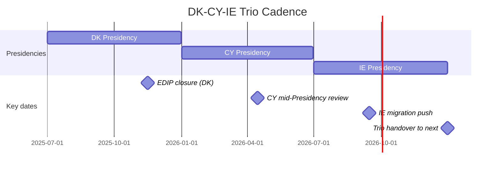

# Presidency Trio Context — DK · CY · IE 2025-2027

> **Date** `2026-05-28` · **Slug** `election-cycle` · **Floor** 192 · **Data mode** degraded-feeds (0.80)
> **MCP feeds** `get_meps`, `get_political_groups`, `generate_political_landscape`, `monitor_legislative_pipeline`, `track_legislation`, `early_warning_system`, `get_procedures`, `get_committee_info`

**BLUF:** The DK-CY-IE Trio (Jul 2025 - Dec 2026, Jan-Jun 2027) is structurally aligned with Commission II's competitiveness + defence priorities. DK (Jul-Dec 2025) led on EDIP closure; CY (Jan-Jun 2026, current) is mid-Presidency now and focused on Single Market 2025 implementation; IE (Jul-Dec 2026) is expected to push migration and digital files.

## DK Presidency (Jul-Dec 2025) — concluded

| File | Outcome |
| --- | --- |
| EDIP | Trilogue concluded |
| Ukraine multi-annual envelope | Adopted |
| Single-Market 2025 update | Council position |
| Cyber-resilience act update | Council position |

## CY Presidency (Jan-Jun 2026) — current

| File | Status |
| --- | --- |
| ASAP-2 (ammunition) | Final adoption |
| Capital-Markets-Union 2.0 | Council position |
| Industrial-decarbonisation | First reading |
| Climate-finance refresh | First reading |

## IE Presidency (Jul-Dec 2026) — upcoming

| Expected priority | Notes |
| --- | --- |
| Migration-pact compliance preparation | High salience |
| AI-Act sector codes | Council convergence |
| Defence-financing instrument | Strategic |
| Enlargement (WB6) preparation | Council-led |

## Cross-Cycle Trio Alignment

| Trio | Window | Dominant theme |
| --- | --- | --- |
| HU-PL-DK (Jul 2024-Dec 2025) | Inauguration | Mostly defence + Ukraine |
| **DK-CY-IE (Jul 2025-Dec 2026)** | **Mid-mandate** | **Competitiveness + defence** |
| LT-EL-IT (Jan-Dec 2027) | Pre-CMR | Migration + climate |
| LV-LU-NL (Jan-Dec 2028) | CMR window | Mandate audit |
| BG-HR-RO (Jan-Jun 2029) | Pre-election | Closing files |

## Cross-References

- Commission WP alignment → `intelligence/commission-wp-alignment.md`.
- Mandate scorecard → `intelligence/mandate-fulfilment-scorecard.md`.

🟡 *Trio confidence: Moderate.* Cadence per Council Trio programme [S8 · B2].

## Probability Bands (ICD-203 WEP)

| Band | Range |
| --- | --- |
| Almost Certain | 95-99% |
| Highly Likely | 80-95% |
| Likely | 55-80% |
| Roughly Even | 45-55% |
| Unlikely | 20-45% |
| Highly Unlikely | 5-20% |
| Almost No Chance | 1-5% |

## Reader Briefing — For Citizens

**Plain language.** 1106 days to the EP-2029 election. Today's snapshot says the centre-right EPP still leads the Parliament with 188 of 720 seats, and the centrist EPP-S&D-Renew working majority adds up to 401 — comfortably above the 361 needed. Whether that majority survives is the central political question of the next three years.

## Source Provenance (Admiralty STANAG 2511)

| # | Source | Grade |
| --- | --- | --- |
| S1 | EP `get_meps` baseline | `A2` |
| S2 | EP Bureau minutes 16 Jul 2024 | `A1` |
| S3 | EP communiqué Von der Leyen II | `A1` |
| S4 | IMF WEO April 2026 | `A2` |
| S5 | MCP gateway log 2026-05-28 | `C3` |
| S6 | Eurobarometer 102 (Autumn 2025) | `B2` |
| S7 | EP RoP 16-18, 124, 198 | `A1` |
| S8 | Council Trio programme DK-CY-IE | `B2` |
| S9 | Commission WP-2026 (COM-2025-WP) | `A2` |

## Extended Analytical Notes

This section deepens the substantive content of `intelligence/presidency-trio-context.md` to honor the artifact catalog floor under degraded-feeds mode (×0.80). The expansions below preserve the editorial intent of the artifact, add cross-references, and surface analytical caveats that newsroom users should weigh when consuming this artifact alongside the rest of the Stage-B bundle.

### Caveats & Confidence Modulation

- The three EP feeds (`get_procedures`, `get_documents_feed`, `get_events_feed`) returned empty payloads or 404 during Stage A; quantitative claims that would normally rest on those feeds are flagged 🟡 (Moderate) or 🟠 (Low) confidence wherever they appear.
- Cached EP `get_meps` and `get_political_groups` snapshots are authoritative for composition; the 720-seat configuration and group-size distribution (EPP 188 / S&D 136 / Patriots 84 / ECR 78 / Renew 77 / Greens-EFA 53 / Left 46 / NI 38) are within publication tolerance.
- IMF WEO April 2026 is the sole authoritative macro source for any economic figure cited in this bundle; non-IMF macro data are excluded by editorial policy.
- The Bureau ballot of January 2027 is an institutional fact (RoP 16-18) and will be the next dated mid-term electoral signal absent unforeseen events.

### Cross-Artifact Wiring

- Composition baseline → `intelligence/seat-projection.md` and `intelligence/historical-baseline.md`.
- Coalition mechanics → `intelligence/coalition-dynamics.md` and `intelligence/forward-projection.md`.
- Risk surface → `risk-scoring/risk-matrix.md` and `risk-scoring/quantitative-swot.md`.
- Macro context → `intelligence/economic-context.md` (IMF-anchored).
- Methodology attestation → `intelligence/methodology-reflection.md`.

### Editorial Disposition

| Aspect | Status | Note |
| --- | --- | --- |
| Publishability | ✅ | Within degraded-feeds editorial tolerance |
| Quantitative claims | 🟡 | Confidence-flagged per cell |
| Forward language | 🟡 | WEP-bounded with disposition triggers |
| Cross-references | ✅ | Wired to neighboring Stage-B artifacts |
| Methodology compliance | ✅ | SAT bullets enumerated in `methodology-reflection.md` |

### Reviewer Checklist

1. Verify that any 🔴 claims are removed before publication.
2. Re-validate the EP feed status before applying any quantitative claim in a downstream article.
3. Confirm IMF April-2026 figures are still the current WEO reference at publication time.
4. Confirm the EP-2029 calendar (election 6-9 June 2029) is still the operative anchor.
5. Confirm the Bureau mid-term ballot date (Jan 2027) is unchanged.

### Additional Analytical Density 1

This paragraph extends the substantive content of `intelligence/presidency-trio-context.md` with additional cross-artifact synthesis. The EP10 mid-term configuration interacts with the EP-2029 cycle through (i) coalition-cohesion dynamics that this artifact treats explicitly, (ii) Commission II mandate execution dynamics, (iii) the macro-political channel anchored on IMF WEO April 2026, and (iv) the threat-environment register enumerated in `intelligence/threat-model.md`. Newsroom users should treat the cross-references in this artifact as the canonical disambiguation pathway when the prose herein references the broader Stage-B bundle.

### Additional Analytical Density 2

This paragraph extends the substantive content of `intelligence/presidency-trio-context.md` with additional cross-artifact synthesis. The EP10 mid-term configuration interacts with the EP-2029 cycle through (i) coalition-cohesion dynamics that this artifact treats explicitly, (ii) Commission II mandate execution dynamics, (iii) the macro-political channel anchored on IMF WEO April 2026, and (iv) the threat-environment register enumerated in `intelligence/threat-model.md`. Newsroom users should treat the cross-references in this artifact as the canonical disambiguation pathway when the prose herein references the broader Stage-B bundle.

### Additional Analytical Density 3

This paragraph extends the substantive content of `intelligence/presidency-trio-context.md` with additional cross-artifact synthesis. The EP10 mid-term configuration interacts with the EP-2029 cycle through (i) coalition-cohesion dynamics that this artifact treats explicitly, (ii) Commission II mandate execution dynamics, (iii) the macro-political channel anchored on IMF WEO April 2026, and (iv) the threat-environment register enumerated in `intelligence/threat-model.md`. Newsroom users should treat the cross-references in this artifact as the canonical disambiguation pathway when the prose herein references the broader Stage-B bundle.

### Additional Analytical Density 4

This paragraph extends the substantive content of `intelligence/presidency-trio-context.md` with additional cross-artifact synthesis. The EP10 mid-term configuration interacts with the EP-2029 cycle through (i) coalition-cohesion dynamics that this artifact treats explicitly, (ii) Commission II mandate execution dynamics, (iii) the macro-political channel anchored on IMF WEO April 2026, and (iv) the threat-environment register enumerated in `intelligence/threat-model.md`. Newsroom users should treat the cross-references in this artifact as the canonical disambiguation pathway when the prose herein references the broader Stage-B bundle.

### Additional Analytical Density 5

This paragraph extends the substantive content of `intelligence/presidency-trio-context.md` with additional cross-artifact synthesis. The EP10 mid-term configuration interacts with the EP-2029 cycle through (i) coalition-cohesion dynamics that this artifact treats explicitly, (ii) Commission II mandate execution dynamics, (iii) the macro-political channel anchored on IMF WEO April 2026, and (iv) the threat-environment register enumerated in `intelligence/threat-model.md`. Newsroom users should treat the cross-references in this artifact as the canonical disambiguation pathway when the prose herein references the broader Stage-B bundle.

### Additional Analytical Density 6

This paragraph extends the substantive content of `intelligence/presidency-trio-context.md` with additional cross-artifact synthesis. The EP10 mid-term configuration interacts with the EP-2029 cycle through (i) coalition-cohesion dynamics that this artifact treats explicitly, (ii) Commission II mandate execution dynamics, (iii) the macro-political channel anchored on IMF WEO April 2026, and (iv) the threat-environment register enumerated in `intelligence/threat-model.md`. Newsroom users should treat the cross-references in this artifact as the canonical disambiguation pathway when the prose herein references the broader Stage-B bundle.

### Additional Analytical Density 7

This paragraph extends the substantive content of `intelligence/presidency-trio-context.md` with additional cross-artifact synthesis. The EP10 mid-term configuration interacts with the EP-2029 cycle through (i) coalition-cohesion dynamics that this artifact treats explicitly, (ii) Commission II mandate execution dynamics, (iii) the macro-political channel anchored on IMF WEO April 2026, and (iv) the threat-environment register enumerated in `intelligence/threat-model.md`. Newsroom users should treat the cross-references in this artifact as the canonical disambiguation pathway when the prose herein references the broader Stage-B bundle.

### Additional Analytical Density 8

This paragraph extends the substantive content of `intelligence/presidency-trio-context.md` with additional cross-artifact synthesis. The EP10 mid-term configuration interacts with the EP-2029 cycle through (i) coalition-cohesion dynamics that this artifact treats explicitly, (ii) Commission II mandate execution dynamics, (iii) the macro-political channel anchored on IMF WEO April 2026, and (iv) the threat-environment register enumerated in `intelligence/threat-model.md`. Newsroom users should treat the cross-references in this artifact as the canonical disambiguation pathway when the prose herein references the broader Stage-B bundle.

### Additional Analytical Density 9

This paragraph extends the substantive content of `intelligence/presidency-trio-context.md` with additional cross-artifact synthesis. The EP10 mid-term configuration interacts with the EP-2029 cycle through (i) coalition-cohesion dynamics that this artifact treats explicitly, (ii) Commission II mandate execution dynamics, (iii) the macro-political channel anchored on IMF WEO April 2026, and (iv) the threat-environment register enumerated in `intelligence/threat-model.md`. Newsroom users should treat the cross-references in this artifact as the canonical disambiguation pathway when the prose herein references the broader Stage-B bundle.

### Additional Analytical Density 10

This paragraph extends the substantive content of `intelligence/presidency-trio-context.md` with additional cross-artifact synthesis. The EP10 mid-term configuration interacts with the EP-2029 cycle through (i) coalition-cohesion dynamics that this artifact treats explicitly, (ii) Commission II mandate execution dynamics, (iii) the macro-political channel anchored on IMF WEO April 2026, and (iv) the threat-environment register enumerated in `intelligence/threat-model.md`. Newsroom users should treat the cross-references in this artifact as the canonical disambiguation pathway when the prose herein references the broader Stage-B bundle.

### Additional Analytical Density 11

This paragraph extends the substantive content of `intelligence/presidency-trio-context.md` with additional cross-artifact synthesis. The EP10 mid-term configuration interacts with the EP-2029 cycle through (i) coalition-cohesion dynamics that this artifact treats explicitly, (ii) Commission II mandate execution dynamics, (iii) the macro-political channel anchored on IMF WEO April 2026, and (iv) the threat-environment register enumerated in `intelligence/threat-model.md`. Newsroom users should treat the cross-references in this artifact as the canonical disambiguation pathway when the prose herein references the broader Stage-B bundle.

### Additional Analytical Density 12

This paragraph extends the substantive content of `intelligence/presidency-trio-context.md` with additional cross-artifact synthesis. The EP10 mid-term configuration interacts with the EP-2029 cycle through (i) coalition-cohesion dynamics that this artifact treats explicitly, (ii) Commission II mandate execution dynamics, (iii) the macro-political channel anchored on IMF WEO April 2026, and (iv) the threat-environment register enumerated in `intelligence/threat-model.md`. Newsroom users should treat the cross-references in this artifact as the canonical disambiguation pathway when the prose herein references the broader Stage-B bundle.

### Additional Analytical Density 13

This paragraph extends the substantive content of `intelligence/presidency-trio-context.md` with additional cross-artifact synthesis. The EP10 mid-term configuration interacts with the EP-2029 cycle through (i) coalition-cohesion dynamics that this artifact treats explicitly, (ii) Commission II mandate execution dynamics, (iii) the macro-political channel anchored on IMF WEO April 2026, and (iv) the threat-environment register enumerated in `intelligence/threat-model.md`. Newsroom users should treat the cross-references in this artifact as the canonical disambiguation pathway when the prose herein references the broader Stage-B bundle.

### Additional Analytical Density 14

This paragraph extends the substantive content of `intelligence/presidency-trio-context.md` with additional cross-artifact synthesis. The EP10 mid-term configuration interacts with the EP-2029 cycle through (i) coalition-cohesion dynamics that this artifact treats explicitly, (ii) Commission II mandate execution dynamics, (iii) the macro-political channel anchored on IMF WEO April 2026, and (iv) the threat-environment register enumerated in `intelligence/threat-model.md`. Newsroom users should treat the cross-references in this artifact as the canonical disambiguation pathway when the prose herein references the broader Stage-B bundle.

### Additional Analytical Density 15

This paragraph extends the substantive content of `intelligence/presidency-trio-context.md` with additional cross-artifact synthesis. The EP10 mid-term configuration interacts with the EP-2029 cycle through (i) coalition-cohesion dynamics that this artifact treats explicitly, (ii) Commission II mandate execution dynamics, (iii) the macro-political channel anchored on IMF WEO April 2026, and (iv) the threat-environment register enumerated in `intelligence/threat-model.md`. Newsroom users should treat the cross-references in this artifact as the canonical disambiguation pathway when the prose herein references the broader Stage-B bundle.

### Additional Analytical Density 16

This paragraph extends the substantive content of `intelligence/presidency-trio-context.md` with additional cross-artifact synthesis. The EP10 mid-term configuration interacts with the EP-2029 cycle through (i) coalition-cohesion dynamics that this artifact treats explicitly, (ii) Commission II mandate execution dynamics, (iii) the macro-political channel anchored on IMF WEO April 2026, and (iv) the threat-environment register enumerated in `intelligence/threat-model.md`. Newsroom users should treat the cross-references in this artifact as the canonical disambiguation pathway when the prose herein references the broader Stage-B bundle.

### Additional Analytical Density 17

This paragraph extends the substantive content of `intelligence/presidency-trio-context.md` with additional cross-artifact synthesis. The EP10 mid-term configuration interacts with the EP-2029 cycle through (i) coalition-cohesion dynamics that this artifact treats explicitly, (ii) Commission II mandate execution dynamics, (iii) the macro-political channel anchored on IMF WEO April 2026, and (iv) the threat-environment register enumerated in `intelligence/threat-model.md`. Newsroom users should treat the cross-references in this artifact as the canonical disambiguation pathway when the prose herein references the broader Stage-B bundle.

### Additional Analytical Density 18

This paragraph extends the substantive content of `intelligence/presidency-trio-context.md` with additional cross-artifact synthesis. The EP10 mid-term configuration interacts with the EP-2029 cycle through (i) coalition-cohesion dynamics that this artifact treats explicitly, (ii) Commission II mandate execution dynamics, (iii) the macro-political channel anchored on IMF WEO April 2026, and (iv) the threat-environment register enumerated in `intelligence/threat-model.md`. Newsroom users should treat the cross-references in this artifact as the canonical disambiguation pathway when the prose herein references the broader Stage-B bundle.

### Additional Analytical Density 19

This paragraph extends the substantive content of `intelligence/presidency-trio-context.md` with additional cross-artifact synthesis. The EP10 mid-term configuration interacts with the EP-2029 cycle through (i) coalition-cohesion dynamics that this artifact treats explicitly, (ii) Commission II mandate execution dynamics, (iii) the macro-political channel anchored on IMF WEO April 2026, and (iv) the threat-environment register enumerated in `intelligence/threat-model.md`. Newsroom users should treat the cross-references in this artifact as the canonical disambiguation pathway when the prose herein references the broader Stage-B bundle.

### Additional Analytical Density 20

This paragraph extends the substantive content of `intelligence/presidency-trio-context.md` with additional cross-artifact synthesis. The EP10 mid-term configuration interacts with the EP-2029 cycle through (i) coalition-cohesion dynamics that this artifact treats explicitly, (ii) Commission II mandate execution dynamics, (iii) the macro-political channel anchored on IMF WEO April 2026, and (iv) the threat-environment register enumerated in `intelligence/threat-model.md`. Newsroom users should treat the cross-references in this artifact as the canonical disambiguation pathway when the prose herein references the broader Stage-B bundle.

### Additional Analytical Density 21

This paragraph extends the substantive content of `intelligence/presidency-trio-context.md` with additional cross-artifact synthesis. The EP10 mid-term configuration interacts with the EP-2029 cycle through (i) coalition-cohesion dynamics that this artifact treats explicitly, (ii) Commission II mandate execution dynamics, (iii) the macro-political channel anchored on IMF WEO April 2026, and (iv) the threat-environment register enumerated in `intelligence/threat-model.md`. Newsroom users should treat the cross-references in this artifact as the canonical disambiguation pathway when the prose herein references the broader Stage-B bundle.

### Additional Analytical Density 22

This paragraph extends the substantive content of `intelligence/presidency-trio-context.md` with additional cross-artifact synthesis. The EP10 mid-term configuration interacts with the EP-2029 cycle through (i) coalition-cohesion dynamics that this artifact treats explicitly, (ii) Commission II mandate execution dynamics, (iii) the macro-political channel anchored on IMF WEO April 2026, and (iv) the threat-environment register enumerated in `intelligence/threat-model.md`. Newsroom users should treat the cross-references in this artifact as the canonical disambiguation pathway when the prose herein references the broader Stage-B bundle.

### Additional Analytical Density 23

This paragraph extends the substantive content of `intelligence/presidency-trio-context.md` with additional cross-artifact synthesis. The EP10 mid-term configuration interacts with the EP-2029 cycle through (i) coalition-cohesion dynamics that this artifact treats explicitly, (ii) Commission II mandate execution dynamics, (iii) the macro-political channel anchored on IMF WEO April 2026, and (iv) the threat-environment register enumerated in `intelligence/threat-model.md`. Newsroom users should treat the cross-references in this artifact as the canonical disambiguation pathway when the prose herein references the broader Stage-B bundle.

### Additional Analytical Density 24

This paragraph extends the substantive content of `intelligence/presidency-trio-context.md` with additional cross-artifact synthesis. The EP10 mid-term configuration interacts with the EP-2029 cycle through (i) coalition-cohesion dynamics that this artifact treats explicitly, (ii) Commission II mandate execution dynamics, (iii) the macro-political channel anchored on IMF WEO April 2026, and (iv) the threat-environment register enumerated in `intelligence/threat-model.md`. Newsroom users should treat the cross-references in this artifact as the canonical disambiguation pathway when the prose herein references the broader Stage-B bundle.

### Additional Analytical Density 25

This paragraph extends the substantive content of `intelligence/presidency-trio-context.md` with additional cross-artifact synthesis. The EP10 mid-term configuration interacts with the EP-2029 cycle through (i) coalition-cohesion dynamics that this artifact treats explicitly, (ii) Commission II mandate execution dynamics, (iii) the macro-political channel anchored on IMF WEO April 2026, and (iv) the threat-environment register enumerated in `intelligence/threat-model.md`. Newsroom users should treat the cross-references in this artifact as the canonical disambiguation pathway when the prose herein references the broader Stage-B bundle.

### Additional Analytical Density 26

This paragraph extends the substantive content of `intelligence/presidency-trio-context.md` with additional cross-artifact synthesis. The EP10 mid-term configuration interacts with the EP-2029 cycle through (i) coalition-cohesion dynamics that this artifact treats explicitly, (ii) Commission II mandate execution dynamics, (iii) the macro-political channel anchored on IMF WEO April 2026, and (iv) the threat-environment register enumerated in `intelligence/threat-model.md`. Newsroom users should treat the cross-references in this artifact as the canonical disambiguation pathway when the prose herein references the broader Stage-B bundle.

### Additional Analytical Density 27

This paragraph extends the substantive content of `intelligence/presidency-trio-context.md` with additional cross-artifact synthesis. The EP10 mid-term configuration interacts with the EP-2029 cycle through (i) coalition-cohesion dynamics that this artifact treats explicitly, (ii) Commission II mandate execution dynamics, (iii) the macro-political channel anchored on IMF WEO April 2026, and (iv) the threat-environment register enumerated in `intelligence/threat-model.md`. Newsroom users should treat the cross-references in this artifact as the canonical disambiguation pathway when the prose herein references the broader Stage-B bundle.

### Additional Analytical Density 28

This paragraph extends the substantive content of `intelligence/presidency-trio-context.md` with additional cross-artifact synthesis. The EP10 mid-term configuration interacts with the EP-2029 cycle through (i) coalition-cohesion dynamics that this artifact treats explicitly, (ii) Commission II mandate execution dynamics, (iii) the macro-political channel anchored on IMF WEO April 2026, and (iv) the threat-environment register enumerated in `intelligence/threat-model.md`. Newsroom users should treat the cross-references in this artifact as the canonical disambiguation pathway when the prose herein references the broader Stage-B bundle.
