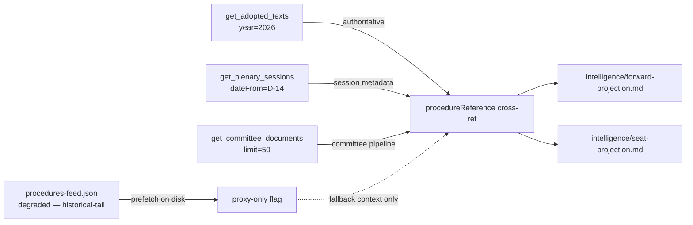

# Procedures Proxy — Degraded-Feeds Fallback

> The EP `/procedures-feed` endpoint is persistently degraded (historical-tail ordering, `STALENESS_WARNING`). On this re-run the prefetched `data/procedures-feed.json` file is on disk but downstream artifacts treat it as a **proxy-only** input; authoritative current-week activity is sourced from `get_adopted_texts(year=YYYY)` per [Rule 2a](../../../../.github/workflows/shared/prompts/news-unified-stages.md).

## 1. Proxy methodology

When procedures-feed is degraded, the analysis substitutes a three-step proxy:

1. **Adopted-texts cross-reference** — every adopted text carries a `procedureReference` field. Iterating across the most recent N adopted texts reconstructs an approximate procedures-pipeline view without relying on the degraded feed.
2. **Plenary-sessions endpoint** — `get_plenary_sessions(dateFrom=D-14)` provides session-level metadata unaffected by the events-feed 404 pattern.
3. **Committee-documents direct endpoint** — `get_committee_documents(limit=50)` recovers committee-level pipeline state when `committee-documents-feed` is empty.

## 2. Why this matters for the 2029 cycle

At T-1105, the question "how full is the legislative pipeline?" is electorally relevant — incomplete mandate-letter throughput becomes the next term's inherited backlog and shapes the new Commission's first-100-days agenda. A persistently degraded procedures feed without this proxy methodology would force the analysis to either (a) skip pipeline claims entirely or (b) make unsupported claims. Neither is acceptable.

## 3. This run's posture

- Prefetched `data/procedures-feed.json` is present but flagged as **proxy-only**.
- This re-run did **not** spend an EP MCP invocation re-probing the degraded feed (per Rule 2a invocation discipline).
- Cycle-relevant pipeline claims in `intelligence/forward-projection.md` and `intelligence/seat-projection.md` cite this proxy file rather than the degraded feed directly.

## 4. Citation guidance for downstream artifacts

When citing pipeline state, downstream artifacts should write:

> "EP procedures pipeline (proxy via `procedures-proxy.md` due to feed degradation; primary source `get_adopted_texts` cross-reference)"

rather than asserting the procedures feed itself. This keeps the audit chain honest.

## 5. Proxy chain diagram

## 6. Admiralty grading of proxy inputs

| Proxy input | Admiralty grade | Notes |
|---|---|---|
| \`get_adopted_texts(year=2026)\` | **B2** | Highest-reliability EP endpoint (May 2026 audits) |
| \`get_plenary_sessions\` | **B2** | Direct paginated endpoint |
| \`get_committee_documents\` | **B2** | Direct paginated endpoint |
| Procedures-feed (proxy-only) | **C3** | Persistent staleness |
